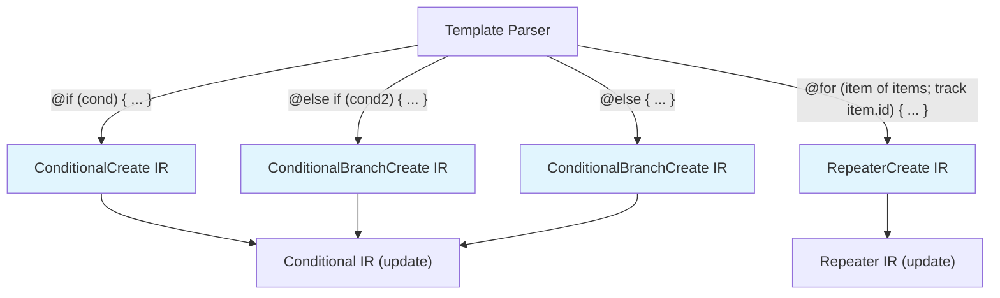
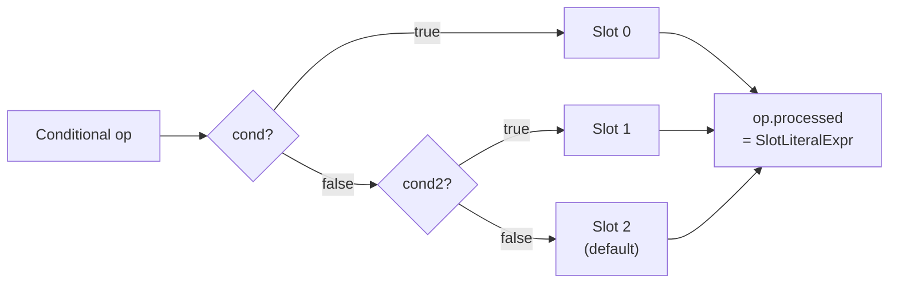

## TL;DR

Angular's `@if`, `@else`, and `@for` are not just syntactic sugar over `*ngIf`/`*ngFor` — they compile into dedicated IR operations (`ConditionalCreate`, `RepeaterCreate`, `Conditional`) that the reify phase turns into `conditionalCreate` and `repeaterCreate` runtime instructions, each allocating an embedded view slot and managing it through the `ViewContainerRef`-backed template infrastructure.

---

## The Engineering Problem

The old structural directives (`*ngIf`, `*ngFor`) worked by expanding into `<ng-template>` elements at parse time, then using `ViewContainerRef.createEmbeddedView()` and `ViewContainerRef.clear()` at runtime. This had two costs:

1. **Extra DOM node** — every `*ngIf` created an `<ng-template>` wrapper element.
2. **Indirect lookup** — the compiler had to resolve the structural directive, instantiate a `TemplateRef`, and then call `createEmbeddedView()` through the directive's `ViewContainerRef` — a multi-step dance that added both code size and change-detection overhead.

The question Angular's team asked was: **can we make conditional and repeated content compile directly into the view's instruction stream, skipping the structural-directive indirection entirely?**

The answer is the new control flow syntax — and its compilation pipeline lives in `packages/compiler/src/template/pipeline/src/phases/`.

---

## The Technical Solution

### Phase 1: Template Parse → IR Operations

When the Angular template compiler encounters `@if (showBanner) { ... }`, it does **not** create a `<ng-template>` element. Instead, it emits:

- A `ConditionalCreate` op — allocates a slot and declares the embedded view function.
- A `ConditionalBranchCreate` op — for each `@else if` / `@else` branch.
- A `Conditional` op in the update pass — the runtime test expression.

For `@for (item of items; track item.id) { ... }`, it emits:

- A `RepeaterCreate` op — allocates a slot and declares the repeated embedded view function.
- A `Repeater` op in the update pass — the runtime collection expression.



### Phase 2: generateConditionalExpressions — Flattening the Test

The `generateConditionalExpressions` phase (in `conditionals.ts`) collapses the chain of conditions into a single ternary expression. For `@if/@else if/@else`, it produces:

```
slot = cond ? branch0Slot : (cond2 ? branch1Slot : defaultSlot)
```

This is stored as `op.processed` — a single expression that evaluates to a slot index (or `-1` for no match).



### Phase 3: Slot Allocation

The `allocateSlots` phase (in `slot_allocation.ts`) assigns a data-slot index to every `ConditionalCreate`, `ConditionalBranchCreate`, and `RepeaterCreate` op — the same way it assigns slots to elements, text nodes, and other declarations. The child view's `decls` (total slot count) is propagated back into the parent `Template`-like op.

### Phase 4: Reify — IR → Runtime Instructions

The `reify` phase (in `reify.ts`) replaces each IR op with a concrete runtime instruction call:

- `ConditionalCreate` → `conditionalCreate(slot, viewFn, decls, vars, tag, constIndex, localRefs, sourceSpan)`
- `ConditionalBranchCreate` → `conditionalBranchCreate(...)` (same signature)
- `RepeaterCreate` → `repeaterCreate(slot, viewFnName, decls, vars, tag, constIndex, trackByFn, ...)`
- `Conditional` → `conditional(processed, contextValue, sourceSpan)`
- `Repeater` → `repeater(collection, sourceSpan)`

These map to `Identifiers.conditionalCreate`, `Identifiers.conditional`, `Identifiers.repeaterCreate`, and `Identifiers.repeater` in the runtime — each of which manages an embedded view through `ViewContainerRef` infrastructure without the structural-directive indirection.

---

## The Clean Example

A minimal template showing both `@if` and `@for`:


```html
<!-- template: app-dashboard.component.html -->
<div class="dashboard">
  @if (showBanner) {
    <div class="alert">Welcome back!</div>
  }

  @for (item of items; track item.id; let idx = $index) {
    <div class="row">
      {{ idx + 1 }}. {{ item.name }}
    </div>
  } @empty {
    <div class="empty">No items yet.</div>
  }
</div>
```


The compiler produces two child views for `@if` and one for `@for` (plus one for `@empty`). The update pass evaluates:

```typescript
// Pseudo-generated update logic (simplified from reify output)
if (rf & 2) { // RenderFlags.Update
  // @if block
  const condResult = showBanner ? 0 : -1; // 0 = slot of the "true" view
  conditional(condResult);

  // @for block
  repeater(items);
}
```

The `conditional` runtime instruction reads the slot index, and if it changed from the previous check, destroys the old embedded view and creates a new one at the target slot. The `repeater` instruction diffs the collection against its `trackBy` function and inserts/removes/moves embedded views accordingly.

---

## Production Reality

### From `packages/compiler/src/template/pipeline/src/phases/conditionals.ts`

This is the phase that collapses `@if/@else if/@else` conditions into a single slot-index expression:

```typescript
// conditionals.ts — generateConditionalExpressions()
export function generateConditionalExpressions(job: ComponentCompilationJob): void {
  for (const unit of job.units) {
    for (const op of unit.ops()) {
      if (op.kind !== ir.OpKind.Conditional) {
        continue;
      }

      let test: o.Expression;

      // Any case with a `null` condition is `default`. If one exists, default to it instead.
      const defaultCase = op.conditions.findIndex((cond) => cond.expr === null);
      if (defaultCase >= 0) {
        const slot = op.conditions.splice(defaultCase, 1)[0].targetSlot;
        test = new ir.SlotLiteralExpr(slot);
      } else {
        // By default, a switch evaluates to `-1`, causing no template to be displayed.
        test = o.literal(-1);
      }

      // Switch expressions assign their main test to a temporary, to avoid re-executing it.
      let tmp = op.test == null ? null : new ir.AssignTemporaryExpr(op.test, job.allocateXrefId());
      let caseExpressionTemporaryXref: ir.XrefId | null = null;

      // For each remaining condition, test whether the temporary satifies the check.
      for (let i = op.conditions.length - 1; i >= 0; i--) {
        let conditionalCase = op.conditions[i];
        if (conditionalCase.expr === null) {
          continue;
        }
        if (tmp !== null) {
          const useTmp = i === 0 ? tmp : new ir.ReadTemporaryExpr(tmp.xref);
          conditionalCase.expr = new o.BinaryOperatorExpr(
            o.BinaryOperator.Identical,
            useTmp,
            conditionalCase.expr,
          );
        } else if (conditionalCase.alias !== null) {
          caseExpressionTemporaryXref ??= job.allocateXrefId();
          conditionalCase.expr = new ir.AssignTemporaryExpr(
            conditionalCase.expr,
            caseExpressionTemporaryXref,
          );
          op.contextValue = new ir.ReadTemporaryExpr(caseExpressionTemporaryXref);
        }
        test = new o.ConditionalExpr(
          conditionalCase.expr,
          new ir.SlotLiteralExpr(conditionalCase.targetSlot),
          test,
        );
      }

      // Save the resulting aggregate expression.
      op.processed = test;
      op.conditions = [];
    }
  }
}
```

Key insight: the `SlotLiteralExpr` emits a literal slot index (e.g., `0`, `1`, `2`). The runtime `conditional()` instruction uses this index to select which embedded view to create/destroy — no `TemplateRef` lookup, no `*ngIf` directive instantiation.

### From `packages/compiler/src/template/pipeline/src/phases/reify.ts`

The reify phase converts IR ops into concrete instruction calls. For control flow, the relevant cases are:

```typescript
// reify.ts — reifyCreateOperations()
case ir.OpKind.ConditionalCreate:
  if (!(unit instanceof ViewCompilationUnit)) {
    throw new Error(`AssertionError: must be compiling a component`);
  }
  const conditionalCreateChildView = unit.job.views.get(op.xref)!;
  ir.OpList.replace(
    op,
    ng.conditionalCreate(
      op.handle.slot!,
      o.variable(conditionalCreateChildView.fnName!),
      conditionalCreateChildView.decls!,
      conditionalCreateChildView.vars!,
      op.tag,
      op.attributes,
      op.localRefs,
      op.startSourceSpan,
    ),
  );
  break;

case ir.OpKind.RepeaterCreate:
  if (op.handle.slot === null) {
    throw new Error('No slot was assigned for repeater instruction');
  }
  const repeaterView = unit.job.views.get(op.xref)!;
  ir.OpList.replace(
    op,
    ng.repeaterCreate(
      op.handle.slot,
      repeaterView.fnName,
      op.decls!,
      op.vars!,
      op.tag,
      op.attributes,
      reifyTrackBy(unit, op),
      op.usesComponentInstance,
      emptyViewFnName,
      emptyDecls,
      emptyVars,
      op.emptyTag,
      op.emptyAttributes,
      op.wholeSourceSpan,
    ),
  );
  break;
```

And for the update pass:

```typescript
// reify.ts — reifyUpdateOperations()
case ir.OpKind.Conditional:
  if (op.processed === null) {
    throw new Error(`Conditional test was not set.`);
  }
  ir.OpList.replace(op, ng.conditional(op.processed, op.contextValue, op.sourceSpan));
  break;

case ir.OpKind.Repeater:
  ir.OpList.replace(op, ng.repeater(op.collection, op.sourceSpan));
  break;
```

### From `packages/compiler/src/template/pipeline/src/instruction.ts`

The instruction helpers that generate the actual runtime calls:

```typescript
// instruction.ts — conditionalCreate()
export function conditionalCreate(
  slot: number,
  templateFnRef: o.Expression,
  decls: number,
  vars: number,
  tag: string | null,
  constIndex: number | null,
  localRefs: number | null,
  sourceSpan: ParseSourceSpan,
): ir.CreateOp {
  const args = [
    o.literal(slot),
    templateFnRef,
    o.literal(decls),
    o.literal(vars),
    o.literal(tag),
    o.literal(constIndex),
  ];
  if (localRefs !== null) {
    args.push(o.literal(localRefs));
    args.push(o.importExpr(Identifiers.templateRefExtractor));
  }
  while (args[args.length - 1].isEquivalent(o.NULL_EXPR)) {
    args.pop();
  }
  return call(Identifiers.conditionalCreate, args, sourceSpan);
}

// instruction.ts — conditional()
export function conditional(
  condition: o.Expression,
  contextValue: o.Expression | null,
  sourceSpan: ParseSourceSpan | null,
): ir.UpdateOp {
  const args = [condition];
  if (contextValue !== null) {
    args.push(contextValue);
  }
  return call(Identifiers.conditional, args, sourceSpan);
}

// instruction.ts — repeater()
export function repeater(
  collection: o.Expression,
  sourceSpan: ParseSourceSpan | null,
): ir.UpdateOp {
  return call(Identifiers.repeater, [collection], sourceSpan);
}
```

### From `packages/compiler/src/template/pipeline/src/emit.ts`

The emit phase generates the final template function, wrapping create and update operations in `Rf` flag checks:

```typescript
// emit.ts — emitView()
function emitView(view: ViewCompilationUnit): o.FunctionExpr {
  if (view.fnName === null) {
    throw new Error(`AssertionError: view ${view.xref} is unnamed`);
  }

  const createStatements: o.Statement[] = [];
  for (const op of view.create) {
    if (op.kind !== ir.OpKind.Statement) {
      throw new Error(
        `AssertionError: expected all create ops to have been compiled, but got ${
          ir.OpKind[op.kind]
        }`,
      );
    }
    createStatements.push(op.statement);
  }
  const updateStatements: o.Statement[] = [];
  for (const op of view.update) {
    if (op.kind !== ir.OpKind.Statement) {
      throw new Error(
        `AssertionError: expected all update ops to have been compiled, but got ${
          ir.OpKind[op.kind]
        }`,
      );
    }
    updateStatements.push(op.statement);
  }

  const createCond = maybeGenerateRfBlock(1, createStatements);
  const updateCond = maybeGenerateRfBlock(2, updateStatements);
  return o.fn(
    [new o.FnParam(RENDER_FLAGS, o.NUMBER_TYPE), new o.FnParam(CONTEXT_NAME, o.DYNAMIC_TYPE)],
    [...createCond, ...updateCond],
    /* type */ undefined,
    /* sourceSpan */ undefined,
    view.fnName,
  );
}
```

The `maybeGenerateRfBlock` wraps statements in `if (rf & 1) { ... }` (create) or `if (rf & 2) { ... }` (update) — the same `Rf` bitmask pattern used by every Ivy-rendered view.

---

## Review Checklist

- [ ] `@if`/`@else` compiles to `ConditionalCreate` + `ConditionalBranchCreate` + `Conditional` IR ops — **not** a `<ng-template>` + `*ngIf` directive.
- [ ] `@for` compiles to `RepeaterCreate` + `Repeater` IR ops — **not** a `<ng-template>` + `*ngFor` directive.
- [ ] `generateConditionalExpressions` flattens the condition chain into a single slot-index ternary stored in `op.processed`.
- [ ] `allocateSlots` assigns slot indexes to control flow create ops and propagates child view `decls` back into the parent.
- [ ] `reify` replaces IR ops with `ng.conditionalCreate()`, `ng.conditional()`, `ng.repeaterCreate()`, and `ng.repeater()` instruction calls.
- [ ] The emit phase wraps each view's create/update ops in `Rf` flag checks (`if (rf & 1)` / `if (rf & 2)`).
- [ ] No `TemplateRef` or `ViewContainerRef.createEmbeddedView()` calls are generated in the control flow path — the runtime handles embedded view management internally.
- [ ] The `trackBy` function for `@for` is compiled into a shared function reference via `reifyTrackBy()`, not an inline expression.

---

## FAQ

**Q: Why doesn't `@if` create a comment node like `*ngIf` did?**

`@if` uses the same slot-based embedded view infrastructure as `@for`, `@switch`, and `@defer`. The runtime allocates a slot for the conditional block and manages the view at that slot index — there is no placeholder comment node needed because the compiler knows the exact slot position at build time.

**Q: Can I still use `*ngIf` and `*ngFor`?**

Yes — they are not deprecated. But `@if` and `@for` compile to a more direct code path with fewer intermediate objects (`TemplateRef`, `ViewContainerRef.createEmbeddedView()` call chain), resulting in smaller bundle size and faster change detection.

**Q: What is the `Conditional` op's `processed` field?**

It is the fully-flattened slot-index expression produced by `generateConditionalExpressions`. After that phase runs, the `conditions` array is cleared and `processed` holds a single `SlotLiteralExpr`-based ternary chain that evaluates to the slot index of the view to display (or `-1` for none).

**Q: How does `@for` handle the empty case?**

The `RepeaterCreate` op carries an optional `emptyView` xref. When the collection is empty, the runtime creates the empty embedded view instead of the main repeater view. This replaces the `*ngFor` template's implicit "else" behavior.

**Q: Where does the `contextValue` for `@switch` cases come from?**

The `generateConditionalExpressions` phase assigns a temporary variable to store the result of the switch expression when a case has an `alias`. The `contextValue` is set to a `ReadTemporaryExpr` that reads this stored result, making it available to the embedded view's context.

---

## Source

- [`packages/compiler/src/template/pipeline/src/phases/conditionals.ts`](https://github.com/angular/angular/blob/main/packages/compiler/src/template/pipeline/src/phases/conditionals.ts) — `generateConditionalExpressions`
- [`packages/compiler/src/template/pipeline/src/phases/slot_allocation.ts`](https://github.com/angular/angular/blob/main/packages/compiler/src/template/pipeline/src/phases/slot_allocation.ts) — `allocateSlots`
- [`packages/compiler/src/template/pipeline/src/phases/reify.ts`](https://github.com/angular/angular/blob/main/packages/compiler/src/template/pipeline/src/phases/reify.ts) — `reify`
- [`packages/compiler/src/template/pipeline/src/instruction.ts`](https://github.com/angular/angular/blob/main/packages/compiler/src/template/pipeline/src/instruction.ts) — `conditionalCreate`, `conditional`, `repeaterCreate`, `repeater`
- [`packages/compiler/src/template/pipeline/src/emit.ts`](https://github.com/angular/angular/blob/main/packages/compiler/src/template/pipeline/src/emit.ts) — `emitView`, `emitTemplateFn`


