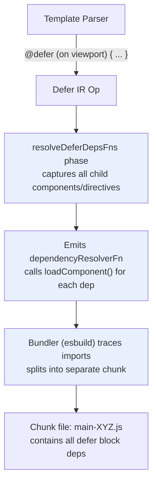
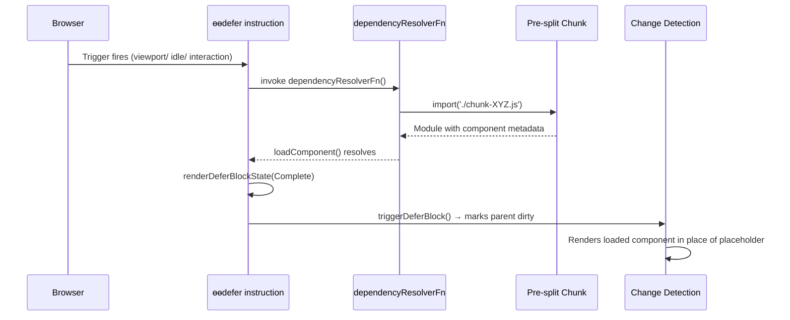

## TL;DR

Angular's `@defer` block creates separate JavaScript chunks at **build time**, not at runtime via a network request. The template compiler captures every component and directive dependency inside the `@defer` block, emits a `DependencyResolverFn` that calls `loadComponent()` / `loadDirective()` on each, and the bundler (esbuild) splits that resolver into its own chunk file. At runtime, when a trigger fires, the `ɵɵdefer` instruction invokes the resolver, which executes dynamic `import()` calls that load the pre-split chunk — **the browser fetches a `.js` file it already knows the URL of, no HTTP round-trip for discovery**. This is fundamentally different from lazy-loading a route, where the chunk URL must be negotiated at runtime; here the chunk path is baked into the build output.

---

## The Engineering Problem

When a component tree contains a heavy child — a chart library, a rich text editor, a full-page analytics dashboard — bundling it eagerly into the main chunk means the user downloads code they may never use. Route-level lazy loading (`loadComponent` in the router) solves this for entire pages, but what about a single component inside an already-loaded view?

The old workaround was manual `import()` inside an `ngOnInit` callback:

```typescript
// The problem: manual dynamic import scatters loading logic
export class DashboardComponent implements OnInit {
  heavyChart: any;

  async ngOnInit() {
    const { HeavyChartComponent } = await import('./heavy-chart.component');
    this.heavyChart = HeavyChartComponent;
  }
}
```

This has three costs:

1. **Boilerplate** — every lazy component needs an `async ngOnInit`, a local variable to hold the imported class, and an `@Component` host binding or `*ngComponentOutlet` to render it.
2. **Change-detection mismatch** — the component is loaded asynchronously, but the parent's change detection has no idea when the import completes. You need `ChangeDetectorRef.markForCheck()` or the component simply doesn't appear until the next unrelated trigger.
3. **No prefetching** — the import only fires on `ngOnInit`, so there is no way to start loading during browser idle time or on hover without writing custom scheduling logic.

Angular's `@defer` solves all three: the compiler handles the dependency graph, the runtime handles the state machine, and the bundler handles the chunk splitting.

---

## The Technical Solution

### Phase 1: Template Compiler Captures Dependencies

When the Angular template compiler encounters `@defer (on viewport) { <heavy-chart /> }`, it does not simply emit the child component inline. Instead, the compiler's `Defer` IR operation records every component, directive, and pipe that appears inside the defer block's template. The `resolveDeferDepsFns` phase then generates a `dependencyResolverFn` — a function that, at runtime, will dynamically import all of those dependencies.

The key insight: the dependency resolver is **not** a list of strings or tokens. It is a compiled function that calls `loadComponent()` and `loadDirective()` with pre-resolved import references, which the bundler traces to produce the chunk.



### Phase 2: Runtime Trigger → Dynamic Import

At runtime, the `ɵɵdefer` instruction stores the `dependencyResolverFn` alongside the block's template indexes (primary, loading, placeholder, error) in `TDeferBlockDetails`. When a trigger fires — `on viewport`, `on idle`, `when condition` — the runtime calls `triggerResourceLoading()`, which invokes the resolver function. The resolver executes `import('./heavy-chart.component')` (or whatever the bundler produced), and the loaded module's component/directive metadata is registered with the Angular injector.



### Phase 3: Why This Is Not a Network Request for Discovery

The critical distinction: `@defer` chunks are **statically analyzed at build time**, not negotiated at runtime. The bundler knows the exact file path of each defer chunk because the `dependencyResolverFn` contains literal `import()` calls with relative paths. There is no service worker, no manifest lookup, no HTTP request to discover "what chunk do I need?" — the browser simply fetches a `.js` file whose path was determined during `ng build`.

This is the same mechanism the Angular router uses for `loadComponent`, but applied at the template level: the compiler treats every `@defer` block as a mini-entry-point for the bundler's code-splitting logic.

---

## The Clean Example

```typescript
// dashboard.component.ts
@Component({
  selector: 'app-dashboard',
  standalone: true,
  imports: [CommonModule],
  template: `
    <div class="dashboard">
      <!-- Heavy chart: only loads when scrolled into view -->
      @defer (on viewport) {
        <app-heavy-chart [data]="chartData" />
      } @loading (minimum 500ms) {
        <div class="chart-placeholder">Loading chart...</div>
      } @placeholder {
        <div class="chart-placeholder">Scroll to load chart</div>
      }

      <!-- Analytics panel: loads on user interaction -->
      @defer (on interaction; prefetch on idle) {
        <app-analytics-panel [userId]="currentUser.id" />
      } @placeholder {
        <button>Click to load analytics</button>
      }

      <!-- OnPush parent — defer block respects it -->
      <app-stats-summary [data]="stats" />
    </div>
  `,
  changeDetection: ChangeDetectionStrategy.OnPush,
})
export class DashboardComponent {
  chartData = signal<ChartData[]>([]);
  currentUser = inject(AuthService).user;
  stats = inject(StatsService).summary;

  constructor() {
    // Signals — when chartData changes, only the non-deferred
    // stats-summary re-renders immediately; the deferred chart
    // block stays in placeholder until its trigger fires.
    effect(() => {
      console.log('Chart data count:', this.chartData().length);
    });
  }
}
```

The compiler produces three separate chunks:

| Block | Chunk contents | Trigger |
|---|---|---|
| `@defer (on viewport)` | `HeavyChartComponent` + its directives/pipes | IntersectionObserver callback |
| `@defer (on interaction)` | `AnalyticsPanelComponent` + its dependencies | click event on placeholder |
| `app-stats-summary` | None — eager, stays in main bundle | None (always loaded) |

The `@loading (minimum 500ms)` config ensures the loading skeleton stays visible for at least half a second even if the chunk loads faster — the timer scheduling lives in `ɵɵdeferEnableTimerScheduling`, which reads `loadingBlockConfig` from the constants array.

---

## Production Reality

### From `packages/core/src/defer/instructions.ts` — `ɵɵdefer`

The runtime instruction stores every piece of the defer block's configuration in `TDeferBlockDetails`:

```typescript
// instructions.ts — ɵɵdefer()
export function ɵɵdefer(
  index: number,
  primaryTmplIndex: number,
  dependencyResolverFn?: DependencyResolverFn | null,
  loadingTmplIndex?: number | null,
  placeholderTmplIndex?: number | null,
  errorTmplIndex?: number | null,
  loadingConfigIndex?: number | null,
  placeholderConfigIndex?: number | null,
  enableTimerScheduling?: typeof ɵɵdeferEnableTimerScheduling | null,
  flags?: TDeferDetailsFlags | null,
) {
  const lView = getLView();
  const tView = getTView();
  const adjustedIndex = index + HEADER_OFFSET;
  const tNode = declareNoDirectiveHostTemplate(lView, tView, index, null, 0, 0);
  const injector = lView[INJECTOR];

  if (tView.firstCreatePass) {
    performanceMarkFeature('NgDefer');

    const tDetails: TDeferBlockDetails = {
      primaryTmplIndex,
      loadingTmplIndex: loadingTmplIndex ?? null,
      placeholderTmplIndex: placeholderTmplIndex ?? null,
      errorTmplIndex: errorTmplIndex ?? null,
      placeholderBlockConfig: null,
      loadingBlockConfig: null,
      dependencyResolverFn: dependencyResolverFn ?? null,
      loadingState: DeferDependenciesLoadingState.NOT_STARTED,
      loadingPromise: null,
      providers: null,
      hydrateTriggers: null,
      debug: null,
      flags: flags ?? TDeferDetailsFlags.Default,
    };
    enableTimerScheduling?.(tView, tDetails, placeholderConfigIndex, loadingConfigIndex);
    setTDeferBlockDetails(tView, adjustedIndex, tDetails);
  }

  const lContainer = lView[adjustedIndex];
  populateDehydratedViewsInLContainer(lContainer, tNode, lView);

  const lDetails: LDeferBlockDetails = [
    null,                // NEXT_DEFER_BLOCK_STATE
    DeferBlockInternalState.Initial,  // DEFER_BLOCK_STATE
    null,                // STATE_IS_FROZEN_UNTIL
    null,                // LOADING_AFTER_CLEANUP_FN
    null,                // TRIGGER_CLEANUP_FNS
    null,                // PREFETCH_TRIGGER_CLEANUP_FNS
    ssrUniqueId,         // SSR_UNIQUE_ID
    ssrBlockState,       // SSR_BLOCK_STATE
    null,                // ON_COMPLETE_FNS
    null,                // HYDRATE_TRIGGER_CLEANUP_FNS
  ];
  setLDeferBlockDetails(lView, adjustedIndex, lDetails);
}
```

Key detail: `dependencyResolverFn` is stored in `TDeferBlockDetails` (static, one per template), not in `LDeferBlockDetails` (instance, one per rendered block). This means the resolver function is a shared reference — the bundler splits it once, and every defer block using the same dependencies shares the same chunk.

### From `packages/compiler/src/template/pipeline/src/phases/resolve_defer_deps_fns.ts`

The compiler phase that generates the resolver function:

```typescript
// resolve_defer_deps_fns.ts — resolveDeferDepsFns()
export function resolveDeferDepsFns(job: ComponentCompilationJob): void {
  for (const unit of job.units) {
    for (const op of unit.create) {
      if (op.kind === ir.OpKind.Defer) {
        if (op.resolverFn !== null) {
          continue;
        }

        if (op.ownResolverFn !== null) {
          if (op.handle.slot === null) {
            throw new Error(
              'AssertionError: slot must be assigned before extracting defer deps functions',
            );
          }
          const fullPathName = unit.fnName?.replace('_Template', '');
          op.resolverFn = job.pool.getSharedFunctionReference(
            op.ownResolverFn,
            `${fullPathName}_Defer_${op.handle.slot}_DepsFn`,
            false,
          );
        }
      }
    }
  }
}
```

The `getSharedFunctionReference` call ensures that if two `@defer` blocks in the same component share identical dependencies, they get a single shared resolver function — and the bundler produces one chunk, not two.

### From `packages/compiler/src/template/pipeline/src/phases/defer_configs.ts`

The timer scheduling configuration for `@loading` and `@placeholder` blocks:

```typescript
// defer_configs.ts — configureDeferInstructions()
export function configureDeferInstructions(job: ComponentCompilationJob): void {
  for (const unit of job.units) {
    for (const op of unit.create) {
      if (op.kind !== ir.OpKind.Defer) {
        continue;
      }

      if (op.placeholderMinimumTime !== null) {
        op.placeholderConfig = new ir.ConstCollectedExpr(
          literalOrArrayLiteral([op.placeholderMinimumTime]),
        );
      }
      if (op.loadingMinimumTime !== null || op.loadingAfterTime !== null) {
        op.loadingConfig = new ir.ConstCollectedExpr(
          literalOrArrayLiteral([op.loadingMinimumTime, op.loadingAfterTime]),
        );
      }
    }
  }
}
```

The `[loadingMinimumTime, loadingAfterTime]` pair is what the runtime's `applyDeferBlockStateWithScheduling` reads to decide whether to immediately render a state or freeze the block for a minimum duration. This is why `@loading (minimum 500ms)` works — the config is a const array, not a runtime computation.

---

## Review Checklist

- [ ] `@defer` creates separate chunks at **build time** via the bundler's code-splitting, not at runtime via HTTP discovery.
- [ ] The compiler's `resolveDeferDepsFns` phase generates a `dependencyResolverFn` that calls `loadComponent()` / `loadDirective()` for every dependency inside the defer block.
- [ ] The bundler (esbuild) traces the dynamic `import()` calls in the resolver to produce a separate `.js` chunk file.
- [ ] `ɵɵdefer` stores the resolver in `TDeferBlockDetails` (static, shared across instances), not `LDeferBlockDetails` (per-render).
- [ ] The runtime state machine transitions through `Initial → Placeholder → Loading → Complete` (or `Error`), each rendered by `renderDeferBlockState()`.
- [ ] Timer-based scheduling (`minimum`, `after`) is enabled by `ɵɵdeferEnableTimerScheduling`, which reads config from the constants array — tree-shakable because the compiler only emits the reference when these parameters are present.
- [ ] `@defer` respects `OnPush` change detection: the trigger calls `triggerDeferBlock()`, which marks the parent view dirty through the scheduler's `NotificationSource.DeferBlockStateUpdate`, not through Zone.js.
- [ ] Prefetching (`prefetch on idle`, `prefetch on viewport`) starts the dynamic import before the main block renders, reducing perceived load time when the trigger fires.

---

## FAQ

**Q: Is `@defer` the same as route-level lazy loading?**

No. Route-level lazy loading splits an entire component (and its template) into a separate chunk, loaded when the router navigates to that route. `@defer` splits a **sub-tree** of an already-loaded component's template into a separate chunk, loaded when a trigger fires within the same page. The chunking mechanism is identical (bundler code-splitting via dynamic `import()`), but the granularity and trigger are different.

**Q: Why doesn't `@defer` require a network request to discover the chunk URL?**

Because the chunk path is statically determined at build time. The `dependencyResolverFn` contains literal `import('./chunk-XYZ.js')` calls — the bundler writes the chunk to a known path, and the resolver references that exact path. There is no runtime negotiation, no manifest lookup, no service worker interception needed. The browser fetches a file it was told about at compile time.

**Q: How does `@defer` interact with `OnPush` change detection?**

`@defer` blocks are managed by their own state machine (`DeferBlockInternalState`), which is separate from the component's change detection. When a trigger fires, `triggerDeferBlock()` notifies the scheduler via `NotificationSource.DeferBlockStateUpdate` — a typed notification that sets a specific dirty flag, not a Zone.js blanket notification. The parent `OnPush` component is only marked dirty when its own inputs or signal state change, not when the defer block transitions states.

**Q: Can two `@defer` blocks in the same component share a chunk?**

Yes. The `resolveDeferDepsFns` phase calls `getSharedFunctionReference()`, which deduplicates resolver functions with identical dependency sets. If two `@defer` blocks load the same component, they reference the same resolver, and the bundler produces one chunk.

**Q: What happens if the dynamic import fails?**

The runtime catches the error and transitions the defer block to the `Error` state. If an `@error` block is defined, it is rendered. If not, the block stays in the `Loading` state with no visible content. The `LDeferBlockDetails` array stores the `ON_COMPLETE_FNS` cleanup functions, which are invoked on error to clean up any partial state.

---

## Source

- [`packages/core/src/defer/instructions.ts`](https://github.com/angular/angular/blob/main/packages/core/src/defer/instructions.ts) — `ɵɵdefer`, `ɵɵdeferWhen`, trigger instructions
- [`packages/core/src/defer/rendering.ts`](https://github.com/angular/angular/blob/main/packages/core/src/defer/rendering.ts) — `renderDeferBlockState`, timer-based scheduling
- [`packages/compiler/src/template/pipeline/src/phases/resolve_defer_deps_fns.ts`](https://github.com/angular/angular/blob/main/packages/compiler/src/template/pipeline/src/phases/resolve_defer_deps_fns.ts) — `resolveDeferDepsFns`
- [`packages/compiler/src/template/pipeline/src/phases/defer_configs.ts`](https://github.com/angular/angular/blob/main/packages/compiler/src/template/pipeline/src/phases/defer_configs.ts) — `configureDeferInstructions`
- [`packages/compiler/src/template/pipeline/src/phases/defer_resolve_targets.ts`](https://github.com/angular/angular/blob/main/packages/compiler/src/template/pipeline/src/phases/defer_resolve_targets.ts) — `resolveDeferTargetNames`


