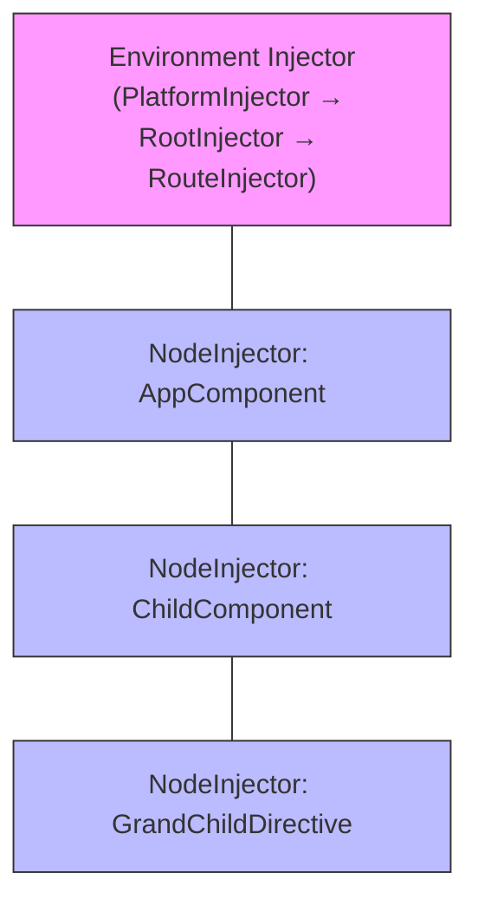
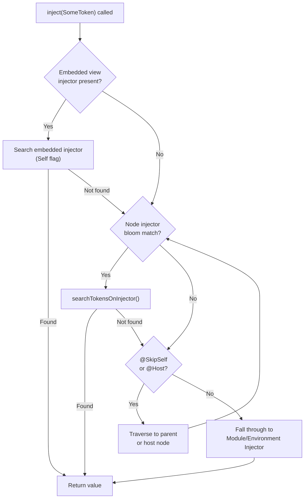
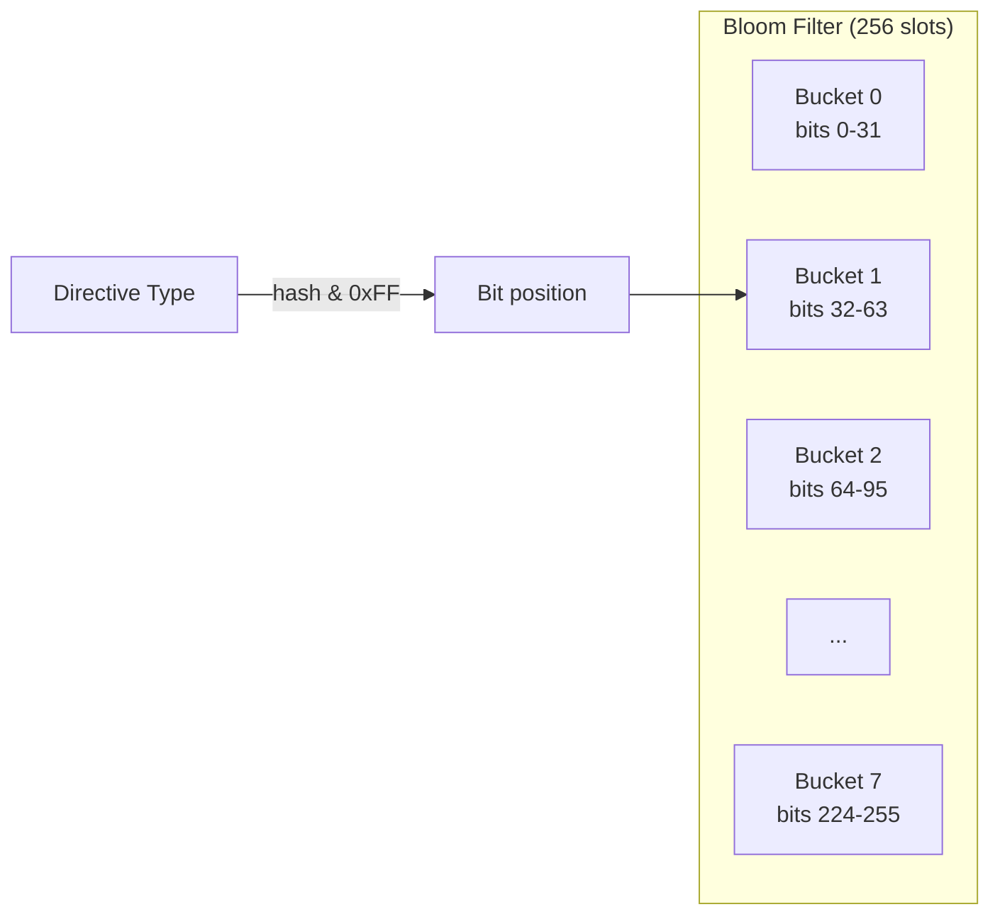

## TL;DR

Angular's DI walks a tree of node injectors — each backed by a 256-slot bloom filter — before it ever reaches an environment injector, so a token registered on a component's element injector silently shadows the same token provided at root.

---

## The Engineering Problem

Most DI tutorials show you `@Injectable({ providedIn: 'root' })` and call it a day. In a real production app — one with lazy-loaded routes, dynamically-embedded components, and `@SkipSelf` overrides — you need to know *exactly* which injector wins when two providers claim the same token.

The question is not "how do I register a provider?" It is: **when `inject(SomeToken)` is called inside a directive constructor, which injector in the hierarchy actually answers, and in what order does Angular walk the tree?**

The answer lives in Angular's internal node injector, the bloom filter it maintains per-element, and a traversal loop that crosses view boundaries.

---

## The Technical Solution

Angular organizes injectors into three layers:



The lookup order for a token inside `GrandChildDirective`:



The bloom filter is the key optimization. Each node injector stores 8 × 32-bit integers = 256 bits. When a directive is registered, its unique ID is hashed into one bit. During lookup, the injector checks whether that bit is set *before* doing a linear scan of providers — an O(1) pre-filter.



When `bloomHasToken` returns true, Angular calls `searchTokensOnInjector` which walks the provider and directive ranges of that TNode's `tView.data`. If the token is found there, `getNodeInjectable` either returns the cached instance or runs the factory — and caches the result in the `LView` array at the same index.

---

## The Clean Example

A minimal component tree that demonstrates the shadowing behavior:


```typescript
// ✅ Root-level provider — expected to be the "global" instance
@Injectable({ providedIn: 'root' })
export class Logger {
  instanceId = Math.random().toString(36).slice(2, 8);
}

@Component({
  selector: 'app-parent',
  template: `<app-child />`,
  // ✅ Overriding the root provider at this element injector
  providers: [{ provide: Logger, useValue: { instanceId: 'parent-override' } as Logger }],
})
export class ParentComponent {
  logger = inject(Logger); // 'parent-override'
}

@Component({
  selector: 'app-child',
  template: `<p>{{ logger.instanceId }}</p>`,
})
export class ChildComponent {
  logger = inject(Logger); // 'parent-override' — inherited from ParentComponent's node injector
}
```


What happens internally:

1. `ParentComponent`'s node injector has `Logger` registered in its bloom filter.
2. `ChildComponent`'s node injector does *not* have `Logger`.
3. When `ChildComponent` calls `inject(Logger)`, Angular walks to the parent node injector, finds the bloom match, and returns `'parent-override'`.
4. The root-level `providedIn: 'root'` provider is never reached.

---

## Production Reality

This is the actual traversal function from Angular's render3 DI, responsible for the full lookup chain. It starts at the current element, checks embedded view injectors, then walks node injectors upward, and finally falls back to the environment injector:

```typescript
// packages/core/src/render3/di.ts — getOrCreateInjectable()
//
// This is the entry point for every DI resolution in Angular's Ivy renderer.
// It orchestrates the three-layer lookup: embedded → node → module/environment.

export function getOrCreateInjectable<T>(
  tNode: TDirectiveHostNode | null,
  lView: LView,
  token: ProviderToken<T>,
  flags: InternalInjectFlags = InternalInjectFlags.Default,
  notFoundValue?: any,
): T | null {
  if (tNode !== null) {
    // If the view or any of its ancestors have an embedded
    // view injector, we have to look it up there first.
    if (
      lView[FLAGS] & LViewFlags.HasEmbeddedViewInjector &&
      // The token must be present on the current node injector when the `Self`
      // flag is set, so the lookup on embedded view injector(s) can be skipped.
      !(flags & InternalInjectFlags.Self)
    ) {
      const embeddedInjectorValue = lookupTokenUsingEmbeddedInjector(
        tNode,
        lView,
        token,
        flags,
        NOT_FOUND,
      );
      if (embeddedInjectorValue !== NOT_FOUND) {
        return embeddedInjectorValue;
      }
    }

    // Otherwise try the node injector.
    const value = lookupTokenUsingNodeInjector(tNode, lView, token, flags, NOT_FOUND);
    if (value !== NOT_FOUND) {
      return value;
    }
  }

  // Finally, fall back to the module injector.
  return lookupTokenUsingModuleInjector<T>(lView, token, flags, notFoundValue);
}
```

And this is the node injector walk itself — the loop that traverses element injectors upward using cumulative bloom filters and parent pointers stored in the `LView`:

```typescript
// packages/core/src/render3/di.ts — lookupTokenUsingNodeInjector()
//
// Walks the node injector tree upward. At each injector, checks the bloom filter
// (bloomHasToken) before doing a linear scan of providers (searchTokensOnInjector).
// Stops when it finds a match or when flags prevent further parent traversal.

function lookupTokenUsingNodeInjector<T>(
  tNode: TDirectiveHostNode,
  lView: LView,
  token: ProviderToken<T>,
  flags: InternalInjectFlags,
  notFoundValue?: any,
) {
  const bloomHash = bloomHashBitOrFactory(token);
  if (typeof bloomHash === 'function') {
    // Special object (ElementRef, TemplateRef) — call the factory directly
    if (!enterDI(lView, tNode, flags)) {
      return flags & InternalInjectFlags.Host
        ? notFoundValueOrThrow<T>(notFoundValue, token, flags)
        : lookupTokenUsingModuleInjector<T>(lView, token, flags, notFoundValue);
    }
    try {
      let value: unknown;
      value = bloomHash(flags);
      if (value == null && !(flags & InternalInjectFlags.Optional)) {
        throwProviderNotFoundError(token);
      } else {
        return value;
      }
    } finally {
      leaveDI();
    }
  } else if (typeof bloomHash === 'number') {
    let previousTView: TView | null = null;
    let injectorIndex = getInjectorIndex(tNode, lView);
    let parentLocation = NO_PARENT_INJECTOR;
    let hostTElementNode: TNode | null =
      flags & InternalInjectFlags.Host ? lView[DECLARATION_COMPONENT_VIEW][T_HOST] : null;

    if (injectorIndex === -1 || flags & InternalInjectFlags.SkipSelf) {
      parentLocation =
        injectorIndex === -1
          ? getParentInjectorLocation(tNode, lView)
          : lView[injectorIndex + NodeInjectorOffset.PARENT];

      if (parentLocation === NO_PARENT_INJECTOR || !shouldSearchParent(flags, false)) {
        injectorIndex = -1;
      } else {
        previousTView = lView[TVIEW];
        injectorIndex = getParentInjectorIndex(parentLocation);
        lView = getParentInjectorView(parentLocation, lView);
      }
    }

    while (injectorIndex !== -1) {
      const tView = lView[TVIEW];
      if (bloomHasToken(bloomHash, injectorIndex, tView.data)) {
        const instance: T | {} | null = searchTokensOnInjector<T>(
          injectorIndex,
          lView,
          token,
          previousTView,
          flags,
          hostTElementNode,
        );
        if (instance !== NOT_FOUND) {
          return instance;
        }
      }
      parentLocation = lView[injectorIndex + NodeInjectorOffset.PARENT];
      if (
        parentLocation !== NO_PARENT_INJECTOR &&
        shouldSearchParent(
          flags,
          lView[TVIEW].data[injectorIndex + NodeInjectorOffset.TNODE] === hostTElementNode,
        ) &&
        bloomHasToken(bloomHash, injectorIndex, lView)
      ) {
        previousTView = tView;
        injectorIndex = getParentInjectorIndex(parentLocation);
        lView = getParentInjectorView(parentLocation, lView);
      } else {
        injectorIndex = -1;
      }
    }
  }

  return notFoundValue;
}
```

The `includeViewProviders` flag controls whether `viewProviders` (private to a component) are visible during resolution. It is set to `true` only when Angular is instantiating the component itself — not when a child directive queries upward:

```typescript
// packages/core/src/render3/di.ts
//
// Controls visibility of viewProviders during DI resolution.
// Flipped off after the component's own factory runs, so child
// directives cannot see tokens declared in `viewProviders`.

let includeViewProviders = true;

export function setIncludeViewProviders(v: boolean): boolean {
  const oldValue = includeViewProviders;
  includeViewProviders = v;
  return oldValue;
}
```

And the bloom filter registration — the function that flips a bit when a directive is first created on a node:

```typescript
// packages/core/src/render3/di.ts — bloomAdd()
//
// Registers a directive token in a node injector's bloom filter.
// The token's unique ID is masked to 0-255 and used to set a single bit
// in one of 8 × 32-bit buckets. This gives O(1) pre-check for token existence.

export function bloomAdd(
  injectorIndex: number,
  tView: TView,
  type: ProviderToken<any> | string,
): void {
  let id: number | undefined;
  if (typeof type === 'string') {
    id = type.charCodeAt(0) || 0;
  } else if (type.hasOwnProperty(NG_ELEMENT_ID)) {
    id = (type as any)[NG_ELEMENT_ID];
  }

  if (id == null) {
    id = (type as any)[NG_ELEMENT_ID] = nextNgElementId++;
  }

  const bloomHash = id & BLOOM_MASK;
  const mask = 1 << bloomHash;

  (tView.data as number[])[injectorIndex + (bloomHash >> BLOOM_BUCKET_BITS)] |= mask;
}
```

---

## Review Checklist

- [ ] **Know the three layers:** element injector (node) → environment injector → platform injector.
- [ ] **Bloom filter pre-check:** Angular does a O(1) bit test before any linear provider scan.
- [ ] **Shadowing is real:** A provider on a child element injector *replaces* the root provider for all descendants.
- [ ] **`viewProviders` isolation:** Only the component itself sees `viewProviders`; child directives cannot.
- [ ] **Embedded view injector:** When present, it is checked *first* — before the owning element's node injector.
- [ ] **`@SkipSelf` starts from parent:** It skips the current node's injector and begins at the parent element.
- [ ] **`@Host` stops at the declaring component:** It will not cross the component boundary to the parent view.
- [ ] **`@Self` is node-only:** It prevents any parent lookup and falls straight to environment injector if not found locally.

---

## FAQ

**Q: Why 256 bits in the bloom filter?**

Because JS bitwise ops work on 32-bit integers, 8 buckets × 32 bits = 256 slots. This keeps the false-positive rate manageable while fitting into the `LView` integer array without extra allocation.

**Q: What happens if two directives on the same element both provide the same token?**

The last one wins. `searchTokensOnInjector` scans the provider/directive range linearly and returns the first match, but Angular creates providers in registration order — the later provider overwrites the earlier slot in `tView.data`.

**Q: Can a service injected in `ngOnInit` see the same providers as one injected in the constructor?**

No. `inject()` only works inside injection contexts (constructor, field initializer, factory function). Calling it in `ngOnInit` throws `MISSING_INJECTION_CONTEXT`.

**Q: How does `providedIn: 'root'` differ from `providers: [MyService]` on a module?**

`providedIn: 'root'` registers the provider on the root environment injector at the module level — it is tree-shakable. `providers: [MyService]` on a route injector creates a new instance per route, scoped to that route's environment injector.

**Q: What is the `NodeInjectorFactory.resolving` flag for?**

It detects cyclic dependencies. When a factory is already being resolved (`resolving === true`) and is hit again, Angular throws a `cyclicDependencyError` instead of entering an infinite loop.

---

## Source

All code in this post is verbatim from the `angular/angular` repository on GitHub:

- [`packages/core/src/render3/di.ts`](https://github.com/angular/angular/blob/main/packages/core/src/render3/di.ts) — node injector, bloom filter, and DI traversal
- [`packages/core/src/di/injector.ts`](https://github.com/angular/angular/blob/main/packages/core/src/di/injector.ts) — abstract `Injector` class and `Injector.create()`
- [`packages/core/src/di/injector_compatibility.ts`](https://github.com/angular/angular/blob/main/packages/core/src/di/injector_compatibility.ts) — `inject()`, `ɵɵinject()`, and flag conversion


