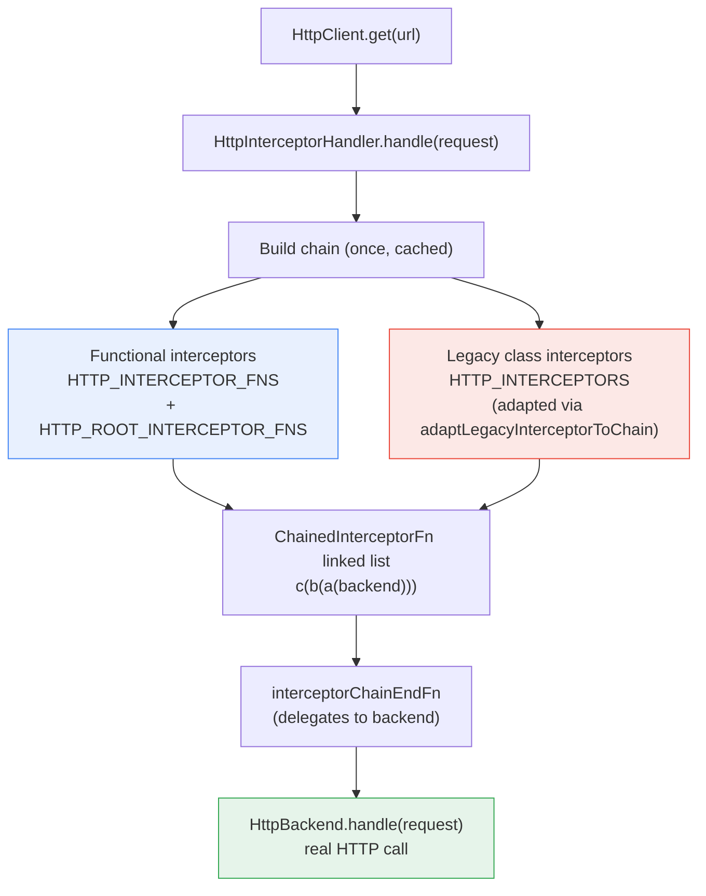
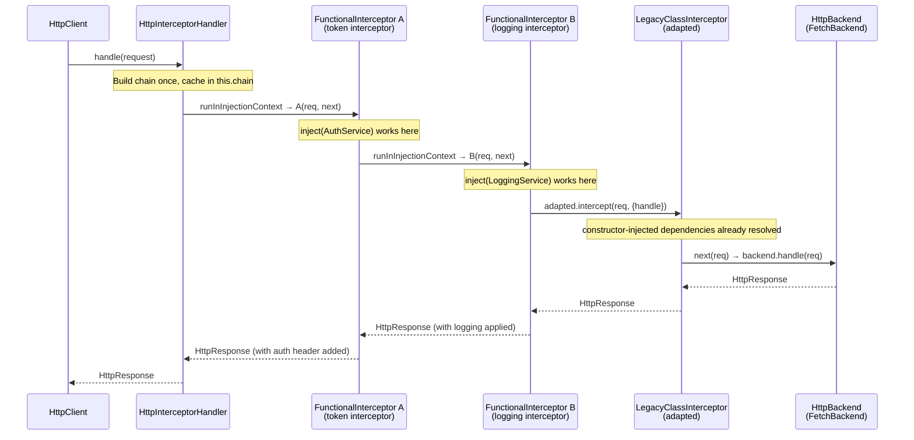

**TL;DR:** Does Angular's HTTP interceptor have to be a class that implements `HttpInterceptor` and gets registered under a multi-provider `InjectionToken`? No — `HttpInterceptorFn` is a plain function that receives `HttpRequest` and `HttpHandlerFn` directly, runs inside `runInInjectionContext` so `inject()` just works, and gets registered via `withInterceptors()` in a `provideHttpClient()` call instead of class-based `HTTP_INTERCEPTORS` providers. The class-based approach still works through a compatibility adapter in the source, but the functional path is the default going forward because it eliminates boilerplate, makes the chain composable without wrapping, and plays cleanly with Angular's tree-shakable DI.

## 1. The Engineering Problem

Class-based HTTP interceptors work, but they carry real ergonomic and architectural weight. Every interceptor must be a separately declared `@Injectable({providedIn: 'root'})` class, implementing an `HttpInterceptor` interface, registered in the DI system under the `HTTP_INTERCEPTORS` multi-provider token. That's three separate artifacts — class, interface, token — for what is fundamentally a single transformation function.

The deeper issue is that class interceptors live outside Angular's modern `EnvironmentInjector` injection context by default. They don't run inside `runInInjectionContext`, so calling `inject()` inside an `intercept()` method requires workarounds or injecting dependencies through the constructor. For interceptors that need a `Router`, a `KeycloakService`, or a logging client, that constructor injection chains back to the class being `providedIn: 'root'`, which means it can't be scoped to a particular `EnvironmentInjector` or feature module without additional DI configuration.

The class-based chain also requires explicit wrapping to compose with the functional chain — the framework has to maintain adapter functions (`adaptLegacyInterceptorToChain`) that bridge between the two calling conventions, adding a layer of indirection inside `HttpInterceptorHandler` on every single request.

## 2. The Technical Solution

Angular's interceptor architecture has two chains that run in the same `HttpInterceptorHandler.handle()` call. The functional chain (`HTTP_INTERCEPTOR_FNS`) and the root functional chain (`HTTP_ROOT_INTERCEPTOR_FNS`) are deduplicated, then reduced right-to-left into a single `ChainedInterceptorFn` linked list. The legacy class-based chain (`HTTP_INTERCEPTORS`) is adapted into the same `ChainedInterceptorFn` shape through a separate factory, and runs in front of the functional chain. The last link in the combined chain calls into the real `HttpBackend`.



The functional interceptor itself is trivially simple — it's a function, not a class. `runInInjectionContext` wraps the call so that `inject()` works inside the function body:

```typescript
// packages/common/http/src/interceptor.ts — the actual type definitions
export type HttpHandlerFn =
  (req: HttpRequest<unknown>) => Observable<HttpEvent<unknown>>;

export type HttpInterceptorFn = (
  req: HttpRequest<unknown>,
  next: HttpHandlerFn,
) => Observable<HttpEvent<unknown>>;
```

The `chainedInterceptorFn` wrapper is what wires each functional interceptor into the linked list while running it inside the injector's injection context:

```typescript
// packages/common/http/src/interceptor.ts — how a functional interceptor
// gets wrapped into the chain, with injection context support
export function chainedInterceptorFn(
  chainTailFn: ChainedInterceptorFn<unknown>,
  interceptorFn: HttpInterceptorFn,
  injector: EnvironmentInjector,
): ChainedInterceptorFn<unknown> {
  return (initialRequest, finalHandlerFn) =>
    runInInjectionContext(injector, () =>
      interceptorFn(initialRequest, (downstreamRequest) =>
        chainTailFn(downstreamRequest, finalHandlerFn),
      ),
    );
}
```

The adapter for legacy class-based interceptors does the same wrapping, but bridges from `HttpInterceptor.intercept(req, {handle})` to the `ChainedInterceptorFn` shape — no `runInInjectionContext` needed because the class already got its dependencies through constructor injection:

```typescript
// packages/common/http/src/interceptor.ts — legacy class adapter
export function adaptLegacyInterceptorToChain(
  chainTailFn: ChainedInterceptorFn<any>,
  interceptor: HttpInterceptor,
): ChainedInterceptorFn<any> {
  return (initialRequest, finalHandlerFn) =>
    interceptor.intercept(initialRequest, {
      handle: (downstreamRequest) =>
        chainTailFn(downstreamRequest, finalHandlerFn),
    });
}
```



Two core truths this diagram is showing:

- **`runInInjectionContext` is the mechanism that makes functional interceptors first-class DI citizens.** The `EnvironmentInjector` that owns the chain is captured once when `chainedInterceptorFn` is called during chain construction — every subsequent request reuses that same injector context, which means `inject()` inside the interceptor body resolves against the injector that registered it, not whatever component happened to be active when the request was dispatched.
- **The legacy adapter doesn't use `runInInjectionContext` because it doesn't need to.** Class interceptors already resolved their dependencies at construction time via their constructor parameters — the adapter just reshapes the calling convention from `intercept(req, handler)` to the `ChainedInterceptorFn(req, finalHandlerFn)` shape.

## 3. The clean example (concept in isolation)

```typescript
// Functional interceptor: a plain function, no class, no decorator
// inject() works because the framework wraps this in runInInjectionContext
const authInterceptor: HttpInterceptorFn = (req, next) => {
  const authService = inject(AuthService);           // works — injection context active
  const token = authService.getToken();

  const cloned = req.clone({
    headers: req.headers.set('Authorization', `Bearer ${token}`),
  });
  return next(cloned);                                // pass to next interceptor in chain
};

// Registration: withInterceptors inside provideHttpClient
// No HTTP_INTERCEPTORS token, no @Injectable, no class
export const appConfig: ApplicationConfig = {
  providers: [
    provideHttpClient(
      withInterceptors([authInterceptor, loggingInterceptor]),
    ),
  ],
};
```

Compare the class-based equivalent that this replaces — three artifacts instead of one function:

```typescript
// Class-based interceptor: interface + class + token registration
@Injectable({ providedIn: 'root' })
export class AuthInterceptor implements HttpInterceptor {
  constructor(private authService: AuthService) {}   // constructor injection

  intercept(req: HttpRequest<unknown>, next: HttpHandler): Observable<HttpEvent<unknown>> {
    const token = this.authService.getToken();
    const cloned = req.clone({
      headers: req.headers.set('Authorization', `Bearer ${token}`),
    });
    return next.handle(cloned);
  }
}

// Registration: multi-provider token
export const appConfig: ApplicationConfig = {
  providers: [
    provideHttpClient(),
    { provide: HTTP_INTERCEPTORS, useClass: AuthInterceptor, multi: true },
  ],
};
```

## 4. Production reality (from the real repo)

```
angular/packages/common/http/src/
├── interceptor.ts    — HttpInterceptorFn, ChainedInterceptorFn, adaptLegacyInterceptorToChain,
│                       chainedInterceptorFn, interceptorChainEndFn, HTTP_INTERCEPTOR_FNS
└── backend.ts        — HttpInterceptorHandler: builds the chain, deduplicates, runs it
```

`HttpInterceptorHandler` is where both chains are built and deduplicated — the class that owns the entire interceptor lifecycle:

```typescript
// packages/common/http/src/backend.ts — HttpInterceptorHandler.handle()
handle(initialRequest: HttpRequest<any>): Observable<HttpEvent<any>> {
  if (this.chain === null) {
    const dedupedInterceptorFns = Array.from(
      new Set([
        ...this.injector.get(HTTP_INTERCEPTOR_FNS),
        ...this.injector.get(HTTP_ROOT_INTERCEPTOR_FNS, []),
      ]),
    );

    // Note: interceptors are wrapped right-to-left so that final execution order is
    // left-to-right. That is, if `dedupedInterceptorFns` is the array `[a, b, c]`, we want to
    // produce a chain that is conceptually `c(b(a(end)))`, which we build from the inside
    // out.
    this.chain = dedupedInterceptorFns.reduceRight(
      (nextSequencedFn, interceptorFn) =>
        chainedInterceptorFn(nextSequencedFn, interceptorFn, this.injector),
      interceptorChainEndFn as ChainedInterceptorFn<unknown>,
    );
  }

  const chain = this.chain;
  // ... PendingTasks stability tracking ...
  return untracked(() =>
    chain(initialRequest, (downstreamRequest) =>
      this.backend.handle(downstreamRequest)),
  );
}
```

`legacyInterceptorFnFactory` shows how class-based interceptors get wrapped into a single `HttpInterceptorFn` so they can run in the same pipeline — the adapter pattern from the functional side:

```typescript
// packages/common/http/src/interceptor.ts — legacy interceptor adapter
// wrapped into a single HttpInterceptorFn for the functional chain
export function legacyInterceptorFnFactory(): HttpInterceptorFn {
  let chain: ChainedInterceptorFn<any> | null = null;

  return (req, handler) => {
    if (chain === null) {
      const interceptors = inject(HTTP_INTERCEPTORS, {optional: true}) ?? [];
      chain = interceptors.reduceRight(
        adaptLegacyInterceptorToChain,
        interceptorChainEndFn as ChainedInterceptorFn<any>,
      );
    }
    return chain(req, handler);
  };
}
```

What this teaches that a hello-world can't:

- **Deduplication via `new Set(...)` on line 6 of `handle()` is necessary because `HTTP_INTERCEPTOR_FNS` and `HTTP_ROOT_INTERCEPTOR_FNS` can both contain the same functional interceptor if it was registered in both an `EnvironmentInjector` and the root injector.** Without the `Set`, the same interceptor would run twice per request — a real bug, not a hypothetical.
- **The chain is built once and cached in `this.chain`.** Subsequent requests skip the `reduceRight` entirely and walk the already-built linked list, which means the first request pays the DI resolution cost but every request after that only pays the function-call cost of traversing the chain.
- **`untracked(() => chain(...))` is necessary because `HttpClient` uses signals internally, and without `untracked`, the chain execution would be tracked as a dependency by whatever `effect()` or `computed()` happened to be active when the HTTP call was dispatched.** The `untracked` call prevents a side effect (an HTTP request) from accidentally becoming a reactive dependency.
- **`interceptorChainEndFn` is the chain terminator** — it simply delegates to the real `HttpBackend.handle()` (which is `FetchBackend` in modern Angular), completing the pipeline. The chain is a classic linked-list-of-functions pattern where each node wraps the next, and the last node calls through to the backend.

## 5. Review checklist

- **Is the interceptor registered via `withInterceptors()` in `provideHttpClient()` or via the `HTTP_INTERCEPTORS` multi-provider token?** The former is the modern path; the latter still works but runs through an adapter layer and can't use `inject()` without constructor injection.
- **Does the interceptor clone the request (`req.clone(...)`) before modifying it?** `HttpRequest` is immutable — mutating it directly is a bug that silently corrupts the request for every downstream interceptor.
- **Is the interceptor calling `next(clonedReq)` to pass the request downstream, or short-circuiting the chain entirely?** Both are valid, but short-circuiting (not calling `next` at all) means no backend call and no downstream interceptors run — verify that's intentional.
- **If the interceptor needs DI services, are those services `providedIn: 'root'` or provided by an `EnvironmentInjector` that's an ancestor of the one that registered the interceptor?** `runInInjectionContext` uses the injector captured at chain-construction time, not the component's injector — services not visible to that injector will fail at runtime.
- **Is the interceptor chain order correct for the use case?** `withInterceptors([authInterceptor, loggingInterceptor])` means auth runs first, then logging — reversing them changes whether the auth header appears in the logged request. This ordering is `reduceRight`-based (right-to-left wrapping, left-to-right execution).

## 6. FAQ

**Q: Why does Angular maintain both `HTTP_INTERCEPTOR_FNS` and `HTTP_ROOT_INTERCEPTOR_FNS` as separate tokens?**
A: `HTTP_INTERCEPTOR_FNS` is for interceptors registered in any `EnvironmentInjector` — they can be scoped to feature modules or lazy-loaded routes. `HTTP_ROOT_INTERCEPTOR_FNS` is only for interceptors registered in the root injector, which guarantees they run for every request in the application regardless of which module made it. The deduplication in `HttpInterceptorHandler.handle()` ensures that if an interceptor is registered in both, it only runs once.

**Q: Can functional interceptors and class-based interceptors coexist in the same application?**
A: Yes — `legacyInterceptorFnFactory` wraps all class-based interceptors into a single `HttpInterceptorFn` that runs in the functional chain. Both types are visible to `HttpInterceptorHandler`, which builds the combined chain from both `HTTP_INTERCEPTOR_FNS` (functional) and `HTTP_INTERCEPTORS` (class-based, adapted). The class-based interceptors run in their original registration order, but behind any functional interceptors that were registered separately.

**Q: Does the order of interceptors in `withInterceptors([...])` matter?**
A: Yes — `reduceRight` wraps them right-to-left, which means execution is left-to-right. `withInterceptors([a, b, c])` produces a chain conceptually shaped as `c(b(a(backend)))`, so `a` runs first on the outgoing request and last on the incoming response. This is the reverse of what `reduceRight` might suggest at first glance — the rightmost interceptor in the array is the one closest to the backend.

**Q: What happens if an interceptor throws an error instead of returning an Observable?**
A: The error propagates up through the chain as a rejected Observable — the same as if the backend itself returned an error. Downstream interceptors don't run, and the `HttpClient` caller receives the error through its `subscribe` error handler or `catchError` operator. There's no special error-boundary mechanism inside the chain; it's plain RxJS error semantics all the way through.

**Q: Why is `untracked()` used in `HttpInterceptorHandler.handle()` when calling the chain?**
A: `HttpClient` uses Angular signals internally for application stability tracking and pending-task management. Without `untracked()`, the chain execution (which includes the backend HTTP call) would be tracked as a dependency by any `effect()` or `computed()` that happened to be active when the request was dispatched, creating an accidental reactive dependency between unrelated application state and an HTTP request.

---

## Source

- **Concept:** Functional HTTP interceptors and the `HttpInterceptorFn` type replacing class-based `HttpInterceptor`
- **Domain:** angular
- **Repo:** [angular/angular](https://github.com/angular/angular) → [`packages/common/http/src/interceptor.ts`](https://github.com/angular/angular/blob/main/packages/common/http/src/interceptor.ts), [`packages/common/http/src/backend.ts`](https://github.com/angular/angular/blob/main/packages/common/http/src/backend.ts) — the Angular framework's own HTTP interceptor chain and handler implementation
