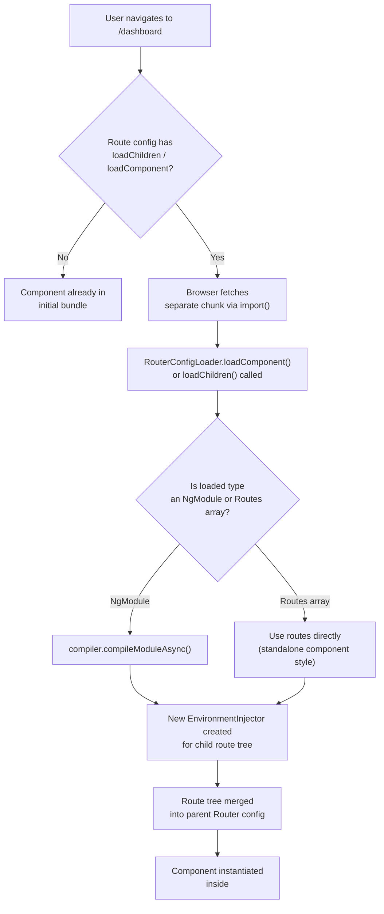
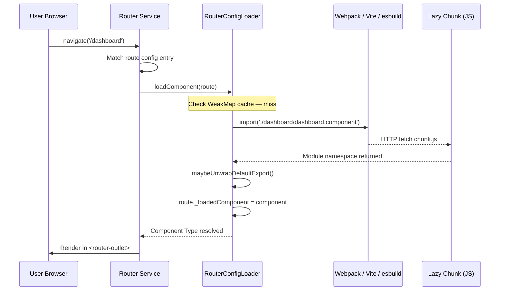

## TL;DR

**Q:** Why does using `loadChildren` in Angular Router reduce initial bundle size?
**A:** Because Angular Router calls `loadComponent`/`loadChildren` via dynamic `import()`, which tells the bundler (Webpack/Vite/esbuild) to emit a separate JavaScript chunk per route—loaded only when the user navigates to it.

---

## 1. The Engineering Problem: Eager Loading Bloats Everything

When you wire every feature module directly into a single root `NgModule`, every component, service, and template gets bundled into **one** JavaScript file. A mid-size Angular app with 15 feature areas can easily ship 1.8 MB+ of uncompressed JS to the browser on first paint.

The browser must download, parse, and execute that entire bundle before the user sees anything. For users on 3G connections, that's a multi-second wait to display a login screen they never needed most of that code for.

The core issue is that Angular's module system doesn't automatically code-split. `RouterModule.forRoot([...])` eagerly resolves every component referenced in its route config at build time. There's no deferred boundary—everything is one monolithic chunk.

---

## 2. The Technical Solution

### Route Config Flowchart

How Angular determines whether a route is eagerly or lazily loaded:



### Lazy Load Sequence Diagram

The internal sequence from navigation to chunk fetch:



---

## 3. The Clean Example

A minimal route config that separates a dashboard feature into its own bundle:

```typescript
// app.routes.ts
import { Routes } from '@angular/router';

export const routes: Routes = [
  // Eagerly loaded — always in the initial bundle
  {
    path: '',
    loadComponent: () =>
      import('./home/home.component').then(m => m.HomeComponent),
    title: 'Home',
  },

  // Lazy-loaded dashboard: 100+ KB of feature code stays out of main.js
  {
    path: 'dashboard',
    loadComponent: () =>
      import('./dashboard/dashboard.component').then(m => m.DashboardComponent),
    title: 'Dashboard',
    canActivate: [authGuard], // guard runs BEFORE the chunk is fetched
  },

  // Nested lazy children — own chunk per child route
  {
    path: 'reports',
    loadChildren: () =>
      import('./reports/report.routes').then(m => m.REPORT_ROUTES),
    title: 'Reports',
  },

  // Fallback: catch-all 404
  { path: '**', redirectTo: '' },
];
```

---

## 4. Production Reality: How the Router Actually Does It

### Annotations — What happens inside `RouterConfigLoader`

> The `RouterConfigLoader` class maintains a `WeakMap` cache per route so the dynamic `import()` is only called once per route. After the first navigation, subsequent visits reuse `_loadedComponent` / `_loadedRoutes` without re-fetching the network chunk.

> `maybeUnwrapDefaultExport()` is an Angular internal that unwraps ES `default` exports — so `import('./foo')` works whether the file uses `export default class` or named exports.

> In JIT mode, `resolveComponentResources(fetch)` is called after lazy-loading a component to ensure its `templateUrl` and `styleUrls` are fetched, since JIT compilation doesn't pre-bake those into the bundle.

### Verbatim from `packages/router/src/router_config_loader.ts`

```typescript
// Source: packages/router/src/router_config_loader.ts (angular/angular @ main)

@Service()
export class RouterConfigLoader {
  // One cache per component, one per child-route set
  private componentLoaders = new WeakMap<Route, Promise<Type<unknown>>>();
  private childrenLoaders = new WeakMap<Route, Promise<LoadedRouterConfig>>();

  async loadComponent(injector: EnvironmentInjector, route: Route): Promise<Type<unknown>> {
    // Return cached promise if already in-flight
    if (this.componentLoaders.get(route)) {
      return this.componentLoaders.get(route)!;
    } else if (route._loadedComponent) {
      return Promise.resolve(route._loadedComponent);  // previously loaded
    }

    const loader = (async () => {
      try {
        const loaded = await wrapIntoPromise(
          runInInjectionContext(injector, () => route.loadComponent!()),
        );
        const component = await maybeResolveResources(
          maybeUnwrapDefaultExport(loaded),
        );
        (typeof ngDevMode === 'undefined' || ngDevMode) &&
          assertStandalone(route.path ?? '', component);
        route._loadedComponent = component;  // cache for next navigation
        return component;
      } finally {
        this.componentLoaders.delete(route);  // clear in-flight cache
      }
    })();
    this.componentLoaders.set(route, loader);
    return loader;
  }

  loadChildren(parentInjector: Injector, route: Route): Promise<LoadedRouterConfig> {
    // Same cache-then-load pattern for child route trees
    if (this.childrenLoaders.get(route)) {
      return this.childrenLoaders.get(route)!;
    } else if (route._loadedRoutes) {
      return Promise.resolve({
        routes: route._loadedRoutes,
        injector: route._loadedInjector,
      });
    }

    const loader = (async () => {
      try {
        const result = await loadChildren(
          route, this.compiler, parentInjector, this.onLoadEndListener,
        );
        route._loadedRoutes = result.routes;
        route._loadedInjector = result.injector;
        return result;
      } finally {
        this.childrenLoaders.delete(route);
      }
    })();
    this.childrenLoaders.set(route, loader);
    return loader;
  }
}
```

---

## 5. Review Checklist

- **Audit `RouterModule.forRoot`** — any route with `component:` directly referenced adds to `main.js`; switch to `loadComponent` for features > 20 KB.
- **Verify chunk output** — run `ng build --stats-json` and inspect the generated chunk names in `dist/` to confirm each lazy route produced its own file.
- **Check `canActivate` runs before the fetch** — guards on `loadChildren` routes execute against the static config; the chunk is only fetched if guards pass.
- **Watch for circular lazy imports** — two lazy routes importing each other's guards creates a circular chunk graph; refactor guards into a shared core module.

---

## 6. FAQ

### Does `loadChildren` always produce a separate chunk?
Yes, if your bundler supports code-splitting (Webpack, Vite, esbuild). Angular CLI's `@angular-devkit/build-angular` is configured to emit separate chunks for every `import()` call inside `loadChildren` or `loadComponent`.

### Can I pre-load a lazy route in the background?
Yes. `PreloadAllModules` (from `@angular/router`) or a custom `PreloadingStrategy` fetches lazy chunks after the initial bundle loads, while the browser is idle. This trades bandwidth for instant navigation later.

### What is the difference between `loadChildren` and `loadComponent`?
`loadChildren` loads an entire sub-route tree (array of `Routes`), while `loadComponent` loads a single component for that specific route. Both use `import()` under the hood and both create separate chunks.

### Why does the `WeakMap` cache matter?
It prevents duplicate network requests. Without it, navigating away from `/dashboard` and back would trigger a second `import()`. The `WeakMap` is keyed on the `Route` object itself, so once loaded, the component promise is reused. Using `WeakMap` also means the cache is garbage-collected if the route config is removed.

### Is lazy loading compatible with SSR / Angular Universal?
Yes. Angular's SSR builder (part of `@angular-devkit/build-angular`) can discover lazy routes at build time and inline them into the server bundle, so server-side renders are not affected by the split. Client-side navigation still fetches chunks normally.

---

## Source

| File | Repository |
|------|-----------|
| [`packages/router/src/router_config_loader.ts`](https://github.com/angular/angular/blob/main/packages/router/src/router_config_loader.ts) | `angular/angular` — `RouterConfigLoader`, `loadChildren()` |
| [`packages/router/src/models.ts`](https://github.com/angular/angular/blob/main/packages/router/src/models.ts) | `angular/angular` — `Route` interface, `LoadChildrenCallback` |
| [`packages/router/src/router.ts`](https://github.com/angular/angular/blob/main/packages/router/src/router.ts) | `angular/angular` — `Router` service, `scheduleNavigation()` |


