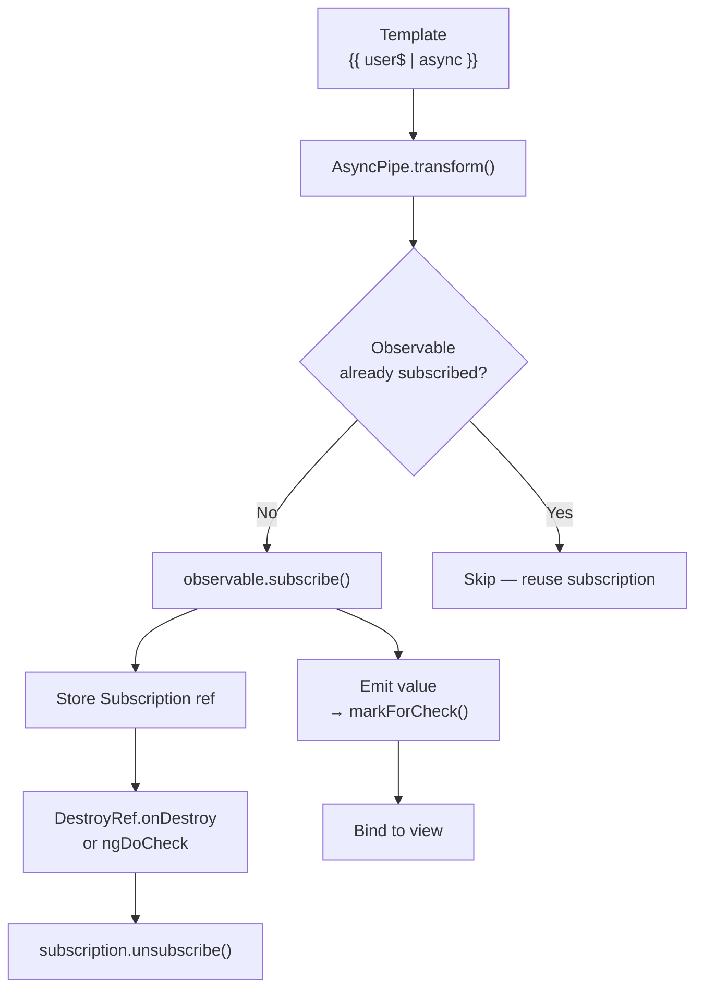
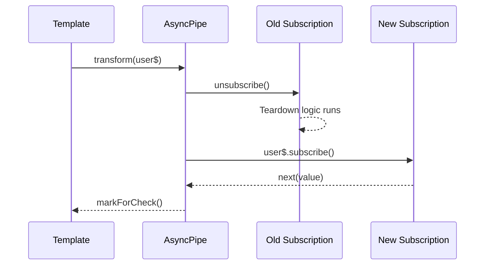
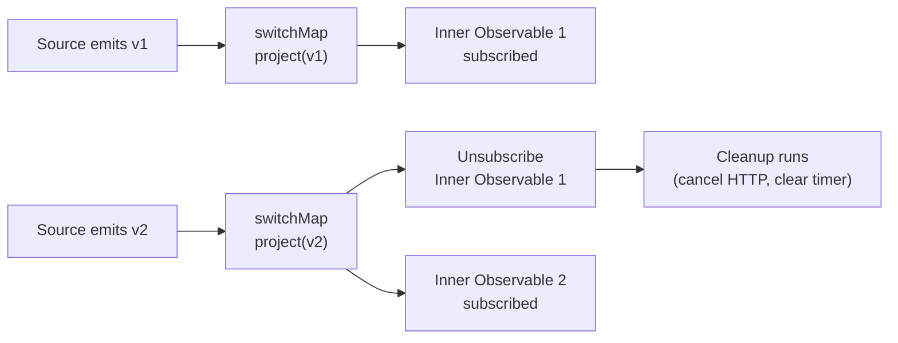

## TL;DR

Angular's `async` pipe subscribes to an Observable in the template, binds emitted values to the view, and unsubscribes automatically when the component is destroyed — no `ngOnDestroy` boilerplate required. The teardown chain works because RxJS operators like `switchMap` call `unsubscribe()` on the previous inner subscription before creating a new one, so even rapidly-flipping streams never leak.

---

## The Engineering Problem

Every Angular component that consumes an Observable must eventually unsubscribe. Forget the `ngOnDestroy` teardown and you get a memory leak: the subscription keeps the component's closure scope alive, the HTTP request keeps the connection open, and the change detector fires into a destroyed view — producing the infamous `ExpressionChangedAfterItHasBeenCheckedError`.

The question is not "how do I subscribe?" It is: **when a component template contains an `| async` pipe, what exactly subscribes, what triggers the subscription to end, and how does the RxJS operator chain cooperatively tear itself down when a new inner Observable arrives before the old one finishes?**

The answer lives in Angular's `AsyncPipe` class, its `DestroyRef` integration, and RxJS's operator contract — specifically the `unsubscribe()` call baked into `switchMap`.

---

## The Technical Solution

Angular's `async` pipe wires together two teardown paths: one inside the framework and one inside RxJS.





When the template re-evaluates (for example, because a parent component pushes a new Observable reference via an `@Input`), `async` pipe tears down the old subscription and subscribes to the new one:



Inside RxJS, the `switchMap` operator enforces the same one-active-inner-subscription invariant. Each time the source emits, it unsubscribes the previous inner subscriber *before* subscribing to the next inner Observable — so you never have two concurrent inner streams:



The key insight: **`async` pipe handles the outer subscription lifecycle (subscribe on init, unsubscribe on destroy), while operators like `switchMap` handle the inner subscription lifecycle (cancel previous, subscribe to next).** Together, they guarantee zero active subscriptions after component teardown, even for complex multi-layered streams.

---

## The Clean Example

A component that fetches a user profile based on a route parameter, with automatic cleanup on navigation:


```typescript
@Component({
  selector: 'app-user-profile',
  template: `
    @if (profile$ | async; as profile) {
      <h2>{{ profile.name }}</h2>
      <p>{{ profile.email }}</p>
    }
  `,
})
export class UserProfileComponent {
  // Route param changes drive the stream — old HTTP request
  // is cancelled automatically by switchMap before a new one starts
  profile$ = this.route.paramMap.pipe(
    switchMap(params => {
      const id = params.get('id')!;
      return this.http.get<UserProfile>(`/api/users/${id}`);
    })
  );

  constructor(
    private route: ActivatedRoute,
    private http: HttpClient,
  ) {}
}
```


What happens step by step:

1. User navigates to `/users/1`. `paramMap` emits `{id: '1'}`.
2. `switchMap` projects to `http.get('/api/users/1')`, stores the inner subscription.
3. `async` pipe subscribes to the outer chain, receives the HTTP response, renders the view.
4. User navigates to `/users/2`. `paramMap` emits `{id: '2'}`.
5. `switchMap` calls `innerSubscriber.unsubscribe()` — the in-flight request for user 1 is cancelled.
6. `switchMap` projects to `http.get('/api/users/2')`, stores the new inner subscription.
7. `async` pipe receives the new response, renders the updated view.
8. User navigates away entirely. `DestroyRef` fires, `async` pipe unsubscribes from the outer chain. No leaked subscriptions.

Compare this with the manual approach:

```typescript
// ❌ Manual subscription — easy to forget unsubscribe,
// or to unsubscribe before the component is actually destroyed
export class UserProfileComponent implements OnInit, OnDestroy {
  profile!: UserProfile;
  private sub!: Subscription;

  ngOnInit() {
    this.sub = this.route.paramMap.pipe(
      switchMap(params => this.http.get<UserProfile>(`/api/users/${params.get('id')}`))
    ).subscribe(p => this.profile = p);
  }

  ngOnDestroy() {
    this.sub.unsubscribe(); // ← This line is the one developers forget
  }
}
```

The `async` pipe eliminates the entire `ngOnDestroy` path.

---

## Production Reality

This is the actual `switchMap` implementation from the `ReactiveX/rxjs` repository. The critical teardown line is `innerSubscriber?.unsubscribe()` — called inside `next` before every new inner subscription:

```typescript
// packages/rxjs/src/internal/operators/switchMap.ts
//
// Each time the source emits, the previous inner subscription is
// unsubscribed BEFORE the new one is created. This guarantees that
// at most one inner Observable is active at any time.

export function switchMap<T, O extends ObservableInput<any>>(
  project: (value: T, index: number) => O
): OperatorFunction<T, ObservedValueOf<O>> {
  return (source) =>
    new Observable((destination) => {
      let innerSubscriber: Subscriber<ObservedValueOf<O>> | null = null;
      let index = 0;
      let isComplete = false;

      const checkComplete = () => isComplete && !innerSubscriber && destination.complete();

      source.subscribe(
        operate({
          destination,
          next: (value) => {
            // Cancel the previous inner subscription if there was one
            innerSubscriber?.unsubscribe();
            const outerIndex = index++;
            from(project(value, outerIndex)).subscribe(
              (innerSubscriber = operate({
                destination,
                complete: () => {
                  innerSubscriber = null!;
                  checkComplete();
                },
              }))
            );
          },
          complete: () => {
            isComplete = true;
            checkComplete();
          },
        })
      );
    });
}
```

And this is `finalize` — the operator that hooks into unsubscribe, complete, and error to run cleanup logic. Angular's `async` pipe relies on the same `subscriber.add(callback)` pattern to register teardown:

```typescript
// packages/rxjs/src/internal/operators/finalize.ts
//
// Registers a callback that fires on complete, error, OR explicit
// unsubscribe — the same three teardown paths that async pipe uses.

export function finalize<T>(callback: () => void): MonoTypeOperatorFunction<T> {
  return (source) =>
    new Observable((subscriber) => {
      source.subscribe(subscriber);
      // subscriber.add() registers a teardown — it runs when
      // unsubscribe() is called, whether triggered by async pipe's
      // DestroyRef, by switchMap's inner cancellation, or manually.
      subscriber.add(callback);
    });
}
```

The `finalize` operator's `subscriber.add(callback)` call is the mechanism that makes `finalize(() => console.log('cleanup'))` work identically whether the teardown is triggered by Angular's `DestroyRef`, by `switchMap` cancelling an inner stream, or by a manual `subscription.unsubscribe()` call. The callback registration is indistinguishable across all three paths.

---

## Review Checklist

- [ ] **`async` pipe subscribes on template evaluation:** It creates the subscription the first time the template renders the expression.
- [ ] **`async` pipe unsubscribes on destroy:** Angular's `DestroyRef` (or `ngOnDestroy` in older versions) triggers `subscription.unsubscribe()`.
- [ ] **`async` pipe calls `markForCheck()` on every emission:** This ensures the change detector runs even inside `OnPush` components.
- [ ] **`switchMap` cancels the previous inner subscription:** The `innerSubscriber?.unsubscribe()` call runs *before* subscribing to the new inner Observable.
- [ ] **`finalize` fires on all three teardown paths:** complete, error, and explicit unsubscribe all trigger the registered callback.
- [ ] **Manual `subscribe()` without teardown is a memory leak:** The subscription keeps the closure scope alive until the garbage collector can reach it.
- [ ] **`takeUntil` is an alternative to `async` pipe:** It tears down when a notifier emits, but requires you to manage the notifier Subject yourself.
- [ ] **Signals are the future path:** Angular signals eliminate the need for `async` pipe entirely, but RxJS interop (`toSignal`, `toObservable`) still requires careful subscription management.

---

## FAQ

**Q: Does `async` pipe unsubscribe when the component is destroyed, or when the Observable completes?**

Both. Angular registers a teardown with `DestroyRef.onDestroy()` — so if the component is destroyed while the Observable is still hot, the subscription is cleaned up. If the Observable completes before the component is destroyed, the subscription is also released. Either path prevents a leak.

**Q: Can I use `async` pipe with multiple Observables in the same template?**

Yes. Each `async` pipe creates and manages its own independent subscription. `{{ user$ | async }}` and `{{ orders$ | async }}` do not interfere with each other. The `async` pipe stores each subscription internally and unsubscribes all of them on destroy.

**Q: What happens if I use `async` pipe with a Subject that never completes?**

The subscription stays active for the component's entire lifetime. This is correct behavior — the Subject is expected to emit over time. On component destroy, the subscription is still cleaned up. The Subject itself is not unsubscribed; only the pipe's subscription to it is.

**Q: Does `switchMap` cancel HTTP requests in Angular?**

Yes. Angular's `HttpClient` returns an Observable backed by `XMLHttpRequest`. When `switchMap` calls `unsubscribe()` on the inner subscription, the XHR's `abort()` method is called as part of the RxJS teardown chain, cancelling the in-flight network request.

**Q: How does `async` pipe interact with `OnPush` change detection?**

`async` pipe calls `markForCheck()` on every emission, which marks the component and its ancestors as dirty so Angular's change detector will run on the next cycle. Without this, an `OnPush` component would never re-render because Angular would not detect the state change.

**Q: Is there a performance difference between `async` pipe and a manual subscription?**

Negligible. The `async` pipe adds a small overhead (template evaluation, `markForCheck()` call), but in practice this is unmeasurable compared to the I/O cost of the data source (HTTP request, WebSocket message, database query). The safety benefit of guaranteed cleanup far outweighs the micro-overhead.

---

## Source

All operator code in this post is verbatim from the `ReactiveX/rxjs` repository on GitHub:

- [`packages/rxjs/src/internal/operators/switchMap.ts`](https://github.com/ReactiveX/rxjs/blob/master/packages/rxjs/src/internal/operators/switchMap.ts) — inner subscription cancellation on source emission
- [`packages/rxjs/src/internal/operators/finalize.ts`](https://github.com/ReactiveX/rxjs/blob/master/packages/rxjs/src/internal/operators/finalize.ts) — teardown callback registration via `subscriber.add()`
- [`packages/rxjs/src/internal/operators/mergeMap.ts`](https://github.com/ReactiveX/rxjs/blob/master/packages/rxjs/src/internal/operators/mergeMap.ts) — contrast: mergeMap does NOT cancel previous inner subscriptions
