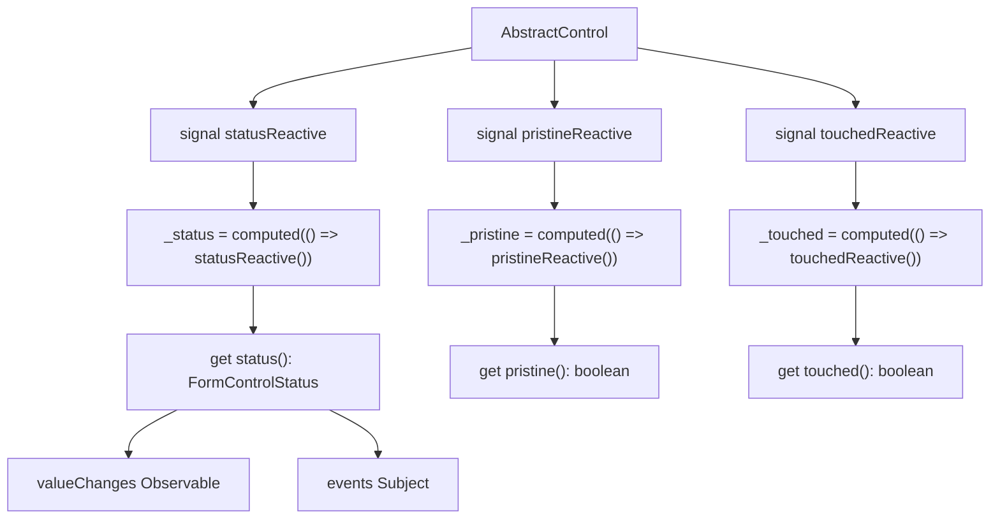
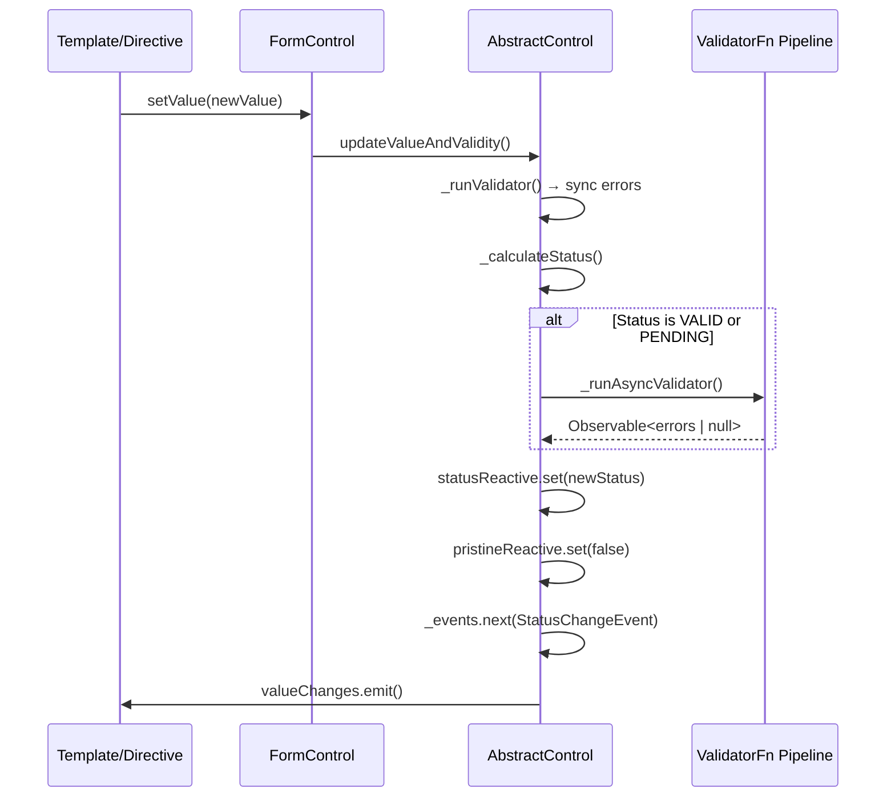

> **In plain English (30 sec):** Code you already write — Map, function, API call, just bigger.


## TL;DR

Angular's Reactive Forms module already uses signals internally. `AbstractControl` stores `status`, `pristine`, and `touched` as signal fields (`signal<FormControlStatus>`, `signal(true)`, `signal(false)`), while exposing `computed()` derivations for framework consumers. The validation engine -- `updateValueAndValidity()` -- mutates these signals directly. Whether you use template-driven forms, reactive forms, or future signal-based forms, every validator runs through the same `ValidatorFn` → `composeValidators` → `_runValidator` pipeline. The plumbing is identical; only the wiring to the template layer changes.

## The Engineering Problem

Every Angular forms API faces the same architectural tension: **validation logic must be decoupled from rendering, but state must propagate to the template in real time.**

In the Reactive Forms world, this was solved with RxJS observables (`valueChanges`, `statusChanges`). The template subscribes imperatively, change detection picks up mutations, and the UI updates. But signals introduced a different mental model: synchronous, pull-based reactivity where the framework tracks dependencies automatically.

The core question for the Angular team was:

> How do you expose form control state through signals without duplicating the validation engine or breaking the existing Observable contract?

The answer lives in `AbstractControl` -- the base class shared by `FormControl`, `FormGroup`, and `FormArray`. Rather than building a parallel signal-based control, Angular embedded signals *inside* the existing class and kept the same `updateValueAndValidity()` entry point for both worlds.

## Technical Solution

### Signal-Backed State Inside `AbstractControl`

`AbstractControl` stores its reactive state as Angular signals, then exposes them through both getter properties and `computed()` read-only signals for internal framework use:



From `packages/forms/src/model/abstract_model.ts`:

```ts
// Internal signal-backed status storage
get status(): FormControlStatus {
  return untracked(this.statusReactive)!;
}
private set status(v: FormControlStatus) {
  untracked(() => this.statusReactive.set(v));
}
/** @internal */
readonly _status = computed(() => this.statusReactive());
private readonly statusReactive = signal<FormControlStatus | undefined>(undefined);

/** @internal */
readonly _pristine = computed(() => this.pristineReactive());
private readonly pristineReactive = signal(true);

/** @internal */
readonly _touched = computed(() => this.touchedReactive());
private readonly touchedReactive = signal(false);
```

The key design choice: the signals are `private`. They are wrapped in `untracked()` reads and writes so that external consumers (templates, `computed()` in component classes) don't accidentally create reactive subscriptions at the wrong granularity. The `_status`, `_pristine`, and `_touched` computed signals exist solely for internal Angular plumbing.

### The Unified Validation Pipeline

Every control -- whether wired up via `formControl`, `formControlName`, or a future signal-based directive -- runs validators through the same `_runValidator()` + `_runAsyncValidator()` path in `updateValueAndValidity()`:



Inside `updateValueAndValidity()`, the validation runs synchronously first, then conditionally starts async validation:

```ts
updateValueAndValidity(
  opts: {onlySelf?: boolean; emitEvent?: boolean; sourceControl?: AbstractControl} = {},
): void {
  this._setInitialStatus();
  this._updateValue();

  if (this.enabled) {
    const shouldHaveEmitted = this._cancelExistingSubscription();
    (this as Writable<this>).errors = this._runValidator();
    this.status = this._calculateStatus();

    if (this.status === VALID || this.status === PENDING) {
      this._runAsyncValidator(shouldHaveEmitted, opts.emitEvent);
    }
  }

  const sourceControl = opts.sourceControl ?? this;
  if (opts.emitEvent !== false) {
    this._events.next(new ValueChangeEvent<TValue>(this.value, sourceControl));
    this._events.next(new StatusChangeEvent(this.status, sourceControl));
    (this.valueChanges as EventEmitter<TValue>).emit(this.value);
    (this.statusChanges as EventEmitter<FormControlStatus>).emit(this.status);
  }

  if (!opts.onlySelf) {
    this._parent?.updateValueAndValidity({...opts, sourceControl});
  }
}
```

Notice that `this.status = this._calculateStatus()` calls the *private setter*, which wraps `this.statusReactive.set(v)` inside `untracked()`. The Observable bridge (`valueChanges`, `statusChanges`) fires **after** the signal is updated. A signal-based template reads the latest value synchronously; a traditional template gets it on the next change detection cycle.

### Validator Composition: Shared Across All APIs

The `setUpValidators()` function in `shared.ts` merges validators from two sources: the programmatic validators you set on the model (`control.setValidators(...)`) and the directive-level validators from template attributes (`required`, `minlength`, etc.). This function is called identically for reactive and template-driven paths:

```ts
export function setUpValidators(control: AbstractControl, dir: AbstractControlDirective): void {
  const validators = getControlValidators(control);
  if (dir.validator !== null) {
    control.setValidators(mergeValidators<ValidatorFn>(validators, dir.validator));
  } else if (typeof validators === 'function') {
    control.setValidators([validators]);
  }

  const asyncValidators = getControlAsyncValidators(control);
  if (dir.asyncValidator !== null) {
    control.setAsyncValidators(
      mergeValidators<AsyncValidatorFn>(asyncValidators, dir.asyncValidator),
    );
  } else if (typeof asyncValidators === 'function') {
    control.setAsyncValidators([asyncValidators]);
  }

  const onValidatorChange = () => control.updateValueAndValidity();
  registerOnValidatorChange<ValidatorFn>(dir._rawValidators, onValidatorChange);
  registerOnValidatorChange<AsyncValidatorFn>(dir._rawAsyncValidators, onValidatorChange);
}
```

The `mergeValidators` utility in `validators.ts` is a simple array concat:

```ts
export function mergeValidators<V>(controlValidators: V | V[] | null, dirValidator: V): V[] {
  if (controlValidators === null) return [dirValidator];
  return Array.isArray(controlValidators)
    ? [...controlValidators, dirValidator]
    : [controlValidators, dirValidator];
}
```

This is the critical architectural insight: **the validator layer is model-level, not directive-level.** A signal-based form control can call `control.setValidators(...)` and `control.updateValueAndValidity()` without any directive involvement. The `FormControlDirective` is just one of many possible "wiring" mechanisms.

## Clean Example

Here is a minimal reactive form that demonstrates the shared validation engine in action. The same `Validators.required` runs whether you read `control.status` imperatively or bind it in a template:


```ts
// component.ts
import { Component } from '@angular/core';
import { FormControl, FormGroup, Validators } from '@angular/forms';

@Component({
  selector: 'app-signal-validation-demo',
  standalone: true,
  template: `
    <form [formGroup]="profileForm">
      <input formControlName="name" placeholder="Name">
      <span>{{ nameControl.errors | json }}</span>

      <input formControlName="email" placeholder="Email">
      <span>{{ emailControl.errors | json }}</span>
    </form>

    <!-- Read signal-backed status directly -->
    <p>Name valid: {{ nameControl.status }}</p>
    <p>Email valid: {{ emailControl.status }}</p>
  `,
})
export class SignalValidationDemoComponent {
  // Both controls share the exact same ValidatorFn pipeline
  nameControl = new FormControl('', Validators.required);
  emailControl = new FormControl('', [Validators.required, Validators.email]);

  profileForm = new FormGroup({
    name: this.nameControl,
    email: this.emailControl,
  });
}
```


What's happening under the hood when you type in the name field:

1. `FormControlDirective` calls `control.setValue('Jo')` via the value accessor pipeline
2. `FormControl.setValue()` calls `this.updateValueAndValidity()`
3. `_runValidator()` executes the composed `required` validator -- returns `null` (valid)
4. `this.status = VALID` sets the signal via the private setter
5. `_events.next(new StatusChangeEvent('VALID', ...))` fires
6. `valueChanges.emit('Jo')` fires for Observable subscribers
7. In a signal-aware template, reading `nameControl.status` returns `'VALID'` synchronously

The same pipeline fires for `emailControl` with `[Validators.required, Validators.email]` composed via `composeValidators()`.

## Production Reality

This is the actual `FormControlDirective` from Angular's forms module. It is the bridge between the model (which owns signals) and the DOM (which uses `ControlValueAccessor`):

```ts
@Directive({
  selector: '[formControl]',
  providers: [formControlBinding, NG_CONTROL_INTEGRATION_PROVIDER],
  exportAs: 'ngForm',
  standalone: false,
})
export class FormControlDirective extends NgControl implements OnChanges, OnDestroy {
  @Input('formControl') form!: FormControl;

  constructor(
    @Optional() @Self() @Inject(NG_VALIDATORS)
      validators: (Validator | ValidatorFn)[],
    @Optional() @Self() @Inject(NG_ASYNC_VALIDATORS)
      asyncValidators: (AsyncValidator | AsyncValidatorFn)[],
    @Optional() @Self() @Inject(NG_VALUE_ACCESSOR)
      valueAccessors: ControlValueAccessor[],
    @Optional() @Inject(NG_MODEL_WITH_FORM_CONTROL_WARNING)
      private _ngModelWarningConfig: string | null,
    @Optional() @Inject(CALL_SET_DISABLED_STATE)
      private callSetDisabledState?: SetDisabledStateOption,
    @Optional() renderer?: Renderer2,
    @Optional() injector?: Injector,
  ) {
    super(injector, renderer, valueAccessors);
    this._setValidators(validators);
    this._setAsyncValidators(asyncValidators);
  }

  ngOnChanges(changes: SimpleChanges): void {
    if (this._isControlChanged(changes)) {
      const previousForm = changes['form'].previousValue as FormControl | null;
      if (previousForm) {
        cleanUpControl(previousForm, this, false);
        this.removeParseErrorsValidator(previousForm);
      }
      if (!this.isCustomControlBased) {
        this.valueAccessor ??= this.selectedValueAccessor;
        setUpControlValueAccessor(this.form, this, this.callSetDisabledState);
      } else {
        this.setupCustomControl();
      }
      this.form.updateValueAndValidity({emitEvent: false});
    }
    if (isPropertyUpdated(changes, this.viewModel)) {
      if (typeof ngDevMode === 'undefined' || ngDevMode) {
        _ngModelWarning('formControl', FormControlDirective, this, this._ngModelWarningConfig);
      }
      this.form.setValue(this.model);
      this.viewModel = this.model;
    }
  }

  ngOnDestroy() {
    if (this.form) {
      cleanUpControl(this.form, this, false);
    }
  }

  ɵngControlCreate(host: ControlDirectiveHost): void {
    super.ngControlCreate(host);
  }

  ɵngControlUpdate(host: ControlDirectiveHost): void {
    super.ngControlUpdate(host, true);
  }
}
```

The directive calls `setUpControlValueAccessor()` which in turn calls `setUpValidators()` -- the same merge function shown earlier. When the directive is destroyed, `cleanUpControl()` reverses the wiring. None of this touches the `AbstractControl` signal internals; it only manipulates the validator function lists and value accessor callbacks.

## Review Checklist

- [ ] `AbstractControl` stores `status`, `pristine`, `touched` as **signals** with `untracked()` read/write wrappers
- [ ] `updateValueAndValidity()` is the **single entry point** for both sync and async validation across all form APIs
- [ ] `setUpValidators()` merges model-level validators and directive-level validators into a **single array** on the control
- [ ] `composeValidators()` reduces the merged array into a single composed `ValidatorFn`
- [ ] `valueChanges` / `statusChanges` Observables fire **after** the signals are updated, not before
- [ ] `FormControlDirective` calls `cleanUpControl()` on destroy to prevent memory leaks in validator subscriptions
- [ ] `_hasRequired = signal(false)` tracks whether a `required` validator is present -- used by `RequiredValidator` directive for ARIA attribute binding
- [ ] Async validators use `toObservable()` to convert Promise-based validators into Observable-based ones, unified under `forkJoin`

## FAQ

**Q: Can I use `control.status` as a signal in my component's `computed()`?**
A: Not directly as a reactive dependency. Angular wraps signal reads in `untracked()` to prevent accidental subscription tracking. You can read `control.status` imperatively (it returns the current value) or subscribe to `control.statusChanges` as an Observable.

**Q: Why does Angular use `untracked()` around signal reads/writes in `AbstractControl`?**
A: Form controls are updated from multiple sources (user input, programmatic `setValue`, async validators completing). Using `untracked()` prevents the framework from creating unintended reactive subscriptions when a parent control reads child status during `updateValueAndValidity()` propagation.

**Q: Is there a separate "Signal Forms" API coming?**
A: The Angular team has explored signal-native form APIs, but the current architecture already embeds signals in the model layer. Any future signal-based form directive would call the same `updateValueAndValidity()` and `setUpValidators()` functions -- the validation engine is agnostic to how the template consumes state.

**Q: What happens to validators when I switch from `formControl` to a hypothetical signal form control?**
A: Nothing changes at the validator level. `ValidatorFn` is `(control: AbstractControl) => ValidationErrors | null`. As long as your signal form control extends `AbstractControl`, all existing validators work without modification.

**Q: Why is `_hasRequired` a signal instead of a plain boolean?**
A: It's read by the `RequiredValidator` directive to bind `aria-required` on the host element. Making it a signal allows the directive to reactively update the ARIA attribute when validators are added or removed at runtime via `addValidators()` / `removeValidators()`.

## Source

- [`packages/forms/src/model/abstract_model.ts` -- `AbstractControl` class with signal-backed state](https://github.com/angular/angular/blob/main/packages/forms/src/model/abstract_model.ts)
- [`packages/forms/src/model/form_control.ts` -- `FormControl` implementation](https://github.com/angular/angular/blob/main/packages/forms/src/model/form_control.ts)
- [`packages/forms/src/directives/shared.ts` -- `setUpValidators()` and `setUpControlValueAccessor()`](https://github.com/angular/angular/blob/main/packages/forms/src/directives/shared.ts)
- [`packages/forms/src/validators.ts` -- `composeValidators()`, `mergeValidators()`, built-in validators](https://github.com/angular/angular/blob/main/packages/forms/src/validators.ts)
- [`packages/forms/src/directives/reactive_directives/form_control_directive.ts` -- `FormControlDirective`](https://github.com/angular/angular/blob/main/packages/forms/src/directives/reactive_directives/form_control_directive.ts)


