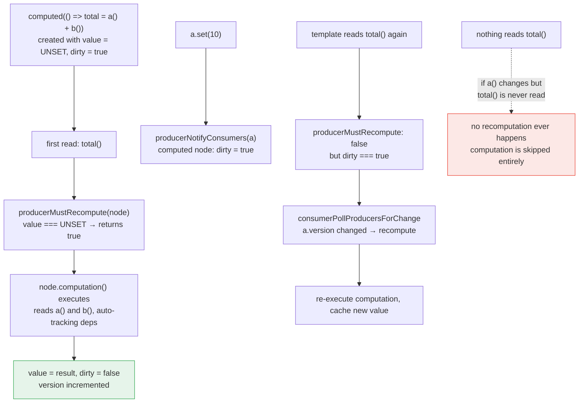

**TL;DR:** Why does `computed()` wait to calculate until something reads it, while `effect()` fires the instant it's created? Because computed values derive state — they produce nothing until someone asks for the result, and computing eagerly would waste cycles on values nobody reads. Effects produce side effects — their entire purpose is to *do* something, so deferring them would mean missing the initial trigger they were registered to observe. Angular implements both on the same reactive graph node, but the scheduling hook differs: `producerMustRecompute` returns `true` on a `computed` whose value is `UNSET`, while an `effect`'s `consumerMarkedDirty` immediately schedules itself with the `ChangeDetectionScheduler`.

## 1. The Engineering Problem

Every reactive system faces a fundamental scheduling question: when a piece of state changes, how do you decide which dependents get to run, and *when*?

Two tempting but wrong approaches keep showing up:

- **Eager recomputation everywhere.** Any time any signal changes, re-derive every computed value that depends on it, and re-run every effect that reads it — immediately, synchronously, before control returns to the caller. This guarantees consistency but wastes enormous amounts of work: a computed that no template ever reads, or an effect whose effect already did its job on first run, burns CPU for nothing. In a component with 200 signals and 40 derived values, a single signal write could trigger 40 recomputations even if only 3 of those values are actually displayed.

- **Lazy everything, including effects.** Only recompute when read. This sounds efficient until you realize effects have no "read" — nobody calls `effect()` to get a value. If an effect were lazy, it would never fire at all on initial creation, because no one reads its return value. The whole point of an effect is to observe signals and do something *because* of what they hold, not to be queried later for a derived result.

The real engineering problem is that `computed` and `effect` look almost identical — both are consumers that read signals and auto-track their dependencies — but they need opposite scheduling semantics. A framework that doesn't make this distinction will either waste work (eager computed) or silently do nothing (lazy effect).

## 2. The Technical Solution

Angular's reactive graph solves this by giving `computed()` and `effect()` the same tracking mechanism — `producerAccessed` links them to the signals they read — but opposite *notification* semantics: a dirty `computed` waits passively until something reads it, while a dirty `effect` schedules itself to re-run as soon as the scheduler allows.

### 2a. computed() — lazy derivation

A `computed()` starts in a `UNSET` state with `dirty: true`. When the getter is first called, `producerUpdateValueVersion` sees the `UNSET` sentinel and calls `producerRecomputeValue`, which executes the computation function. After that first read, the value is cached: subsequent reads skip recomputation entirely unless the computed is `dirty` (meaning at least one of its dependencies changed since the last clean read).



The key insight: a `computed` that is never read is *never* recomputed, no matter how many times its dependencies change. Angular's `producerUpdateValueVersion` has an explicit early-exit for this case — if `dirty` is `false` and `lastCleanEpoch === epoch`, it returns immediately without doing anything. Even if `dirty` is `true`, `consumerPollProducersForChange` walks the dependency list and only recomputes if a version mismatch is found. This is genuine laziness, not deferred-but-still-guaranteed-to-run.

### 2b. effect() — eager first run, push-driven re-runs

An `effect()` does the opposite: the moment `effect()` is called, the framework immediately schedules and executes the effect function. There is no "read" to trigger it — `consumerMarkedDirty` fires synchronously during `createViewEffect` or `createRootEffect`, which calls into the scheduler to queue the effect for immediate execution. The effect function runs once, auto-tracking its signal dependencies the same way a `computed` would, but instead of caching a return value, it performs its side effect.

```mermaid
sequenceDiagram
    participant App as Application
    participant Eff as effect()
    participant Graph as Reactive Graph
    participant Sched as ChangeDetectionScheduler

    App->>Eff: effect(() => { console.log(count()); })
    Eff->>Graph: consumerBeforeComputation(node)<br/>sets activeConsumer = effectNode
    Eff->>Graph: count() → producerAccessed<br/>links count as dependency
    Eff->>Eff: runs effect body immediately<br/>console.log outputs current value
    Eff->>Graph: consumerAfterComputation(node)<br/>restores previous activeConsumer

    Note over Eff,Sched: effect is now registered,<br/>waiting for dependency change

    App->>Graph: count.set(42)
    Graph->>Graph: producerNotifyConsumers(count)<br/>effect node: dirty = true
    Graph->>Sched: consumerMarkedDirty → scheduler.schedule(node)<br/>effect is queued for re-run
    Sched->>Eff: effect re-runs<br/>cleanup functions first, then body

    Note over App,Sched: If no cleanup registered,<br/>body runs with no intermediate step
```

The critical difference from `computed` lives in `consumerMarkedDirty`: for an effect node, `node.consumerMarkedDirty?.(node)` is overridden by `VIEW_EFFECT_NODE` and `ROOT_EFFECT_NODE` to immediately schedule re-execution. A computed doesn't override this — it just sits there with `dirty = true` until something reads it. Same graph, same dirty propagation, opposite consequences.

## 3. The clean example (concept in isolation)

```typescript
// Two consumer types on the same graph — different scheduling on dirty
function createComputed(fn) {
  let value = UNSET, dirty = true;

  const getter = () => {
    if (dirty || value === UNSET) {
      value = fn();     // only runs when read AND dirty
      dirty = false;
    }
    return value;
  };

  getter.markDirty = () => { dirty = true; }; // no schedule — just flag
  return getter;
}

function createEffect(fn) {
  const effect = {
    markDirty: () => {
      queueMicrotask(() => effect.run()); // immediately schedule, don't wait for read
    },
    run: () => {
      const prev = activeConsumer;
      activeConsumer = effect.markDirty; // tracking target = re-schedule itself
      fn();
      activeConsumer = prev;
    }
  };

  effect.run();  // EAGER: execute right now, not on first read
  return effect;
}
```

`computed`'s `markDirty` is a flag flip. `effect`'s `markDirty` is a schedule call. Both are triggered by the same `producerNotifyConsumers` walk. The divergence is in what the consumer type does when notified.

## 4. Production reality (from the real repo)

```
angular/packages/core/primitives/signals/src/
├── computed.ts      — createComputed, COMPUTED_NODE, producerRecomputeValue
├── signal.ts        — signalGetFn, signalSetFn, signalValueChanged
└── graph.ts         — producerUpdateValueVersion, consumerMarkDirty, producerNotifyConsumers

angular/packages/core/src/render3/reactivity/
└── effect.ts        — effect(), VIEW_EFFECT_NODE, ROOT_EFFECT_NODE, createRootEffect
```

The `COMPUTED_NODE` prototype shows the laziness: `producerMustRecompute` returns `true` only when the value is `UNSET` or `COMPUTING` (cycle detection), and `producerRecomputeValue` only fires when that check passes. Nothing here triggers execution on its own — the getter must be called first:

```typescript
// computed.ts — COMPUTED_NODE prototype
const COMPUTED_NODE = (() => {
  return {
    ...REACTIVE_NODE,
    value: UNSET,
    dirty: true,
    error: null,
    equal: defaultEquals,
    kind: 'computed',

    producerMustRecompute(node: ComputedNode<unknown>): boolean {
      // Force a recomputation if there's no current value, or if the current value is in the
      // process of being calculated (which should throw an error).
      return node.value === UNSET || node.value === COMPUTING;
    },

    producerRecomputeValue(node: ComputedNode<unknown>): void {
      if (node.value === COMPUTING) {
        throw new Error(
          typeof ngDevMode !== 'undefined' && ngDevMode ? 'Detected cycle in computations.' : '',
        );
      }

      const oldValue = node.value;
      node.value = COMPUTING;

      const prevConsumer = consumerBeforeComputation(node);
      let newValue: unknown;
      let wasEqual = false;
      try {
        newValue = node.computation();
        setActiveConsumer(null);
        wasEqual =
          oldValue !== UNSET &&
          oldValue !== ERRORED &&
          newValue !== ERRORED &&
          node.equal(oldValue, newValue);
      } catch (err) {
        newValue = ERRORED;
        node.error = err;
      } finally {
        consumerAfterComputation(node, prevConsumer);
      }

      if (wasEqual) {
        node.value = oldValue;
        return;
      }

      node.value = newValue;
      node.version++;
    },
  };
})();
```

The getter returned by `createComputed` shows the read-gated entry point — `producerUpdateValueVersion` only re-runs the computation if the dirty/epoch checks say it's necessary, and `producerAccessed` only records the dependency if a consumer is active:

```typescript
// computed.ts — createComputed
const computed = () => {
  // Check if the value needs updating before returning it.
  producerUpdateValueVersion(node);

  // Record that someone looked at this signal.
  producerAccessed(node);

  if (node.value === ERRORED) {
    throw node.error;
  }

  return node.value;
};
```

`producerUpdateValueVersion` in `graph.ts` is where the lazy/deferred decision lives — it has multiple early-exits for "nothing has changed, skip recomputation":

```typescript
// graph.ts — producerUpdateValueVersion
export function producerUpdateValueVersion(node: ReactiveNode): void {
  if (consumerIsLive(node) && !node.dirty) {
    return;  // live consumer, clean — nothing to do
  }

  if (!node.dirty && node.lastCleanEpoch === epoch) {
    return;  // not dirty, verified clean this epoch — skip
  }

  if (!node.producerMustRecompute(node) && !consumerPollProducersForChange(node)) {
    producerMarkClean(node);
    return;  // no dependencies changed — mark clean, skip
  }

  node.producerRecomputeValue(node);
  producerMarkClean(node);
}
```

Now contrast with `effect.ts` — the `VIEW_EFFECT_NODE` immediately calls `consumerMarkedDirty` after creation, which in turn calls into the `ChangeDetectionScheduler`:

```typescript
// effect.ts — createViewEffect
export function createViewEffect(
  view: LView,
  notifier: ChangeDetectionScheduler,
  fn: (onCleanup: EffectCleanupRegisterFn) => void,
): ViewEffectNode {
  const node = Object.create(VIEW_EFFECT_NODE) as ViewEffectNode;
  node.view = view;
  node.zone = typeof Zone !== 'undefined' ? Zone.current : null;
  node.notifier = notifier;
  node.fn = createEffectFn(node, fn);

  view[EFFECTS] ??= new Set();
  view[EFFECTS].add(node);

  node.consumerMarkedDirty(node);  // ← EAGER: schedules immediately on creation
  return node;
}
```

And `VIEW_EFFECT_NODE`'s `consumerMarkedDirty` override is what turns a dirty notification into a scheduler call:

```typescript
// effect.ts — VIEW_EFFECT_NODE
export const VIEW_EFFECT_NODE = (() => ({
  ...EFFECT_NODE,
  consumerMarkedDirty(this: ViewEffectNode): void {
    this.view[FLAGS] |= LViewFlags.HasChildViewsToRefresh;
    markAncestorsForTraversal(this.view);
    this.notifier.notify(NotificationSource.ViewEffect);  // ← triggers re-run via scheduler
  },
  destroy(this: ViewEffectNode): void {
    consumerDestroy(this);
    if (this.onDestroyFns !== null) {
      for (const fn of this.onDestroyFns) { fn(); }
    }
    this.cleanup();
    this.view[EFFECTS]?.delete(this);
  },
}))();
```

What this teaches that a hello-world can't:

- **`UNSET` is a sentinel, not `null`.** `computed.ts` uses `Symbol('UNSET')` so that `null`, `undefined`, and `0` are all valid computed values — a computed that legitimately returns `null` won't be mistaken for "never computed." The `UNSET`/`COMPUTING`/`ERRORED` triple of sentinels is the entire state machine governing a computed's lifecycle, and each one triggers different behavior in `producerMustRecompute` and the getter.
- **`consumerMarkedDirty` is the single point of divergence between computed and effect scheduling.** `ComputedNode` inherits the default implementation from `REACTIVE_NODE` (which does nothing — just sets `dirty = true`). `VIEW_EFFECT_NODE` and `ROOT_EFFECT_NODE` override it to schedule. This means adding a new consumer type with different scheduling semantics is a matter of overriding one method on the prototype, not modifying the graph traversal.
- **The epoch-based short-circuit in `producerUpdateValueVersion` is what makes `computed` genuinely lazy, not just "deferred until read."** The `lastCleanEpoch === epoch` check means a computed that was verified clean in the current epoch — even if `dirty` is technically `true` — can skip recomputation entirely if no source signal has written since that verification. This prevents unnecessary re-polling of producer versions in a stable graph.

## 5. Review checklist

- **Does a `computed()` that returns `null` or `undefined` correctly treat those as valid cached values, or is there a code path that confuses them with the `UNSET` sentinel?** The answer should be that `UNSET` is `Symbol('UNSET')`, not `null`, so there's no ambiguity — but verify in review that no downstream code tests `if (!node.value)` instead of checking the explicit symbol.
- **Is an `effect()` created in a view component registering cleanup via `onCleanup`, and if so, is the cleanup function list actually being drained before re-execution?** The `cleanup` method on `EFFECT_NODE` pops and calls each registered function before the effect body re-runs — missing cleanup registration means stale side effects accumulate.
- **When a `computed()` depends on a `computed()` that depends on a `computed()`, does the dirty-flag cascade via `consumerMarkDirty → producerNotifyConsumers` stop at the first non-live consumer, or does it recurse through the whole chain?** It should recurse — a dirty intermediate computed propagates its dirtiness to its own consumers — but this means a deep chain can trigger many `consumerMarkDirty` calls for a single source signal write.
- **Is an effect's `consumerMarkedDirty` override actually reaching the scheduler, or is it being shadowed by a different prototype in the chain?** `VIEW_EFFECT_NODE` and `ROOT_EFFECT_NODE` both override `consumerMarkedDirty`, but they spread `EFFECT_NODE` first — verify that `EFFECT_NODE` itself doesn't define a conflicting `consumerMarkedDirty`.
- **Does the `COMPUTED_NODE`'s `equal` check correctly suppress notifications when the old and new values are semantically identical?** If `node.equal(oldValue, newValue)` returns `true`, `node.value` is restored to `oldValue` and `version` is not incremented — meaning downstream dependents see no change at all, which is the optimization, but could cause bugs if the equality function is too permissive.

## 6. FAQ

**Q: If `computed()` is truly lazy, how does Angular handle a chain like `computed → computed → computed` where only the innermost is read?**
A: Only the innermost computed runs. When `total()` is read, it calls `producerUpdateValueVersion`, which checks whether `subtotal()` (its dependency) has changed. If `subtotal()` is itself dirty, it re-runs its own `producerUpdateValueVersion`, which in turn checks `a() + b()`. The laziness is recursive — only the computations on the actual read path get evaluated, and dirty flags on unrelated branches stay flag-only until something reads them.

**Q: Why doesn't Angular just use `queueMicrotask` inside `consumerMarkedDirty` for effects, instead of a dedicated scheduler?**
A: It does have a scheduler — the `ChangeDetectionScheduler` — but that's more sophisticated than a bare `queueMicrotask`. View effects (created inside a component) are batched with Angular's change detection cycle and respect zone semantics if Zone.js is loaded. Root effects (created outside a component tree) use a different path through `EffectScheduler`. A bare `queueMicrotask` would work for correctness but would run effects outside the change detection cycle, potentially triggering rendering inconsistencies.

**Q: Can a `computed()` ever execute more than once per source signal change?**
A: No — `producerUpdateValueVersion` is idempotent per epoch. Once a computed runs `producerRecomputeValue` and is marked clean (`producerMarkClean`), subsequent reads in the same epoch will see `lastCleanEpoch === epoch` and skip. Multiple reads of the same computed in the same change detection cycle will all return the cached value.

**Q: What happens if an `effect()` reads a `computed()` that throws during recomputation?**
A: The computed's value is set to the `ERRORED` sentinel, and the error is cached in `node.error`. When the effect reads the computed getter, `producerUpdateValueVersion` re-runs the failed computation — if it fails again, the cached error is re-thrown. The effect function's `try/catch` (or lack thereof) determines whether the error propagates or is caught. The `ERRORED` state persists until the computed's dependencies change, at which point `dirty` becomes `true` and `producerMustRecompute` forces a retry.

**Q: Is there a way to make a `computed()` eager — to force it to recompute even when nothing reads it?**
A: Not through the signal API directly, but `effect()` can serve as an eager proxy: `effect(() => { this.derived() });` reads the computed every time the effect runs, which forces the computed to recompute (because reading the computed calls `producerUpdateValueVersion`, which runs the computation if dirty). This is a deliberate pattern for computed values that need to always be current, such as when their computation has side effects — though a computed with side effects is itself a design smell.

---

## Source

- **Concept:** Lazy vs. eager scheduling of `computed()` and `effect()` on Angular's reactive graph
- **Domain:** angular
- **Repo:** [angular/angular](https://github.com/angular/angular) → [`packages/core/primitives/signals/src/computed.ts`](https://github.com/angular/angular/blob/main/packages/core/primitives/signals/src/computed.ts), [`packages/core/primitives/signals/src/graph.ts`](https://github.com/angular/angular/blob/main/packages/core/primitives/signals/src/graph.ts), [`packages/core/src/render3/reactivity/effect.ts`](https://github.com/angular/angular/blob/main/packages/core/src/render3/reactivity/effect.ts) — the Angular framework's own signals implementation
