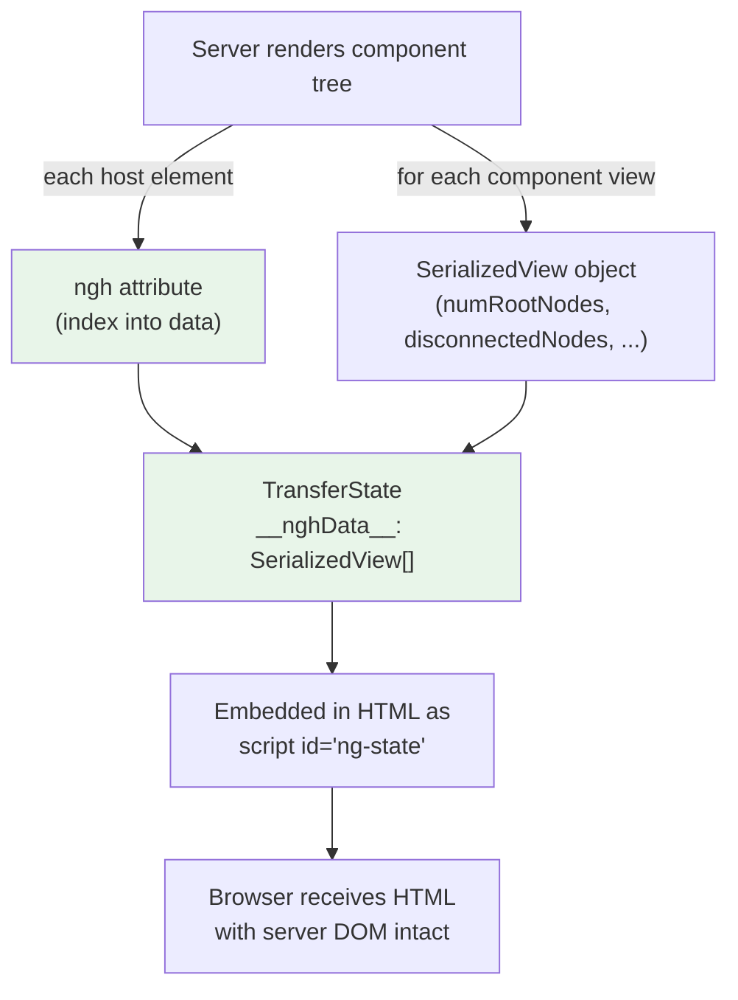
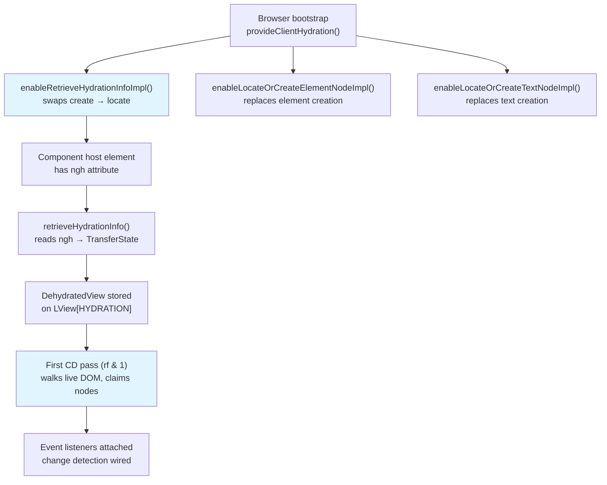

> **In plain English (30 sec):** A focused deep-dive on a specific mechanism or problem pattern.

## TL;DR

Angular's non-destructive hydration skips the destructive tear-down-and-rebuild that most SSR frameworks impose: instead of destroying the server-rendered DOM and re-creating it from scratch, Angular walks the live DOM tree, claims each node via `ngh` attribute annotations serialized into `TransferState`, and wires up event listeners, change detection, and component instances in-place. The result is a single pass over the existing DOM — no flicker, no wasted layout, no double render.

---

## The Engineering Problem

When a server renders an Angular application, it serializes the final HTML to a string and ships it to the browser. The browser displays this HTML immediately (fast First Contentful Paint), but the page is inert — no event handlers, no change detection, no interactivity. The client-side runtime must "wake up" and take ownership of that DOM.

The naive approach — destroy everything the server produced and re-render the component tree from scratch — is called **destructive hydration**. It has three concrete costs:

1. **Flash of inert content** — the user sees the server-rendered page for a frame, then the entire DOM is replaced. Even if the replacement is visually identical, the browser performs a full layout and paint cycle, causing a visible flash.
2. **Wasted CPU** — every element, text node, and attribute is re-created even though the browser already has the correct DOM. On complex pages (large `@for` lists, nested components), this is a measurable regression.
3. **State loss** — any DOM state that Angular doesn't explicitly track (scroll position, focused element, CSS animations in progress, browser-generated form autofill) is destroyed when the server DOM is torn down.

The question Angular's team needed to answer was: **can the client runtime walk the existing DOM tree, claim each node, and attach Angular's internal state without touching the DOM at all?**

---

## The Technical Solution

### Phase 1: Server Serialization — The `ngh` Attribute and TransferState

During server-side rendering, Angular annotates every component host element with an `ngh` attribute containing a numeric index. That index is a slot into the `__nghData__` array serialized inside `TransferState` — a JavaScript object embedded in the HTML as a `<script id="ng-state">` tag.

Each slot holds a `SerializedView` object describing the component's view structure: how many root nodes it owns, which nodes are "disconnected" (not present in the DOM at serialization time, e.g. inside an unrendered `@defer` block), and the sizes of any embedded `<ng-container>` or `ViewContainerRef` anchors.



### Phase 2: Client Hydration — Walk, Claim, Wire

When `provideClientHydration()` is called in the browser bootstrap, Angular enables a set of runtime instruction replacements. The key one is `enableRetrieveHydrationInfoImpl()` — it swaps the default `retrieveHydrationInfo` function (which returns `null`) with a real implementation that reads the `ngh` attribute, looks up the serialized data in `TransferState`, and returns a `DehydratedView` descriptor.

For each component being bootstrapped, Angular:

1. Reads the `ngh` attribute from the host element.
2. Looks up `nghData[nghValue]` in `TransferState`.
3. Stores the `DehydratedView` on the component's `LView` (at the `HYDRATION` index).
4. Calls `enableLocateOrCreateElementNodeImpl()`, `enableLocateOrCreateTextNodeImpl()`, etc. — these replace the "create" code paths with "locate existing DOM node" code paths.

During the first change detection pass (`RenderFlags.Create`, `rf & 1`), instead of calling `document.createElement()`, Angular calls `locateOrCreateElementNodeImpl()`, which walks the existing DOM children to find the matching node. No DOM mutation occurs — the node is simply claimed.



### The Integrity Check

Before any of this runs, Angular performs one critical safety check: `verifySsrContentsIntegrity()`. It scans `<body>` for a special comment node containing `nghm` (the SSR content integrity marker). If this marker is missing — say a CDN stripped comment nodes as an optimization — Angular throws a `RuntimeErrorCode.MISSING_SSR_CONTENT_INTEGRITY_MARKER` error and refuses to hydrate, because the `ngh` annotation comments it depends on may also have been stripped.

---

## The Clean Example

A minimal SSR application enabling hydration:

```typescript
// app.config.ts — browser bootstrap
import {provideClientHydration} from '@angular/platform-browser';
import {bootstrapApplication} from '@angular/platform-browser';
import {App} from './app/app.component';

bootstrapApplication(App, {
  providers: [provideClientHydration()],
});
```

```typescript
// server.ts — Angular Universal / SSR
import {renderApplication} from '@angular/platform-server';
import {App} from './app/app.component';

const html = await renderApplication(App, {
  providers: [provideClientHydration()],
});
```

The HTML produced by the server looks like this (simplified):

```html
<body>
  <!--nghm-->
  <app-root ngh="0">
    <h1>Hello, SSR</h1>
    <div ngh="1">
      <p>Hydrated without re-rendering</p>
    </div>
  </app-root>
  <script id="ng-state" type="application/json">
    {"__nghData__":[{"t":{"vars":2,"varsData":[[0,"Angular"]],"nodes":[2,1,0]}, ...}]}
  </script>
</body>
```

When the client boots, it reads `ngh="0"` from `<app-root>`, looks up slot `0` in the `__nghData__` array, and claims every child node in place. No `document.createElement()` calls — no DOM mutation — no flicker.

---

## Production Reality

### From `packages/core/src/hydration/utils.ts` — The Core Node-Claiming Logic

The `retrieveHydrationInfoImpl` function reads the `ngh` attribute, handles the dual-id encoding (for root views that also act as `ViewContainerRef` anchors), and extracts the serialized data from `TransferState`:

```typescript
// packages/core/src/hydration/utils.ts
export function retrieveHydrationInfoImpl(
  rNode: RElement,
  injector: Injector,
  isRootView = false,
): DehydratedView | null {
  let nghAttrValue = rNode.getAttribute(NGH_ATTR_NAME);
  if (nghAttrValue == null) return null;

  // For cases when a root component also acts as an anchor node for a ViewContainerRef
  // (for example, when ViewContainerRef is injected in a root component), there is a need
  // to serialize information about the component itself, as well as an LContainer that
  // represents this ViewContainerRef. Effectively, we need to serialize 2 pieces of info:
  // (1) hydration info for the root component itself and (2) hydration info for the
  // ViewContainerRef instance (an LContainer). Each piece of information is included into
  // the hydration data (in the TransferState object) separately, thus we end up with 2 ids.
  // Since we only have 1 root element, we encode both bits of info into a single string:
  // ids are separated by the `|` char (e.g. `10|25`, where `10` is the ngh for a component view
  // and 25 is the `ngh` for a root view which holds LContainer).
  const [componentViewNgh, rootViewNgh] = nghAttrValue.split('|');
  nghAttrValue = isRootView ? rootViewNgh : componentViewNgh;
  if (!nghAttrValue) return null;

  const rootNgh = rootViewNgh ? `|${rootViewNgh}` : '';
  const remainingNgh = isRootView ? componentViewNgh : rootNgh;

  let data: SerializedView = {};
  if (nghAttrValue !== '') {
    const transferState = injector.get(TransferState, null, {optional: true});
    if (transferState !== null) {
      const nghData = transferState.get(NGH_DATA_KEY, []);
      data = nghData[Number(nghAttrValue)];
    }
  }
  const dehydratedView: DehydratedView = {
    data,
    firstChild: rNode.firstChild ?? null,
  };
  // ... root view handling, remaining ngh restoration, cleanup ...
  ngDevMode && ngDevMode.hydratedComponents++;
  return dehydratedView;
}
```

Key detail: the `ngh` attribute is **removed** after hydration data is extracted (`rNode.removeAttribute(NGH_ATTR_NAME)`), so the cleaned-up DOM in the browser has no trace of the hydration scaffolding.

### From `packages/core/src/hydration/api.ts` — Enabling Hydration at Bootstrap

The `withDomHydration()` function is the internal counterpart to `provideClientHydration()`. It registers an `ENVIRONMENT_INITIALIZER` that calls `enableRetrieveHydrationInfoImpl()` and all the `enableLocateOrCreate*` function swaps — but only on the client side:

```typescript
// packages/core/src/hydration/api.ts
function enableHydrationRuntimeSupport() {
  if (!isHydrationSupportEnabled) {
    isHydrationSupportEnabled = true;
    enableRetrieveHydrationInfoImpl();
    enableLocateOrCreateElementNodeImpl();
    enableLocateOrCreateTextNodeImpl();
    enableLocateOrCreateElementContainerNodeImpl();
    enableLocateOrCreateContainerAnchorImpl();
    enableLocateOrCreateContainerRefImpl();
    enableFindMatchingDehydratedViewImpl();
    enableApplyRootElementTransformImpl();
  }
}
```

This is the tree-shaking boundary: if `provideClientHydration()` is never called, all of this code is eliminated from the production bundle.

### From `packages/platform-browser/src/hydration.ts` — The Public API

The `provideClientHydration()` function composes all hydration features — DOM hydration, HTTP transfer cache, incremental hydration — and adds validation that blocks contradictory configurations (e.g. `withNoHttpTransferCache()` alongside `withHttpTransferCacheOptions()`):

```typescript
// packages/platform-browser/src/hydration.ts
export function provideClientHydration(
  ...features: HydrationFeature<HydrationFeatureKind>[]
): EnvironmentProviders {
  const providers: Provider[] = [];
  const featuresKind = new Set<HydrationFeatureKind>();

  for (const {ɵproviders, ɵkind} of features) {
    featuresKind.add(ɵkind);
    if (ɵproviders.length) {
      providers.push(ɵproviders);
    }
  }

  // Validates contradictory feature flags in dev mode...
  return makeEnvironmentProviders([
    withDomHydration(),
    featuresKind.has(HydrationFeatureKind.NoHttpTransferCache) || hasHttpTransferCacheOptions
      ? []
      : ɵwithHttpTransferCache({}),
    featuresKind.has(HydrationFeatureKind.NoIncrementalHydration)
      ? []
      : ɵwithIncrementalHydration(),
    providers,
    {provide: CACHE_ACTIVE, useValue: {isActive: true}},
    {provide: APP_BOOTSTRAP_LISTENER, multi: true, useFactory: () => {
      const appRef = inject(ApplicationRef);
      const cacheState = inject(CACHE_ACTIVE);
      return () => {
        appRef.whenStable().then(() => { cacheState.isActive = false; });
      };
    }},
  ]);
}
```

---

## Review Checklist

- [ ] `provideClientHydration()` calls `withDomHydration()` internally — you do not need to call both.
- [ ] The `ngh` attribute on each component host element is an index into the `__nghData__` array in `TransferState` — it is not a DOM-level marker.
- [ ] `retrieveHydrationInfoImpl` reads the `ngh` attribute, splits on `|` for root+container dual encoding, and removes the attribute after extraction.
- [ ] `enableRetrieveHydrationInfoImpl()` and the `enableLocateOrCreate*` family are the tree-shaking boundary — they are only loaded when hydration is enabled.
- [ ] `verifySsrContentsIntegrity()` must find the `nghm` comment marker in `<body>` — CDNs that strip comment nodes will break hydration.
- [ ] The `CacheActive` provider keeps HTTP transfer cache active until `ApplicationRef.whenStable()` resolves, then deactivates it.
- [ ] `withNoIncrementalHydration()` exists to opt out of incremental hydration (enabled by default since v22).
- [ ] Hydration validation warnings (missing annotations, `enabledBlocking` conflicts) only fire in `ngDevMode` — they have zero runtime cost in production.

---

## FAQ

**Q: What happens if the server HTML and the client template disagree?**

Angular's hydration mismatch detection (in dev mode) compares the expected node type, tag name, and attribute count against the actual DOM node. A mismatch triggers a `RuntimeErrorCode.HYDRATION_MISMATCH` error with details about which component and node index diverged. In production, mismatched nodes are skipped and re-created from scratch — they are not silently claimed.

**Q: Can I skip hydration for specific components?**

Yes — the `ngSkipHydration` attribute (or `skipHydration: true` in `@Component`) marks a component's host subtree as disconnected from the hydration data. Angular will re-create that subtree's DOM during the create pass instead of trying to claim it.

**Q: How does hydration interact with `@defer` blocks and incremental hydration?**

Incremental hydration (enabled by default in v22+) serializes defer block metadata into `__nghDeferData__` and wires `jsaction` attributes on host elements. Each `@defer` block's hydration is deferred until its trigger fires (viewport, interaction, idle, timer) — the block's DOM is not claimed until then. This is managed by `DEHYDRATED_BLOCK_REGISTRY` and `createDehydratedBlockRegistry()`.

**Q: Why does Angular strip the `ngh` attribute after reading it?**

The `ngh` attribute is scaffolding — it is only meaningful during the hydration pass. After the `DehydratedView` is extracted and stored on the `LView`, the attribute serves no purpose and would be noise in the browser's DOM inspector.

**Q: What does `processTextNodeMarkersBeforeHydration` do?**

During SSR, empty text nodes are replaced with `<!--ngetn-->` comment markers, and adjacent text nodes are separated by `<!--ngtns-->` markers — because the HTML serializer cannot preserve empty or adjacent text nodes faithfully. Before hydration claims text nodes, this function walks the DOM, replaces `ngetn` markers with empty text nodes, and removes `ngtns` separators.

---

## Source

- [`packages/core/src/hydration/utils.ts`](https://github.com/angular/angular/blob/main/packages/core/src/hydration/utils.ts) — `retrieveHydrationInfoImpl`, `canHydrateNode`, `processTextNodeMarkersBeforeHydration`, `verifySsrContentsIntegrity`
- [`packages/core/src/hydration/api.ts`](https://github.com/angular/angular/blob/main/packages/core/src/hydration/api.ts) — `withDomHydration`, `enableHydrationRuntimeSupport`, `withI18nSupport`, `withIncrementalHydration`
- [`packages/platform-browser/src/hydration.ts`](https://github.com/angular/angular/blob/main/packages/platform-browser/src/hydration.ts) — `provideClientHydration`, feature flags, HTTP transfer cache composition


