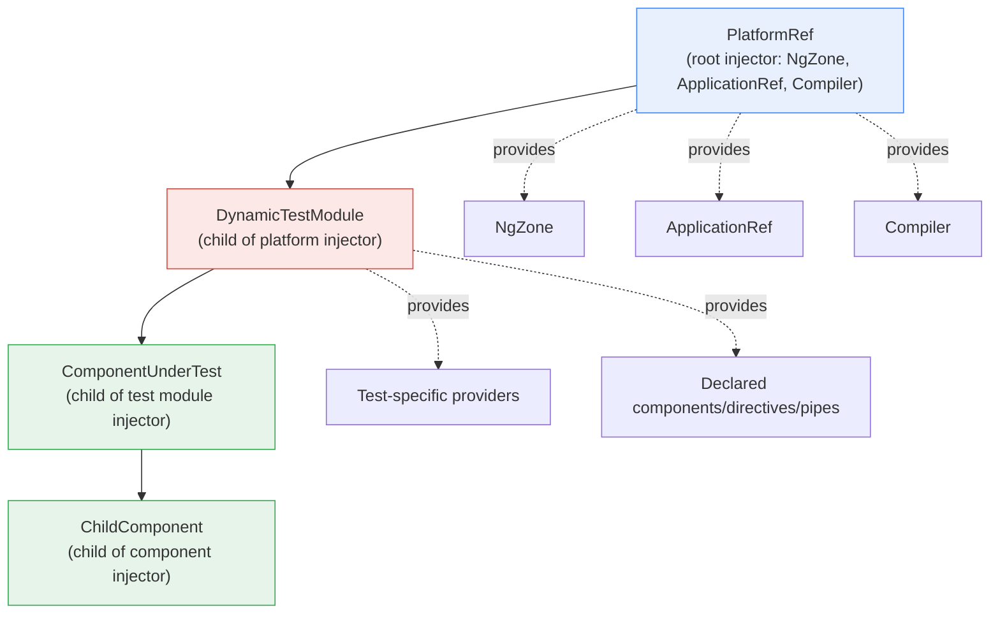
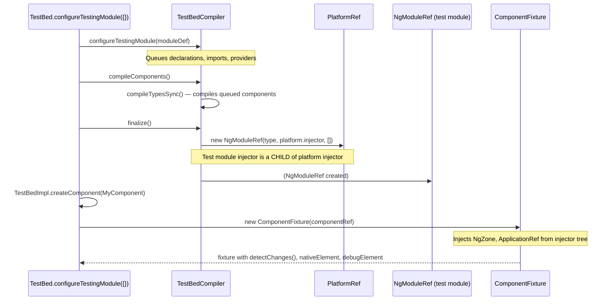

**TL;DR:** Does `TestBed.createComponent()` succeed by just mounting a component into a bare DOM element the way a plain unit test might? No — `TestBed.initTestEnvironment()` requires a `PlatformRef`, and without it, no component can be instantiated at all. The platform provides the root injector, and every component created by `TestBed` lives under that injector's child hierarchy — which is how `NgZone`, `ApplicationRef`, `ChangeDetectorRef`, and the entire change-detection pipeline become available to the component under test. TestBed is not a DOM container; it's a full Angular bootstrap, miniaturized for a single test.

## 1. The Engineering Problem

Unit-testing a component in isolation sounds simple — mount the component, assert something, done. But Angular components are not standalone templates; they are nodes in a dependency injection tree that starts at a platform-level injector and flows downward through module scoping. A component under test injects `NgZone` to know when async work finishes, `ApplicationRef` to participate in change detection, `ChangeDetectorRef` to scope its own updates, and potentially dozens of application-specific services — none of which exist in a bare DOM element.

The naive approach — `document.createElement('my-component')`, set its properties, read its DOM — misses every one of those injected dependencies. `NgZone` is absent, so async callbacks never trigger change detection. `ApplicationRef` is absent, so `fixture.detectChanges()` has nothing to tick. `EnvironmentInjector` is absent, so the component's own provider tree cannot resolve tokens. The test would need to manually construct every dependency the component touches, which defeats the purpose of testing the component's actual behavior in its real runtime context.

## 2. The Technical Solution

**TestBed bootstraps a platform, not a DOM node.** `TestBed.initTestEnvironment()` takes a `PlatformRef` as its second argument — the same type `bootstrapApplication()` receives in production. The platform owns a root injector that provides Angular's core singletons (`NgZone`, `ApplicationRef`, `Compiler`, etc.). `TestBedCompiler` then creates a dynamic test module whose injector is a *child* of that platform injector, so every component `TestBed` instantiates lives inside the same DI hierarchy a real bootstrapped application would have.

**Component creation flows through the platform's injector chain.** When `createComponent()` is called, it builds a `ComponentFactory` from the component's compiled definition, creates a `ComponentRef` whose parent injector is the test module's injector, and wraps it in a `ComponentFixture` that injects `NgZone`, `ApplicationRef`, and `ChangeDetectorRef` from that same injector tree. If any of those are missing — because the platform was never initialized — the injection fails immediately.



Three truths this diagram is showing:

- **The platform is the root of every injector a component sees.** `NgZone` and `ApplicationRef` are not "TestBed services" — they're Angular core services provided by the platform, the same ones a production app uses. TestBed's role is providing the platform, not replacing it.
- **The dynamic test module is a real NgModule, just one that `TestBedCompiler` creates at runtime.** Its declarations, imports, and providers all flow through Angular's real module scoping, not a mock or shim layer.
- **Component creation uses `ComponentFactory.create()` with the test module ref as the parent injector** — not `document.createElement()`. The component's DI tree is rooted at the same place production components are.



The critical detail: `finalize()` passes `platform.injector` as the parent injector when constructing `NgModuleRef`. This is what makes every subsequent `createComponent()` call resolve `NgZone`, `ApplicationRef`, and `ChangeDetectorRef` — they come from the platform, not from anything TestBed invents.

## 3. The clean example (concept in isolation)

```typescript
// What TestBed does, stripped to the essential structure.
class TestBedImpl {
  platform: PlatformRef;  // initialized via initTestEnvironment()
  private testModuleRef: NgModuleRef<any>;

  initTestEnvironment(ngModule: Type<any>, platform: PlatformRef) {
    this.platform = platform;
    this.compiler = new TestBedCompiler(platform, ngModule);
  }

  configureTestingModule(moduleDef: TestModuleMetadata) {
    this.compiler.configureTestingModule(moduleDef);
  }

  async compileComponents() {
    await this.compiler.compileComponents();
  }

  createComponent<T>(type: Type<T>): ComponentFixture<T> {
    const testModuleRef = this.compiler.finalize();
    // ComponentFactory.create() uses testModuleRef as parent injector
    const componentFactory = new ComponentFactory(getComponentDef(type));
    const componentRef = componentFactory.create(
      Injector.NULL, [], `#root`, testModuleRef  // <-- DI comes from here
    );
    return new ComponentFixture(componentRef);
  }
}

// TestBedCompiler.finalize() creates the test module with platform as parent:
finalize(): NgModuleRef<any> {
  this.compileTestModule();   // builds the dynamic test module def
  const parentInjector = this.platform.injector;  // <-- THIS is the key line
  return new NgModuleRef(this.testModuleType, parentInjector, []);
}
```

The `parentInjector = this.platform.injector` line is the entire reason `TestBed.initTestEnvironment()` takes a `PlatformRef` — without it, the test module has no parent injector, and component creation would fail trying to resolve core Angular services.

## 4. Production reality (from the real repo)

```
angular/packages/core/testing/src/
├── TestBedImpl.initTestEnvironment()
│   stores platform, creates TestBedCompiler with platform as parent
├── TestBedCompiler.finalize()
│   creates NgModuleRef(testModuleType, platform.injector)
└── TestBedImpl.createComponent()
    uses ComponentFactory.create() with testModuleRef as parent injector
```

The real `initTestEnvironment` — note that the second argument is a `PlatformRef`, and it is *required*, not optional:

```typescript
initTestEnvironment(
  ngModule: Type<any> | Type<any>[],
  platform: PlatformRef,
  options?: TestEnvironmentOptions,
): void {
  if (this.platform || this.ngModule) {
    throw new Error('Cannot set base providers because it has already been called');
  }

  TestBedImpl._environmentTeardownOptions = options?.teardown;
  TestBedImpl._environmentErrorOnUnknownElementsOption = options?.errorOnUnknownElements;
  TestBedImpl._environmentErrorOnUnknownPropertiesOption = options?.errorOnUnknownProperties;

  this.platform = platform;
  this.ngModule = ngModule;
  this._compiler = new TestBedCompiler(this.platform, this.ngModule);

  setAllowDuplicateNgModuleIdsForTest(true);
}
```

`TestBedCompiler` takes the platform in its constructor and uses it in `finalize()` — the `parentInjector` assignment is what makes the entire DI chain work:

```typescript
class TestBedCompiler {
  constructor(
    private platform: PlatformRef,
    private additionalModuleTypes: Type<any> | Type<any>[],
  ) {
    class DynamicTestModule {}
    this.testModuleType = DynamicTestModule as any;
  }

  finalize(): NgModuleRef<any> {
    this.compileTypesSync();
    this.compileTestModule();
    this.applyTransitiveScopes();
    this.applyProviderOverrides();
    this.patchComponentsWithExistingStyles();
    this.componentToModuleScope.clear();

    const parentInjector = this.platform.injector;
    this.testModuleRef = new NgModuleRef(this.testModuleType, parentInjector, []);

    (this.testModuleRef.injector.get(ApplicationInitStatus) as any).runInitializers();

    const localeId = this.testModuleRef.injector.get(LOCALE_ID, DEFAULT_LOCALE_ID);
    setLocaleId(localeId);

    return this.testModuleRef;
  }
}
```

`createComponent` uses the finalized test module ref as the DI parent — `ComponentFactory.create()` does the real work, not DOM manipulation:

```typescript
createComponent<T>(type: Type<T>, options?: TestComponentOptions): ComponentFixture<T> {
  const testComponentRenderer = this.inject(TestComponentRenderer);
  const rootElId = `root${_nextRootElementId++}`;

  testComponentRenderer.insertRootElement(
    rootElId,
    shouldInferTagName ? inferTagNameFromDefinition(componentDef) : undefined,
  );

  const componentFactory = new ComponentFactory(componentDef);
  const initComponent = () => {
    const componentRef = componentFactory.create(
      Injector.NULL,
      [],
      `#${rootElId}`,
      this.testModuleRef,   // <-- parent injector for the component
      undefined,
      options?.bindings,
    ) as ComponentRef<T>;
    return this.runInInjectionContext(() => new ComponentFixture(componentRef));
  };
  const noNgZone = this.inject(ComponentFixtureNoNgZone, false);
  const ngZone = noNgZone ? null : this.inject(NgZone, null);
  const fixture = ngZone ? ngZone.run(initComponent) : initComponent();
  this._activeFixtures.push(fixture);
  return fixture;
}
```

`ComponentFixture` injects everything from that same injector tree — `NgZone`, `ApplicationRef`, `ChangeDetectorRef` — so `fixture.detectChanges()` actually works:

```typescript
constructor(public componentRef: ComponentRef<T>) {
  this.changeDetectorRef = componentRef.changeDetectorRef;
  this.elementRef = componentRef.location;
  this.debugElement = <DebugElement>getDebugNode(this.elementRef.nativeElement);
  this.componentInstance = componentRef.instance;
  this.nativeElement = this.elementRef.nativeElement;

  this._ngZone = this._noZoneOptionIsSet ? new NoopNgZone() : inject(NgZone);
  this._appRef = inject(ApplicationRef);
  // ...subscriptions, error handling, auto-detect setup...
}
```

What this teaches that a hello-world can't:

- **`PlatformRef` is not optional — it's the structural reason TestBed works at all.** `initTestEnvironment()` throws if it's called twice, and the error message says "Cannot set base providers" — because the platform *is* the base providers. Without it, `TestBedCompiler` has no parent injector, `finalize()` has nothing to parent the test module under, and every `inject()` call for core Angular services fails.
- **The platform is shared across the entire test suite, not per-test.** `initTestEnvironment()` is called once (it throws on a second call), and `resetTestingModule()` tears down the test module but *not* the platform. This means `NgZone` and `ApplicationRef` are singletons across tests — only the test module's declarations and providers are reset between tests, which is why fixture teardown destroys components but doesn't recreate the zone.
- **`ComponentFactory.create()` receives the test module ref, not a bare DOM element.** The DOM element is inserted by `TestComponentRenderer` (a TestBed-internal abstraction), but the *DI parent* for the component is `this.testModuleRef` — which is why the component can inject `NgZone` and `ApplicationRef` without any manual wiring. The DOM insertion is incidental; the injector hierarchy is load-bearing.

## 5. Review checklist

- **Is `TestBed.initTestEnvironment()` called exactly once per test suite, with a real `PlatformRef` from `@angular/platform-browser/testing`** — since calling it twice throws, and omitting it leaves the test module without a parent injector, causing cryptic injection failures for core Angular services?
- **Does the test module properly declare or import every component/directive/pipe the component under test uses in its template** — since the test module's scope determines what the component can see, and Angular's module scoping (not TestBed's magic) is what makes those declarations available?
- **Is `TestBed.resetTestingModule()` called (or `destroyAfterEach: true` configured) between tests that call `configureTestingModule` with different metadata** — since the test module carries state from the previous `configureTestingModule` call until it's explicitly reset?
- **When overriding a component's template via `overrideTemplateUsingTestingModule`, is the override's scope correct** — since this method specifically sets the component's scope to the testing module rather than its original declaring module, which is correct for testing the component in isolation but may break if the template references directives from the original module?

## 6. FAQ

**Q: Why does `TestBed.initTestEnvironment()` throw on a second call instead of resetting the platform?**
A: Because the platform is a shared singleton that persists for the entire test session. Resetting it between tests would destroy `NgZone` and `ApplicationRef`, which are expensive to recreate and structurally identical across tests — only the test module's declarations and providers need per-test isolation, which `resetTestingModule()` handles.

**Q: What's the difference between `TestBed.configureTestingModule()` and `TestBed.initTestEnvironment()`?**
A: `initTestEnvironment()` is called once per suite and sets up the platform and test module type — it's the one-time bootstrap. `configureTestingModule()` is called per-test (or per-describe block) and configures declarations, imports, and providers for that test's dynamic test module. You can call `configureTestingModule` multiple times; you can only call `initTestEnvironment` once.

**Q: Can I use TestBed without a `PlatformRef`?**
A: No — `TestBed.initTestEnvironment()` requires it as its second argument, and `TestBedCompiler.finalize()` uses `platform.injector` as the parent injector for the test module. Without the platform, the test module has no access to core Angular services, and component creation fails with injection errors.

**Q: Why does `ComponentFixture` inject `NgZone` and `ApplicationRef` from the injector tree rather than importing them directly?**
A: Because the injector tree is the mechanism Angular uses to provide these services everywhere — in production and in tests. `ComponentFixture`'s constructor calls `inject(NgZone)` and `inject(ApplicationRef)`, which resolve against the test module's injector (which has the platform injector as its parent). This is the same resolution chain production components use, which is what makes the test environment structurally identical to a real app.

---

## Source

- **Concept:** Why Angular TestBed requires a PlatformRef and creates a full DI hierarchy for component tests
- **Domain:** angular
- **Repo:** [angular/angular](https://github.com/angular/angular) → [`packages/core/testing/src/test_bed.ts`](https://github.com/angular/angular/blob/main/packages/core/testing/src/test_bed.ts), [`packages/core/testing/src/test_bed_compiler.ts`](https://github.com/angular/angular/blob/main/packages/core/testing/src/test_bed_compiler.ts), [`packages/core/testing/src/component_fixture.ts`](https://github.com/angular/angular/blob/main/packages/core/testing/src/component_fixture.ts) — the Angular framework's own testing infrastructure
