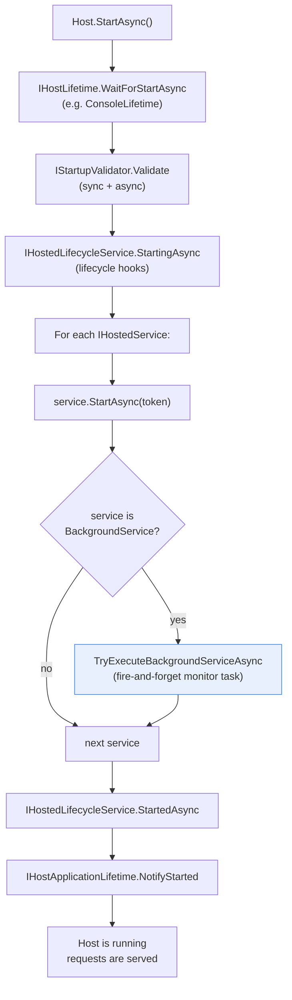
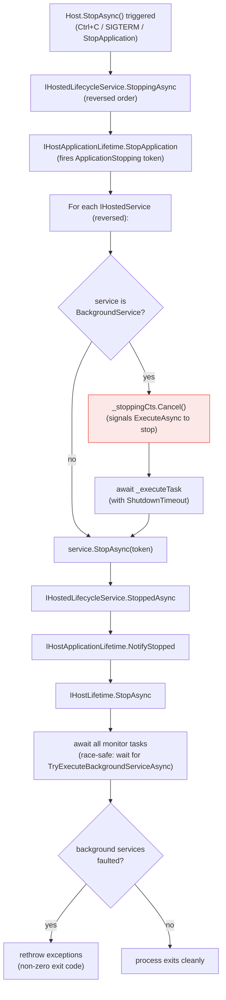

**TL;DR:** Does `BackgroundService.StartAsync` block until your `ExecuteAsync` method finishes? No — it wraps your `ExecuteAsync` in a `Task.Run`, stores the task, and immediately returns `Task.CompletedTask`. The host considers the service "started" before your background loop has done a single iteration, moves on to start the next service, and only monitors `ExecuteAsync`'s task as a fire-and-forget watchdog that can stop the host if it faults.
> **In plain English (30 sec):** Think of this like concepts you already use, but in a production system at scale.


## 1. The Engineering Problem

When you register a `BackgroundService` in ASP.NET Core, you expect it to "run in the background." The reality is more nuanced — and the nuance has real consequences for startup ordering, exception handling, and shutdown behavior.

**The start-before-work contract.** `IHostedService.StartAsync` is the host's contract for "start this service." For most implementations, `StartAsync` is synchronous setup (open a connection, initialize a cache). But `BackgroundService` changes the contract: its `StartAsync` doesn't do the real work — it *schedules* the real work and returns immediately. The host, seeing a completed task from `StartAsync`, proceeds to start the next service, fire `ApplicationStarted`, and begin serving requests. Your background work is running, but the host has no idea whether it's made progress, faulted, or is still initializing.

**The silent fault problem.** If your `ExecuteAsync` throws an unhandled exception, nothing happens at the moment of the throw — the task transitions to `Faulted` state silently, because `StartAsync` already returned. The host only discovers the fault later, when `TryExecuteBackgroundServiceAsync` awaits the stored task. At that point, depending on `BackgroundServiceExceptionBehavior`, the host may either log and continue or call `StopApplication()` and shut down the entire process — but there's a window between "the service faulted" and "the host noticed" where your application is running without its background work.

**The shutdown race.** When the host calls `StopAsync`, it cancels the `CancellationToken` and then awaits `ExecuteAsync`'s task — but only for as long as `ShutdownTimeout` allows. If your `ExecuteAsync` doesn't observe the cancellation token promptly, the host gives up and moves on, leaving your background work orphaned until the process exits. The entire design assumes `ExecuteAsync` cooperates with cancellation, but nothing enforces that contract at compile time.

What was needed was a clear mental model of the two-phase startup: "the service is started" (host considers it up) and "the background work is running" (the actual task is executing). Conflating these two phases is the root cause of most BackgroundService confusion in production.

## 2. The Technical Solution

The Generic Host (`Microsoft.Extensions.Hosting.Internal.Host`) manages the full lifecycle of all `IHostedService` instances. The startup sequence is deliberate and documented in the source code's comments:



The critical detail is in step `SA → BGCheck → Monitor`: after calling `service.StartAsync(token)`, the host checks if the service is a `BackgroundService` and, if so, grabs its `ExecuteTask` (the stored `Task` from `Task.Run(() => ExecuteAsync(...))`) and starts monitoring it *separately*. This monitor task is fire-and-forget — it doesn't block the startup sequence.

Here's the shutdown sequence, which runs in **LIFO order** (last started, first stopped):



Two core truths this diagram captures:

- **`StartAsync` returning `Task.CompletedTask` is the entire point.** The host's `ForeachService` loop is designed so that each service's `StartAsync` doesn't block the next. `BackgroundService` adapts to this by spawning work via `Task.Run` and storing the task — the host monitors it separately, not as part of the startup sequence. This is a *feature* (concurrent startup), not a bug.
- **Shutdown has two independent awaits for BackgroundService.** `StopAsync` cancels the CTS and awaits `_executeTask` with `ShutdownTimeout`, but the host *also* awaits the monitor task (`TryExecuteBackgroundServiceAsync`) at the very end. This race-safe double-await ensures exceptions from the monitor task are always observed, even if `StopAsync`'s continuation ran first.

## 3. The clean example (concept in isolation)

Here's the mental model stripped down — what `BackgroundService.StartAsync` actually does, versus what most developers assume:

```csharp
// What you probably think StartAsync does:
public async Task StartAsync(CancellationToken cancellationToken)
{
    await ExecuteAsync(cancellationToken);  // BLOCKS until work is done — WRONG
}

// What StartAsync ACTUALLY does (simplified from real source):
public virtual Task StartAsync(CancellationToken cancellationToken)
{
    _stoppingCts = CancellationTokenSource.CreateLinkedTokenSource(cancellationToken);

    // Fire-and-forget: ExecuteAsync runs on a thread pool thread
    _executeTask = Task.Run(() => ExecuteAsync(_stoppingCts.Token), _stoppingCts.Token);

    // Return immediately — host considers this service "started"
    return Task.CompletedTask;
}
```

And here's a typical `ExecuteAsync` that cooperates correctly with the lifecycle:

```csharp
public class QueuePoller : BackgroundService
{
    private readonly IQueueClient _queue;
    private readonly ILogger<QueuePoller> _logger;

    public QueuePoller(IQueueClient queue, ILogger<QueuePoller> logger)
    {
        _queue = queue;
        _logger = logger;
    }

    protected override async Task ExecuteAsync(CancellationToken stoppingToken)
    {
        // Host is already running at this point — other services are up,
        // requests are being served, ApplicationStarted has fired.
        _logger.LogInformation("QueuePoller background task starting");

        while (!stoppingToken.IsCancellationRequested)
        {
            try
            {
                var message = await _queue.ReceiveAsync(stoppingToken);
                if (message is not null)
                {
                    await ProcessMessageAsync(message, stoppingToken);
                }
            }
            catch (OperationCanceledException) when (stoppingToken.IsCancellationRequested)
            {
                // Expected during shutdown — don't log as error
                break;
            }
            catch (Exception ex)
            {
                _logger.LogError(ex, "Error processing queue message");
                await Task.Delay(TimeSpan.FromSeconds(5), stoppingToken); // back off
            }
        }

        _logger.LogInformation("QueuePoller background task stopped");
    }
}
```

Registering it in the DI container:

```csharp
builder.Services.AddHostedService<QueuePoller>();
// Or the long form:
// builder.Services.AddSingleton<QueuePoller>();
// builder.Services.AddHostedService(sp => sp.GetRequiredService<QueuePoller>());
```

The host doesn't know or care what `ExecuteAsync` does — it just monitors the returned task and reacts if it faults or completes.

## 4. Production reality (from the real repo)

```
dotnet/runtime/src/libraries/
├── Microsoft.Extensions.Hosting.Abstractions/src/
│   └── BackgroundService.cs                — the abstract base class (StartAsync / StopAsync / ExecuteAsync)
└── Microsoft.Extensions.Hosting/src/
    └── Internal/
        └── Host.cs                         — orchestrates startup/shutdown of all IHostedService instances
```

**`BackgroundService` — the fire-and-forget pattern.** `StartAsync` creates a linked CTS, spawns `ExecuteAsync` on the thread pool via `Task.Run`, and returns `Task.CompletedTask`. The comment in the source is explicit:

```csharp
public virtual Task StartAsync(CancellationToken cancellationToken)
{
    // Create linked token to allow cancelling executing task from provided token
    _stoppingCts = CancellationTokenSource.CreateLinkedTokenSource(cancellationToken);

    // Execute all of ExecuteAsync asynchronously, and store the task we're executing
    // so that we can wait for it later.
    _executeTask = Task.Run(() => ExecuteAsync(_stoppingCts.Token), _stoppingCts.Token);

    // Always return a completed task.  Any result from ExecuteAsync will be handled by the Host.
    return Task.CompletedTask;
}
```

`StopAsync` cancels the CTS and then awaits the stored task — but with a safety net: it uses `Task.WhenAny` against the stop token to avoid hanging forever if `ExecuteAsync` ignores cancellation:

```csharp
public virtual async Task StopAsync(CancellationToken cancellationToken)
{
    if (_executeTask == null)
    {
        return;
    }

    try
    {
        _stoppingCts!.Cancel();
    }
    finally
    {
        // Wait until the task completes or the stop token triggers
        var tcs = new TaskCompletionSource<object>();
        using CancellationTokenRegistration registration = cancellationToken.Register(
            s => ((TaskCompletionSource<object>)s!).SetCanceled(), tcs);
        await Task.WhenAny(_executeTask, tcs.Task).ConfigureAwait(false);
    }
}
```

**`Host.cs` — the orchestrator.** The host's `StartAsync` iterates all `IHostedService` instances, calls `StartAsync` on each, and then explicitly checks for `BackgroundService` to start monitoring:

```csharp
await ForeachService(_hostedServices, cancellationToken, concurrent, abortOnFirstException, exceptions,
    async (service, token) =>
    {
        await service.StartAsync(token).ConfigureAwait(false);

        if (service is BackgroundService backgroundService)
        {
            Task monitorTask = TryExecuteBackgroundServiceAsync(backgroundService);
            List<Task> bgTasks = LazyInitializer.EnsureInitialized(ref _backgroundServiceTasks);
            lock (bgTasks)
            {
                bgTasks.Add(monitorTask);
            }
        }
    }).ConfigureAwait(false);
```

The monitor task (`TryExecuteBackgroundServiceAsync`) is where faulted background services get detected — and it decides whether to shut down the host:

```csharp
private async Task TryExecuteBackgroundServiceAsync(BackgroundService backgroundService)
{
    Task? backgroundTask = backgroundService.ExecuteTask;
    if (backgroundTask is null)
    {
        return;
    }

    try
    {
        await backgroundTask.ConfigureAwait(false);
    }
    catch (Exception ex)
    {
        // When the host is being stopped, it cancels the background services.
        // This isn't an error condition, so don't log it as an error.
        if (_applicationLifetime.ApplicationStopping.IsCancellationRequested
            && backgroundTask.IsCanceled
            && ex is OperationCanceledException)
        {
            return;
        }

        _logger.BackgroundServiceFaulted(ex);
        if (_options.BackgroundServiceExceptionBehavior == BackgroundServiceExceptionBehavior.StopHost)
        {
            _logger.BackgroundServiceStoppingHost(ex);
            _applicationLifetime.StopApplication();
        }
    }
}
```

And the shutdown side has a deliberate race-safety wait at the end of `StopAsync`, ensuring all monitor tasks are observed before exceptions are rethrown:

```csharp
if (_backgroundServiceTasks is not null)
{
    Task bgMonitoringTasks = Task.WhenAll(_backgroundServiceTasks);
    var tcs = new TaskCompletionSource<object?>(
        TaskCreationOptions.RunContinuationsAsynchronously);
    using (cancellationToken.Register(
        s => ((TaskCompletionSource<object?>)s!).TrySetCanceled(), tcs))
    {
        await Task.WhenAny(bgMonitoringTasks, tcs.Task).ConfigureAwait(false);
    }
}
```

What this teaches that a hello-world can't:

- **`BackgroundServiceExceptionBehavior.StopHost` is the default.** A single unhandled exception in *any* registered `BackgroundService`'s `ExecuteAsync` will call `StopApplication()` and shut down the entire host — not just the offending service. This is the correct default for most applications (a faulted background service usually means the app is in an inconsistent state), but it means your `ExecuteAsync` must have robust exception handling if you want the process to survive individual failures.
- **The host reads `_backgroundServiceExceptions` *after* waiting for monitor tasks.** This isn't an accident — without the `Task.WhenAll` + `WhenAny` race-safe wait, `StopAsync` could read the exceptions list before the monitor task has added its exception, leading to a silent non-zero exit code. The lock-free `Volatile.Read` followed by `lock` ensures the read sees the complete list.
- **`Dispose()` calls `_stoppingCts?.Cancel()`** — disposing a `BackgroundService` while it's running is equivalent to requesting cancellation. The service doesn't await `ExecuteAsync` in `Dispose`; it just cancels the token and lets the task get garbage collected. This is fine for `IAsyncDisposable` cleanup, but it means a disposed-but-still-running background service is a silent bug, not a thrown exception.

## 5. Review checklist

- **Does your `ExecuteAsync` observe `stoppingToken.IsCancellationRequested` in its loop condition?** If it doesn't, `StopAsync` will cancel the CTS but `ExecuteAsync` will keep running until `ShutdownTimeout` expires — and the host logs a warning. The idiomatic pattern is `while (!stoppingToken.IsCancellationRequested)`.
- **Does your `ExecuteAsync` catch `OperationCanceledException` when `stoppingToken` is the trigger?** The host won't treat this as a fault (the monitor task checks `ApplicationStopping.IsCancellationRequested && backgroundTask.IsCanceled`), but an uncaught OCE will still log noise. Catch it and break cleanly.
- **Is the `BackgroundServiceExceptionBehavior` option appropriate for your scenario?** The default (`StopHost`) means one faulted service takes down the whole process. If you need a faulted service to be non-fatal, set `BackgroundServiceExceptionBehavior.Ignore` in `HostOptions` — but then you're responsible for detecting and recovering from the fault yourself.
- **Are you registering your `BackgroundService` correctly?** `AddHostedService<T>()` does the "register as singleton + resolve via hosted service" two-step internally. If you register as a plain singleton and forget `AddHostedService`, the host won't call `StartAsync` at all — your service just sits there, inert.
- **Does your `ExecuteAsync` handle the case where dependencies are disposed during shutdown?** The DI container disposes scoped services after `StopAsync` completes, but your `ExecuteAsync` may still be running (or winding down) when disposal happens. Resolve long-lived dependencies from the root scope or via `IServiceScopeFactory`, not from a captured `IServiceScope`.

## 6. FAQ

**Q: Why doesn't `StartAsync` just await `ExecuteAsync` directly?**
A: Because the host's `ForeachService` loop calls `StartAsync` on each service sequentially (or concurrently if `ServicesStartConcurrently` is set) and needs each call to complete before proceeding. If `StartAsync` blocked on `ExecuteAsync`, the host couldn't start the next service until the first one's background work finished — defeating the purpose of having multiple background services. `Task.Run` + `Task.CompletedTask` decouples "start the service" from "run the work."

**Q: What happens if `ExecuteAsync` never returns (infinite loop without cancellation observation)?**
A: The host will call `StopAsync`, which cancels the CTS and awaits the task with `ShutdownTimeout` (default: 30 seconds). If the task doesn't complete within that window, `StopAsync` returns and the host proceeds with disposal. If using `WaitAsync` (.NET 8+), the timeout is built into the framework; on older runtimes, `Task.WhenAny` against the stop token achieves the same result.

**Q: Can I have multiple `BackgroundService` instances in the same app?**
A: Yes — register each with `AddHostedService<T>()` and the host starts them all. By default they start sequentially (in registration order); set `ServicesStartConcurrently = true` in `HostOptions` to start them in parallel. Shutdown is also sequential by default (LIFO order), but `ServicesStopConcurrently` can change that.

**Q: Does `BackgroundService` implement `IHostedLifecycleService`?**
A: No — `BackgroundService` implements `IHostedService` and `IDisposable` only. The lifecycle hooks (`StartingAsync`, `StartedAsync`, `StoppingAsync`, `StoppedAsync`) are separate and only fire for services that explicitly implement `IHostedLifecycleService`. If you need lifecycle hooks on a background service, implement both interfaces.

**Q: What's the difference between `AddHostedService<T>()` and registering as a singleton?**
A: `AddHostedService<T>()` internally does two things: `AddSingleton<T>()` and then registers the service type with `IHostedService` so the host resolves it in its `_hostedServices` enumeration. If you only `AddSingleton<T>()` without the hosted-service registration, the host never calls `StartAsync` or `StopAsync` on it — the instance lives as a plain singleton with no lifecycle management.

---

## Source

- **Concept:** Background service hosted lifetimes and the Generic Host's two-phase startup contract
- **Domain:** dotnet
- **Repo:** [dotnet/runtime](https://github.com/dotnet/runtime) → [`src/libraries/Microsoft.Extensions.Hosting.Abstractions/src/BackgroundService.cs`](https://github.com/dotnet/runtime/blob/main/src/libraries/Microsoft.Extensions.Hosting.Abstractions/src/BackgroundService.cs) and [`src/libraries/Microsoft.Extensions.Hosting/src/Internal/Host.cs`](https://github.com/dotnet/runtime/blob/main/src/libraries/Microsoft.Extensions.Hosting/src/Internal/Host.cs) — the real, first-party .NET Generic Host and BackgroundService implementation


