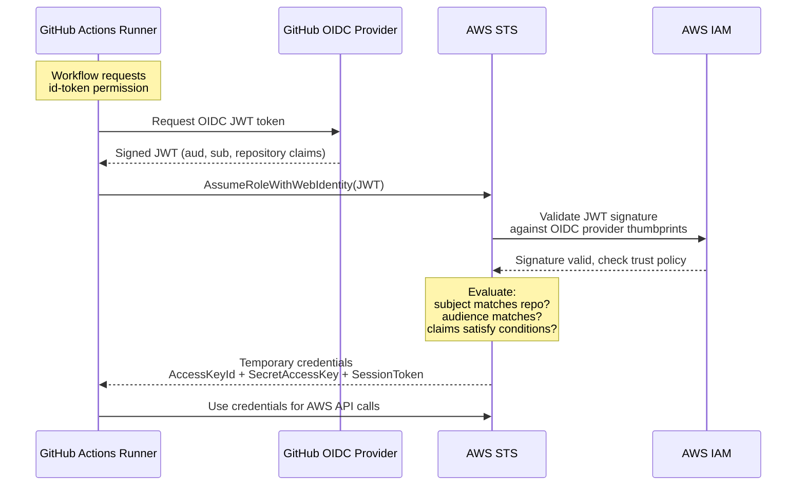
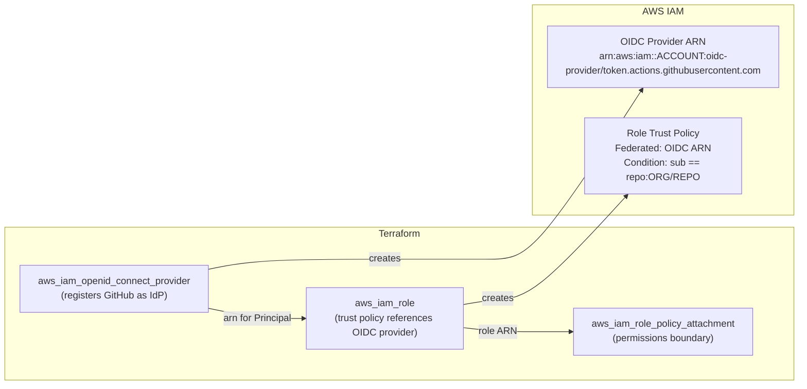

> **In plain English (30 sec):** Code you already write — Map, function, API call, just bigger.


## TL;DR

GitHub Actions needs AWS credentials. The naive approach stores `AWS_ACCESS_KEY_ID` and `AWS_SECRET_ACCESS_KEY` as repository secrets — long-lived, rotatable only manually, and a blast radius nightmare if leaked. The correct approach: register GitHub's OIDC issuer with AWS IAM, create a role whose trust policy scopes access to specific repos and workflows, and let the runner exchange its short-lived JWT for temporary STS credentials at runtime. Zero stored secrets. Terraform manages the entire graph.

---

## The Engineering Problem

CI/CD pipelines authenticate to cloud providers dozens of times per day. Every authentication event is a risk surface. The traditional approach has three failure modes:

1. **Long-lived access keys.** Static credentials live in GitHub Secrets. If a contributor forks the repo or a workflow logs them accidentally, the keys are compromised until manual rotation. There is no automatic expiry.

2. **Overprivileged identities.** Teams reuse a single key pair across staging and production because creating per-environment keys is tedious. A compromised key in staging pivots to production.

3. **No workload attestation.** The cloud provider cannot distinguish between a legitimate workflow run and a script running on someone's laptop that happens to have the same key. There is no cryptographic link between the caller's identity and the code that invoked it.

OIDC federation solves all three by replacing secrets with cryptographically verifiable tokens bound to specific GitHub repositories, branches, and workflows.

---

## Technical Solution

### How OIDC Federation Works

The flow replaces static credentials with a runtime token exchange:



### How Terraform Wires It Up

Terraform manages two resources that form the trust boundary: the OIDC provider (the identity source) and the IAM role (the permissions grant). The role's trust policy is the enforcement point — it's a JSON document that maps OIDC claims to who can assume the role.



The trust policy is the critical piece. It says: "Only a JWT issued by GitHub's OIDC endpoint, for a specific repository and workflow, is allowed to assume this role."

---

## Clean Example

Below is a minimal but production-viable Terraform configuration. The OIDC provider registers GitHub as an identity source. The role's trust policy scopes access to a single repository and workflow.

### OIDC Provider Registration

```terraform
# Register GitHub's OIDC issuer with AWS IAM.
# thumbprint_list is optional for GitHub — AWS uses its own CA library.
resource "aws_iam_openid_connect_provider" "github" {
  url             = "https://token.actions.githubusercontent.com"
  client_id_list  = ["sts.amazonaws.com"]
  thumbprint_list = []
  tags = {
    Environment = "production"
    ManagedBy   = "terraform"
  }
}
```

The `client_id_list` must include `sts.amazonaws.com` — this is the `aud` claim AWS STS validates against. Without it, `AssumeRoleWithWebIdentity` fails with an invalid client ID error.

### IAM Role with Scoped Trust Policy

```terraform
# IAM role that GitHub Actions runners can assume.
# The trust policy is the enforcement boundary — it maps OIDC
# claims (sub, aud, etc.) to "who can assume this role".
data "aws_iam_policy_document" "github_actions_trust" {
  statement {
    actions = ["sts:AssumeRoleWithWebIdentity"]

    principals {
      type        = "Federated"
      identifiers = [aws_iam_openid_connect_provider.github.arn]
    }

    # Scope to a specific repository and workflow.
    # The "sub" claim in the JWT must match this condition.
    condition {
      test     = "StringEquals"
      variable = "token.actions.githubusercontent.com:aud"
      values   = ["sts.amazonaws.com"]
    }

    condition {
      test     = "StringLike"
      variable = "token.actions.githubusercontent.com:sub"
      values   = ["repo:myorg/myapp:ref:refs/heads/main"]
    }
  }
}

resource "aws_iam_role" "github_actions" {
  name               = "github-actions-deploy"
  assume_role_policy = data.aws_iam_policy_document.github_actions_trust.json
  max_session_duration = 3600
}
```

### Attaching Permissions

```terraform
# Least-privilege policy for the deployment workflow.
data "aws_iam_policy_document" "deploy_permissions" {
  statement {
    actions = [
      "s3:PutObject",
      "s3:GetObject",
    ]
    resources = ["arn:aws:s3:::my-deploy-bucket/*"]
  }

  statement {
    actions   = ["cloudfront:CreateInvalidation"]
    resources = ["*"]
  }
}

resource "aws_iam_policy" "deploy" {
  name   = "github-actions-deploy"
  policy = data.aws_iam_policy_document.deploy_permissions.json
}

resource "aws_iam_role_policy_attachment" "deploy" {
  role       = aws_iam_role.github_actions.name
  policy_arn = aws_iam_policy.deploy.arn
}
```

### GitHub Actions Workflow

```yaml
name: Deploy
on:
  push:
    branches: [main]
permissions:
  id-token: write   # Required for OIDC token
  contents: read
jobs:
  deploy:
    runs-on: ubuntu-latest
    steps:
      - uses: actions/checkout@v4
      - uses: aws-actions/configure-aws-credentials@v4
        with:
          role-to-assume: arn:aws:iam::123456789012:role/github-actions-deploy
          aws-region: us-east-1
      - run: aws s3 sync ./dist s3://my-deploy-bucket/
```

No secrets are stored. The runner requests a JWT from GitHub, presents it to STS, and receives temporary credentials scoped to exactly the permissions defined in the policy.

---

## Production Reality

The Terraform AWS provider's implementation reveals details that matter at scale.

### Source: `openid_connect_provider.go`

The `thumbprint_list` is optional. AWS uses its own CA library for GitHub, GitLab, and Google OIDC endpoints. From the provider source:

```go
// From: internal/service/iam/openid_connect_provider.go
// Schema definition for aws_iam_openid_connect_provider

"thumbprint_list": {
    Type:     schema.TypeList,
    Optional: true,       // Optional since v5.81.0
    Computed: true,
    Elem: &schema.Schema{
        Type:         schema.TypeString,
        ValidateFunc: validation.StringLenBetween(40, 40),
    },
},
```

The URL validation enforces HTTPS and normalizes the issuer URL to prevent drift:

```go
// From: internal/service/iam/openid_connect_provider.go
// URL field with validation and diff suppression

names.AttrURL: {
    Type:             schema.TypeString,
    Required:         true,
    ForceNew:         true,     // Changing URL requires recreation
    ValidateFunc:     validOpenIDURL,
    DiffSuppressFunc: suppressOpenIDURL,
},
```

### Source: `role.go`

The role's trust policy is the enforcement point. The provider validates it as IAM policy JSON and normalizes whitespace to prevent spurious diffs:

```go
// From: internal/service/iam/role.go
// Trust policy schema with diff suppression

"assume_role_policy": {
    Type:                  schema.TypeString,
    Required:              true,
    ValidateFunc:          verify.ValidIAMPolicyJSON,
    DiffSuppressFunc:      verify.SuppressEquivalentPolicyDiffs,
    DiffSuppressOnRefresh: true,
    StateFunc: func(v any) string {
        json, _ := structure.NormalizeJsonString(v)
        return json
    },
},
```

The retry logic on role creation handles eventual consistency — IAM role creation can fail with "Invalid principal in policy" if the OIDC provider hasn't propagated yet:

```go
// From: internal/service/iam/role.go
// Retry creation when trust policy references a not-yet-propagated principal

func retryCreateRole(ctx context.Context, conn *iam.Client, input *iam.CreateRoleInput) (*iam.CreateRoleOutput, error) {
    outputRaw, err := tfresource.RetryWhen(ctx, propagationTimeout,
        func(ctx context.Context) (any, error) {
            return conn.CreateRole(ctx, input)
        },
        func(err error) (bool, error) {
            if errs.IsAErrorMessageContains[*awstypes.MalformedPolicyDocumentException](err, "Invalid principal in policy") {
                return true, err
            }
            if errs.IsA[*awstypes.ConcurrentModificationException](err) {
                return true, err
            }
            return false, err
        },
    )
    // ...
}
```

This means Terraform will retry for up to `propagationTimeout` if the OIDC provider ARN in the trust policy hasn't been recognized by IAM yet. This is a common race condition when provisioning both resources in the same apply.

---

## Review Checklist

Before deploying OIDC federation to production, verify:

- [ ] **OIDC provider URL** uses `https://token.actions.githubusercontent.com` (not HTTP, not a custom domain)
- [ ] **Client ID list** includes `sts.amazonaws.com` — this is the `aud` claim STS validates
- [ ] **Thumbprint list** is empty `[]` for GitHub — AWS manages its own CA trust store
- [ ] **Trust policy `sub` condition** uses `StringLike` with a specific pattern like `repo:org/repo:ref:refs/heads/main` — avoid `*` wildcards in production
- [ ] **Trust policy `aud` condition** uses `StringEquals` (not `StringLike`) with `sts.amazonaws.com`
- [ ] **Role `max_session_duration`** is set to the minimum needed — default 3600s, max 43200s
- [ ] **Role permissions** follow least-privilege — attach only the policies the workflow needs
- [ ] **Terraform `depends_on`** is not needed — the trust policy references the provider ARN which Terraform resolves automatically
- [ ] **OIDC provider is created before the role** — Terraform handles this via resource references, but verify in `terraform plan` output
- [ ] **Test the full flow** — trigger a workflow and verify temporary credentials appear in CloudTrail under `AssumeRoleWithWebIdentity`

---

## FAQ

**Q: Can I use this with GitLab, Bitbucket, or other OIDC providers?**

Yes. Register the provider's issuer URL with `aws_iam_openid_connect_provider`, set the correct `client_id_list`, and adjust the trust policy conditions to match that provider's claim structure. GitLab uses `gitlab.com` as the issuer; the claim structure differs from GitHub's.

**Q: What happens if GitHub rotates their OIDC signing keys?**

AWS STS fetches GitHub's JWKS (JSON Web Key Set) endpoint at validation time. Key rotation is transparent — you do not need to update the OIDC provider or trust policy.

**Q: Can multiple repositories assume the same role?**

Yes. Use a trust policy condition with `StringLike` on the `sub` claim: `repo:myorg/*:ref:refs/heads/main`. For cross-organization access, create separate OIDC providers or use a wildcard pattern scoped to your GitHub organization.

**Q: Why does Terraform retry role creation?**

IAM is eventually consistent. When you create an OIDC provider and a role referencing it in the same `terraform apply`, the OIDC provider ARN may not be recognized by IAM's policy evaluation engine immediately. The `retryCreateRole` function handles this by retrying on "Invalid principal in policy" errors.

**Q: Is the thumbprint list truly optional?**

For GitHub, GitLab, Google, Auth0, and S3-hosted JWKS endpoints, yes. AWS validates against its own CA library. For other IdPs, AWS will auto-retrieve the top intermediate CA thumbprint if you omit it. If you set a thumbprint and later remove it, Terraform does not trigger IAM to re-retrieve — it keeps the original value. This is a known asymmetry (see [issue #40509](https://github.com/hashicorp/terraform-provider-aws/issues/40509)).

---

## Source

- **Terraform AWS Provider** — `internal/service/iam/openid_connect_provider.go` ([GitHub](https://github.com/hashicorp/terraform-provider-aws/blob/main/internal/service/iam/openid_connect_provider.go))
- **Terraform AWS Provider** — `internal/service/iam/role.go` ([GitHub](https://github.com/hashicorp/terraform-provider-aws/blob/main/internal/service/iam/role.go))
- **Terraform Registry** — [`aws_iam_openid_connect_provider`](https://registry.terraform.io/providers/hashicorp/aws/latest/docs/resources/iam_openid_connect_provider)
- **Terraform Registry** — [`aws_iam_role`](https://registry.terraform.io/providers/hashicorp/aws/latest/docs/resources/iam_role)
- **AWS Docs** — [Using IAM Identity Providers and Creating Tokens](https://docs.aws.amazon.com/IAM/latest/UserGuide/id_roles_providers_create_oidc.html)
- **GitHub Docs** — [Security hardening: Using OpenID Connect](https://docs.github.com/en/actions/deployment/security-hardening-your-deployments/about-security-hardening-with-openid-connect)


