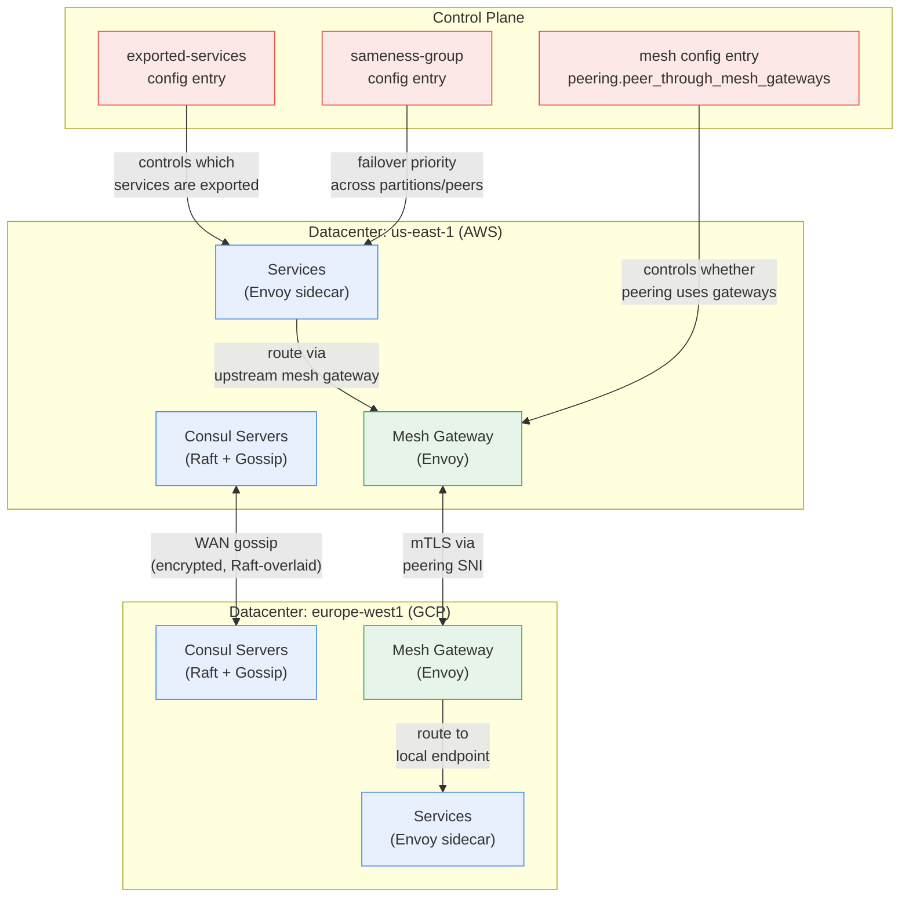
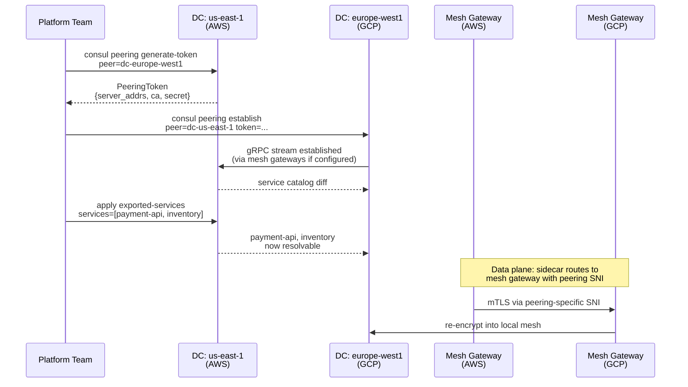

**TL;DR:** Can a service in an AWS VPC talk to a service in a GCP VPC without opening a single port on either firewall? In HashiCorp Consul it can — but the path from "service registered in dc-us-east-1" to "service reachable from dc-europe-west1" doesn't happen through direct VPC peering or VPN tunnels; it passes through three distinct mechanisms (WAN federation for control-plane gossip, mesh gateways for data-plane traffic, and exported-services config entries for which services are visible across boundaries), each configured through a different layer of Consul's config entry system — and confusing the layers is how multi-cloud meshes break silently in production.

> **In plain English (30 sec):** Code you already write — Map, function, API call, just bigger.

## 1. The Engineering Problem

Multi-cloud networking has a firewall problem that gets worse as you add clouds: every VPC, every subnet, every security group is a hard boundary that blocks unsolicited inbound traffic. Inside a single cloud, you can use VPC peering or private endpoints; across clouds, you're looking at VPN tunnels or dedicated interconnects — both of which give you network-layer reachability but not service-layer discoverability. A service in AWS doesn't know how to find a service in GCP by DNS name, and even if you bolt on a global DNS, you still have mTLS certificate trust boundaries: the SPIFFE identity issued by Consul in dc-us-east-1 is not trusted by the Consul cluster in dc-europe-west1.

Consul's service mesh was originally designed for a single datacenter. When teams started deploying the same services across multiple clouds, Consul extended its architecture with three new primitives that sit between the per-datacenter mesh and the outside world: **WAN federation** (gossip-encrypted control-plane channel between server clusters), **mesh gateways** (Envoy proxies that terminate and re-originate mTLS at the boundary), and **peering** (a newer, lighter alternative to full federation that uses `PeeringToken` exchange instead of shared gossip). Understanding how these three mechanisms interact — and which config entries control each one — is what makes a multi-cloud Consul deployment an engineering tool instead of a firewall hole-punching exercise.

## 2. The Technical Solution

Consul's multi-cloud architecture has three layers, each with a different mechanism for crossing boundaries:



**WAN federation** is the original cross-datacenter mechanism. Each Consul server cluster gossips with server clusters in other datacenters over port 8302 (TLS-encrypted). This gives every server a complete view of services registered in any federated datacenter. The downside is that every server in every datacenter must be able to reach every other server — which is hard to achieve across cloud boundaries without opening many firewall ports.

**Mesh gateways** solve the data-plane problem. Instead of routing service-to-service traffic directly across clouds (which would require mTLS trust across datacenters and direct network reachability), traffic exits the local mesh through a mesh gateway, which re-encrypts it with a peering-specific SNI, sends it to the remote mesh gateway, which decrypts and re-encrypts into the local mesh. The mesh gateway is the only component that needs cross-cloud network access.

**Peering** is the newer alternative to full WAN federation for the control plane. Instead of gossipping between server clusters, peering uses a one-time `PeeringToken` exchange — each side generates a token containing its server addresses, CA chain, and a one-time establishment secret. The receiving side uses those addresses to establish a gRPC streaming connection. Peered clusters share service catalog information (which services are exported) but not Raft state, which makes it lighter than federation but limits failover capabilities.

The critical configuration that ties peering to mesh gateways lives in the `MeshConfigEntry`:

```go
// PeeringMeshConfig contains cluster-wide options pertaining to peering.
type PeeringMeshConfig struct {
	// PeerThroughMeshGateways determines whether peering traffic between
	// control planes should flow through mesh gateways. If enabled,
	// Consul servers will advertise mesh gateway addresses as their own.
	// Additionally, mesh gateways will configure themselves to expose
	// the local servers using a peering-specific SNI.
	PeerThroughMeshGateways bool `alias:"peer_through_mesh_gateways"`
}
```

This single boolean controls whether the control-plane peering traffic (the gRPC stream that shares service catalog data) also routes through the mesh gateway, or whether it goes direct to the Consul servers. When `true`, servers advertise the mesh gateway's address instead of their own — which means you only need to open one port on one host (the mesh gateway) instead of all server ports on all servers.

The second diagram shows the peering token exchange and service export flow:



Two core truths about this chain:

- **Peering and federation are mutually exclusive for the same pair of datacenters.** Federation gives you full Raft state sharing (every server sees every KV store, every ACL token). Peering gives you service catalog sharing only. You choose one or the other per peering relationship — mixing them creates undefined behavior.
- **The `exported-services` config entry is the only thing that makes a service visible to a peer.** Even after peering is established, no service traffic flows until you explicitly declare which services should be exported. This is intentional: peering is opt-in at the service level, not a blanket "everything is reachable" mode.

## 3. The clean example

A minimal peering setup between two Consul datacenters, isolated from ACL tokens and gateway mesh configuration:

```hcl
# Datacenter us-east-1: generate a peering token for europe-west1
# Requires: mesh gateways registered and reachable
consul peering generate-token \
  -peer dc-europe-west1 \
  -meta "cloud=aws" \
  -meta "region=us-east-1"
```

```hcl
# Datacenter europe-west1: establish the peering using the token
# The token contains server addresses, CA cert, and establishment secret
consul peering establish \
  -peer dc-us-east-1 \
  -token "<token-from-us-east-1>"
```

```hcl
# Datacenter us-east-1: export services to the peer
# Only these services will be discoverable in europe-west1
cat <<'EOF' | consul config write -
Kind = "exported-services"
Name = "default"
Services = [
  {
    Name      = "payment-api"
    Namespace = "default"
    Peers     = ["dc-europe-west1"]
  },
  {
    Name      = "inventory"
    Namespace = "default"
    Peers     = ["dc-europe-west1"]
  }
]
EOF
```

```hcl
# Both datacenters: enable peering through mesh gateways
# This is what makes cross-cloud traffic route through the gateway
# instead of direct server-to-server
cat <<'EOF' | consul config write -
Kind = "mesh"
Name = "mesh"
Peering = {
  PeerThroughMeshGateways = true
}
EOF
```

The chain: the peering token exchange establishes the control-plane link. The `mesh` config entry with `PeerThroughMeshGateways = true` makes that link (and all subsequent data-plane traffic) flow through the mesh gateways. The `exported-services` entry with `Peers = ["dc-europe-west1"]` makes specific services discoverable. No service flows until all three are in place.

## 4. Production reality (from the real repo)

The files below are verbatim from [hashicorp/consul](https://github.com/hashicorp/consul), Consul's core repository. This is the config entry system that runs inside every Consul server.

**Config entry registry** — `agent/structs/config_entry.go`

The `MakeConfigEntry` function is the factory that maps kind strings to concrete config entry structs. Every config entry kind that Consul supports — including `mesh`, `exported-services`, and `sameness-group` — is registered here:

```go
func MakeConfigEntry(kind, name string) (ConfigEntry, error) {
	if configEntry := makeEnterpriseConfigEntry(kind, name); configEntry != nil {
		return configEntry, nil
	}
	switch kind {
	case ServiceDefaults:
		return &ServiceConfigEntry{Name: name}, nil
	case ProxyDefaults:
		return &ProxyConfigEntry{Name: name}, nil
	case ServiceRouter:
		return &ServiceRouterConfigEntry{Name: name}, nil
	case ServiceSplitter:
		return &ServiceSplitterConfigEntry{Name: name}, nil
	case ServiceResolver:
		return &ServiceResolverConfigEntry{Name: name}, nil
	case IngressGateway:
		return &IngressGatewayConfigEntry{Name: name}, nil
	case TerminatingGateway:
		return &TerminatingGatewayConfigEntry{Name: name}, nil
	case ServiceIntentions:
		return &ServiceIntentionsConfigEntry{Name: name}, nil
	case MeshConfig:
		return &MeshConfigEntry{}, nil
	case ExportedServices:
		return &ExportedServicesConfigEntry{Name: name}, nil
	case SamenessGroup:
		return &SamenessGroupConfigEntry{Name: name}, nil
	case APIGateway:
		return &APIGatewayConfigEntry{Name: name}, nil
	case BoundAPIGateway:
		return &BoundAPIGatewayConfigEntry{Name: name}, nil
	case FileSystemCertificate:
		return &FileSystemCertificateConfigEntry{Name: name}, nil
	case InlineCertificate:
		return &InlineCertificateConfigEntry{Name: name}, nil
	case HTTPRoute:
		return &HTTPRouteConfigEntry{Name: name}, nil
	case TCPRoute:
		return &TCPRouteConfigEntry{Name: name}, nil
	case JWTProvider:
		return &JWTProviderConfigEntry{Name: name}, nil
	default:
		return nil, fmt.Errorf("invalid config entry kind: %s", kind)
	}
}
```

What this teaches: the `MeshConfig` case returns a `MeshConfigEntry{}` with no `Name` field — mesh config is singleton. `ExportedServices` and `SamenessGroup` take a name, so you can have multiple export rules and multiple sameness groups. The kind string constants (`MeshConfig = "mesh"`, `ExportedServices = "exported-services"`) are what `consul config write` uses to route the HCL/JSON to the right struct.

**Mesh config entry** — `agent/structs/config_entry_mesh.go`

The `MeshConfigEntry` is the singleton that controls cluster-wide mesh behavior, including the peering-through-gateways toggle:

```go
type MeshConfigEntry struct {
	TransparentProxy TransparentProxyMeshConfig `alias:"transparent_proxy"`
	AllowEnablingPermissiveMutualTLS bool `json:",omitempty" alias:"allow_enabling_permissive_mutual_tls"`
	ValidateClusters bool `json:",omitempty" alias:"validate_clusters"`
	TLS *MeshTLSConfig `json:",omitempty"`
	HTTP *MeshHTTPConfig `json:",omitempty"`
	Peering *PeeringMeshConfig `json:",omitempty"`

	Meta               map[string]string `json:",omitempty"`
	Hash               uint64            `json:",omitempty" hash:"ignore"`
	acl.EnterpriseMeta `hcl:",squash" mapstructure:",squash"`
	RaftIndex          `hash:"ignore"`
}
```

The `PeerThroughMeshGateways()` accessor method is what the data-plane controller checks when deciding whether to advertise server addresses or mesh gateway addresses:

```go
func (e *MeshConfigEntry) PeerThroughMeshGateways() bool {
	if e == nil || e.Peering == nil {
		return false
	}
	return e.Peering.PeerThroughMeshGateways
}
```

What this teaches: the default is `false` — peering traffic goes direct to servers unless you explicitly configure mesh gateways. This is why a fresh peering setup works within a single cloud (servers are directly reachable) but breaks across clouds (servers are in different VPCs with no direct route). The `PeerThroughMeshGateways` flag is the toggle that makes cross-cloud peering work.

**Peering token structure** — `agent/structs/peering.go`

The `PeeringToken` is what gets serialized and exchanged between clusters. It contains everything the receiving cluster needs to establish a connection:

```go
type PeeringToken struct {
	CA                    []string
	ManualServerAddresses []string
	ServerAddresses       []string
	ServerName            string
	PeerID                string
	EstablishmentSecret   string
	Remote                PeeringTokenRemote
}

type PeeringTokenRemote struct {
	Partition  string
	Datacenter string
	Locality   *Locality
}
```

And the `ExportedServiceList` is what the control plane uses to track which services a peer is allowed to see:

```go
type ExportedServiceList struct {
	Services    []ServiceName
	DiscoChains map[ServiceName]ExportedDiscoveryChainInfo
}

type ExportedDiscoveryChainInfo struct {
	Protocol   string
	TCPTargets []*DiscoveryTarget
}
```

What this teaches: the token carries `ServerAddresses` (or `ManualServerAddresses` if you're not using mesh gateways) — these are the IPs/ports the receiving cluster dials to establish the gRPC stream. `EstablishmentSecret` is one-time-use; if the peering is deleted and re-established, a new token is required. The `ExportedServiceList` separates standard service discovery (`Services` slice) from mesh-aware discovery chains (`DiscoChains` map), which is how Consul knows whether a peer needs just DNS resolution or full Envoy route configuration.

**Sameness group** — `agent/structs/config_entry_sameness_group.go`

Sameness groups define failover priority across partitions and peers. In a multi-cloud setup, this is how you say "if the service in us-east-1 is down, try europe-west1 before giving up":

```go
type SamenessGroupConfigEntry struct {
	Name               string
	DefaultForFailover bool `json:",omitempty" alias:"default_for_failover"`
	IncludeLocal       bool `json:",omitempty" alias:"include_local"`
	Members            []SamenessGroupMember
	Meta               map[string]string `json:",omitempty"`
	Hash               uint64            `json:",omitempty" hash:"ignore"`
	acl.EnterpriseMeta `hcl:",squash" mapstructure:",squash"`
	RaftIndex          `hash:"ignore"`
}

type SamenessGroupMember struct {
	Partition string `json:",omitempty"`
	Peer      string `json:",omitempty"`
}
```

What this teaches: `Members` is an ordered list of `{Partition, Peer}` pairs. When a service resolver references a sameness group, it tries members in order. `DefaultForFailover = true` makes this group the default failover target for all services — you don't need to annotate every service resolver individually. `IncludeLocal` controls whether the local partition is tried first or only remote members are considered.

## 5. Review checklist

- **Is `PeerThroughMeshGateways` enabled on both sides of a peering?** The `MeshConfigEntry` is per-cluster — if one side has it `true` and the other doesn't, the control-plane gRPC stream works (because the side with gateways advertises gateway addresses) but the data-plane routing is asymmetric. Services in the cluster without gateways try to connect directly to the peer's servers and fail.
- **Does the `exported-services` entry list the correct peer name?** The `Peers` field must match exactly the `-peer` name used during `consul peering establish`. A typo in the peer name doesn't cause an error — it just silently exports to a non-existent peer, and the service is unreachable.
- **Is the mesh gateway reachable from both datacenters?** Mesh gateways need to be registered in both clusters (as `service:mesh-gateway` instances) and must have routable IPs from both sides. In AWS/GCP this typically means an internet-facing NLB or an internal cross-cloud interconnect — the mesh gateway itself doesn't care how it's routed, just that it is.
- **Are mTLS certificates issued by the same CA or cross-signed?** Peered clusters exchange their CA chains in the `PeeringToken`. If the receiving cluster's trust domain doesn't include the issuing CA, the mTLS handshake between mesh gateways fails silently — the connection is established at the TCP level but the Envoy proxy rejects the certificate.

## 6. FAQ

**Q: What's the difference between peering and WAN federation?**
A: Federation creates a full gossip mesh between all server clusters — every server in every datacenter knows about every other server, and KV stores, ACL tokens, and intentions are replicated. Peering creates a one-to-one gRPC stream between two clusters that shares only service catalog information. Federation is heavier but gives you full failover; peering is lighter but requires explicit `exported-services` configuration for each service.

**Q: Can I peer two clusters in the same cloud?**
A: Yes — peering doesn't care about the underlying cloud. The main reason to peer within a cloud is isolation: two independent Consul clusters (maybe owned by different teams) that need to share some services but not all state. `PeerThroughMeshGateways` is still useful here if the clusters are in different VPCs.

**Q: How does Consul handle service name conflicts across peers?**
A: Peered services are namespaced by peer name. When dc-europe-west1 resolves a service exported from dc-us-east-1, it uses the peer name as part of the DNS query: `payment-api.peer.dc-us-east-1.service.consul`. There's no conflict as long as peer names are unique — which they must be, since `consul peering establish` rejects duplicate peer names.

**Q: What happens when a mesh gateway goes down?**
A: Traffic to the peer fails until the gateway recovers. Mesh gateways are stateless Envoy proxies — they don't hold service catalog state, so there's nothing to restore. A mesh gateway deployment should have at least two instances behind a load balancer. Consul's service mesh routes to mesh gateways by service discovery, so a new gateway instance is picked up automatically.

**Q: Does `sameness-group` work across peered clusters?**
A: Yes — a `SamenessGroupMember` with a `Peer` field references a peered cluster. The service resolver uses the group to determine failover order. But peered clusters don't share KV state, so session-based lock acquisition (used by Consul's leader election for services) doesn't work across peers — only health-check-based failover is available.

---

## Source

- **Concept:** Consul's multi-cloud service mesh networking — WAN federation, mesh gateways, peering tokens, and exported-services config entries for cross-VPC service discovery and traffic routing
- **Domain:** multicloud
- **Repo:** [hashicorp/consul](https://github.com/hashicorp/consul) — Consul's core repository; key files: [`agent/structs/config_entry.go`](https://github.com/hashicorp/consul/blob/main/agent/structs/config_entry.go) (config entry registry and `MakeConfigEntry` factory), [`agent/structs/config_entry_mesh.go`](https://github.com/hashicorp/consul/blob/main/agent/structs/config_entry_mesh.go) (`MeshConfigEntry` with `PeerThroughMeshGateways`), [`agent/structs/peering.go`](https://github.com/hashicorp/consul/blob/main/agent/structs/peering.go) (`PeeringToken` and `ExportedServiceList`), [`agent/structs/config_entry_sameness_group.go`](https://github.com/hashicorp/consul/blob/main/agent/structs/config_entry_sameness_group.go) (`SamenessGroupConfigEntry` for cross-cluster failover)


