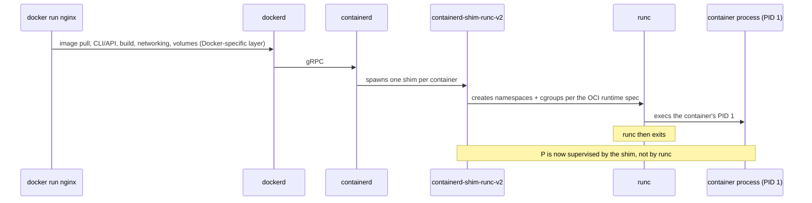

## 1. The Engineering Problem: "the Docker daemon does it" isn't an answer

Ask most engineers what creates a running container and the honest answer is "dockerd does something with namespaces, I think" — a black box that works until it doesn't: a container that won't die on `docker stop`, a host where `dockerd` restarts and every container mysteriously survives (or doesn't), a "why is there a process called `containerd-shim-runc-v2` eating a CPU core" ticket. None of those are answerable from "the daemon does it."

Historically Docker *was* one big daemon process that did image management, networking, and container execution all in one binary — which meant restarting or upgrading `dockerd` risked taking every running container down with it, since the thing supervising the containers and the thing being upgraded were the same process. That coupling was the actual engineering problem: you can't safely update or crash-recover the control plane if it's also the thing keeping your workloads alive.

---

## 2. The Technical Solution: split the daemon into a chain of single-purpose processes

Modern Docker Engine is not one process — it's a chain, and each link exists to isolate a failure domain from the one above it.



Three things to hold onto:

1. **`runc` does not stay running.** It's invoked to *create and start* a container — it sets up Linux namespaces (`pid`, `net`, `mnt`, `uts`, `ipc`, `user`) and cgroups per the [OCI Runtime Specification](https://github.com/opencontainers/runtime-spec), execs the container's PID 1, then exits. If `runc` stayed resident as the parent of every container, `dockerd` or `containerd` couldn't restart without killing every container tied to that process tree.
2. **`containerd-shim-runc-v2` is what actually survives.** One shim process per container becomes the real parent after `runc` exits, holds the container's I/O streams, and reports the exit code back to `containerd`. This is *why* you can restart `dockerd` (or even `containerd`) without your containers dying — the shim keeps them alive and reattaches to `containerd` when it comes back.
3. **`containerd` owns lifecycle and storage; `dockerd` is a client of it.** Image layers, the content-addressed blob store, and the `overlay2` snapshotter are `containerd`'s job. `dockerd` talks to `containerd` over gRPC for container lifecycle the same way the Kubernetes CRI does — Docker Engine isn't a special case anymore, it's one more client of the same containerd.

---

## 3. The clean example (the concept in isolation)

There's no "manifest" for a runtime chain — the concept lives in the process tree, not a YAML file. Here's what to actually go look at on any Docker host:

```bash
# Start something long-running
docker run -d --name demo nginx:alpine

# Find the shim that's supervising it
ps -ef | grep containerd-shim
# root   4821  1    0 12:03 ?  containerd-shim-runc-v2 -namespace moby -id <container-id> ...
#        ^^^^ PPID 1 -- reparented to init, NOT a child of dockerd or runc

# Confirm runc itself is long gone
ps -ef | grep runc
# (nothing -- runc already exited after starting the container)

# Ask containerd directly, bypassing dockerd entirely
sudo ctr --namespace moby containers list
sudo ctr --namespace moby tasks list
```

The shim's parent PID being `1` (the host's init), not `dockerd`'s PID, is the tell: nothing about the container's continued existence depends on `dockerd` still running. Kill and restart `dockerd` while `demo` is running and the container keeps serving traffic — the shim never noticed.

---

## 4. Production reality: what actually runs as PID 1 in a real image

The runtime chain treats every image identically regardless of what's inside it, but *what* ends up as the container's PID 1 — and therefore what `runc` execs and the shim supervises — is defined entirely by the image's `ENTRYPOINT`/`CMD`. Here's the real, final production stage from `docker/awesome-compose`'s Go + Postgres backend, verbatim:

```dockerfile
FROM scratch
COPY --from=builder /code/bin/backend /usr/local/bin/backend
CMD ["/usr/local/bin/backend"]
```

(This is the tail end of a multi-stage build — `FROM scratch` means literally zero base OS: no shell, no libc, no coreutils. Everything above it in the real file is the Go build stage; see the [multi-stage builds lesson](/docker/2026/07/22/multi-stage-builds-shrinking-the-final-image.html) for that in full.)

**What this teaches that a hello-world can't:**

- **`FROM scratch` is the sharpest possible illustration of what `runc` actually needs.** There is no init system, no shell, no package manager in this image — just one statically-linked binary. `runc` doesn't require any of that scaffolding; it only needs an executable to exec as PID 1 inside the namespaces it creates. Everything people associate with "a Linux system" (a shell, `/bin`, `/etc/passwd`) is optional as far as the container runtime is concerned — Docker images conventionally include it, but the runtime doesn't demand it.
- **`CMD ["/usr/local/bin/backend"]` in exec form (JSON array), not shell form,** means the container's PID 1 *is* the `backend` binary directly — no intermediate `/bin/sh -c` process. That matters for signal handling: `docker stop` sends `SIGTERM` to PID 1, and PID 1 in this image receives it directly, with no shell in between potentially swallowing it. Had this been `CMD "/usr/local/bin/backend"` (shell form), PID 1 would be `/bin/sh` — except this image has no shell at all, so shell-form `CMD` would simply fail to start.
- **A `scratch`-based static binary has no child processes to reap**, which sidesteps a classic container gotcha: when PID 1 *is* a shell or an app that spawns children without reaping zombies, the container leaks defunct processes over its lifetime because Linux only reaps zombies via the parent, and a naive PID 1 often doesn't call `wait()` correctly. Single static binary, no forking — nothing to reap.
- **Multi-stage builds and the runtime chain are orthogonal concepts that meet at exactly one point**: whatever the final `COPY --from=builder` lands in the last stage is the only thing `runc` ever sees. The builder stage, its toolchain, its intermediate layers — none of that exists at container-run time; `runc` execs the artifact, not the Dockerfile that produced it.

---

## Source

- **Concept:** The container runtime chain — `dockerd` → `containerd` → `containerd-shim-runc-v2` → `runc`, per the [OCI Runtime Spec](https://github.com/opencontainers/runtime-spec)
- **Domain:** docker
- **Repo:** [docker/awesome-compose](https://github.com/docker/awesome-compose) → [`nginx-golang-postgres/backend/Dockerfile`](https://github.com/docker/awesome-compose/blob/master/nginx-golang-postgres/backend/Dockerfile) — Docker's official curated collection of real multi-service Compose stacks
