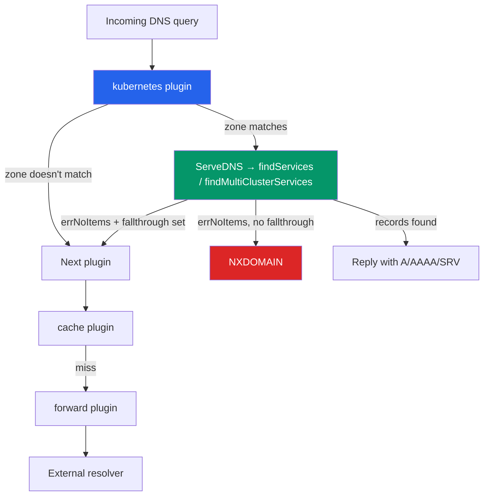
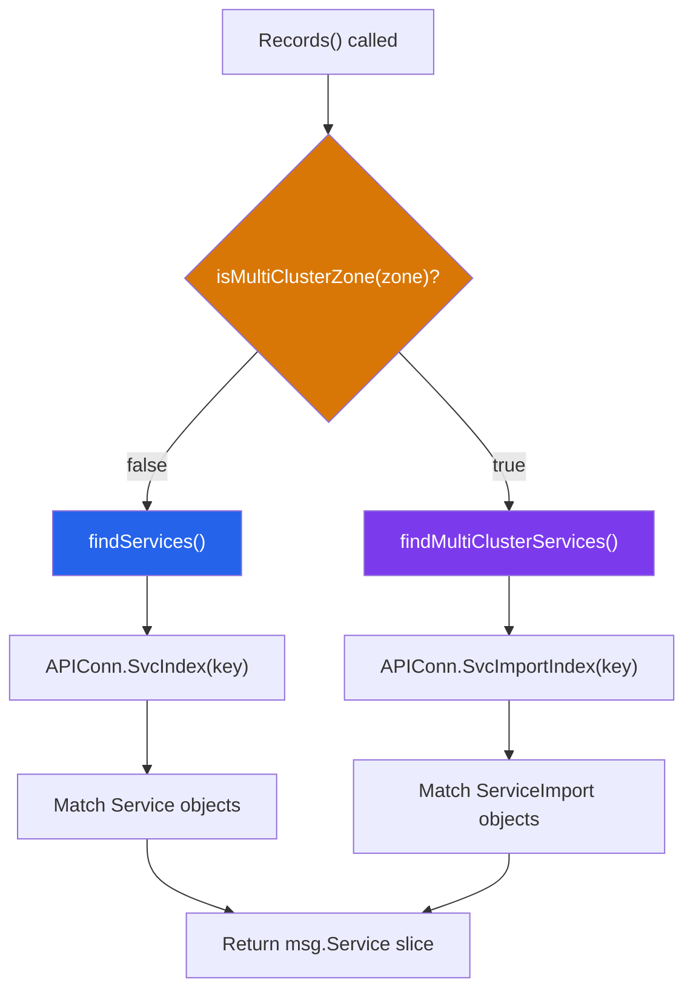

> **In plain English (30 sec):** A focused deep-dive on a specific mechanism or problem pattern.

## TL;DR

CoreDNS resolves multi-cluster service names by walking a **plugin chain** — not a static A-record zone file. Each plugin (`kubernetes`, `forward`, `cache`, `errors`) receives a `plugin.Handler` pointer to the next plugin and either answers the query or calls `plugin.NextOrFailure()` to delegate. In a multi-cluster setup the `kubernetes` plugin switches between local `findServices()` and `findMultiClusterServices()` paths based on the `multicluster` Corefile directive, consulting `ServiceImport` objects instead of plain `Service` objects. If none of those resolve, the query falls through to `forward`, then `cache`, then `errors`. Understanding this chain is critical because misordering plugins or omitting `fallthrough` silently breaks cross-cluster name resolution.

---

## The Engineering Problem

When you run a single Kubernetes cluster, DNS is straightforward: `coredns` watches the API for `Service` and `Endpoints` objects and returns A/AAAA records for `<svc>.<ns>.svc.cluster.local`. The moment you add a second cluster — even on a different cloud — the question changes.

A pod in **Cluster A** needs to reach `billing-api` running in **Cluster B**. Both clusters run CoreDNS, both have the `kubernetes` plugin, but neither knows about the other's services by default. You can bolt on external DNS providers, configure stub zones, or hand-roll CNAME chains, but every one of those approaches ignores the plugin architecture that makes CoreDNS extensible in the first place.

The real problem is threefold:

1. **Plugin ordering matters.** CoreDNS builds a linked list of handlers at startup. If `cache` sits before `kubernetes`, cached responses for a zone that the `kubernetes` plugin can answer will shadow live data.
2. **Multi-cluster is a separate code path.** The `kubernetes` plugin does not fall back from single-cluster to multi-cluster lookup; the `multicluster` Corefile directive activates an entirely different set of index lookups (`SvcImportIndex` instead of `SvcIndex`).
3. **`fallthrough` is opt-in.** Without it, the `kubernetes` plugin returns `NXDOMAIN` on its own zone even when a downstream plugin (like `forward` or a custom plugin) could answer.

---

## Technical Solution

### How the Plugin Chain Is Built

Every CoreDNS server block compiles to a linked list. `NewServer()` in `core/dnsserver/server.go` iterates the plugin list **backwards**, wiring each plugin's `Next` pointer:


<!-- Wiring loop from server.go — see Production Reality below -->
```
for i := len(site.Plugin) - 1; i >= 0; i-- {
    stack = site.Plugin[i](stack)
    site.registerHandler(stack)
}
site.pluginChain = stack
```

Each plugin is a **closure factory**: `func(next plugin.Handler) plugin.Handler`. The `kubernetes` plugin's setup registers itself this way:



The `fallthrough` directive in the Corefile controls whether a name-not-found from `kubernetes` hands off to the next plugin or hard-fails.

### Multi-Cluster Lookup Path

When `multicluster <zone>` is set in the Corefile, the `Records()` method branches:



`findMultiClusterServices()` queries the **MCS API** (`sigs.k8s.io/mcs-api`) objects — `ServiceImport` and `MultiClusterEndpoints` — rather than standard Kubernetes `Service` and `Endpoints`. This means the same CoreDNS binary serves both local and cross-cluster names, differentiated purely by zone configuration.

---

## Clean Example

A two-cluster setup where **Cluster A** (us-east-1) resolves services from **Cluster B** (eu-west-1):

### Corefile — Cluster A

```corefile
cluster.local {
    kubernetes cluster.local {
        multicluster cluster.global
        fallthrough
        ttl 5
    }

    forward . 10.0.1.53 10.0.2.53 {
        health_check 5s
    }

    cache 30
    errors
}
```

### What Happens When a Pod Queries `billing-api.billing.svc.cluster.global`

1. Query arrives — zone `cluster.global` matches `kubernetes` plugin.
2. `isMultiClusterZone("cluster.global")` returns `true`.
3. `findMultiClusterServices()` searches `ServiceImport` objects for `billing-api` in namespace `billing`.
4. If the `ServiceImport` exists, CoreDNS returns the ClusterIP(s) registered by the MCS controller.
5. If it does not exist, `errNoItems` is returned. Because `fallthrough` is set, the query passes to `forward`.
6. `forward` sends the query to the external resolvers (10.0.1.53, 10.0.2.53) which may be CoreDNS instances in Cluster B.
7. Cluster B's CoreDNS resolves `billing-api.billing.svc.cluster.local` normally and returns the answer upstream.

---

## Production Reality

The code below is verbatim from `coredns/coredns` on GitHub. Two files define the mechanics.

### Plugin Chain Wiring — `core/dnsserver/server.go`

```go
// Compile custom plugin for everything
var stack plugin.Handler
for i := len(site.Plugin) - 1; i >= 0; i-- {
    stack = site.Plugin[i](stack)

    // register the *handler* also
    site.registerHandler(stack)

    // If the current plugin is a MetadataCollector, bookmark it for later use. This loop traverses the plugin
    // list backwards, so the first MetadataCollector plugin wins.
    if mdc, ok := stack.(MetadataCollector); ok {
        site.metaCollector = mdc
    }

    if s.trace == nil && stack.Name() == "trace" {
        // we have to stash away the plugin, not the
        // Tracer object, because the Tracer won't be initialized yet
        if t, ok := stack.(trace.Trace); ok {
            s.trace = t
        }
    }
    // Unblock CH class queries when any of these plugins are loaded.
    if _, ok := EnableChaos[stack.Name()]; ok {
        s.classChaos = true
    }
}
site.pluginChain = stack
```

### Request Dispatch — `core/dnsserver/server.go`

```go
// ServeDNS is the entry point for every request to the address that
// is bound to. It acts as a multiplexer for the requests zonename as
// defined in the request so that the correct zone
// (configuration and plugin stack) will handle the request.
func (s *Server) ServeDNS(ctx context.Context, w dns.ResponseWriter, r *dns.Msg) {
    // ...
    q := strings.ToLower(r.Question[0].Name)
    var (
        off       int
        end       bool
        dshandler *Config
    )

    for {
        if z, ok := s.zones[q[off:]]; ok {
            for _, h := range z {
                if h.pluginChain == nil {
                    errorAndMetricsFunc(s.Addr, w, r, dns.RcodeRefused)
                    return
                }

                if h.metaCollector != nil {
                    ctx = h.metaCollector.Collect(ctx, request.Request{Req: r, W: w})
                }

                if passAllFilterFuncs(ctx, h.FilterFuncs, &request.Request{Req: r, W: w}) {
                    if h.ViewName != "" {
                        ctx = context.WithValue(ctx, ViewKey{}, h.ViewName)
                    }
                    if r.Question[0].Qtype != dns.TypeDS {
                        rcode, _ := h.pluginChain.ServeDNS(ctx, w, r)
                        if !plugin.ClientWrite(rcode) {
                            errorFunc(s.Addr, w, r, rcode)
                        }
                        return
                    }
                    dshandler = h
                }
            }
        }
        off, end = dns.NextLabel(q, off)
        if end {
            break
        }
    }
    // ...
}
```

### Multi-Cluster Service Lookup — `plugin/kubernetes/kubernetes.go`

```go
// Records looks up services in kubernetes.
func (k *Kubernetes) Records(_ctx context.Context, state request.Request, _exact bool) ([]msg.Service, error) {
    multicluster := k.isMultiClusterZone(state.Zone)
    r, e := parseRequest(state.Name(), state.Zone, multicluster)
    if e != nil {
        return nil, e
    }
    if r.podOrSvc == "" {
        return nil, nil
    }

    if dnsutil.IsReverse(state.Name()) > 0 {
        return nil, errNoItems
    }

    if !k.namespaceExposed(r.namespace) {
        return nil, errNsNotExposed
    }

    if r.podOrSvc == Pod {
        pods, err := k.findPods(r, state.Zone)
        return pods, err
    }

    var services []msg.Service
    var err error
    if !multicluster {
        services, err = k.findServices(r, state.Zone)
    } else {
        services, err = k.findMultiClusterServices(r, state.Zone)
    }
    return services, err
}
```

### `ServeDNS` Delegation to Next Plugin — `plugin/kubernetes/handler.go`

```go
func (k Kubernetes) ServeDNS(ctx context.Context, w dns.ResponseWriter, r *dns.Msg) (int, error) {
    state := request.Request{W: w, Req: r}

    qname := state.QName()
    zone := plugin.Zones(k.Zones).Matches(qname)
    if zone == "" {
        return plugin.NextOrFailure(k.Name(), k.Next, ctx, w, r)
    }
    // ...
    if k.IsNameError(err) {
        if k.Fall.Through(state.Name()) {
            return plugin.NextOrFailure(k.Name(), k.Next, ctx, w, r)
        }
        if !k.APIConn.HasSynced() {
            return plugin.BackendError(ctx, &k, zone, dns.RcodeServerFailure, state, nil, plugin.Options{})
        }
        return plugin.BackendError(ctx, &k, zone, dns.RcodeNameError, state, nil, plugin.Options{})
    }
    // ...
}
```

---

## Review Checklist

- [ ] **Plugin order in Corefile matches intent.** `kubernetes` must come before `forward` and `cache` for authoritative local resolution.
- [ ] **`multicluster` directive targets an authoritative zone.** CoreDNS validates that the `multicluster` zone is a subset of the plugin's zones; startup will fail otherwise.
- [ ] **`fallthrough` is set when downstream plugins must handle misses.** Without it, `NXDOMAIN` is returned before `forward` or custom plugins run.
- [ ] **MCS API CRDs are installed in the cluster.** `ServiceImport` and `EndpointSlice` for multi-cluster require the `sigs.k8s.io/mcs-api` CRDs.
- [ ] **API QPS and burst limits are tuned.** The `apiserver_qps` and `apiserver_burst` Corefile options prevent CoreDNS from overwhelming the API server during cache rebuilds.
- [ ] **`ignore empty_service` is evaluated per cluster.** A `ServiceImport` with zero `EndpointSlice` backing will still return records unless this option is set.
- [ ] **`startup_timeout` is long enough.** CoreDNS will serve with an unsynced cache if the Kubernetes API is unreachable at boot; set this to match your control plane SLA.

---

## FAQ

**Q: Can I use CoreDNS multi-cluster resolution with non-Kubernetes DNS systems?**

A: The `kubernetes` plugin is purpose-built for the Kubernetes API. For non-Kubernetes environments you would write a custom plugin or use `etcd`/`auto` plugins with an external service registry.

**Q: What is the difference between `multicluster` and `forward` for cross-cluster DNS?**

A: `multicluster` resolves names directly from the Kubernetes MCS API objects (`ServiceImport`) within the same CoreDNS process. `forward` delegates the query to an external resolver (which may itself be CoreDNS in another cluster). They are complementary: `multicluster` gives you in-process resolution, `forward` gives you delegation.

**Q: Does `fallthrough` apply to all zones or just the matched zone?**

A: `fallthrough` applies only to the zones listed in its arguments. If no arguments are given, it applies to all zones the plugin serves.

**Q: How does CoreDNS handle split-horizon when a service exists in both the local cluster and a remote cluster?**

A: The `kubernetes` plugin checks `isMultiClusterZone()` on the queried zone. Local queries (`svc.cluster.local`) hit `findServices()`. Multi-cluster queries (`svc.cluster.global`) hit `findMultiClusterServices()`. The two paths never overlap for the same query.

**Q: What happens if the MCS API CRDs are not installed but `multicluster` is set?**

A: CoreDNS will fail to initialize the multi-cluster controller during `InitKubeCache()` and return an error at startup.

---

## Source

- [coredns/coredns — `plugin/kubernetes/kubernetes.go`](https://github.com/coredns/coredns/blob/master/plugin/kubernetes/kubernetes.go)
- [coredns/coredns — `core/dnsserver/server.go`](https://github.com/coredns/coredns/blob/master/core/dnsserver/server.go)
- [coredns/coredns — `plugin/kubernetes/handler.go`](https://github.com/coredns/coredns/blob/master/plugin/kubernetes/handler.go)
- [coredns/coredns — `plugin/kubernetes/setup.go`](https://github.com/coredns/coredns/blob/master/plugin/kubernetes/setup.go)
- [Kubernetes Multi-Cluster Services API (MCS)](https://github.com/kubernetes-sigs/mcs-api)


