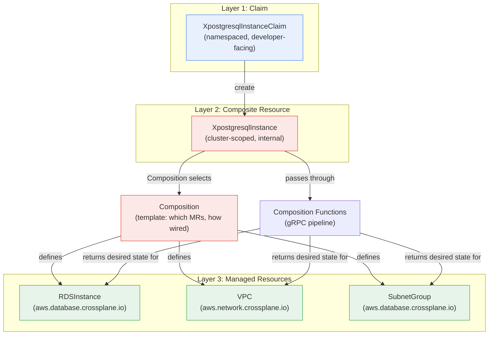
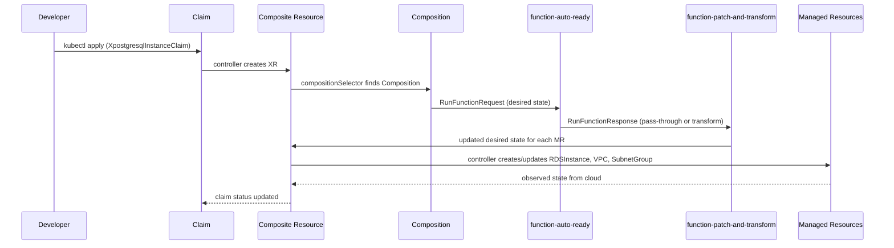

**TL;DR:** Does writing a Kubernetes YAML file actually create an RDS instance on AWS? In Crossplane it does — but the claim you `kubectl apply` doesn't map 1:1 to the cloud resource; it passes through a Composition (a template that selects which cloud resources to create and how to wire them together), which produces one or more Managed Resources (provider-specific objects that talk to the cloud API), all orchestrated by a controller engine that dynamically starts watches and runs a gRPC function pipeline — and understanding that chain is what separates "Crossplane works in a demo" from "Crossplane works in production."
> **In plain English (30 sec):** Think of this like concepts you already use, but in a production system at scale.


## 1. The Engineering Problem

Multi-cloud infrastructure has a portability problem that the previous lesson in this domain made concrete at the Terraform level: AWS RDS and GCP Cloud SQL model "highly available" and "backup retention" as structurally different schema shapes, so swapping providers isn't a provider-name rename — it's rewriting the resource definition. Terraform abstracts the *tooling* difference (same CLI, same state file, same plan/apply flow) but not the *resource schema* difference.

Crossplane's answer to this is architecturally different from Terraform's: instead of a CLI-and-state approach, it puts a Kubernetes API server in front of every cloud. You write a Kubernetes YAML object — a *Claim* — that describes what you want in abstract terms ("I need a managed Postgres database with 10GB storage"), and Crossplane's controllers translate that into real cloud API calls. The appeal is genuine: developers who already know `kubectl apply` don't need to learn Terraform's HCL, and the declarative model (desired state in the API server, controllers reconciling drift) is the same one they already use for pods and deployments.

The problem is that this abstraction chain — from one YAML claim to actual cloud resources — is not a simple mapping. A single claim can produce *multiple* cloud resources (a database instance, a subnet group, a security group, a DNS entry), each from a different cloud provider's API, wired together with provider-specific details the claim author shouldn't have to know about. Crossplane solves this with a three-layer object model (Claim → Composition → Managed Resource) backed by a function pipeline and a dynamic controller engine — and understanding that machinery is what makes it an engineering tool instead of a magic box that breaks silently when you need it to do something the demo didn't cover.

## 2. The Technical Solution

Crossplane's object model has three distinct layers, each with a different responsibility:



**Claim** (Layer 1): A namespaced Kubernetes object the developer creates. It describes *what* they want, not *how* to build it. A claim for a managed database might specify storage size, engine version, and high-availability requirement — but nothing about VPCs, subnet groups, or security groups.

**Composition** (Layer 2): A cluster-scoped template selected by the Claim's `compositionSelector`. It maps abstract claim fields to concrete Managed Resource specs, defines how multiple resources relate to each other, and optionally passes the request through a gRPC function pipeline for dynamic transformation. One Composition can produce multiple Managed Resources — a database *and* its networking *and* its DNS entry — all wired together.

**Managed Resources** (Layer 3): Provider-specific objects that map 1:1 to a cloud API call. An `RDSInstance` in the AWS provider talks directly to the AWS RDS API. These are the objects that actually create, update, and delete cloud infrastructure.

The function pipeline is where the real flexibility lives. Crossplane runs Composition Functions as gRPC calls in sequence — each function receives the current state of all composed resources and can modify the desired state before passing it along:



Two core truths about this chain:

- **The claim never touches the cloud directly.** It's a namespaced, developer-facing object that gets reconciled into a cluster-scoped Composite Resource, which is then reconciled into Managed Resources. Each layer adds provider-specific detail the layer above doesn't know about.
- **Functions are a pipeline, not a single step.** Each function in the Composition's `pipeline` receives the accumulated state from the previous function and can add, modify, or remove composed resources. The order matters — a `patch-and-transform` function that runs before `auto-ready` can inject defaults that the ready-checker then validates.

## 3. The clean example

A minimal Composition that maps a database claim to a single AWS RDS instance, isolated from the full Crossplane package ecosystem:

```yaml
# CompositeResourceDefinition — defines the abstract claim schema
apiVersion: apiextensions.crossplane.io/v1
kind: CompositeResourceDefinition
metadata:
  name: xpostgresqlinstances.database.example.org
spec:
  group: database.example.org
  names:
    kind: XpostgresqlInstance
  claimNames:
    kind: PostgreSQLInstance
  versions:
    - name: v1alpha1
      served: true
      referenceable: true
      schema:
        openAPIV3Schema:
          type: object
          properties:
            parameters:
              type: object
              properties:
                storageGB:
                  type: integer
                  minimum: 1
                  maximum: 1000
                highAvailability:
                  type: boolean
              required:
                - storageGB
```

```yaml
# Composition — the template that maps claim fields to cloud resources
apiVersion: apiextensions.crossplane.io/v1
kind: Composition
metadata:
  name: postgresql-aws
  labels:
    provider: aws
spec:
  compositeTypeRef:
    apiVersion: database.example.org/v1alpha1
    kind: XpostgresqlInstance
  resources:
    - name: rds-instance
      base:
        apiVersion: database.aws.crossplane.io/v1beta1
        kind: RDSInstance
        spec:
          forProvider:
            engine: postgres
            engineVersion: "15"
            instanceClass: db.t3.micro
            masterUsername: admin
            storageType: gp3
          providerConfigRef:
            name: aws-provider
      patches:
        - type: FromCompositeFieldPath
          fromFieldPath: spec.parameters.storageGB
          toFieldPath: spec.forProvider.allocatedStorage
        - type: FromCompositeFieldPath
          fromFieldPath: spec.parameters.highAvailability
          toFieldPath: spec.forProvider.multiAZ
          transforms:
            - type: map
              map:
                "true": "true"
                "false": "false"
```

```yaml
# The developer's claim — this is what gets kubectl applied
apiVersion: database.example.org/v1alpha1
kind: PostgreSQLInstance
metadata:
  name: my-app-db
  namespace: production
spec:
  parameters:
    storageGB: 50
    highAvailability: true
  compositionSelector:
    matchLabels:
      provider: aws
```

The chain: the claim specifies *what* (50GB, HA). The Composition specifies *how* (RDS instance, `gp3` storage, `db.t3.micro`). The patches wire the claim fields to the right spots in the Managed Resource spec. No VPC, no subnet group, no security group in this minimal example — a real Composition would add those, but the pattern is the same: each composed resource is a `base` with `patches` that pull values from the composite resource's spec.

## 4. Production reality (from the real repo)

The files below are verbatim from [crossplane/crossplane](https://github.com/crossplane/crossplane), Crossplane's core control plane repository. This is what runs inside the Crossplane pod when you `helm install crossplane`.

**Composition revision reconciler** — `internal/controller/apiextensions/composition/reconciler.go`

This controller watches `Composition` objects and creates immutable `CompositionRevision` snapshots whenever the Composition spec changes. It hashes the spec to detect changes, lists existing revisions, and only creates a new one when the hash doesn't match:

```go
// Reconcile a Composition.
func (r *Reconciler) Reconcile(ctx context.Context, req reconcile.Request) (reconcile.Result, error) {
	log := r.log.WithValues("request", req)
	log.Debug("Reconciling")

	ctx, cancel := context.WithTimeout(ctx, timeout)
	defer cancel()

	comp := &v1.Composition{}
	if err := r.client.Get(ctx, req.NamespacedName, comp); err != nil {
		log.Debug(errGet, "error", err)
		r.record.Event(comp, event.Warning(reasonCreateRev, errors.Wrap(err, errGet)))

		return reconcile.Result{}, errors.Wrap(resource.IgnoreNotFound(err), errGet)
	}

	if meta.WasDeleted(comp) {
		return reconcile.Result{}, nil
	}

	currentHash := comp.Hash()

	log = log.WithValues(
		"uid", comp.GetUID(),
		"version", comp.GetResourceVersion(),
		"name", comp.GetName(),
		"spec-hash", currentHash,
	)

	rl := &v1.CompositionRevisionList{}
	if err := r.client.List(ctx, rl, client.MatchingLabels{v1.LabelCompositionName: comp.GetName()}); err != nil {
		log.Debug(errListRevs, "error", err)
		r.record.Event(comp, event.Warning(reasonCreateRev, errors.Wrap(err, errListRevs)))

		return reconcile.Result{}, errors.Wrap(err, errListRevs)
	}

	var latestRev, existingRev int64

	if lr := v1.LatestRevision(comp, rl.Items); lr != nil {
		latestRev = lr.Spec.Revision
	}

	for i := range rl.Items {
		rev := &rl.Items[i]

		if !metav1.IsControlledBy(rev, comp) {
			if err := meta.AddControllerReference(rev, meta.AsController(meta.TypedReferenceTo(comp, v1.CompositionGroupVersionKind))); err != nil {
				log.Debug(errOwnRev, "error", err)
				r.record.Event(comp, event.Warning(reasonUpdateRev, err))
# ... (1 lines omitted)
```

What this teaches: Compositions are *immutable once applied to a claim*. The reconciler doesn't patch existing revisions — it creates new ones with incremented revision numbers. This is why a Composition update doesn't instantly affect running claims: each claim references a specific revision, and only an explicit upgrade (or re-reconciliation) picks up the new one.

**Controller engine** — `internal/engine/engine.go`

The `ControllerEngine` dynamically starts and stops controllers and their watches as new claim types and composed resource types appear. This is how Crossplane scales from "one provider, one resource type" to "dozens of providers, hundreds of resource types" without loading every informer at startup:

```go
// A ControllerEngine manages a set of controllers that can be dynamically
// started and stopped. It also manages a dynamic set of watches per controller,
// and the informers that back them.
type ControllerEngine struct {
	mgr            manager.Manager
	namespace      string
	serviceAccount string
	infs           TrackingInformers
	cached         client.Client
	uncached       client.Client
	controllers    map[string]*controller
	mx             sync.RWMutex
	log            logging.Logger
	metrics        Metrics
}
```

The engine's `Start` method creates a controller-runtime controller with `SkipNameValidation = true` so that multiple reconcilers (one per claim type, one per composite type) can share the same engine without name collisions:

```go
func (e *ControllerEngine) Start(name string, o ...ControllerOption) error {
	e.mx.Lock()
	defer e.mx.Unlock()

	if _, running := e.controllers[name]; running {
		return nil
	}

	co := &ControllerOptions{nc: kcontroller.NewUnmanaged}
	for _, fn := range o {
		fn(co)
	}
	co.runtime.SkipNameValidation = ptr.To(true)

	c, err := co.nc(name, co.runtime)
	if err != nil {
		return errors.Wrap(err, "cannot create new controller")
	}

	ctx, cancel := context.WithCancel(context.Background())

	go func() {
		<-e.mgr.Elected()
		e.log.Debug("Starting new controller", "controller", name)
		e.metrics.ControllerStarted(name)

		if err := c.Start(ctx); err != nil {
			e.log.Info("Controller stopped with an error", "name", name, "error", err)
			_ = e.Stop(ctx, name)
			return
		}

		e.log.Debug("Stopped controller", "controller", name)
		e.metrics.ControllerStopped(name)
	}()

	r := &controller{
		ctrl:    c,
		cancel:  cancel,
		sources: make(map[WatchID]*StoppableSource),
	}

	e.controllers[name] = r

	return nil
}
```

`StartWatches` is the key method — it's called on every reconcile by the composite resource controller, and it only starts a new watch if the informer for that GVK isn't already active:

```go
func (e *ControllerEngine) StartWatches(ctx context.Context, name string, ws ...Watch) error {
	// ...
	a := e.infs.ActiveInformers()
	activeInformer := make(map[schema.GroupVersionKind]bool, len(a))
	for _, gvk := range a {
		activeInformer[gvk] = true
	}

	c.mx.RLock()
	start := false
	for i, w := range ws {
		wid := WatchID{Type: w.wt, GVK: gvks[i]}
		if _, watchExists := c.sources[wid]; watchExists && activeInformer[wid.GVK] {
			continue
		}
		start = true
		break
	}
	c.mx.RUnlock()

	if !start {
		return nil
	}
	// ... start new sources ...
}
```

What this teaches: Crossplane doesn't preload a watch for every possible cloud resource type. It starts watches *on demand* as Compositions reference new resource types, and garbage-collects them when CRDs are deleted — which is how a single Crossplane installation can support thousands of resource types without running out of memory.

**gRPC function runner** — `internal/xfn/function_runner.go`

Composition Functions are called over gRPC, with connection pooling and automatic endpoint discovery from the active `FunctionRevision`:

```go
func (r *PackagedFunctionRunner) RunFunction(ctx context.Context, name string, req *fnv1.RunFunctionRequest) (*fnv1.RunFunctionResponse, error) {
	conn, err := r.getClientConn(ctx, name)
	if err != nil {
		return nil, errors.Wrapf(err, errFmtGetClientConn, name)
	}

	rsp, err := NewBetaFallBackFunctionRunnerServiceClient(conn).RunFunction(ctx, req)

	return rsp, errors.Wrapf(err, errFmtRunFunction, name)
}
```

The runner tries the v1 gRPC API first, falling back to v1beta1 if the Function doesn't implement v1 yet — this is how Crossplane maintains backward compatibility as the Function SDK evolves:

```go
func (c *BetaFallBackFunctionRunnerServiceClient) RunFunction(ctx context.Context, req *fnv1.RunFunctionRequest, opts ...grpc.CallOption) (*fnv1.RunFunctionResponse, error) {
	rsp, err := fnv1.NewFunctionRunnerServiceClient(c.cc).RunFunction(ctx, req, opts...)

	if err == nil {
		return rsp, nil
	}

	if status.Code(err) != codes.Unimplemented {
		return nil, err
	}

	breq, err := toBeta(req)
	if err != nil {
		return nil, err
	}

	brsp, err := fnv1beta1.NewFunctionRunnerServiceClient(c.cc).RunFunction(ctx, breq, opts...)
	if err != nil {
		return nil, err
	}

	rsp, err = fromBeta(brsp)

	return rsp, err
}
```

**Circuit breaker** — `internal/circuit/breaker.go`

When a watched resource triggers too many reconciliations (e.g., two controllers fighting over the same object), the circuit breaker opens and drops events to prevent a tight loop:

```go
type Breaker interface {
	GetState(ctx context.Context, target types.NamespacedName) State
	RecordEvent(ctx context.Context, target types.NamespacedName, es EventSource, et EventType)
	ResetTarget(ctx context.Context, target types.NamespacedName)
}

type State struct {
	IsOpen         bool
	NextAllowedAt  time.Time
	TriggeredBy    string
}
```

The core startup command wires all of these together — `cmd/crossplane/core/core.go` configures the function runner, the circuit breaker, the controller engine, and the API extensions controller into a single controller manager:

```go
pfr := xfn.NewPackagedFunctionRunner(mgr.GetClient(),
	xfn.WithLogger(log),
	xfn.WithTLSConfig(clienttls),
	xfn.WithInterceptorCreators(pfrm),
)

// Periodically remove clients for Functions that no longer exist.
go pfr.GarbageCollectConnections(ctx, 10*time.Minute)

var runner xfn.FunctionRunner = pfr
// ... layers of middleware: FetchingFunctionRunner -> FunctionResponseCache -> PipelineInspector ...

ce := engine.New(mgr,
	engine.TrackInformers(ca, mgr.GetScheme()),
	unstructured.NewClient(cached),
	unstructured.NewClient(uncached),
	engine.WithLogger(log),
	engine.WithMetrics(cem),
	engine.WithNamespace(c.Namespace),
	engine.WithServiceAccount(c.ServiceAccount),
)

ao := apiextensionscontroller.Options{
	Options:                  o,
	ControllerEngine:         ce,
	FunctionRunner:           runner,
	OpenAPIClient:            oac,
	CircuitBreakerMetrics:    cbm,
	CircuitBreakerBurst:      c.CircuitBreakerBurst,
	CircuitBreakerRefillRate: c.CircuitBreakerRefillRate,
	CircuitBreakerCooldown:   c.CircuitBreakerCooldown,
	MinPollInterval:          c.MinPollInterval,
}
```

What this teaches: Crossplane's production architecture is a layered middleware stack — function calls pass through requirement-fetching, response caching, and optional pipeline inspection before hitting the gRPC network. The circuit breaker configuration (`CircuitBreakerBurst`, `CircuitBreakerRefillRate`, `CircuitBreakerCooldown`) is exposed as CLI flags, not hardcoded — because the right thresholds depend on how many reconciliations per second your specific set of providers and compositions produces.

## 5. Review checklist

- **Does the Composition define explicit `providerConfigRef` on every composed Managed Resource?** A missing provider config reference means the MR will fail at reconcile time with an "unknown provider" error — and since Claims are namespaced while Managed Resources are cluster-scoped, the failure surfaces in the developer's namespace while the root cause is in the cluster admin's configuration.
- **Are Composition patches using `ToCompositeFieldPath` for outputs (status values, connection details) or only `FromCompositeFieldPath` for inputs?** A Composition that only patches *into* Managed Resources but never patches *back* to the Claim leaves the developer with no way to see connection strings, endpoints, or status — they applied the claim but can't connect to the database.
- **Is the CompositionRevision strategy intentional — auto-upgrade, or manual?** The `revisionUpdatePolicy` field controls whether existing Claims automatically pick up new Composition revisions. In production, auto-upgrade can silently change the shape of your Managed Resources on a Composition update. Manual (`Manual`) is safer for anything with stateful cloud resources.
- **Has the circuit breaker configuration been sized for your reconcile volume?** The defaults (`CircuitBreakerBurst: 100`, `CircuitBreakerRefillRate: 1.0`, `CircuitBreakerCooldown: 5m`) are conservative. A cluster with hundreds of compositions and dozens of providers may need a higher burst to avoid dropping legitimate events during startup or after a provider upgrade.

## 6. FAQ

**Q: Why does Crossplane use both Claims and Composite Resources — why not just let developers create Managed Resources directly?**
A: Managed Resources are provider-specific. An `RDSInstance` knows about AWS instance classes, VPCs, and subnet groups. Claims are provider-agnostic — a developer says "I need 50GB of Postgres with HA" and doesn't need to know that means `multiAZ: true` and `db.t3.micro` on AWS vs. `availability_type: REGIONAL` and `db-custom-1-3840` on GCP. The Composition is where that mapping lives, and it's maintained by a platform team, not every developer who needs a database.

**Q: What's the difference between a Composition and a CompositionRevision?**
A: A Composition is a living object — you edit it, and the revision reconciler detects the change (via spec hash), creates a new immutable CompositionRevision, and bumps the revision number. Claims reference a specific revision. This means you can update a Composition without instantly affecting all running claims — they keep running against the revision they were created with until they're explicitly upgraded or re-reconciled.

**Q: How does Crossplane know which Managed Resource types exist in a provider?**
A: Each provider package (e.g., `provider-aws`) installs CRDs for every cloud resource it supports. The `ControllerEngine`'s `StartWatches` method starts informers on demand as Compositions reference new resource types, and `GarbageCollectCustomResourceInformers` cleans up informers when CRDs are deleted. This lazy-loading is why a Crossplane installation with 50 providers doesn't start 50 × hundreds of informers at boot.

**Q: Why is gRPC used for Composition Functions instead of just applying patches in Go code?**
A: Functions are OCI-packaged, independently versioned executables that run as sidecar containers or separate Deployments. gRPC gives Crossplane a stable, language-agnostic protocol to call them — a Function written in Go, Rust, or Python all look the same from Crossplane's side. The `BetaFallBackFunctionRunnerServiceClient` in the function runner ensures backward compatibility as the Function SDK evolves from v1beta1 to v1.

**Q: What happens when two Compositions try to manage the same Managed Resource?**
A: Managed Resources have an `offerings` field (or owner references) that prevents this at the Crossplane level — but at the controller level, the circuit breaker (`internal/circuit/breaker.go`) handles the case where multiple controllers are reconciling the same resource and fighting over its state. If the reconciliation rate exceeds the token bucket's burst capacity, the circuit opens and drops events for a configurable cooldown period, preventing a tight loop.

---

## Source

- **Concept:** Crossplane's Kubernetes-native multi-cloud control plane architecture — Claim → Composition → Managed Resource chain, dynamic controller engine, and gRPC function pipeline
- **Domain:** multicloud
- **Repo:** [crossplane/crossplane](https://github.com/crossplane/crossplane) — the core Crossplane control plane; key files: [`internal/controller/apiextensions/composition/reconciler.go`](https://github.com/crossplane/crossplane/blob/master/internal/controller/apiextensions/composition/reconciler.go) (Composition revision reconciler), [`internal/engine/engine.go`](https://github.com/crossplane/crossplane/blob/master/internal/engine/engine.go) (dynamic controller engine), [`internal/xfn/function_runner.go`](https://github.com/crossplane/crossplane/blob/master/internal/xfn/function_runner.go) (gRPC Composition Function runner), [`internal/circuit/breaker.go`](https://github.com/crossplane/crossplane/blob/master/internal/circuit/breaker.go) (circuit breaker for reconciliation loops), [`cmd/crossplane/core/core.go`](https://github.com/crossplane/crossplane/blob/master/cmd/crossplane/core/core.go) (core startup wiring)


