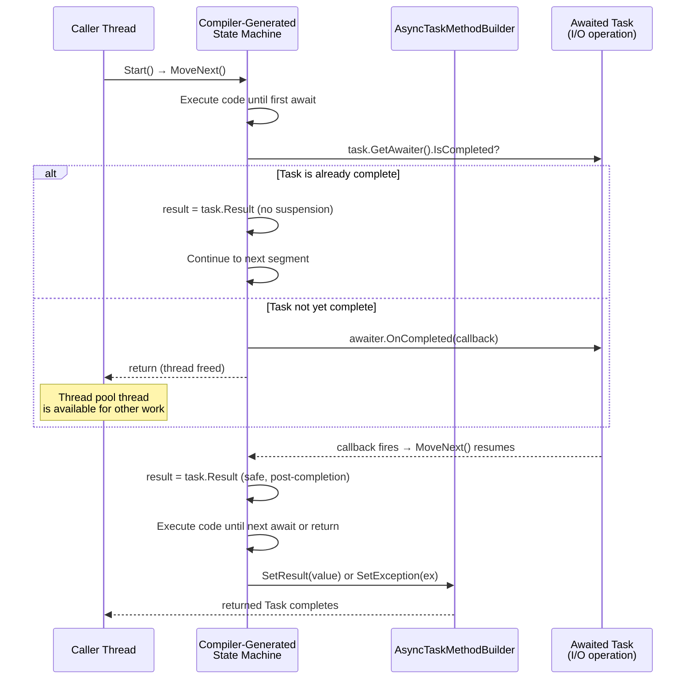

**TL;DR:** Does `async/await` spin up a new thread for each await? No — the compiler rewrites your method into a heap-allocated state machine that runs synchronously on the current thread up to the first await, then suspends and resumes later via a callback when the awaited task completes, with no thread-per-await cost at all.

## 1. The Engineering Problem

Before `async/await`, writing non-blocking I/O in C# meant one of two painful patterns — both with real production costs.

**Thread blocking.** The naive approach: call `.Result` or `.Wait()` on a `Task` to get a value synchronously. This blocks the thread entirely — the thread pool thread sits idle doing nothing while waiting for I/O to complete. Under load, the thread pool exhausts its thread count, new work items queue behind the blocked threads, and throughput collapses. ASP.NET apps hit this hard: a web request thread blocked on a database call means one fewer thread available to serve other requests, and the thread pool's heuristic thread injection can't keep up.

**Callback hell.** The alternative: avoid blocking by chaining continuations with `Task.ContinueWith`. This produces deeply nested, hard-to-read code where error handling and local variable scope become the developer's problem to manage manually. Exception propagation across continuation boundaries is fragile; the stack trace is lost; and cancellation tokens must be threaded through every callback by hand. The *intent* of the code — "do A, then B, then C" — is buried under the *plumbing* of how continuations are wired together.

What was needed was a way to write sequential-looking code that the compiler could transparently transform into non-blocking, resumable logic — without the developer having to manually manage continuations, captured state, or thread pool callbacks.

## 2. The Technical Solution

When you mark a method with `async` and use `await` inside it, the C# compiler rewrites the method body into a **state machine struct** — a class (or struct, in hot paths) that implements `IAsyncStateMachine` and captures every local variable, parameter, and awaiter as a field. The original method body is split into segments at each `await` point, and each segment becomes a case in a `switch` statement inside `MoveNext()`.

At runtime, the execution flow is:

1. The caller invokes your `async` method. The compiler-generated code creates the state machine (initially stack-allocated when possible) and an `AsyncTaskMethodBuilder<T>`.
2. `builder.Start(ref stateMachine)` is called, which runs `stateMachine.MoveNext()` — this executes your code synchronously up to the first `await`.
3. If the awaited task is already complete, `MoveNext()` continues without suspending. If not, the state machine captures the current `ExecutionContext`, registers a continuation callback on the awaited task's `IValueTaskSource`, and returns — the thread is freed.
4. When the awaited operation completes, the runtime calls `stateMachine.MoveNext()` again, picking up at the next `switch` case with all local variables intact.
5. This repeats at every `await` until the method returns or throws, at which point `builder.SetResult()` or `builder.SetException()` completes the returned `Task`.



Two key architectural truths emerge from this:

- **The thread is never "waiting" — it's released.** Between the first `await` on an incomplete task and the callback firing, no thread is associated with the state machine at all. This is what makes async scalable: a server with 200 in-flight I/O operations doesn't need 200 threads.
- **Local variables survive across await points as struct fields, not closures.** The compiler hoists every variable used after an `await` into the state machine struct's fields — no heap allocation for a closure, no captured delegate. This is why `async` methods have a measurable allocation cost: the state machine itself must be boxed to the heap once an `await` actually suspends.

## 3. The clean example (concept in isolation)

Stripped of the builder plumbing, here is the conceptual shape of what the compiler generates — a state machine with an integer state and a `MoveNext()` switch:

```csharp
// Conceptual shape of what the compiler generates.
// This is NOT the real code — it's a simplified illustration of the state machine pattern.

public class OrderStateMachine : IAsyncStateMachine
{
    public int state;                         // which segment to execute (-1 = not started)
    public AsyncTaskMethodBuilder<Order> builder;
    private Order result;                     // local variable / return value
    private int orderId;                      // captured local
    private Task<Inventory> inventoryTask;    // captured awaiter
    private Inventory inventory;              // captured local (set after first await)

    public void MoveNext()
    {
        switch (state)
        {
            case 0:  // After first await (GetInventoryAsync)
                goto case 1;

            case -1: // Initial call
                orderId = 42;
                inventoryTask = GetInventoryAsync(orderId);
                if (inventoryTask.IsCompleted)
                {
                    inventory = inventoryTask.Result;
                    goto case 1;
                }
                state = 0;
                builder.AwaitUnsafeOnCompleted(inventoryTask.GetAwaiter(), ref this);
                return;

            case 1: // After inventory is available
                inventory = inventoryTask.Result;  // safe to read — task is complete
                var order = new Order(orderId, inventory);
                result = order;
                builder.SetResult(order);           // completes the returned Task<Order>
                return;
        }
    }

    public void SetStateMachine(IAsyncStateMachine stateMachine) =>
        builder.SetStateMachine(stateMachine);
}
```

The original `async` method this came from would have looked like:

```csharp
public async Task<Order> ProcessOrderAsync(int orderId)
{
    var inventory = await GetInventoryAsync(orderId);   // ← await point: state splits here
    return new Order(orderId, inventory);
}
```

That single `await` produces a state split: everything before it runs on the caller's thread in the initial `MoveNext()` call; everything after it runs in a callback after the task completes. No threads are blocked, no threads are created, and the local variable `inventory` survives the suspension as a struct field.

## 4. Production reality (from the real repo)

The actual compiler output relies on two types from `dotnet/runtime`: the `AsyncTaskMethodBuilder` (driving the `Task` lifecycle) and `Task` itself (the returned promise). Both live in `System.Private.CoreLib`:

```
runtime/src/libraries/System.Private.CoreLib/src/System/
├── Runtime/CompilerServices/
│   └── AsyncTaskMethodBuilder.cs     — builder that the compiler calls into
└── Threading/Tasks/
    └── Task.cs                       — the returned Task (promise) and its state flags
```

**`AsyncTaskMethodBuilder` — the compiler's control surface.** Every `async Task` method compiles down to calls into this struct. Three critical members:

`Start` kicks off the state machine. It's `AggressiveInlining` because it's called on every single async method invocation — the performance budget matters:

```csharp
[DebuggerStepThrough]
[MethodImpl(MethodImplOptions.AggressiveInlining)]
public void Start<TStateMachine>(ref TStateMachine stateMachine) where TStateMachine : IAsyncStateMachine =>
    AsyncMethodBuilderCore.Start(ref stateMachine);
```

`AwaitUnsafeOnCompleted` is what the compiler calls when an `await` hits an incomplete task — it registers the state machine to be resumed when the awaited operation completes. The "Unsafe" variant skips `ExecutionContext` capture (used for awaiters that guarantee they won't flow context):

```csharp
[MethodImpl(MethodImplOptions.AggressiveInlining)]
public void AwaitUnsafeOnCompleted<TAwaiter, TStateMachine>(
    ref TAwaiter awaiter, ref TStateMachine stateMachine)
    where TAwaiter : ICriticalNotifyCompletion
    where TStateMachine : IAsyncStateMachine =>
    AsyncTaskMethodBuilder<VoidTaskResult>.AwaitUnsafeOnCompleted(ref awaiter, ref stateMachine, ref m_task);
```

`SetResult` completes the returned `Task` in the `RanToCompletion` state — but it has a fast path: if nobody has accessed the `Task` property yet (no caller is awaiting the returned Task), it assigns a cached pre-completed task rather than creating a new one:

```csharp
public void SetResult()
{
    if (m_task is null)
    {
        m_task = Task.s_cachedCompleted;    // fast path: no Task was allocated
    }
    else
    {
        AsyncTaskMethodBuilder<VoidTaskResult>.SetExistingTaskResult(m_task, default!);
    }
}
```

**`Task` — the returned promise and its state flags.** `Task` is a class with a `m_stateFlags` volatile int that packs the task's lifecycle state (Created → WaitingToRun → Running → RanToCompletion / Faulted / Canceled) into bit flags using `TaskStateFlags`:

```csharp
internal volatile int m_stateFlags; // SOS DumpAsync command depends on this name

[Flags]
internal enum TaskStateFlags
{
    Started = 0x10000,
    DelegateInvoked = 0x20000,
    RanToCompletion = 0x1000000,
    WaitingForActivation = 0x2000000,
    Faulted = 0x200000,
    Canceled = 0x400000,
    // ...
}
```

The `AtomicStateUpdate` method uses `Interlocked.CompareExchange` to transition state flags atomically — this is how the runtime ensures exactly one thread sees a task transition from `Running` to `RanToCompletion`, even when multiple threads could observe completion:

```csharp
internal bool AtomicStateUpdate(int newBits, int illegalBits)
{
    int oldFlags = m_stateFlags;
    return
        (oldFlags & illegalBits) == 0 &&
        (Interlocked.CompareExchange(ref m_stateFlags, oldFlags | newBits, oldFlags) == oldFlags ||
         AtomicStateUpdateSlow(newBits, illegalBits));
}
```

And the task's continuation mechanism — `m_continuationObject` transitions from null to a single delegate to a list of delegates to the sentinel object as the task accumulates and fires continuations. This is what `AwaitUnsafeOnCompleted` ultimately hooks into: the builder schedules the state machine's resume as a continuation on the awaited task.

What this teaches that a hello-world can't:

- **The builder lazily creates the returned `Task`** — if your `async` method completes synchronously (all awaits are already-complete tasks), the builder can use `Task.s_cachedCompleted` and never allocate a `Task` object at all. The fast path is deliberately optimized.
- **`AtomicStateUpdate` with `Interlocked.CompareExchange` is the concurrency boundary** — not a `lock`, not a volatile read, but a compare-and-swap loop. The state machine doesn't need a lock because only one thread can ever observe a given transition (the thread completing the awaited operation, or the thread running `MoveNext()`).
- **The state machine struct is boxed to the heap only when an `await` actually suspends** — `Start()` runs `MoveNext()` while the struct is still on the stack. If every `await` in the method hits an already-completed task, no boxing occurs and the method runs entirely synchronously with zero heap allocations beyond the result object itself.

## 5. Review checklist

- If an `async` method is in a hot path, check whether all its `await` points could be on already-completed tasks (e.g. cached results, `ValueTask` with a synchronous path) — if so, the compiler-generated state machine may never box and may run with zero allocations.
- If you see `AsyncTaskMethodBuilder` in a profiler's allocation graph, it means the state machine was actually suspended — the returned `Task` and the boxed state machine are both heap-allocated. Consider whether `ValueTask<T>` (which avoids `Task` allocation for synchronous paths) is appropriate.
- If an `async void` method appears in the call stack of an unhandled exception, that's the root cause — `async void` doesn't return a `Task`, so exceptions can't be captured by a builder. It should only be used for event handlers that require the `void` return type.
- When reviewing code that chains `Task.ContinueWith` instead of `async/await`, confirm the continuation captures error handling and cancellation explicitly — `ContinueWith` doesn't propagate `SynchronizationContext` or flow `ExecutionContext` the way the compiler-generated state machine does via `AwaitUnsafeOnCompleted`.

## 6. FAQ

**Q: Does `async/await` create a new thread?**
A: No. The compiler-generated state machine runs synchronously on the caller's thread up to the first `await` on an incomplete task. At that point, the thread is released back to the thread pool. When the awaited operation completes, a thread pool thread calls `MoveNext()` to resume — but no thread is dedicated to waiting.

**Q: Why does every `async` method allocate even if it completes synchronously?**
A: In many cases it doesn't. `AsyncTaskMethodBuilder.SetResult` checks whether `m_task` is null (meaning nobody accessed the `.Result` or awaited the returned `Task` yet) and assigns a static cached completed task instead of creating a new one. If you avoid awaiting the returned `Task` at all (fire-and-forget from a synchronous caller), no `Task` allocation occurs — though `async void` should only be used for event handlers for this reason.

**Q: What's the difference between `Task` and `ValueTask`, and when does the state machine use each?**
A: `Task` is a heap-allocated class with internal state flags and continuation lists — always allocated when the async method suspends. `ValueTask<T>` is a struct that can wrap either a synchronous result or a `Task<T>`, avoiding the heap allocation when the operation completes synchronously. The compiler chooses the builder based on the return type: `async Task<T>` methods use `AsyncTaskMethodBuilder<T>`; `async ValueTask<T>` methods use `AsyncValueTaskMethodBuilder<T>`, which has the fast path for synchronous completion.

**Q: What happens to the local variables across `await` points?**
A: The compiler hoists every local variable that is live across an `await` into fields on the state machine struct. If the state machine is boxed (because an `await` actually suspended), those fields live on the heap for the duration of the async operation. This is why `async` methods have a measurable allocation overhead beyond the `Task` itself — the state machine carries the full variable state.

**Q: Why is `AwaitUnsafeOnCompleted` marked "unsafe"?**
A: "Unsafe" here means it doesn't capture and flow the current `ExecutionContext` (no `ExecutionContext.Capture()`). The regular `AwaitOnCompleted` does capture it. The compiler uses `AwaitUnsafeOnCompleted` for awaiters that implement `ICriticalNotifyCompletion` and are known to handle context flow themselves (like `ConfiguredTaskAwaitable`), avoiding the redundant capture overhead.

---

## Source

- **Concept:** The Task-based Asynchronous Pattern — compiler-generated async state machines in C#
- **Domain:** dotnet
- **Repo:** [dotnet/runtime](https://github.com/dotnet/runtime) → [`src/libraries/System.Private.CoreLib/src/System/Runtime/CompilerServices/AsyncTaskMethodBuilder.cs`](https://github.com/dotnet/runtime/blob/main/src/libraries/System.Private.CoreLib/src/System/Runtime/CompilerServices/AsyncTaskMethodBuilder.cs) and [`src/libraries/System.Private.CoreLib/src/System/Threading/Tasks/Task.cs`](https://github.com/dotnet/runtime/blob/main/src/libraries/System.Private.CoreLib/src/System/Threading/Tasks/Task.cs) — the CLR runtime's own async builder and Task implementation.


