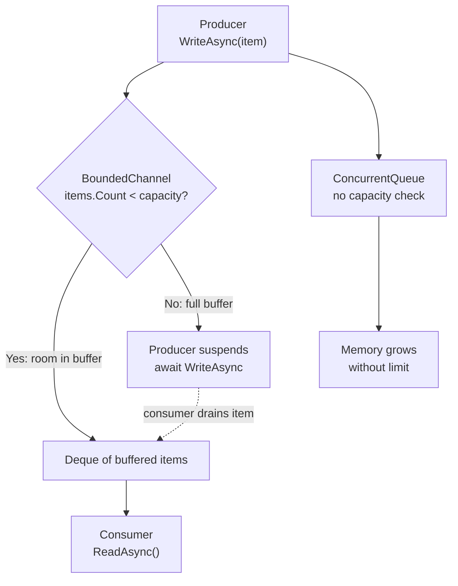
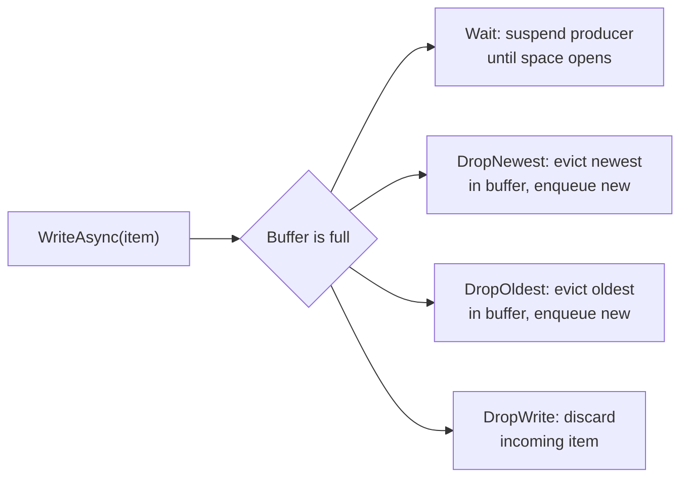

**TL;DR:** Does your channel slow down the producer when the consumer falls behind? A bounded channel blocks the writer's `WriteAsync` the instant the internal deque hits capacity — that's backpressure. An unbounded channel never blocks because its `ConcurrentQueue` has no capacity check — a fast producer with a slow consumer will allocate items until the process runs out of memory. The runtime gives you both choices; the production consequences are entirely your problem.

> **In plain English (30 sec):** Code you already write — Map, function, API call, just bigger.

## 1. The Engineering Problem

Building a producer-consumer pipeline in .NET used to mean choosing between a `BlockingCollection<T>` (heavy, `SemaphoreSlim` + `Monitor` per operation) or rolling your own `ConcurrentQueue<T>` with manual signaling via `ManualResetEventSlim`. Both paths had the same blind spot: there was no built-in way to tell a producer "slow down, the consumer can't keep up."

**Unbounded growth kills production systems.** If you connect a fast producer (message broker ingestion, log forwarding, high-frequency telemetry) to a slow consumer (database writes, HTTP calls) through an unbounded queue, the queue grows without limit. Every item the producer pushes is a `T` on the heap. In a sustained traffic spike, the GC can't keep up, Gen 2 collections spike, memory pressure triggers page faults, and the process gets OOM-killed. The queue itself isn't the bottleneck — it's the absence of a speed bump.

**Blocking the thread pool is the opposite failure.** The naive fix is to use `BlockingCollection<T>` with a bounded capacity. But `BlockingCollection` blocks the calling thread via `SemaphoreSlim.Wait` — if you're on an ASP.NET request thread or in a synchronous hot path, you've just tied up a thread pool thread doing nothing while waiting for the consumer to drain. That's exactly the thread-pool exhaustion problem that `async/await` was designed to eliminate, and a blocking collection reintroduces it.

What was needed was a channel that could block a *producer* at the async level — suspending the `async Task WriteAsync` without blocking a thread — when the buffer fills, while simultaneously allowing the *consumer* to drain at its own pace. Backpressure should be a first-class API, not something bolted on with `SemaphoreSlim` and manual `Monitor.Wait`.

## 2. The Technical Solution

`System.Threading.Channels` solves this with two concrete types — `BoundedChannel<T>` and `UnboundedChannel<T>` — sharing the same `Channel<T>` base class but diverging in exactly one dimension: **whether `WriteAsync` can suspend when the buffer is full.**



The left path (bounded) is backpressure: the producer suspends when the deque is full, and resumes only when the consumer reads an item. The right path (unbounded) is the danger zone: items enqueue without limit because there is no capacity check anywhere in the write path.

### The four full-buffer modes

`BoundedChannel` doesn't just block — it lets you choose *what happens* when the buffer is full via `BoundedChannelFullMode`:



The default is `Wait` — true backpressure. The drop modes are for cases where freshness matters more than completeness: a telemetry stream where only the latest readings matter, or a status channel where intermediate states are meaningless.

### Why unbounded can't backpressure

`UnboundedChannel<T>` uses a `ConcurrentQueue<T>` and never checks capacity. Its `TryWrite` method has no capacity guard — it just enqueues. Its `WaitToWriteAsync` always returns `true` (unless the channel is completed). There is no mechanism to suspend a producer. The queue grows until GC pressure or OOM.

## 3. The clean example (concept in isolation)

Here is the conceptual difference — a bounded channel throttling a fast producer, versus an unbounded channel letting it run unchecked:

```csharp
// Bounded: producer is throttled when buffer fills.
var bounded = Channel.CreateBounded<int>(capacity: 100);

// Producer task — WriteAsync suspends when 100 items are buffered
await foreach (var batch in ProduceBatchesAsync())
{
    await bounded.Writer.WriteAsync(batch);  // blocks here if consumer is slow
}

// Consumer task — drains at its own pace
await foreach (var item in bounded.Reader.ReadAllAsync())
{
    await ProcessAsync(item);  // slow database call
}
```

```csharp
// Unbounded: producer runs without throttle — memory grows forever.
var unbounded = Channel.CreateUnbounded<int>();

// Producer task — TryWrite never fails, never suspends
await foreach (var batch in ProduceBatchesAsync())
{
    unbounded.Writer.TryWrite(batch);  // always succeeds — no backpressure
}

// Consumer task — same drain, same pace
await foreach (var item in unbounded.Reader.ReadAllAsync())
{
    await ProcessAsync(item);
}
```

The producer code is identical. The difference is whether `WriteAsync` *can* suspend. With bounded, the `await` on `WriteAsync` is a real suspension point — the producer task yields its thread back to the pool until the consumer drains an item. With unbounded, `TryWrite` always returns `true`, the producer never yields, and items accumulate without limit.

## 4. Production reality (from the real repo)

The actual implementation lives in `dotnet/runtime`'s `System.Threading.Channels` library:

```
runtime/src/libraries/System.Threading.Channels/src/System/Threading/Channels/
├── BoundedChannel.cs         — bounded channel with backpressure
├── UnboundedChannel.cs       — unbounded channel (no capacity check)
├── Channel.cs                — static factory: CreateBounded / CreateUnbounded
└── BoundedChannelFullMode.cs — the four full-buffer behaviors
```

**`BoundedChannel<T>` — the deque and the blocked-writer linked list.** The bounded channel stores items in a `Deque<T>` and tracks blocked writers in a singly-linked list. When `WriteAsync` finds the deque full and mode is `Wait`, it enqueues a `BlockedWriteAsyncOperation<T>` on `_blockedWritersHead` and suspends. When the consumer dequeues an item, it walks the blocked-writer list and completes exactly one writer:

```csharp
// From BoundedChannel.cs — TryWrite, the full-buffer branch.
// When the deque is full and mode is Wait, the write fails synchronously.
// When mode is DropNewest/DropOldest, the eviction happens inline.
else if (parent._mode == BoundedChannelFullMode.Wait)
{
    // The channel is full and we're in a wait mode.
    // Simply exit and let the caller know we didn't write the data.
    return false;
}
else if (parent._mode == BoundedChannelFullMode.DropWrite)
{
    // The channel is full.  Just ignore the item being added
    // but say we added it.
    Monitor.Exit(parent.SyncObj);
    releaseLock = false;
    parent._itemDropped?.Invoke(item);
    return true;
}
else
{
    // The channel is full, and we're in a dropping mode.
    // Drop either the oldest or the newest
    T droppedItem = parent._mode == BoundedChannelFullMode.DropNewest ?
        parent._items.DequeueTail() :
        parent._items.DequeueHead();

    parent._items.EnqueueTail(item);

    Monitor.Exit(parent.SyncObj);
    releaseLock = false;
    parent._itemDropped?.Invoke(droppedItem);

    return true;
}
```

When the consumer reads and the buffer drops below capacity, it walks the blocked-writer list to resume exactly one suspended producer. This is the backpressure valve:

```csharp
// From BoundedChannel.cs — DequeueItemAndPostProcess.
// After dequeuing an item, if there are blocked writers, promote one.
while (ChannelUtilities.TryDequeue(ref parent._blockedWritersHead, out BlockedWriteAsyncOperation<T>? w))
{
    if (w.TrySetResult(default))
    {
        parent._items.EnqueueTail(w.Item!);
        return item;
    }
}
```

**`UnboundedChannel<T>` — ConcurrentQueue, no capacity check.** The unbounded variant uses `ConcurrentQueue<T>` and has no blocked-writer list at all. `TryWrite` always enqueues and returns `true`. `WaitToWriteAsync` always returns `true` unless the channel is completed:

```csharp
// From UnboundedChannel.cs — WaitToWriteAsync.
// An unbounded channel can always accept writes (unless completed).
public override ValueTask<bool> WaitToWriteAsync(CancellationToken cancellationToken)
{
    Exception? doneWriting = _parent._doneWriting;
    return
        cancellationToken.IsCancellationRequested ? new ValueTask<bool>(Task.FromCanceled<bool>(cancellationToken)) :
        doneWriting is null ? new ValueTask<bool>(true) : // unbounded writing can always be done if we haven't completed
        doneWriting != ChannelUtilities.s_doneWritingSentinel ? new ValueTask<bool>(Task.FromException<bool>(doneWriting)) :
        default;
}
```

**`Channel.cs` — the factory.** `CreateBounded` routes to `BoundedChannel<T>` for capacity > 0, or `RendezvousChannel<T>` for capacity == 0 (synchronous handoff, no buffer at all). `CreateUnbounded` routes to `UnboundedChannel<T>` or its single-reader optimized variant:

```csharp
// From Channel.cs — the factory methods.
public static Channel<T> CreateBounded<T>(int capacity) =>
    capacity > 0 ? new BoundedChannel<T>(capacity, BoundedChannelFullMode.Wait, runContinuationsAsynchronously: true, itemDropped: null) :
    capacity == 0 ? new RendezvousChannel<T>(BoundedChannelFullMode.Wait, runContinuationsAsynchronously: true, itemDropped: null) :
    throw new ArgumentOutOfRangeException(nameof(capacity));
```

What this teaches that a hello-world can't:

- **Backpressure is a linked-list suspension, not a `SemaphoreSlim.Wait`.** `BoundedChannel` doesn't block a thread when the buffer is full — it enqueues a `BlockedWriteAsyncOperation<T>` on `_blockedWritersHead` and returns an incomplete `ValueTask`. The producer's thread is freed. When the consumer drains an item, `DequeueItemAndPostProcess` walks the blocked-writer list and completes exactly one writer via `TrySetResult`, moving the writer's item directly into the deque. This is lock-free on the consumer side after the initial `lock` scope.
- **The `Deque<T>` vs `ConcurrentQueue<T>` choice is the backpressure boundary.** `BoundedChannel` uses `Deque<T>` (requires lock for all operations) because it needs head and tail eviction for `DropOldest`/`DropNewest`. `UnboundedChannel` uses `ConcurrentQueue<T>` (lock-free for enqueue/dequeue) because it never needs to evict — the performance trade-off is deliberate: lock-free fast path when there's no capacity concern, lock-protected path when eviction logic requires atomic deque-head-tail operations.
- **Capacity 0 creates a `RendezvousChannel` — synchronous handoff with zero buffer.** The producer suspends until the consumer is ready to receive the item directly. This is useful for request-response patterns where you don't want any intermediate buffering at all.

## 5. Review checklist

- If a channel carries data between a fast producer and a slow consumer, confirm it's bounded — an unbounded channel in a sustained-throughput scenario will cause GC pressure and eventual OOM, with no visible error until it's too late.
- When choosing `BoundedChannelFullMode`, match the mode to the data semantics: `Wait` for ordered pipelines where every item matters; `DropOldest` for status/telemetry where only the latest state matters; `DropNewest` for burst-absorption where recent data can be sacrificed; `DropWrite` when the producer must never block and can tolerate silent loss.
- If `WaitToWriteAsync` is used as the throttle signal (check-then-write pattern), confirm the consumer is actually draining — a deadlocked consumer means `WaitToWriteAsync` never completes and the producer hangs forever.
- If the channel is created with `RunContinuationsAsynchronously: false` (the non-default), verify no continuation runs on a thread that holds the channel's internal lock — the `AssertInvariants` debug method enforces this invariant with `Debug.Assert` but it's only checked in DEBUG builds.
- Check whether `SingleReader: true` is set in `UnboundedChannelOptions` — this switches from `UnboundedChannel<T>` to `SingleConsumerUnboundedChannel<T>`, which uses a simpler single-consumer fast path and avoids some synchronization overhead.

## 6. FAQ

**Q: What happens if I call `TryWrite` on a full bounded channel?**
A: It returns `false` immediately. `TryWrite` never suspends — it's a synchronous check. Use `WriteAsync` if you want the producer to suspend until space opens (the default `Wait` mode). In `DropNewest`, `DropOldest`, or `DropWrite` modes, `TryWrite` succeeds even when full by evicting or discarding items.

**Q: Can I change the capacity of a bounded channel after creation?**
A: No. `_bufferedCapacity` is set once in the constructor and never mutated. If you need a dynamic limit, create a new channel and migrate producers/consumers.

**Q: What's the difference between `ReadAsync` and `WaitToReadAsync`?**
A: `ReadAsync` dequeues an item (or suspends if empty). `WaitToReadAsync` returns a `ValueTask<bool>` that completes when an item *might* be available — it doesn't dequeue, it just signals "there's something to read." Use `WaitToReadAsync` in an `await foreach` pattern or a `while` loop where you want to check availability before committing to a dequeue.

**Q: Why does `BoundedChannel` use `Deque<T>` instead of `Queue<T>`?**
A: Because `DropOldest` needs to dequeue from the head and `DropNewest` needs to dequeue from the tail — `Queue<T>` only supports head dequeue. The `Deque<T>` provides O(1) `EnqueueTail`, `DequeueHead`, and `DequeueTail`, which are all three operations the four full-buffer modes require.

**Q: Is `RendezvousChannel` (capacity 0) just a `Task<T>` handoff?**
A: Essentially yes. With capacity 0, there's no buffer — the producer's `WriteAsync` suspends until the consumer's `ReadAsync` picks up the item directly. It's a synchronous rendezvous: both sides must be ready for the transfer to complete. Useful for request-response patterns where intermediate buffering would add latency without benefit.

---

## Source

- **Concept:** Backpressure via bounded channels — `System.Threading.Channels` in .NET
- **Domain:** dotnet
- **Repo:** [dotnet/runtime](https://github.com/dotnet/runtime) → [`src/libraries/System.Threading.Channels/src/System/Threading/Channels/BoundedChannel.cs`](https://github.com/dotnet/runtime/blob/main/src/libraries/System.Threading.Channels/src/System/Threading/Channels/BoundedChannel.cs), [`UnboundedChannel.cs`](https://github.com/dotnet/runtime/blob/main/src/libraries/System.Threading.Channels/src/System/Threading/Channels/UnboundedChannel.cs), [`Channel.cs`](https://github.com/dotnet/runtime/blob/main/src/libraries/System.Threading.Channels/src/System/Threading/Channels/Channel.cs), and [`BoundedChannelFullMode.cs`](https://github.com/dotnet/runtime/blob/main/src/libraries/System.Threading.Channels/src/System/Threading/Channels/BoundedChannelFullMode.cs) — the runtime's own channel implementations.


