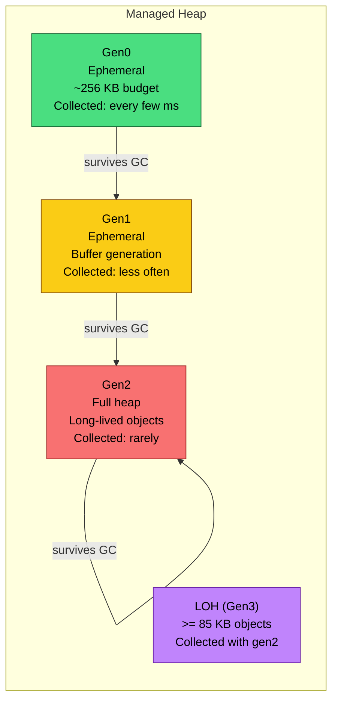
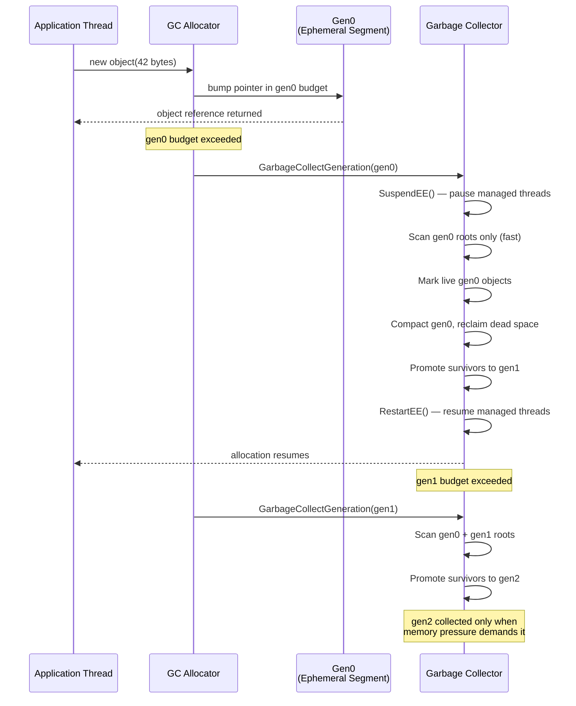

**TL;DR:** Does the .NET GC scan the entire managed heap every time it runs? No — it divides objects into generations (gen0, gen1, gen2) based on survival age, collecting the youngest generation most frequently because short-lived objects die fast, while long-lived objects are promoted upward and collected rarely. This is why a gen0 collection takes microseconds, not milliseconds.
> **In plain English (30 sec):** Think of this like concepts you already use, but in a production system at scale.


## 1. The Engineering Problem

Without generational collection, every garbage collection must walk the entire managed heap — every live object, every dead object, every pointer. For a process with 200 MB of managed memory, that means scanning 200 MB of pointers on *every* collection, even if 90% of the garbage was created in the last millisecond.

This creates two production-killing bottlenecks:

**Wasted work on short-lived garbage.** In most applications, the overwhelming majority of objects are short-lived — iterators, temporary strings, request-scoped DTOs, LINQ enumeration results. These objects die within the method that created them. A non-generational collector treats them identically to long-lived singletons and connection pools, scanning their memory with equal thoroughness. The cost is proportional to total heap size, not to the amount of actual garbage.

**Unbounded pause times on large heaps.** A web server handling 10,000 concurrent requests might have 500 MB of live managed objects. Without generational separation, every GC pauses all managed threads while it scans the full 500 MB. The pause time grows linearly with heap size — a server that scales to more traffic actually gets *worse* GC behavior as it grows.

What was needed was a collector that could reclaim the vast majority of garbage (the short-lived objects) by examining only a small slice of the heap, reserving full-heap scans for the rare case where long-lived objects actually die.

## 2. The Technical Solution

The .NET GC solves this by dividing the managed heap into **generations** — logical age groups that let the collector exploit the weak generational hypothesis: objects that have survived many collections are likely to survive more, and objects that were recently allocated are likely to die soon.

For small objects (under 85,000 bytes), there are three generations:

- **Gen0** — newly allocated objects. Collected most frequently. This is where almost all garbage dies.
- **Gen1** — objects that survived one gen0 collection. A buffer generation that protects gen2 from premature collection.
- **Gen2** — objects that survived a gen1 collection. Collected least frequently. Long-lived objects live here.

Large objects (≥ 85,000 bytes) go directly to the **Large Object Heap (LOH)**, treated as gen3. Pinned objects get their own **Pinned Object Heap (POH)**. Both are only collected during full (gen2) collections.

The key insight: **collecting a generation means collecting that generation plus all younger generations.** A gen1 collection also collects gen0. A gen2 collection collects everything. But a gen0 collection *only* looks at gen0 — the fastest, smallest scan.



When a GC is triggered, the runtime must decide *which* generation to collect. This decision depends on three factors: which generation's allocation budget was exceeded, the fragmentation level of each generation, and the current memory pressure on the machine. The allocator tracks how much memory has been allocated since the last collection for each generation — when a generation's budget is exceeded, a GC targeting that generation is triggered.

The physical layout follows a simple rule: **there is always exactly one ephemeral segment** containing gen0 and gen1, while gen2 can span zero or more additional segments. The allocator always bump-allocates into gen0 on the ephemeral segment. When gen0 fills its budget, a gen0 collection runs. If that collection doesn't free enough, the GC escalates to gen1. If gen1 doesn't free enough, it escalates to gen2.



Three architectural details make this work in practice:

**The allocation budget is dynamic, not fixed.** Each generation's budget is adjusted based on survival rates — if gen0 objects survive at a high rate, the budget increases so collections happen less often (and the surviving objects get promoted with less overhead). The `dynamic_data_table` in the runtime tracks per-generation statistics and adjusts budgets via smoothing algorithms.

**Card tables enable cross-generational references without scanning the whole heap.** When an old-generation object (gen2) holds a reference to a young-generation object (gen0), the JIT write barrier sets a *card* — a byte in a side table marking that region of the heap as potentially interesting. During ephemeral collections, the GC only examines cards to find old-to-young references, avoiding a full gen2 scan.

**Server GC gives each logical processor its own heap.** On multi-core servers, `gc_heap` instances are replicated per processor (controlled by `n_heaps`), each with its own generation segments, allocation contexts, and free lists. This eliminates allocation contention between threads and lets GC phases run in parallel across heaps.

## 3. The clean example (concept in isolation)

Stripped of the OS-level segment management and write barrier plumbing, here is the conceptual shape of generational promotion — a budget-exceeding allocation triggering the appropriate collection level:

```csharp
// Conceptual shape of .NET's generational GC trigger logic.
// This is NOT the real code — it's a simplified illustration of the budget model.

public class GenerationalHeap
{
    private readonly long[] _generationBudgets = [256_1024, 1024 * 1024, long.MaxValue];
    private readonly long[] _allocatedSinceLastGC = new long[3];
    private readonly List<object[]> _generations = [[], [], []];

    public T Allocate<T>(T obj) where T : class
    {
        // All small objects allocate into gen0
        int generation = 0;
        _allocatedSinceLastGC[generation] += IntPtr.Size + 40;

        _generations[generation].Add(obj);

        if (_allocatedSinceLastGC[generation] >= _generationBudgets[generation])
        {
            Collect(generation);  // trigger GC for this generation
        }

        return obj;
    }

    private void Collect(int maxGeneration)
    {
        // Collect all generations from 0 up to maxGeneration
        for (int gen = 0; gen <= maxGeneration; gen++)
        {
            var surviving = new List<object[]>();

            foreach (var obj in _generations[gen])
            {
                if (IsAlive(obj))
                {
                    // Promotion: survivor moves to the next generation
                    int targetGen = Math.Min(gen + 1, 2);
                    _generations[targetGen].Add(obj);
                }
            }

            _generations[gen].Clear();
            _allocatedSinceLastGC[gen] = 0;
        }

        // Recalculate budget based on survival rates
        for (int gen = 0; gen <= maxGeneration; gen++)
        {
            int survivalRate = _generations[gen].Count;
# ... (1 lines omitted)
```

The original application code this serves would look like:

```csharp
// Hot path: millions of short-lived objects per second
for (int i = 0; i < 1_000_000; i++)
{
    var request = new RequestDto { Id = i };       // ← allocated in gen0
    var result = Process(request);                  // ← request becomes garbage immediately
    Console.WriteLine(result);
}
```

The `RequestDto` objects are allocated into gen0. Most die immediately after `Process` returns. A gen0 collection reclaims them in microseconds by scanning only the small gen0 budget region — it never touches gen1 or gen2. If a `RequestDto` somehow survives (captured by a long-lived event handler), it promotes to gen1, then gen2, where it will be scanned only during infrequent full collections.

## 4. Production reality (from the real repo)

The actual CLR GC implementation lives in a single 100K+ line C++ file. The generation-to-object-heap mapping is a critical piece — it defines how the internal generation numbers (`soh_gen0`, `soh_gen1`, `soh_gen2`, `loh_generation`, `poh_generation`) map to the three object heap categories:

```
runtime/src/coreclr/gc/gc.cpp — generation-to-object-heap mapping
```

```c++
gc_oh_num gen_to_oh(int gen)
{
    switch (gen)
    {
        case soh_gen0:
            return gc_oh_num::soh;
        case soh_gen1:
            return gc_oh_num::soh;
        case soh_gen2:
            return gc_oh_num::soh;
        case loh_generation:
            return gc_oh_num::loh;
        case poh_generation:
            return gc_oh_num::poh;
        default:
            assert(false);
            return gc_oh_num::unknown;
    }
}
```

This mapping reveals the physical truth: gen0, gen1, and gen2 all belong to the **same object heap** (SOH — Small Object Heap). They are logical divisions within contiguous heap segments, not separate memory regions. LOH and POH are genuinely separate heaps with their own segment chains.

The heap initialization code builds the generation table by walking the small object heap segment and placing generation boundaries at marker objects:

```c++
// runtime/src/coreclr/gc/gc.cpp — heap initialization

heap_segment* seg = make_initial_segment (soh_gen0, h_number, __this);

uint8_t*  start = heap_segment_mem (seg);

for (int i = max_generation; i >= 0; i--)
{
    make_generation (i, seg, start);
    start += Align (min_obj_size);
}

heap_segment_allocated (seg) = start;
alloc_allocated = start;
ephemeral_heap_segment = seg;

// Create segments for the large and pinned generations
heap_segment* lseg = make_initial_segment(loh_generation, h_number, __this);
lseg->flags |= heap_segment_flags_loh;

heap_segment* pseg = make_initial_segment (poh_generation, h_number, __this);
pseg->flags |= heap_segment_flags_poh;

make_generation (loh_generation, lseg, heap_segment_mem (lseg));
make_generation (poh_generation, pseg, heap_segment_mem (pseg));

for (int gen_num = 0; gen_num < total_generation_count; gen_num++)
{
    generation*  gen = generation_of (gen_num);
    make_unused_array (generation_allocation_start (gen), Align (min_obj_size));
}
```

The allocation states and GC reasons exposed via ETW tracing tell the full story of when and why collections happen:

```c++
// runtime/src/coreclr/gc/gc.cpp — allocation state machine and GC reasons

static const char* const allocation_state_str[] = {
    "start",
    "can_allocate",
    "cant_allocate",
    "retry_allocate",
    "try_fit",
    "try_fit_new_seg",
    "try_fit_after_cg",        // CG = collection of older generation
    "try_fit_after_bgc",       // BGC = background (concurrent) GC
    "try_fit_full_seg_in_bgc",
    "try_free_after_bgc",
    "try_seg_end",
    "acquire_seg",
    "trigger_full_compact_gc",
    "trigger_ephemeral_gc",
    "trigger_2nd_ephemeral_gc",
    "check_retry_seg"
};

static const char* const str_gc_reasons[] =
{
    "alloc_soh",               // gen0 budget exceeded during SOH allocation
    "induced",                 // explicit GC.Collect() call
    "lowmem",                  // OS signaled low memory
    "empty",                   // heap is empty (startup path)
    "alloc_loh",               // LOH budget exceeded
    "oos_soh",                 // out-of-space on SOH segment
    "oos_loh",                 // out-of-space on LOH segment
    "induced_noforce",
    "gcstress",
    "induced_lowmem",
    "induced_compacting",
    "lowmemory_host",
    "pm_full_gc",
    "lowmemory_host_blocking"
};
```

The `alloc_soh` reason is by far the most common in production — it means a gen0 budget was exhausted during normal small-object allocation, triggering an ephemeral collection. The state machine walks through `try_fit` → `try_fit_new_seg` → `try_fit_after_cg` as it attempts to find space, escalating to more aggressive collection levels when simpler ones don't free enough.

What this teaches that a hello-world can't:

- **The three SOH generations share a single segment chain** — they are logical partitions, not physically separate memory. The `make_generation` loop places marker objects (min-size "unused arrays") at boundaries within the same `heap_segment`, and the GC uses those markers to know where gen0 ends and gen1 begins.
- **The allocation state machine is the real trigger** — `allocation_state_str` is the state machine that decides whether to allocate on the current segment, request a new segment, or trigger a collection. The transition from `can_allocate` to `cant_allocate` to `trigger_ephemeral_gc` is the path every allocation takes when gen0 runs out.
- **Budget smoothing prevents oscillation** — the `smoothed_desired_total` array applies exponential smoothing to generation budgets, preventing a scenario where a single high-survival gen0 collection wildly inflates the budget, causing the next collection to scan a much larger region.
- **Background GC is a separate thread, not a pause** — the `bgc_thread` runs marking concurrently with application threads, only pausing briefly at the beginning and end. The `c_gc_state` enum tracks whether the background GC is free, marking, or sweeping, and ephemeral foreground GCs can run on application threads while the background GC marks gen2.

## 5. Review checklist

- If a gen0 collection takes more than a few milliseconds, check the gen0 budget — it may have been inflated by high survival rates from a preceding gen1 collection. Use `dotnet-counters` to monitor `gen-0-gc-count` and `gen-0-size`.
- If you see `alloc_soh` as the dominant GC reason in ETW traces (`Microsoft.Diagnostics.Tracing.TraceEvent`), that's normal — it means the GC is triggering on budget, not on segment exhaustion or memory pressure.
- If gen1 collections are happening frequently, objects are surviving gen0 at a higher rate than expected — look for short-lived references being captured by long-lived delegates, event handlers, or static collections that promote them one generation too early.
- If `gen2-gc-count` is climbing, long-lived objects are actually dying — this is expensive because gen2 collects the entire heap. Check for unnecessary object retention in caches, pools, or connection objects.
- The `GC.GetGeneration(object)` API can confirm which generation an object currently lives in — useful for diagnosing unexpected promotion. An object that should be gen0 but is in gen1 has survived at least one collection.

## 6. FAQ

**Q: Why does gen0 have a small budget (around 256 KB) while gen2 can grow to hundreds of MB?**
A: The gen0 budget is intentionally small because gen0 collections are cheap — scanning a small region takes microseconds. The budget forces frequent collections that reclaim the vast majority of garbage quickly. Gen2's budget is effectively unbounded because collecting it is expensive (full heap scan), so the runtime waits until it's actually needed.

**Q: What happens when gen0 collection doesn't free enough memory?**
A: The GC escalates. If gen0 doesn't free enough to satisfy the allocation, a gen1 collection runs (which also collects gen0). If that's still insufficient, a gen2 collection runs — the most expensive option that scans the entire heap including LOH. The `trigger_ephemeral_gc` and `trigger_2nd_ephemeral_gc` states in the allocation state machine handle this escalation.

**Q: Why are large objects (≥ 85 KB) treated separately?**
A: Compacting large objects is expensive — it requires copying large memory blocks and updating all references to them. Moving a 1 MB object during compaction costs orders of magnitude more than moving a 32-byte object. So the LOH avoids compaction by default and is only collected during gen2 collections, where the cost is amortized against the full-heap scan.

**Q: Can I force a specific generation to be collected?**
A: `GC.Collect(0)` targets gen0 only, `GC.Collect(1)` targets gen0+gen1, and `GC.Collect(2)` targets everything including LOH. In production, the runtime's own budget-based triggering is almost always better than manual collection — explicit calls can disrupt the budget smoothing and cause suboptimal collection patterns.

**Q: What is the difference between Server GC and Workstation GC?**
A: Workstation GC uses a single heap with one GC thread, optimized for low-latency desktop apps. Server GC creates one heap per logical processor (`n_heaps`), each with its own GC thread and allocation contexts, enabling parallel collection and eliminating allocation contention. Server GC is the default for ASP.NET and services; Workstation GC is the default for desktop apps.

---

## Source

- **Concept:** Generational garbage collection in the .NET CLR — the weak generational hypothesis applied to managed memory
- **Domain:** dotnet
- **Repo:** [dotnet/runtime](https://github.com/dotnet/runtime) → [`src/coreclr/gc/gc.cpp`](https://github.com/dotnet/runtime/blob/main/src/coreclr/gc/gc.cpp) — the CLR GC implementation containing generation initialization, allocation state machine, and GC trigger logic; [`docs/design/coreclr/botr/garbage-collection.md`](https://github.com/dotnet/runtime/blob/main/docs/design/coreclr/botr/garbage-collection.md) — the official GC design document by Maoni Stephens explaining generational architecture, the allocation budget, and the mark/plan/compact/sweep phases.


