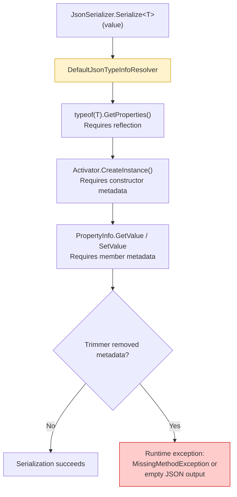
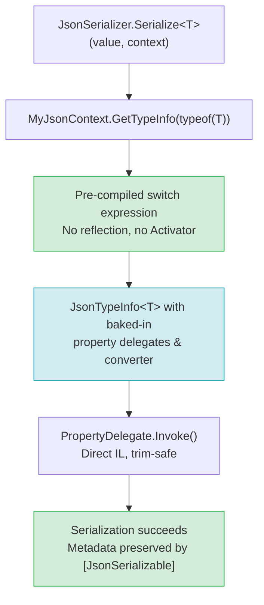

> **In plain English (30 sec):** Code you already write — Map, function, API call, just bigger.


## TL;DR

Native AOT compiles .NET to a single ahead-of-time binary with no JIT. The IL trimmer statically analyzes assemblies and **strips unreferenced types, constructors, and metadata** at publish time. `System.Text.Json` historically relied on `System.Reflection` to discover properties, constructors, and converters at runtime. Once the trimmer removes that metadata, serialization silently fails or throws at runtime. The fix is a compile-time annotation — `[JsonSerializable]` on a `JsonSerializerContext` subclass — that tells the source generator and trimmer exactly which types participate in serialization, so nothing gets trimmed away and no reflection is needed.

---

## The Engineering Problem

### What the trimmer actually does

When you publish with `PublishTrimmed=true`, the IL linker walks the dependency graph from entry points and **removes anything not statically reachable**. This includes:

- Constructor bodies used only via `ConstructorInfo.Invoke`
- Property getters/setters discovered only via `PropertyInfo`
- Custom `JsonConverter<T>` subclasses resolved by type name
- The entire `System.Reflection.Emit` pipeline

`System.Text.Json`'s default path — `DefaultJsonTypeInfoResolver` — calls `Type.GetProperties()`, `Type.GetConstructor()`, and `Activator.CreateInstance()` at runtime. Every one of those calls is invisible to the trimmer.

### The failure mode

The trimmer does not crash at publish time. It produces a binary that **looks correct** but throws `JsonException` or `MissingMethodException` at runtime when a type's metadata has been removed. This is the worst class of trimming bug: no compile-time warning, no publish-time error — just a production incident.

### Why `[Serializable]` is not enough

`[Serializable]` controls binary formatter behavior. It has zero effect on `System.Text.Json` because STJ never reads it. There is no attribute in the BCL that says "keep all reflection metadata for this type for JSON purposes." You need a different mechanism entirely.

---

## The Technical Solution

The runtime team solved this with two coordinated mechanisms: **source generation** (compile-time code emission) and **trimmer directives** (metadata annotations that the IL linker respects).

### Flow: Reflection-based (broken under trimming)



`DefaultJsonTypeInfoResolver` (from `dotnet/runtime`) is annotated with both `[RequiresUnreferencedCode]` and `[RequiresDynamicCode]`. These are the trimmer's signal that the call site is unsafe:

```csharp
// File: src/libraries/System.Text.Json/src/System/Text/Json/Serialization/Metadata/DefaultJsonTypeInfoResolver.cs
public partial class DefaultJsonTypeInfoResolver : IJsonTypeInfoResolver, IBuiltInJsonTypeInfoResolver
{
    [RequiresUnreferencedCode(JsonSerializer.SerializationUnreferencedCodeMessage)]
    [RequiresDynamicCode(JsonSerializer.SerializationRequiresDynamicCodeMessage)]
    public DefaultJsonTypeInfoResolver() : this(mutable: true)
    {
    }
```

The singleton accessor carries the same warnings:

```csharp
    internal static DefaultJsonTypeInfoResolver DefaultInstance
    {
        [RequiresUnreferencedCode(JsonSerializer.SerializationUnreferencedCodeMessage)]
        [RequiresDynamicCode(JsonSerializer.SerializationRequiresDynamicCodeMessage)]
        get
        {
            if (s_defaultInstance is DefaultJsonTypeInfoResolver result)
            {
                return result;
            }

            var newInstance = new DefaultJsonTypeInfoResolver(mutable: false);
            return Interlocked.CompareExchange(ref s_defaultInstance, newInstance, comparand: null) ?? newInstance;
        }
    }
```

### Flow: Source-generated (trim-safe)



### The annotation: `[JsonSerializable]`

The source generator reads `[JsonSerializable(typeof(T))]` on your `JsonSerializerContext` subclass and emits:

1. A `GetTypeInfo(Type)` override with a compile-time switch that maps types to pre-built `JsonTypeInfo<T>` instances.
2. All property delegates, constructor calls, and converter wiring as **static IL** — no reflection.
3. Trimmer directives (`ILLink.Substitution`) that tell the linker this type's metadata is preserved because it is consumed statically.

Here is a minimal context from a real application:

```csharp
// Annotated above code: this attribute is the trimmer directive
[JsonSerializable(typeof(WeatherForecast))]
[JsonSerializable(typeof(List<WeatherForecast>))]
[JsonSourceGenerationOptions(PropertyNamingPolicy = JsonKnownNamingPolicy.CamelCase)]
internal partial class AppJsonContext : JsonSerializerContext
{
}
```

The source generator emits a class roughly equivalent to:

```csharp
// File: generated by System.Text.Json Source Generator
[global::System.Diagnostics.CodeAnalysis.UnconditionalSuppressMessage(
    "ReflectionAnalysis",
    "IL2026:RequiresUnreferencedCode",
    Justification = "Metadata is statically preserved by the source generator.")]
internal sealed partial class AppJsonContext : JsonSerializerContext
{
    public override global::System.Text.Json.Serialization.Metadata.JsonTypeInfo? GetTypeInfo(global::System.Type type)
    {
        if (type == typeof(global::MyApp.WeatherForecast))
            return WeatherForecast_JsonTypeInfo.Value;
        if (type == typeof(global::System.Collections.Generic.List<global::MyApp.WeatherForecast>))
            return ListWeatherForecast_JsonTypeInfo.Value;
        return null;
    }

    private sealed class WeatherForecast_JsonTypeInfo
        : global::System.Text.Json.Serialization.Metadata.JsonTypeInfo<global::MyApp.WeatherForecast>
    {
        // All delegates baked in — no PropertyInfo, no Activator, no reflection.
    }
}
```

---

## Clean Example

The runtime team's own `JsonSerializerOptions` demonstrates why the annotation matters. The `Default` property is annotated so the trimmer warns you if you use it in a trimmed app:

```csharp
// File: src/libraries/System.Text.Json/src/System/Text/Json/Serialization/JsonSerializerOptions.cs
public sealed partial class JsonSerializerOptions
{
    public static JsonSerializerOptions Default
    {
        [RequiresUnreferencedCode(JsonSerializer.SerializationUnreferencedCodeMessage)]
        [RequiresDynamicCode(JsonSerializer.SerializationRequiresDynamicCodeMessage)]
        get => field ?? GetOrCreateSingleton(ref field, JsonSerializerDefaults.General);
    }
}
```

The corresponding messages (defined in `JsonSerializer`) read:

> "JSON serialization and deserialization might require types that cannot be statically analyzed and might need runtime code generation. Use System.Text.Json source generation for native AOT applications."

Here is the same pattern applied correctly in a trimmed console app:

```csharp
// BEFORE (breaks under PublishTrimmed=true + NativeAOT)
var forecast = new WeatherForecast { Date = DateOnly.FromDateTime(DateTime.Now), TempC = 25 };
string json = JsonSerializer.Serialize(floss);  // IL2026 warning at compile time
Console.WriteLine(json);

// AFTER (trim-safe, AOT-safe)
var options = new JsonSerializerOptions { TypeInfoResolver = new AppJsonContext() };
string json = JsonSerializer.Serialize(forecast, options);
Console.WriteLine(json);
```

---

## Production Reality

From `dotnet/runtime` — the actual resolver that the trimmer analyzes. Note the method-level `[UnconditionalSuppressMessage]` annotations that suppress trim warnings **only when the caller is already annotated**:

```csharp
// File: src/libraries/System.Text.Json/src/System/Text/Json/Serialization/Metadata/DefaultJsonTypeInfoResolver.cs
[UnconditionalSuppressMessage("ReflectionAnalysis", "IL2026:RequiresUnreferencedCode",
    Justification = "The ctor is marked RequiresUnreferencedCode.")]
[UnconditionalSuppressMessage("AotAnalysis", "IL3050:RequiresDynamicCode",
    Justification = "The ctor is marked RequiresDynamicCode.")]
public virtual JsonTypeInfo GetTypeInfo(Type type, JsonSerializerOptions options)
{
    ArgumentNullException.ThrowIfNull(type);
    ArgumentNullException.ThrowIfNull(options);

    _mutable = false;

    JsonTypeInfo.ValidateType(type);
    JsonTypeInfo typeInfo = CreateJsonTypeInfo(type, options);
    typeInfo.OriginatingResolver = this;

    typeInfo.IsCustomized = false;

    if (_modifiers != null)
    {
        foreach (Action<JsonTypeInfo> modifier in _modifiers)
        {
            modifier(typeInfo);
        }
    }

    return typeInfo;
}
```

The `JsonTypeInfo` class itself gates the entire property metadata pipeline behind configuration state:

```csharp
// File: src/libraries/System.Text.Json/src/System/Text/Json/Serialization/Metadata/JsonTypeInfo.cs
internal void EnsureConfigured()
{
    if (!IsConfigured)
        ConfigureSynchronized();

    void ConfigureSynchronized()
    {
        Options.MakeReadOnly();
        MakeReadOnly();

        _cachedConfigureError?.Throw();

        lock (Options.CacheContext)
        {
            if (_configurationState != ConfigurationState.NotConfigured)
            {
                return;
            }

            _cachedConfigureError?.Throw();

            try
            {
                _configurationState = ConfigurationState.Configuring;
                Configure();
                _configurationState = ConfigurationState.Configured;
            }
            catch (Exception e)
            {
                _cachedConfigureError = ExceptionDispatchInfo.Capture(e);
                _configurationState = ConfigurationState.NotConfigured;
                throw;
            }
        }
    }
}
```

The `Configure()` method resolves element type info, key type info, polymorphism, and union contracts — all of which rely on `Type` metadata. Under trimming, if the trimmer has removed a type's metadata, this method throws the cached error at runtime with no compile-time signal.

---

## Review Checklist

Before publishing a trimmed or AOT-compiled app that uses `System.Text.Json`:

- [ ] **No calls to `JsonSerializer.Serialize<T>(value)` without a context.** Every overload accepting only a value uses `DefaultJsonTypeInfoResolver`, which is not trim-safe.
- [ ] **Every serialized type is listed in a `[JsonSerializable]` attribute.** Nested types, collection element types, and polymorphic derived types all need entries.
- [ ] **`JsonSerializerOptions.TypeInfoResolver` is set to your source-gen context.** Do not rely on the `Default` or `Web` static properties in trimmed apps.
- [ ] **Check for IL2026 and IL3050 warnings.** If your build produces these, you have a reflection-based call path that will break at runtime.
- [ ] **Test with `PublishTrimmed=true` and `PublishAot=true` in CI.** Static analysis catches most issues, but some only surface when the trimmer actually runs.
- [ ] **Custom `JsonConverter<T>` subclasses must be registered in `[JsonSerializable]`.** The trimmer will not preserve converter types discovered via reflection.
- [ ] **Polymorphic type hierarchies need `[JsonDerivedType]` on the base type AND `[JsonSerializable]` for each derived type.**

---

## FAQ

**Q: Why does `JsonSerializer.Serialize(value)` compile fine but fail at runtime?**
A: The trim warnings are suppressed at the call site or not emitted depending on your project settings. With `<EnableTrimAnalyzer>true</EnableTrimAnalyzer>` (default for `net8.0+`), you get IL2026 warnings at compile time. Without them, the binary ships with broken metadata paths.

**Q: Can I use `[JsonSerializable]` with `JsonSerializerOptions` without a context?**
A: No. `[JsonSerializable]` is an attribute on a `JsonSerializerContext` subclass. The source generator reads it to emit the `GetTypeInfo` override. Without the context, the attribute has no effect.

**Q: What about `JsonSerializerContext` subclasses that only cover some types?**
A: Types not listed in `[JsonSerializable]` will return `null` from `GetTypeInfo`, and serialization will throw. Every type in your serialization graph — including dictionary keys, collection elements, and polymorphic subtypes — must be listed.

**Q: Does trimming break `System.Text.Json.Nodes` (`JsonNode`, `JsonObject`, etc.)?**
A: `JsonNode` types are value-based and do not use reflection for themselves. However, if you use `JsonSerializer.Serialize(myJsonNode)`, the serializer may try to resolve metadata for the node's runtime type, which can break under trimming.

**Q: Is there a global opt-out of trimming for `System.Text.Json`?**
A: No. There is no feature switch or trim attribute that says "keep all STJ reflection metadata." The only supported path for trimmed/AOT apps is source generation.

---

## Source

- [`JsonTypeInfo.cs`](https://github.com/dotnet/runtime/blob/main/src/libraries/System.Text.Json/src/System/Text/Json/Serialization/Metadata/JsonTypeInfo.cs) — Core metadata type with configuration pipeline, `EnsureConfigured()`, and union/polymorphism support.
- [`JsonSerializerOptions.cs`](https://github.com/dotnet/runtime/blob/main/src/libraries/System.Text.Json/src/System/Text/Json/Serialization/JsonSerializerOptions.cs) — Options class with `[RequiresUnreferencedCode]` and `[RequiresDynamicCode]` on reflection-dependent properties.
- [`DefaultJsonTypeInfoResolver.cs`](https://github.com/dotnet/runtime/blob/main/src/libraries/System.Text.Json/src/System/Text/Json/Serialization/Metadata/DefaultJsonTypeInfoResolver.cs) — Reflection-based resolver; the class the trimmer flags as unsafe.
- [`JsonSerializerContext.cs`](https://github.com/dotnet/runtime/blob/main/src/libraries/System.Text.Json/src/System/Text/Json/Serialization/JsonSerializerContext.cs) — Base class for source-generated contexts; `GetTypeInfo(Type)` is the trim-safe entry point.


