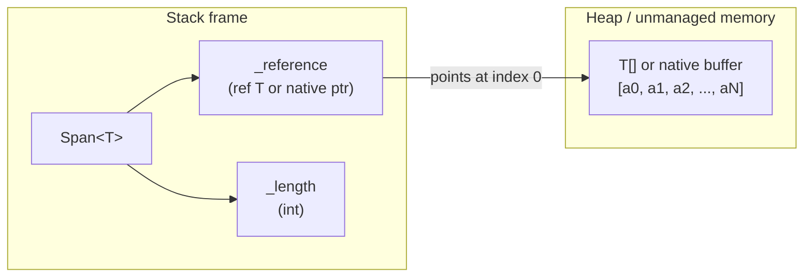

**TL;DR:** Why do hot-path parsers, JSON serializers, and network parsers in .NET avoid `string` and `T[]` slicing? Because `Span<T>` lives entirely on the stack — a `ref T` pointer plus an `int` length — so creating a slice, passing a sub-range to a helper, or renting from `ArrayPool<T>` never touches the GC heap at all.
> **In plain English (30 sec):** Think of this like concepts you already use, but in a production system at scale.


**Real repo:** [`dotnet/runtime`](https://github.com/dotnet/runtime) — the Span<T> and ArrayPool<T> implementations.

---

## 1. The Engineering Problem: slicing and copying data without burning GC cycles

Consider a typical high-throughput path — a reverse proxy forwarding 100k HTTP requests per second, each request containing a 4 KB payload. Every time the proxy parses a header, it needs to:

1. **Slice** the incoming byte buffer to isolate a header field.
2. **Pass** that slice to a helper method (hashing, validation, logging).
3. **Avoid allocating** a new `byte[]` or `string` for each slice — doing so would pressure the GC, cause Gen0 collections, and stall request threads.

Before `Span<T>`, .NET code had no safe, high-level way to represent a *view* into an existing buffer. You either copied into a new array, or you dropped into `unsafe` code with raw pointers — trading type safety for performance.

The core problem: **the CLR's type system has no concept of "a reference plus a length" that can live on the stack and be bounds-checked at runtime.** Arrays are heap objects with object headers, vtables, and GC tracking. Strings are immutable and heap-allocated. Neither can represent "bytes 100–200 of this larger buffer" without a copy.

---

## 2. The Technical Solution: a stack-only ref struct backed by a raw byref

### 2a. Span<T> internal layout — two fields, no object header



`Span<T>` is a `readonly ref struct` — the CLR enforces that it can only live on the stack. It contains exactly two fields:

- `_reference` — a `ref T` (or native pointer) into the backing buffer.
- `_length` — an `int` bounding how many elements the span covers.

There is no object header, no vtable pointer, and no GC tracking. The JIT can elide bounds checks when it can prove the index is within range, and the `ref struct` constraint guarantees the span can never be boxed, stored in a heap-allocated closure, or escaped beyond the current stack frame.

### 2b. ArrayPool<T> + Span<T> — rent, slice, return

```mermaid
sequenceDiagram
    participant Caller as Request handler
    participant Pool as ArrayPool.Shared
    participant Buf as rented byte[]
    participant Span as Span&lt;byte&gt;

    Caller->>Pool: Rent(4096)
    Pool-->>Caller: byte[] (may be larger)
    Caller->>Span: new Span<byte>(buf, 0, bytesRead)
    Note over Span: zero-allocation slice<br/>of the rented buffer
    Span->>Span: slice = span.Slice(0, headerLen)
    Note over Span: helper reads slice<br/>without copying
    Caller->>Pool: Return(buf)
```

The pattern is:

1. **Rent** a buffer from `ArrayPool<byte>.Shared` — amortized zero-allocation because pooled arrays are reused across requests.
2. **Wrap** it in a `Span<byte>` — zero cost, just two stack fields.
3. **Slice** it with `span.Slice(start, length)` — creates a new `Span<T>` pointing deeper into the same buffer, no copy.
4. **Return** the buffer to the pool when done — the pooled array lives on for the next request.

The entire lifetime of the slice never creates a heap object. The GC never sees it.

---

## 3. The clean example (concept in isolation)

```csharp
using System;
using System.Buffers;

// Simulating a high-throughput parsing scenario:
// receive a buffer, parse two fields, compute a hash.

byte[] buffer = ArrayPool<byte>.Shared.Rent(4096);
int bytesRead = FillBuffer(buffer); // simulate I/O

Span<byte> payload = buffer.AsSpan(0, bytesRead);

// Slice field 1: bytes [0..20)
Span<byte> header = payload.Slice(0, 20);

// Slice field 2: bytes [20..bytesRead)
Span<byte> body = payload.Slice(20);

// Pass slices to helpers — no copies, no allocations
uint hash = ComputeHash(body);
ProcessHeader(header);

// Return the rented buffer to the pool
ArrayPool<byte>.Shared.Return(buffer);

// --- helper methods accept Span<T> by reference ---

static uint ComputeHash(ReadOnlySpan<byte> data)
{
    // FNV-1a style hash — zero-allocation
    uint hash = 2166136261;
    foreach (byte b in data)
    {
        hash ^= b;
        hash *= 16777619;
    }
    return hash;
}

static void ProcessHeader(ReadOnlySpan<byte> header)
{
    // Read a 4-byte big-endian length prefix without allocation
    int length = (header[0] << 24) | (header[1] << 16)
               | (header[2] << 8)  | header[3];
    Console.WriteLine($"Header declares body length: {length}");
}
```

Key points:

- `buffer.AsSpan(0, bytesRead)` creates a `Span<byte>` view — no new array.
- `payload.Slice(0, 20)` creates a second `Span<byte>` — just a pointer bump and length change.
- `ComputeHash` accepts `ReadOnlySpan<byte>` — the caller's span is passed by reference; the callee cannot escape it to the heap.
- The entire operation allocates **zero bytes** on the managed heap.

---

## 4. Production reality (from `dotnet/runtime`)

The runtime's own `Span<T>` is the ground truth. Here is the struct definition from `System.Private.CoreLib`:

```csharp
// dotnet/runtime — src/libraries/System.Private.CoreLib/src/System/Span.cs
[NonVersionable]
[Intrinsic]
public readonly ref struct Span<T>
{
    /// <summary>A byref or a native ptr.</summary>
    internal readonly ref T _reference;

    /// <summary>The number of elements this Span contains.</summary>
    private readonly int _length;

    [MethodImpl(MethodImplOptions.AggressiveInlining)]
    public Span(T[]? array)
    {
        if (array == null)
        {
            this = default;
            return;
        }
        if (!typeof(T).IsValueType && array.GetType() != typeof(T[]))
            ThrowHelper.ThrowArrayTypeMismatchException();

        _reference = ref MemoryMarshal.GetArrayDataReference(array);
        _length = array.Length;
    }
}
```

Three things to notice:

1. **`ref struct`** — the CLR prevents boxing. You cannot store a `Span<T>` in an `object`, a field of a class, or a closure. It dies when the stack frame unwinds.
2. **`ref T _reference`** — not an object reference, not a pointer with `unsafe`. The C# `ref` keyword gives a type-safe byref that the JIT can optimize aggressively.
3. **`MemoryMarshal.GetArrayDataReference(array)`** — obtains a `ref T` to the first element of the array, bypassing the object header entirely. The span never tracks the array's GC root.

The `Slice` method is equally lean:

```csharp
// dotnet/runtime — src/libraries/System.Private.CoreLib/src/System/Span.cs
[MethodImpl(MethodImplOptions.AggressiveInlining)]
public Span<T> Slice(int start, int length)
{
    if ((uint)start > (uint)_length
        || (uint)length > (uint)(_length - start))
        ThrowHelper.ThrowArgumentOutOfRangeException();

    return new Span<T>(
        ref Unsafe.Add(ref _reference, (nint)(uint)start),
        length);
}
```

No new array. No copy. The returned `Span<T>` points deeper into the same backing memory. The `(uint)` casts let the JIT eliminate both bounds checks with a single unsigned comparison on 64-bit — a micro-optimization that matters when `Slice` is called millions of times per second in parsers and serializers.

`ArrayPool<T>` complements this by eliminating the allocation of the backing array itself:

```csharp
// dotnet/runtime — src/libraries/System.Private.CoreLib/src/System/Buffers/ArrayPool.cs
public abstract class ArrayPool<T>
{
    private static readonly SharedArrayPool<T> s_shared = new SharedArrayPool<T>();

    public static ArrayPool<T> Shared => s_shared;

    public abstract T[] Rent(int minimumLength);

    public abstract void Return(T[] array, bool clearArray = false);

    internal void Return(T[] array, int lengthToClear)
    {
        array.AsSpan(0, lengthToClear).Clear();
        Return(array);
    }
}
```

Notice the internal `Return` overload — it uses `AsSpan(0, lengthToClear).Clear()` to zero only the portion of the array that was actually written, not the entire buffer. This is a `Span<T>` consumer inside the pool itself, keeping the clearing path allocation-free.

---

## 5. Review checklist

- [ ] **`ref struct` means stack-only.** If you see `Span<T>` stored in a `class` field, a closure, or returned from an `async` method, that code will not compile — the constraint is enforced by the language.
- [ ] **Slicing is a pointer bump, not a copy.** `span.Slice(start, length)` returns a new `Span<T>` pointing into the same memory. Verify that the backing buffer outlives every slice derived from it.
- [ ] **`ReadOnlySpan<T>` for read-only paths.** Prefer `ReadOnlySpan<T>` when the callee does not write. This prevents accidental mutation and enables implicit conversion from `Span<T>`.
- [ ] **`ArrayPool<T>.Shared` for reusable buffers.** Rent before the hot loop, return after. Never call `Return` twice on the same array.
- [ ] **`stackalloc` for small, known-max-size buffers.** When the maximum size is bounded and small (e.g., 256 bytes for a header parse), `stackalloc` + `Span<byte>` avoids even the pool.
- [ ] **Do not capture `Span<T>` across `await`.** The backing memory is on the stack frame that produced it; if that frame is suspended by `await`, the span becomes invalid. Use `Memory<T>` (heap-safe counterpart) for async scenarios.
- [ ] **Verify `AggressiveInlining` is present on hot-path span methods.** The runtime marks `Slice`, the indexer, and constructors with it — your own span-taking helpers should follow suit.

---

## 6. FAQ

**Q: What is `Memory<T>` and when do I need it instead of `Span<T>`?**

`Memory<T>` is the heap-safe counterpart. It can be stored in class fields, passed to `async` methods, and used across `await` boundaries. It wraps a `Span<T>` internally but adds a potential `object` reference (to track the underlying array or `MemoryManager<T>`). Use `Memory<T>` when you need to hand a buffer to code that might store it or suspend on it; use `Span<T>` for synchronous, scoped, hot-path slicing.

**Q: Can I use `Span<T>` with `stackalloc`?**

Yes. `Span<byte> buffer = stackalloc byte[256];` creates a stack-allocated buffer and wraps it in a `Span<byte>`. The span is bounds-checked, so the raw stack memory cannot be overrun. This is ideal for small, fixed-maximum-size parsing operations where pooling is unnecessary overhead.

**Q: Why does the runtime use `(uint)` casts in bounds checks?**

Casting `int` to `uint` turns a signed range check into an unsigned one. On 64-bit JITs, two 32-bit unsigned values can be compared in a single 64-bit comparison, eliminating a branch. The runtime uses this pattern in `Span<T>.Slice` and the indexer to shave nanoseconds off a path called millions of times per request in hot serializers.

**Q: Is `Span<T>` safe from buffer overflows?**

Yes. Every element access goes through the bounds-checked indexer, and every `Slice` call validates the range. The only way to bypass this is with `unsafe` code using `Unsafe.Add` or raw pointers. The language-level `ref struct` constraint prevents the span from escaping to untrusted code paths.

**Q: What happens if I return a rented buffer to `ArrayPool` but a `Span<T>` derived from it is still alive?**

The span becomes a dangling reference. The pool may hand the same array to another caller, and any access through the old span reads or writes the new caller's data. This is undefined behavior in the managed sense — not a crash (the memory is valid), but a silent data corruption. Always ensure all slices are done being used before calling `Return`.

**Q: Does `Span<T>` work with reference types like `Span<string>`?**

No. `Span<T>` where `T` is a reference type is blocked at construction — the runtime checks `typeof(T).IsValueType` and throws `ArrayTypeMismatchException`. This prevents the span from creating a view over a covariant array that could allow type-safety violations.

---

## 7. Source

| File | Path in `dotnet/runtime` |
|---|---|
| `Span<T>` struct | `src/libraries/System.Private.CoreLib/src/System/Span.cs` |
| `ArrayPool<T>` abstract base | `src/libraries/System.Private.CoreLib/src/System/Buffers/ArrayPool.cs` |
| `SharedArrayPool<T>` | `src/libraries/System.Private.CoreLib/src/System/Buffers/OverlappingArraysBucket.cs` (internal) |
| `MemoryMarshal.GetArrayDataReference` | `src/libraries/System.Private.CoreLib/src/System/Runtime/InteropServices/MemoryMarshal.cs` |


