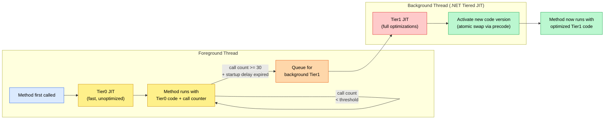
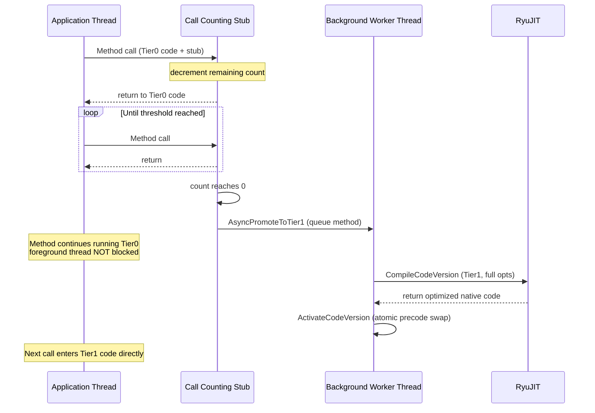

**TL;DR:** Why does .NET re-compile a method it already has machine code for? Because the first JIT pass (Tier0) trades code quality for startup speed — it generates unoptimized code with no inlining, no loop optimizations, and minimal analysis. Once call counting confirms a method is actually hot (called 30+ times after startup), the runtime kicks off a background thread to re-JIT it with full Tier1 optimizations (inlining, vectorization, dead code elimination). The slow code runs for milliseconds; the optimized code runs for the lifetime of the process.
> **In plain English (30 sec):** Think of this like concepts you already use, but in a production system at scale.


**Real repo:** [`dotnet/runtime`](https://github.com/dotnet/runtime) — the RyuJIT JIT compiler and `TieredCompilationManager`

## 1. The Engineering Problem: optimizing every method at startup wastes time nobody will ever get back

A typical .NET application has thousands of methods. Most are called once or twice during startup and never again. A few — the request handler, the hot loop, the serialization path — run millions of times. If the JIT compiler applies full optimizations to every method on first call, startup pays the full cost of inlining analysis, loop unrolling, and register allocation for methods that will never benefit from it.

This creates two production-killing problems:

**Startup latency dominated by JIT time.** Full Tier1 optimization for a single method can take 100-500 microseconds. Multiply that across thousands of methods called during startup and you get hundreds of milliseconds of pure JIT overhead before the first request is even processed. For a microservice that needs to respond to health checks within seconds, that's a dealbreaker.

**Foreground thread starvation.** The JIT runs on the calling thread. If the first invocation of a hot method triggers full optimization, the thread that called it blocks for the entire compilation — which means the request that triggered the call waits. In a web server handling concurrent requests, this means one request pays a hidden JIT tax while other requests queue behind it.

What was needed was a two-speed compilation strategy: produce acceptable code instantly, then optimize it later on a background thread when the foreground isn't busy.

---

## 2. The Technical Solution: compile fast first, optimize later on a background thread

Tiered compilation splits all JIT-eligible code into two tiers:

- **Tier0** — minimal-optimization code generated as fast as possible. No inlining, no loop optimizations, no devirtualization. The goal is to produce *any* executable code so the method can start running immediately. Call counting stubs are injected to track how often the method is invoked.
- **Tier1** — fully optimized code generated on a background thread after the call count exceeds a threshold (default: 30 calls, after a startup delay). Full RyuJIT optimization pipeline: inlining, vectorization, dead code elimination, devirtualization.

The runtime also supports intermediate tiers for profile-guided optimization: **Tier0Instrumented** and **Tier1Instrumented** collect branch-taken profiles during execution, then use that data to guide Tier1 optimization decisions.



The startup delay is critical: it prevents background Tier1 recompilation from competing with foreground startup JIT work. The delay timer (default 100ms) resets every time a Tier0 method is compiled. Only after 100ms of *no* Tier0 compilation does call counting begin. This ensures the background thread doesn't steal CPU from the foreground during the startup phase.

Once call counting begins, a method's Tier0 entry point is replaced with a call counting stub — a tiny assembly trampoline that decrements a counter on each call. When the counter hits zero, the stub triggers `OnCallCountThresholdReached`, which queues the method for Tier1 compilation on the background thread. The foreground thread never blocks.



---

## 3. The clean example (concept in isolation)

```csharp
using System;
using System.Diagnostics;
using System.Runtime.CompilerServices;

// Tiered compilation is transparent — you can't force a method to tier up,
// but you CAN observe the difference with [MethodImpl] attributes and
// EventListener to watch the JIT events.

class TieredDemo
{
    // This method will be Tier0-compiled on first call (fast, no opts),
    // then Tier1-recompiled after 30+ calls + startup delay.
    [MethodImpl(MethodImplOptions.NoInlining)] // prevent inlining so we see both tiers
    static long ComputeFibonacci(int n)
    {
        if (n <= 1) return n;
        long a = 0, b = 1;
        for (int i = 2; i <= n; i++)
        {
            long temp = a + b;
            a = b;
            b = temp;
        }
        return b;
    }

    static void Main()
    {
        // Phase 1: Tier0 — fast compile, slow execution
        var sw = Stopwatch.StartNew();
        for (int i = 0; i < 50; i++)
            ComputeFibonacci(40);
        Console.WriteLine($"50 calls: {sw.ElapsedMilliseconds}ms");

        // After 30+ calls + startup delay, Tier1 kicks in on background thread.
        // The next batch will use optimized code (inlined, vectorized).
        sw.Restart();
        for (int i = 0; i < 50; i++)
            ComputeFibonacci(40);
        Console.WriteLine($"50 calls (post-tier-up): {sw.ElapsedMilliseconds}ms");
    }
}
```

Run with `dotnet run -c Release` and observe: the second batch is measurably faster because the background thread has recompiled `ComputeFibonacci` with full optimizations while the foreground was busy.

---

## 4. Production reality (from `dotnet/runtime`)

The following is verbatim from `TieredCompilationManager::GetJitFlags` in [`src/coreclr/vm/tieredcompilation.cpp`](https://github.com/dotnet/runtime/blob/main/src/coreclr/vm/tieredcompilation.cpp) — this is the function that decides what JIT flags to pass based on the current optimization tier:

```cpp
// src/coreclr/vm/tieredcompilation.cpp
CORJIT_FLAGS TieredCompilationManager::GetJitFlags(PrepareCodeConfig *config)
{
    WRAPPER_NO_CONTRACT;
    _ASSERTE(config != nullptr);

    CORJIT_FLAGS flags;

    NativeCodeVersion nativeCodeVersion = config->GetCodeVersion();

    switch (nativeCodeVersion.GetOptimizationTier())
    {
        case NativeCodeVersion::OptimizationTier0Instrumented:
            _ASSERT(g_pConfig->TieredCompilation_QuickJit());
            flags.Set(CORJIT_FLAGS::CORJIT_FLAG_BBINSTR);
            flags.Set(CORJIT_FLAGS::CORJIT_FLAG_TIER0);
            break;

        case NativeCodeVersion::OptimizationTier1Instrumented:
            _ASSERT(g_pConfig->TieredCompilation_QuickJit());
            flags.Set(CORJIT_FLAGS::CORJIT_FLAG_BBINSTR);
            flags.Set(CORJIT_FLAGS::CORJIT_FLAG_TIER1);
            break;

        case NativeCodeVersion::OptimizationTier0:
            if (g_pConfig->TieredCompilation_QuickJit())
            {
                flags.Set(CORJIT_FLAGS::CORJIT_FLAG_TIER0);
                break;
            }
            nativeCodeVersion.SetOptimizationTier(
                NativeCodeVersion::OptimizationTierOptimized);
            goto Optimized;

        case NativeCodeVersion::OptimizationTier1OSR:
            flags.Set(CORJIT_FLAGS::CORJIT_FLAG_OSR);
            FALLTHROUGH;

        case NativeCodeVersion::OptimizationTier1:
            flags.Set(CORJIT_FLAGS::CORJIT_FLAG_TIER1);
            FALLTHROUGH;

        case NativeCodeVersion::OptimizationTierOptimized:
        Optimized:
            break;

        default:
            UNREACHABLE();
    }
    return flags;
# ... (1 lines omitted)
```

This teaches that a hello-world can't:

- **The switch statement maps each tier to a distinct set of JIT flags** — `CORJIT_FLAG_TIER0` tells RyuJIT to skip inlining, loop optimization, and devirtualization for speed; `CORJIT_FLAG_TIER1` enables the full optimization pipeline. The `BBINSTR` flag for instrumented tiers enables basic-block-level profiling instrumentation, which collects branch-taken data for profile-guided optimization. These aren't just different "quality levels" — they're fundamentally different compilation paths inside the JIT.

- **The startup delay is implemented as a `m_methodsPendingCountingForTier1` list** — when a method is first called during the startup delay window, it's added to this list (pre-allocated for 64 entries). The background worker sleeps for `CallCountingDelayMs` (default 100ms) and only activates call counting stubs after the delay expires AND no new Tier0 compilations have occurred. This two-condition gate prevents the background thread from stealing CPU during startup.

- **`ActivateCodeVersion` uses the CodeVersionManager's `SetActiveNativeCodeVersion` to atomically swap the method's entry point** — the old Tier0 code isn't deleted or patched in place. Instead, a new native code version is registered and the method's precode (the indirection trampoline) is updated to point at the new code. Any thread currently executing the old Tier0 code finishes naturally; only future calls enter Tier1. This is a lock-free hot-swap, not a stop-the-world replacement.

---

## 5. Review checklist

- [ ] Tier0 is a fast, unoptimized JIT pass — its purpose is startup speed, not runtime performance
- [ ] Call counting stubs are injected at Tier0 entry points to track invocation frequency
- [ ] A startup delay (default 100ms) prevents background recompilation from competing with foreground startup
- [ ] Methods need 30+ calls after the startup delay before they're eligible for Tier1
- [ ] Tier1 compilation happens on a dedicated background thread (`.NET Tiered JIT`), never on the calling thread
- [ ] The atomic code-version swap via precode means no stop-the-world pause is needed
- [ ] Instrumented tiers (Tier0Instrumented, Tier1Instrumented) add basic-block profiling for PGO
- [ ] On-Stack Replacement (OSR, `CORJIT_FLAG_OSR`) can promote long-running loops without waiting for a new call

---

## 6. FAQ

**Q: Can I force a method to skip Tier0 and go straight to Tier1?**
A: Yes — apply `[MethodImpl(MethodImplOptions.AggressiveOptimization)]`. This tells the runtime the method is eligible for Tier1 from the first call, skipping the call-counting phase entirely.

**Q: What's the default call count threshold before tiering up?**
A: 30 calls. The design doc notes this was derived from early empirical testing and hasn't been aggressively tuned — an order-of-magnitude change matters, but +/-5 vanishes into noise for most workloads.

**Q: Does tiered compilation apply to ReadyToRun (precompiled) assemblies?**
A: Yes. R2R code is treated as Tier0. If the runtime detects the method is hot, it re-JITs from IL with full optimizations, which can produce faster code because the JIT sees the exact loaded dependencies and CPU features at runtime.

**Q: What is On-Stack Replacement (OSR)?**
A: OSR lets the runtime replace code *inside a currently executing method* — if a Tier0 loop runs for a long time, OSR can swap in Tier1 code for the active frame without waiting for the method to return and be called again. This prevents infinite loops from permanently running unoptimized code.

**Q: Where is the call counting threshold configured?**
A: Via the `DOTNET_TieredCompilation_CallCountThreshold` environment variable or the corresponding runtime config knob. The startup delay is `DOTNET_TieredCompilation_CallCountingDelayMs` (default 100ms).

---

## Source

- **Concept:** Tiered JIT compilation, call counting, background optimization
- **Domain:** dotnet
- **Repo:** [dotnet/runtime](https://github.com/dotnet/runtime) → [`src/coreclr/vm/tieredcompilation.cpp`](https://github.com/dotnet/runtime/blob/main/src/coreclr/vm/tieredcompilation.cpp), [`src/coreclr/vm/tieredcompilation.h`](https://github.com/dotnet/runtime/blob/main/src/coreclr/vm/tieredcompilation.h), [`src/coreclr/vm/callcounting.cpp`](https://github.com/dotnet/runtime/blob/main/src/coreclr/vm/callcounting.cpp) — the TieredCompilationManager and CallCountingManager that implement two-tier JIT in the .NET runtime. Design doc: [`docs/design/features/tiered-compilation.md`](https://github.com/dotnet/runtime/blob/main/docs/design/features/tiered-compilation.md).


