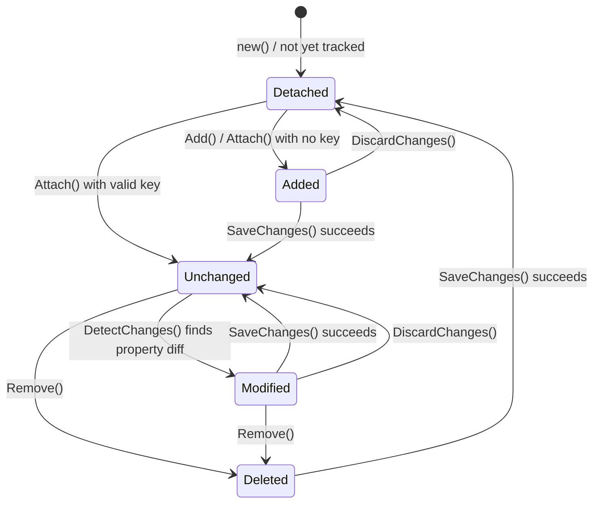
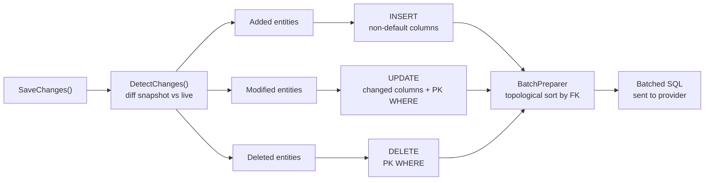

How does EF Core know which SQL to generate when you call SaveChanges — an INSERT, an UPDATE, or a DELETE — without you ever writing a WHERE clause or a state flag? It snapshots every property value when an entity is first tracked, diffs the snapshot against the live object at save time, and routes each entity to the right command based on the gap between the two.

**Real repo:** [`dotnet/efcore`](https://github.com/dotnet/efcore)

## 1. The Engineering Problem: your ORM has to decide what changed, without being told

You add a new entity to a DbSet, modify a property on a loaded entity, and remove another — three lines of code, three fundamentally different SQL operations. A naive ORM would require you to flag each entity's intent explicitly (`MarkAdded`, `MarkModified`, `MarkDeleted`). That pushes bookkeeping onto application code and creates a class of bugs where the declared state doesn't match the actual object graph. Something has to automatically determine the correct operation for every tracked entity by comparing the object's current values against a known-good baseline, without requiring the developer to declare intent manually — and it has to do it efficiently, because in a typical request you might be tracking hundreds of entities.

---

## 2. The Technical Solution: snapshot-based change detection and a state machine per entity

**Snapshot diffing**: When an entity enters the change tracker — via a tracking query, `Add`, `Attach`, or `Update` — EF Core captures a property-value snapshot (`ISnapshot`) storing the current value of every tracked property. Before `SaveChanges` executes, `DetectChanges` walks every tracked entity and compares each property's live value against its snapshot. If the entity is in `Unchanged` state and any property differs, the state flips to `Modified`. If the entity was `Added`, all properties are "new" by definition — no diff needed. If the entity was `Deleted`, it goes straight to a DELETE command regardless of property values.



**Command generation**: Once every entity is in its final state, `SaveChanges` iterates the tracked entries grouped by operation type. For `Added` entities it emits an `INSERT` (including only non-default values for properties with store-generated keys). For `Modified` entities it emits an `UPDATE` with a WHERE clause keyed on the original primary key from the snapshot — this is also where row-version concurrency checks land. For `Deleted` entities it emits a `DELETE`. The grouping and batching happens in `UpdateCommandBatchPreparer`, which topologically sorts entities to respect foreign-key dependencies before writing them into batched SQL commands.



Core truths: **the snapshot is the single source of truth for what the database looked like when the entity was loaded** — not a hash, not a dirty flag, a full property-by-property copy; and **the state machine on each entity (`Detached → Added/Unchanged → Modified → Deleted → Detached`) is the sole determinant of which SQL command gets generated**, so understanding the state transitions is the key to understanding the ORM's output.

---

## 3. The clean example (concept in isolation)

```csharp
using var db = new BlogContext();

// --- INSERT: entity enters Added state, snapshot is empty of DB values ---
var blog = new Blog { Title = "First Post" };
db.Blogs.Add(blog);
// State: Added. Snapshot has no PK (it's store-generated).

db.SaveChanges();
// INSERT INTO Blogs (Title) VALUES ('First Post');
// State flips to Unchanged. Snapshot now captures Title = "First Post", Id = 1.

// --- UPDATE: property differs from snapshot ---
blog.Title = "Updated Post";
db.SaveChanges();
// DetectChanges finds Title changed: "First Post" != "Updated Post"
// UPDATE Blogs SET Title = 'Updated Post' WHERE Id = 1
// State stays Unchanged after save. Snapshot refreshed.

// --- DELETE: entity removed from DbSet ---
db.Blogs.Remove(blog);
// State: Deleted. Snapshot still holds Id = 1.
db.SaveChanges();
// DELETE FROM Blogs WHERE Id = 1
// State flips to Detached. Snapshot discarded.
```

---

## 4. Production reality (from `dotnet/efcore`)

```csharp
// src/EFCore/ChangeTracking/ChangeTracker.cs
// DetectChanges walks every tracked entity and diffs live property values
// against the stored snapshot. If AutoDetectChangesEnabled is true (the default),
// this runs automatically before SaveChanges and before Entries() enumerates.

public virtual void DetectChanges()
{
    if (!_model.SkipDetectChanges)
    {
        ChangeDetector.DetectChanges(StateManager);
    }
}

// HasChanges checks ChangedCount — the number of entities whose state
// is NOT Unchanged and NOT Detached — after running DetectChanges.

public virtual bool HasChanges()
{
    TryDetectChanges();
    return StateManager.ChangedCount > 0;
}
```

```csharp
// src/EFCore/ChangeTracking/Internal/StateManager.cs
// StartTrackingFromQuery is the hot path for materialized query results.
// It stores a snapshot (ISnapshot) from the query materializer and marks the
// entity as Unchanged — this snapshot is the baseline for all future diffs.

public virtual InternalEntityEntry StartTrackingFromQuery(
    IEntityType baseEntityType,
    object entity,
    in ISnapshot snapshot)
{
    var existingEntry = TryGetEntry(entity);
    if (existingEntry != null)
    {
        return existingEntry;
    }

    var clrType = entity.GetType();
    var entityType = baseEntityType.HasSharedClrType
        || baseEntityType.ClrType == clrType
            ? baseEntityType
            : _model.FindRuntimeEntityType(clrType)!;

    var newEntry = snapshot.IsEmpty
        ? new InternalEntityEntry(this, entityType, entity)
        : new InternalEntityEntry(this, entityType, entity, snapshot);

    foreach (var key in baseEntityType.GetKeys())
    {
        GetOrCreateIdentityMap(key).AddOrUpdate(newEntry);
    }

    UpdateReferenceMaps(newEntry, EntityState.Unchanged, null);
    newEntry.MarkUnchangedFromQuery();
    // ...
    return newEntry;
}
```

What this teaches that a hello-world can't:

- **The snapshot is captured by the query materializer, not by `DetectChanges`** — `StartTrackingFromQuery` receives an `ISnapshot` that was built at query materialization time (the moment the SQL reader populates each property), not at attach time. This means the snapshot reflects the database's exact state at query execution, not whatever state the entity might have been in if it was previously tracked and detached.
- **`ChangedCount` is maintained incrementally, not recomputed on every check** — `StateManager` tracks it as entities transition in and out of non-Unchanged states, so `HasChanges()` avoids a full scan of the entity reference map. The `TryDetectChanges` call is still needed (to catch property-level mutations on `Unchanged` entities), but the count itself is O(1).
- **Identity maps are keyed per `IKey`, not per entity type** — `GetOrCreateIdentityMap(key)` resolves the correct map from the entity type's primary key, and additional maps exist for alternate keys and foreign keys. This means a single CLR type mapped to multiple entity types (table-per-hierarchy with shared CLR type) gets separate identity maps, preventing collisions where two mapped entities share the same object reference.
- **`AcceptAllChanges` is called after the provider commits** — the state machine transitions from `Added/Modified/Deleted` back to `Unchanged` (or `Detached` for deletes) only *after* the database provider reports success. If the provider throws, the entities remain in their pre-save state, and the change tracker is consistent with what actually hit the database.

---

## 5. Review checklist

- [ ] **Snapshot vs change-detection**: understand that the snapshot is captured at materialization, and `DetectChanges` diffs the live object against it — not the other way around.
- [ ] **State machine correctness**: every entity must be in exactly one of `Detached`, `Added`, `Unchanged`, `Modified`, or `Deleted`. An entity in `Unchanged` with a mutated property that wasn't detected (because `AutoDetectChangesEnabled = false`) will silently skip the UPDATE.
- [ ] **Store-generated keys**: for `Added` entities, the PK is excluded from the INSERT and populated from the database via `GetValueGeneratedToAdd`. The snapshot is refreshed after save so subsequent diffs use the real PK.
- [ ] **Concurrency tokens**: for `Modified` entities, the UPDATE's WHERE clause includes the original value of any `IsConcurrencyToken` property from the snapshot — a row-version mismatch produces `DbUpdateConcurrencyException`.
- [ ] **Detached vs tracked in Web APIs**: the number-one source of "why is my entity not updating" bugs is passing a deserialized entity to `Update()` on a fresh context without first loading the existing entity to populate the snapshot. Use `Attach` + selective property marking, or load-then-copy, instead.
- [ ] **`AutoDetectChangesEnabled` performance**: for high-entity-count scenarios, disabling `AutoDetectChangesEnabled` and calling `DetectChanges()` once before save avoids O(N) diff scans on every `Entries()` call — but only if you remember to call it.

---

## 6. FAQ

**Q: Why doesn't `dbContext.Update(entity)` always generate an UPDATE?**
`Update` sets the entity state to `Modified`, which *guarantees* an UPDATE regardless of whether any property actually changed. The UPDATE will SET every column to its current value. Use `Attach` + mark specific properties if you want only-changed-columns UPDATE.

**Q: What happens if I modify a property, then set it back to the original value before `SaveChanges`?**
`DetectChanges` sees no diff between the live value and the snapshot, so the entity stays `Unchanged` and no UPDATE is generated. The snapshot acts as a "baseline of truth," not a log of intermediate mutations.

**Q: Can two DbContext instances track the same entity simultaneously?**
No — each context has its own `StateManager` and identity map. Two contexts tracking the same entity will have independent snapshots. Saving changes from one context will not update the other's snapshot, which is a common source of stale-data bugs in long-running or multi-context scenarios.

**Q: Why does `Attach` + `Remove` work but `Update` + `Remove` doesn't behave as expected?**
`Attach` sets state to `Unchanged`, then `Remove` transitions to `Deleted` — the state machine is valid. `Update` sets state to `Modified`, then `Remove` transitions to `Deleted` — also valid, but `Update` also marks *all* properties as modified, which is wasted work if you're about to delete.

**Q: How does EF Core handle foreign-key cascade deletes in the change tracker?**
When a principal entity transitions to `Deleted`, the change tracker evaluates `DeleteBehavior` on each dependent relationship. For `Cascade` behavior (the default for required relationships), dependents transition to `Deleted` as well — controlled by `CascadeDeleteTiming` (default: `Immediate`). For `ClientSetnull`, the foreign key property is set to null and the dependent stays tracked.

---

## Source

- **Concept:** Snapshot-based change detection and the EntityState machine in EF Core
- **Domain:** dotnet
- **Repo:** [dotnet/efcore](https://github.com/dotnet/efcore) → [`src/EFCore/ChangeTracking/ChangeTracker.cs`](https://github.com/dotnet/efcore/blob/main/src/EFCore/ChangeTracking/ChangeTracker.cs), [`src/EFCore/ChangeTracking/Internal/StateManager.cs`](https://github.com/dotnet/efcore/blob/main/src/EFCore/ChangeTracking/Internal/StateManager.cs) — the EF Core change tracker and state manager that drive INSERT/UPDATE/DELETE generation.


