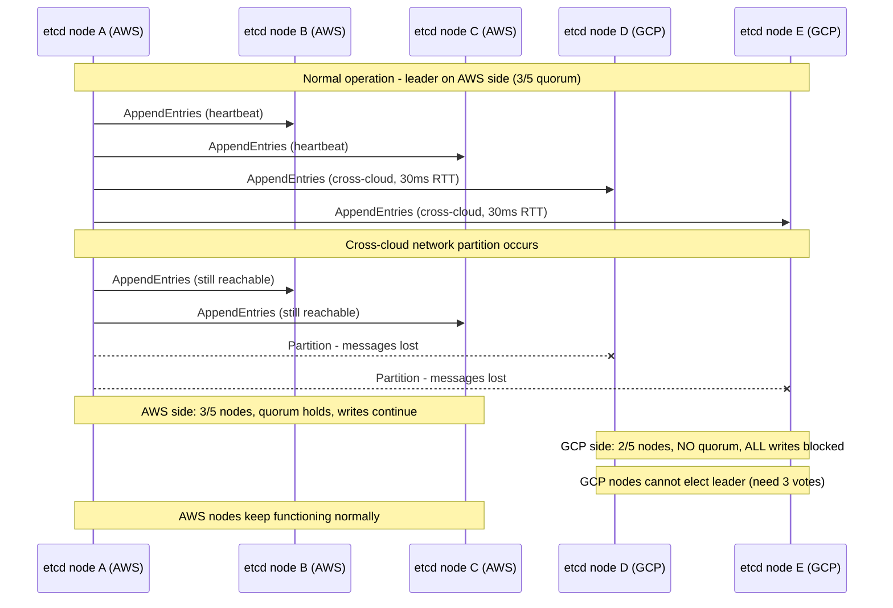
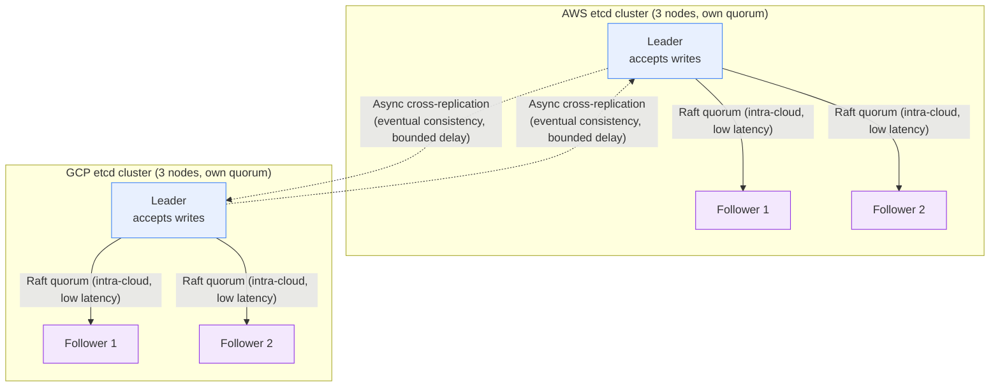

**TL;DR:** Can you run a single etcd cluster stretched across two cloud providers for unified multi-cloud state? No — Raft's correctness guarantee is that a majority of nodes must acknowledge every committed write, and cross-cloud network partitions turn that majority into a availability-killer: a 5-node cluster split 3/2 across clouds will keep the majority side running but completely stall writes from the minority side, while etcd's lessor (lease manager) elects exactly one primary for the entire cluster, meaning one cloud's nodes are fully demoted during normal operation, not active-active.

> **In plain English (30 sec):** Code you already write — Map, function, API call, just bigger.

## 1. The Engineering Problem

A natural instinct when building multi-cloud infrastructure is "let's just stretch our state store across both clouds" — run one etcd or Consul cluster with members in both AWS and GCP, get unified state, and avoid the complexity of syncing between two independent clusters. The pitch sounds clean: one cluster, one API endpoint, one source of truth.

The engineering problem is that Raft consensus — the algorithm etcd uses to stay consistent — is *designed* to make stretched clusters unavailable during network partitions, not to degrade gracefully across them. Raft requires a strict majority (N/2 + 1) of nodes to acknowledge every committed write. In a single-cloud 5-node cluster, losing 2 nodes still leaves quorum. In a cross-cloud 5-node cluster with 3 nodes in AWS and 2 in GCP, a cross-cloud network partition means the AWS side keeps writing (it has 3/5) while the GCP side completely stops — not slowly degrades, but *stops accepting writes entirely*. Worse, etcd's lessor (the lease manager that handles TTL-based key expiry) promotes exactly one node as the primary lessor for the whole cluster; during normal operation, the minority-side nodes are fully demoted, not "lower priority active" — they exist only as standby readers that can't write until the partition heals or a leader election runs.

This is not a hypothetical edge case. Cross-cloud latencies of 10–80 ms (AWS us-east-1 to GCP us-central1) are within Raft's normal operating window but far enough that a brief routing hiccup, a BGP convergence event, or a cloud provider maintenance window will trigger leader elections — each one causing a brief write outage even when both sides are technically reachable. The "stretch cluster" that was supposed to give you multi-cloud resilience actually gives you *less* availability than two independent clusters, because a problem in one cloud now stalls the other cloud's writes too.

## 2. The Technical Solution

The production answer is **independent clusters with async cross-replication**, not one stretched Raft group. Each cloud runs its own complete, self-quorum'd etcd cluster with its own leader. State is replicated between clusters asynchronously (via application-level sync, or tools like etcd's snapshot-based replication), accepting the tradeoff that writes in one cloud are visible in the other after a bounded delay, not instantly.

The fundamental tension between Raft's design and cross-cloud reality:



This diagram shows the core asymmetry: the partition doesn't affect both sides equally. The majority side keeps running; the minority side *completely stops*, even though both sides are healthy individually.

Now, the correct multi-cloud pattern — independent clusters with async replication:



Three core truths:

- **Raft quorum operates at intra-cloud latency (1–2 ms), not cross-cloud latency (10–80 ms).** Each cluster's Raft heartbeats and log replication stay within a single cloud, keeping commit latency low and leader elections fast. Cross-cloud communication is a separate, asynchronous concern, not mixed into the consensus path.
- **Each cluster is independently self-sufficient.** If one cloud goes down entirely, the other cloud's etcd cluster continues operating at full capacity — no leader election across a partition, no quorum loss, no write stall. The async replication link goes quiet, but the surviving cluster keeps serving.
- **The tradeoff shifts from "unified consistency" to "bounded staleness."** A key written in AWS appears in GCP after the async replication cycle completes (typically seconds, not minutes). For most multi-cloud DR use cases — "we need the secondary region to take over if the primary fails" — this is the right tradeoff: a few seconds of staleness during normal operation, in exchange for a surviving cluster that keeps working when the other cloud is completely unreachable.

## 3. The clean example (concept in isolation)

```python
# Conceptual model: what "independent clusters with async replication"
# actually looks like for a key-value store.

class EtcdCluster:
    """A single, self-contained etcd cluster within one cloud."""
    def __init__(self, nodes, cloud_region):
        self.nodes = nodes          # 3 or 5 nodes in same cloud
        self.region = cloud_region
        # Raft operates ONLY within self.nodes — no cross-cloud members
        self.raft = RaftGroup(self.nodes, quorum=len(self.nodes) // 2 + 1)

    def write(self, key, value):
        """Writes go through local Raft quorum — low latency, fast commit."""
        return self.raft.propose(WriteOp(key, value))

    def replicate_to(self, other_cluster):
        """Async replication to another cluster — separate from Raft path."""
        changes = self.raft.get_unreplicated_log_entries()
        for entry in changes:
            other_cluster.apply_remote(entry)  # not part of Raft consensus
        return len(changes)


class MultiCloudStateStore:
    """Two independent clusters, each fully quorum'd, async-replicated."""
    def __init__(self):
        self.aws = EtcdCluster(nodes_3_in("us-east-1"), "aws")
        self.gcp = EtcdCluster(nodes_3_in("us-central1"), "gcp")
        # Replication runs on a background timer, not in the Raft hot path
        self.replication_interval_ms = 1000

    def write_anywhere(self, key, value):
        """Client writes to whichever cloud it's in — local Raft, fast."""
        return self.current_leader().write(key, value)

    def current_leader(self):
        """Returns whichever cluster is currently serving traffic.
        In active-active, both are leaders for their own clients."""
        return self.aws  # or route based on client location
```

This model makes the architectural separation explicit: `RaftGroup` (the consensus engine) only knows about nodes in the same cloud. Cross-cloud replication (`replicate_to`) is a completely separate channel — it doesn't participate in quorum calculations, it doesn't affect commit latency, and its failure doesn't stall either cluster's writes.

## 4. Production reality (from `etcd-io/etcd`)

```
server/etcdserver/
├── server.go            — EtcdServer: Raft event loop, leadership, snapshot apply
├── api/rafthttp/        — peer-to-peer transport (Raft messages between nodes)

server/lease/
├── lessor.go            — Lessor: lease grant/renew/expiry, primary promotion
```

**`server/etcdserver/server.go`** — the core Raft event loop, showing why leadership is singular and cross-cloud heartbeat timeout is lethal:

```go
// server/etcdserver/server.go

// EtcdServer is the production implementation of the Server interface
type EtcdServer struct {
    inflightSnapshots atomic.Int64
    appliedIndex      atomic.Uint64
    committedIndex    atomic.Uint64
    term              atomic.Uint64
    lead              atomic.Uint64   // exactly ONE leader ID for the whole cluster

    r            raftNode    // the Raft state machine — one per process
    kv           mvcc.WatchableKV
    lessor       lease.Lessor
    // ...
}

// run is the core event loop: processes Raft ready events, applies
// committed entries, handles leader changes. There is exactly ONE
// leader for the entire EtcdServer instance — no per-region leaders.
func (s *EtcdServer) run() {
    // ...
    rh := &raftReadyHandler{
        getLead:    func() (lead uint64) { return s.getLead() },
        updateLead: func(lead uint64) { s.setLead(lead) },
        updateLeadership: func(newLeader bool) {
            if !s.isLeader() {
                // When this node LOSES leadership, the lessor is demoted
                // — it stops managing lease expiry for the ENTIRE cluster
                if s.lessor != nil {
                    s.lessor.Demote()
                }
                if s.compactor != nil {
                    s.compactor.Pause()
                }
            } else {
                if newLeader {
                    t := time.Now()
                    s.leadTimeMu.Lock()
                    s.leadElectedTime = t
                    s.leadTimeMu.Unlock()
                }
                if s.compactor != nil {
                    s.compactor.Resume()
                }
            }
            if newLeader {
                s.leaderChanged.Notify()
            }
        },
        // ...
    }
    // ...
}
```

**`server/lease/lessor.go`** — the lessor that makes cross-cloud lease management impossible under one cluster:

```go
// server/lease/lessor.go

// lessor is the lease manager. It has ONE primary for the entire cluster.
// When a node is promoted to leader, its lessor becomes primary.
// All other nodes' lessors are demoted — they don't expire or renew leases.
type lessor struct {
    mu sync.RWMutex

    // demotec is set when the lessor is the primary.
    // demotec will be closed if the lessor is demoted.
    demotec chan struct{}

    leaseMap             map[LeaseID]*Lease
    leaseExpiredNotifier *LeaseExpiredNotifier
    leaseCheckpointHeap  LeaseQueue
    // ...
}

// Promote makes this lessor the primary — only the Raft leader's
// lessor is promoted. Cross-cloud followers never become primary.
func (le *lessor) Promote(extend time.Duration) {
    le.mu.Lock()
    defer le.mu.Unlock()

    le.demotec = make(chan struct{})

    // Refresh the expiries of ALL leases on this node
    for _, l := range le.leaseMap {
        l.refresh(extend)
        item := &LeaseWithTime{id: l.ID, time: l.expiry}
        le.leaseExpiredNotifier.RegisterOrUpdate(item)
        le.scheduleCheckpointIfNeeded(l)
    }
    // ... rate-limit lease pile-up ...
}

// Demote shuts down lease management entirely on this node.
// Happens whenever a node loses Raft leadership — no partial lease
// management, no "degraded mode". Fully demoted.
func (le *lessor) Demote() {
    le.mu.Lock()
    defer le.mu.Unlock()

    for _, l := range le.leaseMap {
        l.forever()  // set expiry to "never" — stop tracking
    }

    le.clearScheduledLeasesCheckpoints()
    le.clearLeaseExpiredNotifier()

    if le.demotec != nil {
        close(le.demotec)
        le.demotec = nil
    }
}

// isPrimary tells whether this lessor manages lease expiry.
// Only the Raft leader's lessor is primary — there is exactly one
// for the entire cluster, not one per cloud or region.
func (le *lessor) isPrimary() bool {
    return le.demotec != nil
}
```

What this teaches that a hello-world can't:

- **`lead` is a single atomic field (`atomic.Uint64`), not a per-region or per-cloud field.** There is exactly one leader for the entire EtcdServer process — no concept of "AWS leader" and "GCP leader" coexisting. In a stretched cluster, one cloud holds leadership and the other's nodes are fully demoted followers. This is a hard architectural constraint, not a tunable setting.
- **`lessor.Demote()` sets ALL leases to `forever` and clears the expiry notifier.** When a node loses leadership, it doesn't "deprioritize" lease management — it stops entirely. In a stretched cluster across clouds, the minority-side nodes' lessors are demoted, meaning their leases stop being tracked for expiry. If those nodes somehow served clients during a partition, their lease-based key expirations would silently not happen until the partition heals and a new leader is elected.
- **`updateLeadership` pauses the compactor on leadership loss.** The compactor (which trims old MVCC revisions from the backend) only runs on the leader. A stretched cluster means compaction only happens on whichever cloud the leader happens to be in — the other cloud's etcd nodes accumulate un-compacted revisions, growing disk usage until the leader migrates or the partition heals.
- **The heartbeat timeout (`rafthttp.ConnWriteTimeout`) is tuned for intra-cloud latency.** Default timeouts assume 1–5 ms round-trips; cross-cloud 30–80 ms RTTs will trigger frequent leader elections even during normal operation, each one causing a brief write stall across the entire cluster (including the healthy cloud).

## 5. Review checklist

- **Is the DR architecture using one stretched etcd cluster, or two independent clusters with async replication?** A stretched cluster trades availability for the illusion of unified state; independent clusters with bounded-staleness replication give each cloud full autonomy during an outage.
- **If using independent clusters, is the async replication interval explicitly measured and monitored?** The staleness bound (how old the secondary cluster's state can be) is a direct function of the replication interval — an unmonitored interval that silently degrades means a failover to a stale secondary.
- **Are lease TTLs and checkpoint intervals sized for the expected cross-replication delay?** A key with a 30-second TTL in the primary cluster, replicated with a 10-second delay, means the secondary cluster might see the key expire 10 seconds after it was already renewed in the primary — lease-based applications must tolerate this bounded skew.
- **Has the failover procedure been tested with a full cloud outage simulation, not just a single-node failure?** Losing one etcd node is routine; losing an entire cloud provider's nodes is the actual DR scenario, and it surfaces different failure modes (all cross-cloud replication links go dark simultaneously, not one at a time).

## 6. FAQ

**Q: Can't you work around Raft's quorum requirement by running an odd number of nodes split evenly across clouds — say 3 in AWS and 2 in GCP — so either side can maintain quorum?**
A: No — that's exactly the scenario the first diagram illustrates. With 3 nodes in AWS and 2 in GCP, a cross-cloud partition leaves the GCP side with 2/5 (no quorum) while the AWS side has 3/5 (quorum). The GCP side *completely stops accepting writes*. An odd split helps with intra-cloud node failures (losing one node in AWS still leaves 2/3 quorum), but does nothing for cross-cloud partitions — you'd need both sides to independently hold a majority, which is mathematically impossible with one cluster.

**Q: Why not just increase Raft's election timeout to tolerate cross-cloud latency?**
A: You can increase the timeout to avoid *spurious* leader elections, but you can't eliminate the fundamental problem: during a real partition, the minority side still can't reach a majority, so it still can't commit writes. A longer election timeout just delays the inevitable stall — it also makes actual failover slower when you need it, because the cluster waits longer before noticing the old leader is gone.

**Q: What's the actual RPO (Recovery Point Objective) when using independent clusters with async replication?**
A: It's equal to the time between the last successful cross-cluster replication cycle and the moment of failure. If the replication interval is 1 second, worst-case RPO is approximately 1 second (one full interval of writes). In practice, it's slightly less because replication runs continuously, but it's never zero — that's the explicit tradeoff: bounded staleness during normal operation, in exchange for full availability during a cloud outage.

**Q: Does etcd itself provide any built-in cross-cluster replication, or is this purely an application-level concern?**
A: etcd provides no native cross-cluster replication mechanism — it's a single-cluster consensus engine by design. Production multi-cloud etcd setups use external tools: snapshot-based replication (periodic full snapshots shipped cross-cloud), application-level key syncing (a custom controller that reads from one cluster's watch API and writes to the other), or Kubernetes-focused tools like Velero for cluster-level backup/restore. The choice of replication mechanism is a separate engineering decision from the Raft consensus architecture itself.

**Q: If both clusters are independent, how does a client know which cluster to write to — and what happens during failover?**
A: Typically via a global load balancer or DNS-based routing (e.g. Route53 health checks, Cloud DNS health-checked routing) that directs clients to the primary cluster. On failover, the DNS record or load balancer target switches to the secondary cluster's endpoints. The client doesn't need to know about etcd's Raft topology — it just connects to whichever endpoint the routing layer provides. The hard part is ensuring the secondary cluster's state is recent enough to be useful, which circles back to the replication interval and RPO tradeoff.

---

## Source

- **Concept:** Raft consensus and lease primary promotion in a single-cluster state store, and why it constrains multi-cloud DR architecture
- **Domain:** multicloud
- **Repo:** [etcd-io/etcd](https://github.com/etcd-io/etcd) → [`server/etcdserver/server.go`](https://github.com/etcd-io/etcd/blob/main/server/etcdserver/server.go) (Raft event loop, leadership, snapshot apply) and [`server/lease/lessor.go`](https://github.com/etcd-io/etcd/blob/main/server/lease/lessor.go) (lease primary promotion/demotion, expiry management)


