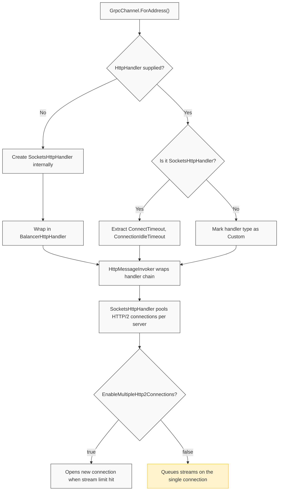
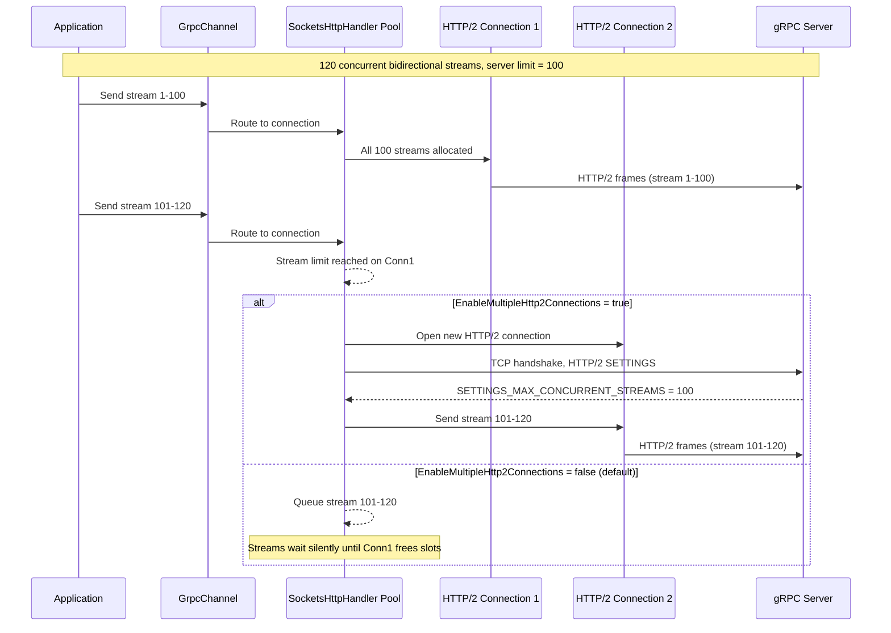

**TL;DR:** Does a single `GrpcChannel` really open just one HTTP/2 connection to a server, and if so, what happens when your concurrent streams exceed that connection's limit?
> **In plain English (30 sec):** Think of this like concepts you already use, but in a production system at scale.


## 1. The Engineering Problem

When you call `GrpcChannel.ForAddress("https://my-server")` and start firing concurrent unary RPCs or opening bidirectional streams, the channel feels like it handles unlimited parallelism. Under the hood, every `GrpcChannel` creates a single `SocketsHttpHandler` (when no handler is supplied), and that handler maintains **one HTTP/2 connection per server** by default.

HTTP/2 multiplexes many logical streams over a single TCP connection, but the server controls the ceiling via `SETTINGS_MAX_CONCURRENT_STREAMS` — typically 100. Once your application opens more concurrent calls than that limit, the `SocketsHttpHandler` connection pool **queues new streams** behind the existing ones. There is no error, no exception, and no log entry. Requests simply wait.

For a background worker sending 50 unary RPCs per second, this is invisible. For a high-concurrency microservice handling 500+ simultaneous bidirectional streams against the same server, the queue grows, latency spikes, and deadlines start failing — with no obvious root cause because the client never reports a connection error.

## 2. The Technical Solution

The fix lives inside `SocketsHttpHandler`, not in `GrpcChannel` itself. Starting with .NET 5, `SocketsHttpHandler` exposes `EnableMultipleHttp2Connections` — a flag that tells the connection pool to open a **second** HTTP/2 connection to the same server when the first connection's stream limit is reached.

The `GrpcChannel` constructor in `grpc-dotnet` detects whether the supplied handler is a `SocketsHttpHandler` and extracts its configuration:



When the handler is a plain `SocketsHttpHandler` without `EnableMultipleHttp2Connections`, the pool enforces a single HTTP/2 connection. With the flag set to `true`, a second (and third, ...) connection is established the moment the first reaches its concurrent-stream ceiling. The pool then load-balances new streams across available connections.



Three core truths to hold:

1. **`GrpcChannel` does not own the connection pool.** The pool lives in `SocketsHttpHandler`. The channel is just an abstraction that routes gRPC calls through the handler's HTTP/2 transport.
2. **One connection is the default, not a bug.** The HTTP/2 spec recommends a single connection per origin. The problem is that service-to-service communication (where a few callers open hundreds of streams) violates the assumption behind that recommendation.
3. **Queueing is silent.** There is no timeout, no log, and no exception when streams are queued behind the connection limit. The only symptom is rising latency and eventual deadline expiration.

## 3. The Clean Example

A minimal gRPC client configured to allow multiple HTTP/2 connections:

```csharp
using Grpc.Net.Client;
using SocketsHttpHandler = System.Net.Http.SocketsHttpHandler;

// Create a handler that allows multiple HTTP/2 connections per server.
// Without this, all concurrent streams share one connection.
var handler = new SocketsHttpHandler
{
    // Opens additional HTTP/2 connections when the first hits its
    // SETTINGS_MAX_CONCURRENT_STREAMS limit (default: 100).
    EnableMultipleHttp2Connections = true,

    // Keep connections alive for 15 minutes to respect DNS changes.
    PooledConnectionLifetime = TimeSpan.FromMinutes(15),

    // Idle connections are cleaned up after 2 minutes.
    PooledConnectionIdleTimeout = TimeSpan.FromMinutes(2)
};

// Pass the handler to GrpcChannel via GrpcChannelOptions.
var channel = GrpcChannel.ForAddress(
    "https://my-grpc-server",
    new GrpcChannelOptions { HttpHandler = handler });

// All calls through this channel now benefit from the connection pool.
var client = new Greeter.GreeterClient(channel);
```

Without `EnableMultipleHttp2Connections`, a burst of 200 concurrent unary RPCs would queue 100 of them on the single connection. With the flag, the pool transparently opens a second connection and distributes the load.

## 4. Production Reality (from grpc/grpc-dotnet)

The real `GrpcChannel` constructor detects the handler type and extracts connection settings:

```csharp
// File: src/Grpc.Net.Client/GrpcChannel.cs
// How GrpcChannel identifies the handler and extracts timeout settings.

if (HttpRequestHelpers.HasHttpHandlerType(
        channelOptions.HttpHandler,
        "System.Net.Http.SocketsHttpHandler"))
{
    var socketsHttpHandler = HttpRequestHelpers
        .GetHttpHandlerType<SocketsHttpHandler>(channelOptions.HttpHandler)!;

    return new HttpHandlerContext(
        HttpHandlerType.SocketsHttpHandler,
        socketsHttpHandler.ConnectTimeout,
        GetConnectionIdleTimeout(socketsHttpHandler));
}
```

And when no handler is supplied, the channel creates one internally:

```csharp
// File: src/Grpc.Net.Client/GrpcChannel.cs
// Internal HTTP invoker creation when no handler is provided.

private HttpMessageInvoker CreateInternalHttpInvoker(
    HttpMessageHandler? handler)
{
    if (handler == null)
    {
        // Creates a SocketsHttpHandler by default on .NET Core.
        if (!HttpHandlerFactory.TryCreatePrimaryHandler(out handler))
        {
            throw HttpHandlerFactory.CreateUnsupportedHandlerException();
        }
    }

    // Wrap in BalancerHttpHandler for load balancing support.
    handler = new BalancerHttpHandler(handler, ConnectionManager);

    // HttpMessageInvoker is faster than HttpClient for gRPC.
    var httpInvoker = new HttpMessageInvoker(
        handler, disposeHandler: true);

    return httpInvoker;
}
```

The `ConnectionIdleTimeout` extraction logic reveals how the pool manages connection lifecycle:

```csharp
// File: src/Grpc.Net.Client/GrpcChannel.cs
// ConnectionIdleTimeout is the larger of idle timeout and lifetime.

static TimeSpan? GetConnectionIdleTimeout(
    SocketsHttpHandler socketsHttpHandler)
{
    if (socketsHttpHandler.PooledConnectionIdleTimeout
        == Timeout.InfiniteTimeSpan)
    {
        return socketsHttpHandler.PooledConnectionLifetime;
    }

    if (socketsHttpHandler.PooledConnectionLifetime
        == Timeout.InfiniteTimeSpan)
    {
        return socketsHttpHandler.PooledConnectionIdleTimeout;
    }

    return socketsHttpHandler.PooledConnectionIdleTimeout
        > socketsHttpHandler.PooledConnectionLifetime
        ? socketsHttpHandler.PooledConnectionIdleTimeout
        : socketsHttpHandler.PooledConnectionLifetime;
}
```

What this teaches that a hello-world cannot:

- **Handler detection is reflection-based.** `HasHttpHandlerType` checks the handler's full type name string, not its runtime type — because `DelegatingHandler` chains can wrap the real handler several layers deep.
- **`HttpMessageInvoker` over `HttpClient`.** The channel uses `HttpMessageInvoker` directly to skip `HttpClient`'s client-side features (automatic redirects, cookie handling) that gRPC doesn't use, gaining measurable performance in tight call loops.
- **Idle timeout is the max of two settings.** The channel uses whichever is larger — `PooledConnectionIdleTimeout` or `PooledConnectionLifetime` — because connections must survive at least as long as the shorter of the two timeouts. This prevents premature eviction of connections that are still within their lifetime.
- **`BalancerHttpHandler` wraps the handler unconditionally.** Even without load balancing configured, the channel inserts its own `DelegatingHandler` into the chain — this is the extension point for future subchannel routing.

## 5. Review Checklist

- [ ] **Is `EnableMultipleHttp2Connections` set?** If your service opens more than 100 concurrent gRPC streams to the same server, the default single-connection pool will silently queue them. Set `EnableMultipleHttp2Connections = true` on the `SocketsHttpHandler`.
- [ ] **Is `PooledConnectionLifetime` configured?** The default is infinite — connections never close, so DNS changes are never picked up. Set a finite value (e.g. 15 minutes) to force periodic re-resolution.
- [ ] **Is the handler a `SocketsHttpHandler`?** If you pass a custom `DelegatingHandler` chain or an `HttpClientHandler`, `GrpcChannel` marks the handler type as `Custom` and loses access to advanced connectivity features like load balancing and idle timeout extraction.
- [ ] **Are you reusing the `GrpcChannel`?** Creating a new channel per call creates a new `SocketsHttpHandler` and connection pool per call — the opposite of connection reuse. One channel per target server, shared across all callers.

## 6. FAQ

**Q: Why doesn't `GrpcChannel` set `EnableMultipleHttp2Connections = true` by default?**

A: Because the channel delegates all HTTP transport configuration to the handler. The channel's design principle is that `GrpcChannelOptions.HttpHandler` gives you full control over the transport layer. Defaulting `EnableMultipleHttp2Connections` would change behavior for users who don't need multiple connections and might surprise those relying on single-connection semantics for flow control or debugging.

**Q: How many connections does `EnableMultipleHttp2Connections` actually create?**

A: As many as needed, up to the server's concurrent-stream limit. Each new connection is opened when the existing connections have no available stream slots. There is no hard cap in the handler — the practical limit is the server's `SETTINGS_MAX_CONCURRENT_STREAMS` multiplied by the number of connections the pool creates.

**Q: Does `IHttpClientFactory` affect the gRPC connection pool?**

A: Yes. When you use `Grpc.Net.ClientFactory` (the gRPC integration with `IHttpClientFactory`), the factory creates and manages the `SocketsHttpHandler` lifetime. Each named client gets its own handler and therefore its own connection pool. You must configure `EnableMultipleHttp2Connections` on the handler provided to the factory, not on the channel directly.

**Q: What happens if the server sends a `GOAWAY` frame?**

A: The `SocketsHttpHandler` pool drains the affected connection — existing streams complete, but no new streams are assigned to it. If `EnableMultipleHttp2Connections` is true, a new connection is opened to replace the drained one. Without it, all new streams queue until the drained connection fully closes and a replacement is established.

**Q: Can I use `MaxConnectionsPerServer` instead of `EnableMultipleHttp2Connections`?**

A: No. `MaxConnectionsPerServer` controls TCP connections for HTTP/1.1. For HTTP/2, the equivalent is `EnableMultipleHttp2Connections` (which has no numeric limit — it creates as many connections as the stream ceiling requires). This distinction exists because HTTP/2 connection management is fundamentally different from HTTP/1.1's one-request-per-connection model.

## Source

- **Concept:** HTTP/2 connection pooling via `SocketsHttpHandler`
- **Domain:** dotnet
- **Repo:** [grpc/grpc-dotnet](https://github.com/grpc/grpc-dotnet) → [`src/Grpc.Net.Client/GrpcChannel.cs`](https://github.com/grpc/grpc-dotnet/blob/master/src/Grpc.Net.Client/GrpcChannel.cs) — the .NET gRPC client implementation that wraps `HttpClient` and `SocketsHttpHandler`


