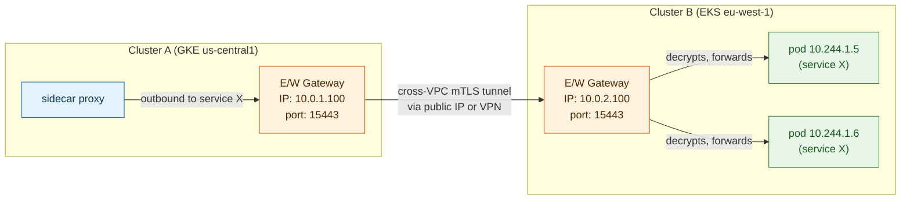
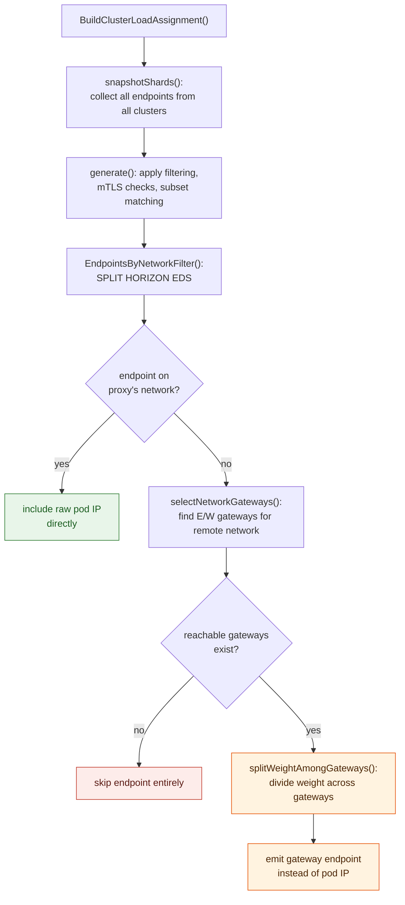

**TL;DR:** Can two Kubernetes clusters on different clouds share a single Istio service mesh when their pod CIDRs are entirely unreachable from each other? Istio's answer is the **east-west (E/W) gateway** — a dedicated Envoy deployed at the edge of each cluster that accepts cross-network traffic and tunnels it into the destination cluster. The control plane (Pilot) doesn't expose every remote pod IP as a direct endpoint. Instead, the `EndpointsByNetworkFilter` in the endpoint builder *replaces* remote-network pod IPs with the E/W gateway's own address, weighted across multiple gateways for load spreading. The filter is not optional decoration — without it, the mesh silently generates EDS entries pointing at unreachable private IPs.

> **In plain English (30 sec):** Code you already write — Map, function, API call, just bigger.

## 1. The Engineering Problem: pod IPs across cloud VPCs are unreachable from each other

A single Kubernetes cluster has a flat pod network — any pod can reach any other pod by IP. The moment you split a workload across two clusters in different VPCs (say, GKE in `us-central1` and EKS in `eu-west-1`), that flat network assumption collapses. Pod CIDRs don't overlap, can't be peered simply, and cloud firewall rules don't cross account boundaries without explicit peering or VPN tunnels.

Istio's control plane (Pilot) aggregates endpoint information from all clusters into a shared `EndpointIndex`. A sidecar proxy in cluster-A needs to load-balance across pods in cluster-B. But Pilot can't just hand cluster-A's proxy the raw IP addresses of cluster-B's pods — those IPs are unreachable. The mesh needs a hop in between: a gateway that is routable from cluster-A and can forward traffic into cluster-B's pod network. This is the east-west gateway — distinct from the more familiar north-south ingress gateway because its purpose is *intra-mesh* cross-network routing, not external traffic entry.

The problem is compounded when there are multiple gateways per cluster (for HA), when endpoints span three or more networks, and when the same service has pods in some networks but not others. The endpoint generation logic must selectively replace unreachable IPs with weighted gateway addresses, and it must do this per-proxy, since the set of reachable networks differs from each sidecar's vantage point.

---

## 2. The Technical Solution: the endpoint builder replaces remote IPs with E/W gateway addresses

Istio solves this in two layers. First, each cluster deploys E/W gateways that accept mTLS (sidecar mode) or HBONE (ambient mode) traffic on a known port and forward it into the cluster's pod network. Second, Pilot's endpoint builder (`EndpointBuilder`) runs a **Split Horizon EDS filter** (`EndpointsByNetworkFilter`) that rewrites what each proxy sees: endpoints on the proxy's own network are passed through directly; endpoints on remote networks are replaced with the E/W gateway's address, with load distributed proportionally across all available gateways.



The `EndpointsByNetworkFilter` function (in `pilot/pkg/xds/endpoints/ep_filters.go`) is the heart of this rewriting. It iterates every endpoint locality group, and for each individual endpoint it checks: is this endpoint on the same network as the calling proxy? If yes, include the raw endpoint IP. If no, look up the E/W gateways for that remote network, split the endpoint's weight across those gateways, and emit a gateway endpoint instead.



The filter also handles the case where no E/W gateways are reachable for a remote network — the endpoint is silently dropped rather than generating an unreachable EDS entry. In ambient mode (non-sidecar proxies), the gateway endpoint uses a double-HBONE tunnel via an internal `inner_connect_originate` listener instead of legacy mTLS, but the structural logic is the same: replace the pod IP with a gateway address.

---

## 3. The clean example (concept in isolation)

```go
// Simplified version of EndpointsByNetworkFilter logic.
// Shows the core decision: same-network endpoints pass through,
// remote-network endpoints get replaced with E/W gateway addresses.

func FilterEndpointsByNetwork(
    endpoints []*LocalityEndpoints,
    proxyNetwork network.ID,
    gateways []NetworkGateway,
) []*LocalityEndpoints {

    filtered := make([]*LocalityEndpoints, 0)

    for _, ep := range endpoints {
        localEndpoints := &LocalityEndpoints{}

        // Track gateway weights for remote endpoints
        gatewayWeights := make(map[NetworkGateway]uint32)

        for i, lbEp := range ep.LbEndpoints {
            epNetwork := ep.IstioEndpoints[i].Network

            if epNetwork == proxyNetwork || len(gateways) == 0 {
                // Same network or no gateways configured: pass through directly
                localEndpoints.append(ep.IstioEndpoints[i], lbEp)
            } else {
                // Remote network: replace with weighted gateway endpoints
                weight := lbEp.LoadBalancingWeight.Value
                weightPerGw := weight / uint32(len(gateways))
                for _, gw := range gateways {
                    gatewayWeights[gw] += weightPerGw
                }
            }
        }

        // Emit gateway endpoints for all remote traffic
        for gw, weight := range gatewayWeights {
            gwEp := buildGatewayEndpoint(gw, weight)
            localEndpoints.append(&IstioEndpoint{Network: gw.Network}, gwEp)
        }

        localEndpoints.refreshWeight()
        filtered = append(filtered, localEndpoints)
    }

    return filtered
}
```

---

## 4. Production reality (from `istio/istio`)

The real `EndpointsByNetworkFilter` is substantially more complex than the simplified version above. It handles ambient vs. sidecar mode, IP-family filtering, waypoint proxies, and the `forceGateway` edge case where a proxy has no network label but gateways are configured:

```go
// pilot/pkg/xds/endpoints/ep_filters.go
// EndpointsByNetworkFilter is a network filter function to support Split Horizon EDS -
// filter the endpoints based on the network of the connected sidecar.
func (b *EndpointBuilder) EndpointsByNetworkFilter(endpoints []*LocalityEndpoints) []*LocalityEndpoints {
    // If we don't have multiple networks, we just return the plain endpoints.
    if !b.gateways().IsMultiNetworkEnabled() && (!features.EnableAmbientMultiNetwork || isSidecarProxy(b.proxy)) {
        return endpoints
    }

    filtered := make([]*LocalityEndpoints, 0)
    scaleFactor := b.gateways().GetLBWeightScaleFactor()
    if scaleFactor == 0 {
        scaleFactor = 1
    }

    for _, ep := range endpoints {
        lbEndpoints := &LocalityEndpoints{
            llbEndpoints: endpoint.LocalityLbEndpoints{
                Locality: ep.llbEndpoints.Locality,
                Priority: ep.llbEndpoints.Priority,
            },
        }
        gatewayWeights := make(map[model.NetworkGateway]uint32)

        for i, lbEp := range ep.llbEndpoints.LbEndpoints {
            istioEndpoint := ep.istioEndpoints[i]
            if !b.proxyView.IsVisible(istioEndpoint) {
                continue
            }

            epNetwork := istioEndpoint.Network
            epCluster := istioEndpoint.Locality.ClusterID
            gateways := b.selectNetworkGateways(epNetwork, epCluster)
            reachableGateways := b.filterGatewaysByIPFamily(gateways)

            // Ambient mode: skip remote endpoints with no reachable E/W gateway
            if !b.proxy.InNetwork(epNetwork) && features.EnableAmbientMultiNetwork {
                if len(reachableGateways) == 0 {
                    log.Warnf("Workload %s on network %s has no reachable E/W gateway, skipping",
                        istioEndpoint.WorkloadName, epNetwork)
                    continue
                }
            }

            weight := b.scaleEndpointLBWeight(lbEp, scaleFactor)
            if lbEp.GetLoadBalancingWeight().GetValue() != weight {
                lbEp = protomarshal.Clone(lbEp)
                lbEp.LoadBalancingWeight = &wrappers.UInt32Value{Value: weight}
            }

            // Directly reachable: same network or no gateways
            forceGateway := b.network == "" && epNetwork != "" && len(gateways) > 0
            if !forceGateway && (b.proxy.InNetwork(epNetwork) || len(gateways) == 0) {
                if util.GetEndpointHost(lbEp) != "" {
                    lbEndpoints.append(ep.istioEndpoints[i], lbEp)
                }
                continue
            }

            if len(reachableGateways) == 0 {
                continue
            }

            // Cross-network requires mTLS for SNI routing (sidecar mode)
            if (!features.EnableAmbientMultiNetwork || isSidecarProxy(b.proxy)) && !isMtlsEnabled(lbEp) {
                continue
            }

            splitWeightAmongGateways(weight, reachableGateways, gatewayWeights)
        }

        // Sort gateways for deterministic output, then emit weighted gateway endpoints
        gateways := maps.Keys(gatewayWeights)
        gateways = model.SortGateways(gateways)
        for _, gw := range gateways {
            epWeight := gatewayWeights[gw]
            gwEp := buildNetworkGatewayEndpoint(b, gw, epWeight)
            gwIstioEp := &model.IstioEndpoint{Network: gw.Network}
            lbEndpoints.append(gwIstioEp, gwEp)
        }

        lbEndpoints.refreshWeight()
        filtered = append(filtered, lbEndpoints)
    }
    return filtered
}
```

And `selectNetworkGateways` — the function that picks which E/W gateways to use — prefers gateways in the same cluster as the target endpoints to minimize an extra cross-cluster hop:

```go
// pilot/pkg/xds/endpoints/ep_filters.go
func (b *EndpointBuilder) selectNetworkGateways(nw network.ID, c cluster.ID) []model.NetworkGateway {
    // Prefer gateways matching both network AND cluster (reduces extra hops)
    gws := b.gateways().GatewaysForNetworkAndCluster(nw, c)
    if len(gws) == 0 {
        gws = b.gateways().GatewaysForNetwork(nw)
    }

    // Ambient mode: filter to gateways with HBONE port
    if features.EnableAmbientMultiNetwork && !isSidecarProxy(b.proxy) {
        var ambientGws []model.NetworkGateway
        for _, gw := range gws {
            if gw.HBONEPort == 0 {
                continue
            }
            ambientGws = append(ambientGws, gw)
        }
        return ambientGws
    }

    // Sidecar proxies: filter out ambient-only gateways (no mTLS port)
    if isSidecarProxy(b.proxy) {
        var sidecarGws []model.NetworkGateway
        for _, gw := range gws {
            if gw.Port == 0 {
                continue
            }
            sidecarGws = append(sidecarGws, gw)
        }
        return sidecarGws
    }

    return gws
}
```

What this teaches that a hello-world can't:

- **The `forceGateway` check handles a real operational gap: when `ISTIO_META_NETWORK` isn't set on a sidecar, the proxy's network is empty (`""`), but the endpoint has a real network and gateways exist.** Without this check, the proxy would treat the remote endpoint as directly reachable (because `InNetwork("")` returns true for any network) and generate a broken EDS entry pointing at an unreachable pod IP. The `forceGateway` path ensures gateway-based routing is used even when the proxy forgot to declare its own network — a common misconfiguration in production.

- **`scaleEndpointLBWeight` multiplies every endpoint's weight by a scale factor derived from the LCM of gateways-per-network and gateways-per-cluster.** This isn't arbitrary overhead — it ensures that when endpoint weight is divided among multiple gateways (`splitWeightAmongGateways` does integer division), the per-gateway weight doesn't round down to zero for small endpoint weights. The scale factor is the minimum value that prevents this rounding loss across all gateway topologies.

- **The ambient vs. sidecar code path diverges on the wire protocol for the gateway endpoint itself.** In sidecar mode, the gateway endpoint is a plain IP:port with mTLS metadata (`TLSMode: IstioMutual`). In ambient mode, it's an `inner_connect_originate` internal address that tells Envoy to establish a double-HBONE tunnel — an HBONE connection to the E/W gateway, which itself establishes a second HBONE connection to the destination pod. Same structural replacement of pod-with-gateway, completely different tunnel protocol underneath.

Known-stale fact: "east-west gateways" are sometimes described as optional add-ons for Istio multi-cluster — something you deploy if you want high availability but can live without for a basic setup. In reality, the `EndpointsByNetworkFilter` logic shows that without E/W gateways, Istio's endpoint generation for remote networks silently falls through to producing raw pod-IP EDS entries. In a same-network single-cluster setup this is fine (there are no remote networks to filter). In a true multi-network setup across cloud VPCs, these raw pod IPs are unreachable, and traffic fails without a clear error message — the filter's `len(reachableGateways) == 0` branch simply skips the endpoint rather than failing loudly. The gateway isn't a nice-to-have for HA; it's the only mechanism that makes cross-VPC routing work at all.

---

## 5. Review checklist

- **Does each cluster have E/W gateways deployed and registered in `MeshNetworks`?** Without them, the `EndpointsByNetworkFilter` finds zero reachable gateways for remote networks and silently drops every cross-cluster endpoint — services appear healthy locally but have zero members when queried from the other cluster.
- **Is `ISTIO_META_NETWORK` set on every sidecar proxy?** If it's missing, the proxy's network is `""`, and the `forceGateway` code path in `ep_filters.go` may or may not route through gateways correctly depending on whether gateways are configured for the endpoint's network. This is one of the most common production misconfigurations.
- **Are the E/W gateways' HBONE/mTLS ports open in the cloud firewall?** The gateway's address is substituted for the pod IP, but if port 15443 (mTLS) or the HBONE port is blocked by a security group or VPC firewall rule, the tunnel handshake fails at the transport layer, not at the Istio layer — the error surfaces as connection timeouts, not mesh configuration errors.
- **For multi-gateway HA, are gateway weights balanced?** `splitWeightAmongGateways` divides endpoint weight equally across all reachable gateways. If one gateway is significantly larger or more performant than another, the equal split means it gets the same share as the smaller one — there's no automatic capacity-aware weighting.
- **When using ambient mode, is `EnableAmbientWaypointMultiNetwork` and `EnableAmbientIngressMultiNetwork` correctly configured?** The filter explicitly checks these feature flags and skips remote-network endpoints for waypoints and ingress when they're disabled — a deliberate safety gate, not a default-on behavior.

---

## 6. FAQ

**Q: Can you run Istio multi-cluster without east-west gateways at all?**
A: Yes, but only within a single network. Istio supports "primary-remote" and "multi-primary" topologies where two clusters share a single network (shared VPC, peered VPCs with flat pod CIDR). In that case, `IsMultiNetworkEnabled()` returns false, and `EndpointsByNetworkFilter` returns the raw endpoints unmodified — pod IPs are directly reachable because the network is flat. The moment you cross cloud VPC boundaries without peering, you need E/W gateways.

**Q: How is an east-west gateway different from a Kubernetes Ingress gateway?**
A: An Ingress gateway handles north-south traffic (external clients entering the mesh). An E/W gateway handles intra-mesh cross-network traffic — it's not exposed to external clients at all, only to other Istio proxies in other networks. In Istio's implementation, the same `Gateway` resource type is used for both, but the E/W gateway is configured with a specific `istio-eastwestgateway` Helm chart that opens the mTLS/HBONE ports and disables external listeners.

**Q: What happens if one E/W gateway goes down — does the mesh fail open or closed?**
A: The `EndpointsByNetworkFilter` rebuilds gateway weights on every EDS push. When a gateway is removed from the `NetworkGateways` index (because its endpoint pod is deleted or unhealthy), subsequent EDS pushes redistribute weight across the remaining gateways. The transition isn't instant — there's a propagation delay from the gateway pod deletion through Pilot's endpoint push to Envoy's EDS update — but the mesh converges to the surviving gateways without manual intervention.

**Q: Does the endpoint filter work the same way for ambient (ztunnel) proxies as for sidecars?**
A: The filter's structural logic — same-network pass-through, remote-network gateway replacement — is identical. The difference is in the gateway endpoint's protocol: sidecars use a plain IP with mTLS metadata; ambient proxies use an `inner_connect_originate` internal address for double-HBONE tunneling. The ambient code path also checks additional feature flags (`EnableAmbientWaypointMultiNetwork`, `EnableAmbientIngressMultiNetwork`) that gate whether cross-network endpoints are generated at all for waypoints and ingress gateways.

---

## Source

- **Concept:** Split Horizon EDS and east-west gateway endpoint rewriting in Istio multi-cluster mesh
- **Domain:** multicloud
- **Repo:** [istio/istio](https://github.com/istio/istio) → [`pilot/pkg/xds/endpoints/ep_filters.go`](https://github.com/istio/istio/blob/master/pilot/pkg/xds/endpoints/ep_filters.go) — the `EndpointsByNetworkFilter`, `selectNetworkGateways`, and `splitWeightAmongGateways` functions that implement split-horizon endpoint rewriting; [`pilot/pkg/xds/endpoints/endpoint_builder.go`](https://github.com/istio/istio/blob/master/pilot/pkg/xds/endpoints/endpoint_builder.go) — the `EndpointBuilder.BuildClusterLoadAssignment` and `generate` methods that invoke the network filter; [`pilot/pkg/xds/eds.go`](https://github.com/istio/istio/blob/master/pilot/pkg/xds/eds.go) — the `EdsGenerator.buildEndpoints` that orchestrates per-cluster EDS generation for all connected proxies


