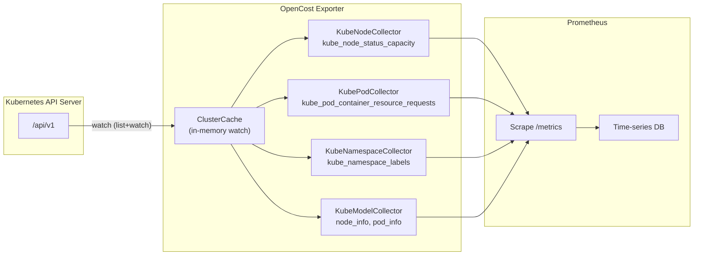
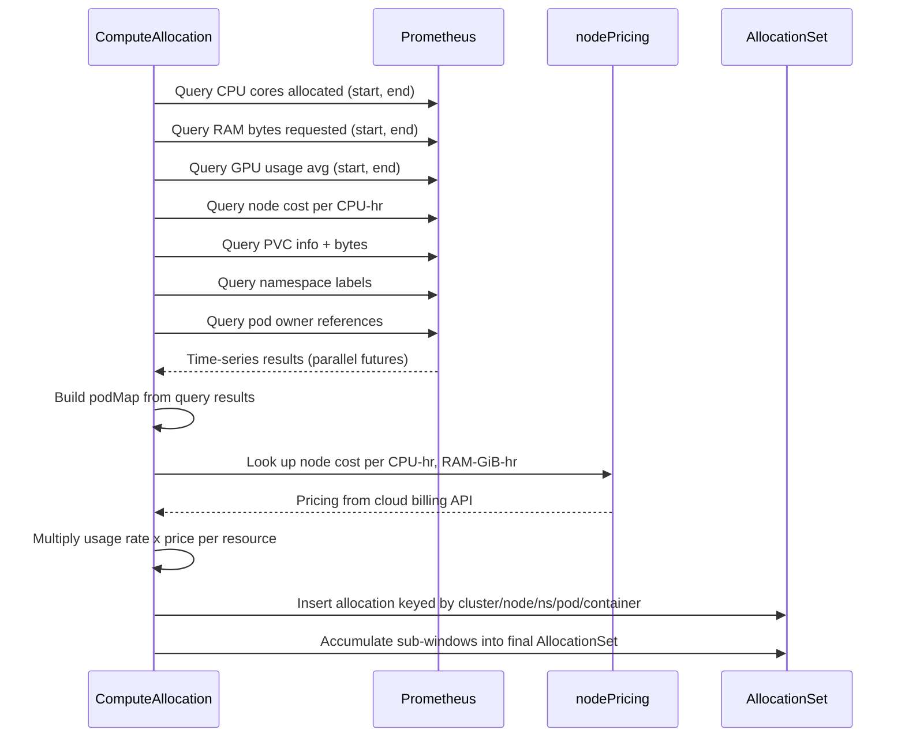

**TL;DR:** AWS Cost Explorer tells you how much you spent on EC2 last month, but it cannot tell you which Kubernetes namespace in that cluster consumed 400 CPU-core-hours of that spend. Kubecost's allocation engine solves this by querying real-time Prometheus metrics -- pod CPU requests, node pricing, PVC attachment -- and computing per-namespace, per-pod, per-container cost breakdowns that no cloud-billing API can provide alone.
> **In plain English (30 sec):** Think of this like concepts you already use, but in a production system at scale.


**Real repos:** [`opencost/opencost`](https://github.com/opencost/opencost) (OpenCost -- the open-source core of Kubecost) and [`kubecost/kubecost`](https://github.com/kubecost/kubecost) (the Kubecost Helm chart)

## 1. The Engineering Problem: cloud billing APIs know what you paid, not who used it

Your AWS bill says you spent $12,400 on EC2 in us-east-1 last month. Your GCP invoice breaks down Cloud SQL costs by project. But neither billing API knows that the `payments` namespace ran 8 pods requesting 2 CPU cores each for 720 hours, while the `analytics` namespace ran 2 pods requesting 0.5 cores for the same duration -- all on the same node pool. Cost Explorer sees the instance; Kubernetes sees the workload. The two views never meet.

This is the fundamental gap in multi-cloud FinOps: cloud providers bill at the infrastructure level (instances, volumes, load balancers), but platform teams need allocation at the workload level (namespace, pod, container, controller). Bridging that gap requires a system that reads real-time resource-usage metrics from the cluster itself -- CPU cores allocated, RAM bytes requested, GPU utilization, PVC bytes consumed -- and multiplies them by the per-resource pricing that comes from the cloud billing APIs. No single data source alone is sufficient.

---

## 2. The Technical Solution: custom Prometheus collectors feed a query-driven allocation engine

OpenCost (the open-source core that Kubecost is built on) solves this with a two-layer architecture. The first layer is a set of **custom Prometheus collectors** that watch the Kubernetes API server cache and emit metrics in a format Prometheus can scrape -- `kube_node_status_capacity`, `kube_pod_container_resource_requests`, `kube_namespace_labels`, and dozens more. These are not pulled from kube-state-metrics; they are generated directly from the same in-memory cluster cache that the cost model uses, which means they are always current with the API server's view of the cluster.

The second layer is the **allocation engine** (`ComputeAllocation`), which fires a burst of parallel Prometheus queries -- CPU allocated, RAM limits, GPU usage, network transfer bytes, PV costs, load balancer costs, namespace labels, pod annotations, controller ownership -- and stitches the results into an `AllocationSet` keyed by `cluster/node/namespace/pod/container`. Each allocation carries its own cost, computed by multiplying the resource-usage rate by the node's per-hour pricing (which itself comes from the cloud provider's billing API, reconciled into a `nodePricing` struct).





The allocation key -- `cluster/node/namespace/pod/container` -- is what makes per-namespace rollups possible. Every allocation carries its namespace label, so aggregating by namespace is a simple `sum` over the allocation set. This is fundamentally different from Cost Explorer, which would require you to tag every EC2 instance with a namespace label manually (and could never track pod-level churn within that instance).

---

## 3. The clean example (concept in isolation)

```go
// A minimal allocation key that ties a workload to its cost center
type AllocationKey struct {
    Cluster   string
    Node      string
    Namespace string
    Pod       string
    Container string
}

// Allocation holds the cost of one container over a time window
type Allocation struct {
    Key       AllocationKey
    CPUUsage  float64 // core-hours
    RAMUsage  float64 // GiB-hours
    GPUCost   float64 // USD
    PVCCost   float64 // USD
    TotalCost float64 // USD
}

// ComputeCost multiplies resource usage rates by per-resource pricing
func (a *Allocation) ComputeCost(node NodePricing) {
    cpuCost := a.CPUUsage * node.CostPerCPUHour
    ramCost := a.RAMUsage * node.CostPerRAMGiBHour
    a.TotalCost = cpuCost + ramCost + a.GPUCost + a.PVCCost
}

// AggregateByNamespace rolls up all allocations into per-namespace totals
func AggregateByNamespace(allocs []Allocation) map[string]float64 {
    totals := map[string]float64{}
    for _, a := range allocs {
        totals[a.Key.Namespace] += a.TotalCost
    }
    return totals
}
```

---

## 4. Production reality (from `opencost/opencost`)

The real `KubeNodeCollector` implements the `prometheus.Collector` interface, reading directly from the in-memory `ClusterCache` and emitting metrics that Prometheus scrapes. Each metric is guarded by a disabled-metrics map so operators can turn off expensive emissions:

```go
// pkg/metrics/nodemetrics.go
// KubeNodeCollector is a prometheus collector that generates node sourced metrics.
type KubeNodeCollector struct {
    KubeClusterCache clustercache.ClusterCache
    metricsConfig    MetricsConfig
}

func (nsac KubeNodeCollector) Describe(ch chan<- *prometheus.Desc) {
    disabledMetrics := nsac.metricsConfig.GetDisabledMetricsMap()
    if _, disabled := disabledMetrics["kube_node_status_capacity"]; !disabled {
        ch <- prometheus.NewDesc("kube_node_status_capacity",
            "Node resource capacity.", []string{}, nil)
    }
    if _, disabled := disabledMetrics["kube_node_status_allocatable"]; !disabled {
        ch <- prometheus.NewDesc("kube_node_status_allocatable",
            "The allocatable for different resources of a node", []string{}, nil)
    }
    // ... kube_node_labels, kube_node_status_condition, etc.
}

func (nsac KubeNodeCollector) Collect(ch chan<- prometheus.Metric) {
    nodes := nsac.KubeClusterCache.GetAllNodes()
    disabledMetrics := nsac.metricsConfig.GetDisabledMetricsMap()

    for _, node := range nodes {
        nodeName := node.Name
        nodeUID := string(node.UID)

        for resourceName, quantity := range node.Status.Capacity {
            resource, unit, value := toResourceUnitValue(resourceName, quantity)
            if resource == "" {
                continue
            }
            if _, disabled := disabledMetrics["kube_node_status_capacity"]; !disabled {
                ch <- newKubeNodeStatusCapacityMetric(
                    "kube_node_status_capacity", nodeName,
                    resource, unit, nodeUID, value)
            }
        }
    }
}
```

The `toResourceUnitValue` helper normalizes Kubernetes resource quantities into a standard form that the cost model can multiply by pricing data:

```go
// pkg/metrics/kubemetrics.go
func toResourceUnitValue(resourceName v1.ResourceName,
    quantity resource.Quantity) (resource string, unit string, value float64) {
    resource = promutil.SanitizeLabelName(string(resourceName))
    switch resourceName {
    case v1.ResourceCPU:
        unit = "core"
        value = float64(quantity.MilliValue()) / 1000
        return
    case v1.ResourceMemory:
        unit = "byte"
        value = float64(quantity.Value())
        return
    case v1.ResourcePods:
        unit = "integer"
        value = float64(quantity.Value())
        return
    }
    resource = ""
    unit = ""
    value = 0.0
    return
}
```

The allocation engine fires all Prometheus queries in parallel, then stitches results into a pod map before building the final `AllocationSet`:

```go
// pkg/costmodel/allocation.go
func (cm *CostModel) computeAllocation(start, end time.Time) (
    *opencost.AllocationSet, map[nodeKey]*nodePricing, error) {

    podMap := map[podKey]*pod{}
    err := cm.buildPodMap(window, podMap, ingestPodUID, podUIDKeyMap)

    grp := source.NewQueryGroup()
    ds := cm.DataSource.Metrics()

    // Fire all Prometheus queries in parallel
    resChCPUCoresAllocated := source.WithGroup(grp,
        ds.QueryCPUCoresAllocated(start, end))
    resChRAMBytesAllocated := source.WithGroup(grp,
        ds.QueryRAMBytesAllocated(start, end))
    resChGPUsAllocated := source.WithGroup(grp,
        ds.QueryGPUsAllocated(start, end))
    resChNodeCostPerCPUHr := source.WithGroup(grp,
        ds.QueryNodeCPUPricePerHr(start, end))
    resChNodeCostPerRAMGiBHr := source.WithGroup(grp,
        ds.QueryNodeRAMPricePerGiBHr(start, end))
    resChPVCInfo := source.WithGroup(grp,
        ds.QueryPVCInfo(start, end))
    resChPodPVCAllocation := source.WithGroup(grp,
        ds.QueryPodPVCAllocation(start, end))
    resChNamespaceLabels := source.WithGroup(grp,
        ds.QueryNamespaceLabels(start, end))

    // Await all results, then apply to the pod map
    resCPUCoresAllocated, _ := resChCPUCoresAllocated.Await()
    resRAMBytesAllocated, _ := resChRAMBytesAllocated.Await()
    // ... (30+ parallel query futures)

    applyCPUCoresAllocated(podMap, resCPUCoresAllocated, podUIDKeyMap)
    applyRAMBytesAllocated(podMap, resRAMBytesAllocated, podUIDKeyMap)
    // ... (apply each result set to the pod map)

    // Build final AllocationSet keyed by cluster/node/namespace/pod/container
    for _, pod := range podMap {
        for _, alloc := range pod.Allocations {
            alloc.Name = fmt.Sprintf("%s/%s/%s/%s/%s",
                cluster, nodeName, namespace, podName, container)
            allocSet.Set(alloc)
        }
    }
    return allocSet, nodeMap, nil
}
```

What this teaches that a hello-world can't:

- **The collectors emit kube-state-metrics-compatible metric names (`kube_node_status_capacity`, `kube_pod_container_resource_requests`) but do NOT depend on kube-state-metrics being installed.** They read from the same in-memory `ClusterCache` that watches the API server directly, which means they are always in sync and have zero scrape-delay compared to a separate KSM deployment. The `EmitKubeStateMetrics` flag in `InitKubeMetrics` controls whether these collectors are registered at all, allowing operators who already run KSM to avoid double-emission.
- **`ComputeAllocation` batches Prometheus queries into `BatchDuration`-sized windows** to avoid exceeding Prometheus's maximum query duration. For a 30-day allocation request, it fires multiple parallel query batches, computes per-batch `AllocationSet` objects, then accumulates them. Annotations, labels, and services are propagated post-accumulation because `Properties.Intersection` does not carry map values through for performance reasons.
- **The `toResourceUnitValue` switch handles CPU as `MilliValue() / 1000` (core-hours) and memory as `Value()` (bytes)**, which is the exact normalization the cost model needs to multiply by `nodeCostPerCPUHr` and `nodeCostPerRAMGiBHr`. Getting this wrong by even a factor of 1024 (bytes vs GiB) would produce wildly incorrect cost allocations.

---

## 5. Review checklist

- [ ] Cloud billing APIs (AWS Cost Explorer, GCP Billing) provide infrastructure-level costs; Kubernetes allocation requires workload-level metrics from Prometheus
- [ ] OpenCost's custom Prometheus collectors read from an in-memory `ClusterCache`, not from kube-state-metrics, ensuring zero scrape-delay sync with the API server
- [ ] `ComputeAllocation` fires 30+ parallel Prometheus queries per time window and stitches results into an `AllocationSet` keyed by `cluster/node/namespace/pod/container`
- [ ] Node pricing (`nodeCostPerCPUHr`, `nodeCostPerRAMGiBHr`) comes from the cloud billing API and is applied to the resource-usage rates measured by Prometheus
- [ ] Per-namespace cost is a simple aggregation over the allocation set -- every allocation carries its namespace label
- [ ] Batched query windows prevent Prometheus timeout on long date ranges; results are accumulated post-hoc with labels/annotations propagated manually

---

## 6. FAQ

**Q: Can I use Kubecost without Prometheus?**
A: No. The allocation engine is fundamentally query-driven -- it fires PromQL queries against Prometheus for CPU allocation, RAM usage, GPU utilization, PVC attachment, network transfer, and node pricing. Without Prometheus (or a compatible query engine like Thanos/Mimir), `ComputeAllocation` has no data source.

**Q: How does this differ from `kubectl top`?**
A: `kubectl top` shows instantaneous resource usage (current CPU/memory). Kubecost's allocation engine computes cumulative resource-usage *rates* over a time window and multiplies them by per-resource pricing. You need the rate integration to get cost, not just instantaneous usage.

**Q: Does OpenCost replace AWS Cost Explorer?**
A: No. They are complementary. Cost Explorer tells you total cloud spend per service per account. OpenCost tells you how that spend is distributed across Kubernetes namespaces, pods, and containers. You still need Cost Explorer for non-Kubernetes AWS spend (S3, RDS, CloudFront, etc.).

**Q: What happens if a node's pricing changes mid-window (e.g., Spot price fluctuation)?**
A: The `nodePricing` struct is resolved per-query-window. For Spot instances, the cost per CPU-hour reflects the price at query time. Kubecost does not backfill historical Spot pricing from AWS Spot Price History; the allocation reflects the pricing snapshot used during computation.

**Q: Can I allocate costs by label instead of namespace?**
A: Yes. The allocation set carries pod labels, namespace labels, and annotations on every allocation. The API supports aggregation by any property: `aggregate=namespace`, `aggregate=label:team`, `aggregate=controller`, etc.

---

## Source

- **Concept:** Kubernetes cost allocation via real-time Prometheus metrics
- **Domain:** multicloud
- **Repos:** [opencost/opencost](https://github.com/opencost/opencost) (the open-source core of Kubecost) -- [`pkg/metrics/nodemetrics.go`](https://github.com/opencost/opencost/blob/develop/pkg/metrics/nodemetrics.go), [`pkg/metrics/namespacemetrics.go`](https://github.com/opencost/opencost/blob/develop/pkg/metrics/namespacemetrics.go), [`pkg/metrics/kubemetrics.go`](https://github.com/opencost/opencost/blob/develop/pkg/metrics/kubemetrics.go), [`pkg/metrics/podmetrics.go`](https://github.com/opencost/opencost/blob/develop/pkg/metrics/podmetrics.go), [`pkg/costmodel/allocation.go`](https://github.com/opencost/opencost/blob/develop/pkg/costmodel/allocation.go); [kubecost/kubecost](https://github.com/kubecost/kubecost) (the Helm chart and enterprise layer)


