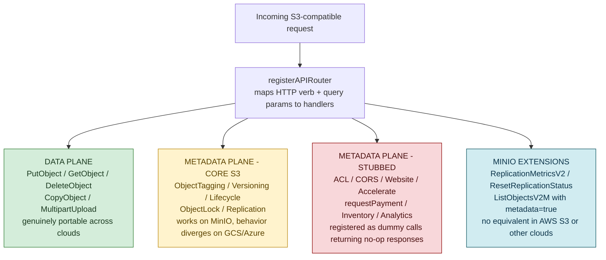
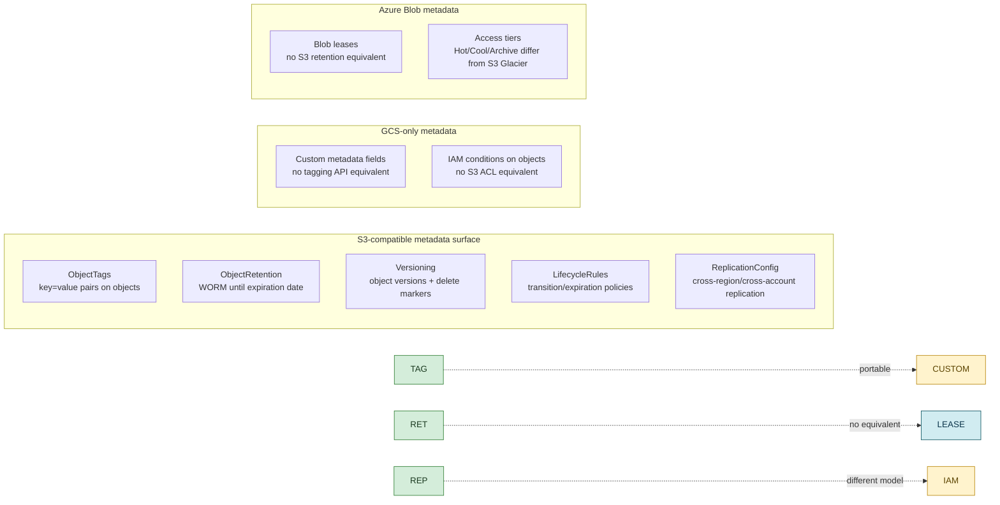

**TL;DR:** Can you really abstract S3, GCS, and Azure Blob behind one interface and expect identical behavior? MinIO's S3-compatible router shows the exact seam where abstraction breaks: the data plane (PUT/GET bytes) is genuinely portable, but the metadata plane — object tagging, retention policies, replication configuration, lifecycle rules — carries provider-specific semantics that surface as `notImplementedHandler` stubs, dummy ACL calls, and MinIO-specific extension APIs layered on top of S3's own surface. The abstraction holds for files; it fractures for metadata.

> **In plain English (30 sec):** Code you already write — Map, function, API call, just bigger.

**Real repo:** [`minio/minio`](https://github.com/minio/minio)

## 1. The Engineering Problem: S3 compatibility is a spectrum, not a boolean

"Works with S3" is the most common claim in multicloud object storage. But compatibility is not a single boolean — it's a spectrum spanning three distinct layers: the wire protocol (HTTP verbs, path-style vs virtual-hosted-style URLs), the core data operations (PutObject, GetObject, DeleteObject), and the metadata sub-system (tagging, retention, lifecycle, replication, legal hold, object lock). MinIO implements S3's API surface faithfully for the first two layers, but the third layer reveals an uncomfortable truth: S3's metadata operations are not just REST calls — they encode AWS-specific governance models (WORM compliance, cross-account replication, intelligent tiering) that don't have direct equivalents in other clouds.

The problem compounds when teams adopt a "cloud-agnostic" storage abstraction layer (like a Terraform module or a Go interface wrapper) expecting identical behavior across MinIO, S3, GCS, and Azure Blob. The abstraction holds cleanly for reading and writing bytes, but the moment a pipeline depends on object tagging for lifecycle routing, or retention policies for regulatory compliance, or replication metrics for DR verification — the abstraction leaks, and the leak is provider-specific.

---

## 2. The Technical Solution: a router that makes the abstraction's seams visible

MinIO's API router (`cmd/api-router.go`) is a single registration function that maps every S3 HTTP endpoint to a handler — and in doing so, it creates a concrete, readable catalog of exactly which S3 metadata operations are supported, which are stubbed out, and which are MinIO-specific extensions. The `rejectedObjAPIs` and `rejectedBucketAPIs` lists, combined with the "dummy call" comments, are the most honest documentation of S3 abstraction limits you'll find anywhere.



The critical design decision: MinIO doesn't silently fail on unsupported S3 features. It explicitly registers rejected APIs (`rejectedObjAPIs`, `rejectedBucketAPIs`) and dummy handlers (GetBucketACL, PutBucketACL, GetBucketCors, etc.) so that a client speaking full S3 gets deterministic HTTP responses rather than confusing 404s. This is better than most abstractions — it's honest about its limits.

The `ObjectInfo` struct in `cmd/object-api-datatypes.go` reveals the other side of the same coin: the metadata fields that MinIO *does* carry (`ReplicationStatus`, `VersionPurgeStatus`, `TransitionedObject`, `UserDefined` tags) are all S3-flavored. A GCS or Azure Blob backend would need a completely different struct — not because the data is different, but because the governance model that metadata describes is provider-specific.



Core truths: **the data plane is genuinely portable because bytes are bytes** — a 5 GB file stored via PutObject works identically across S3, MinIO, GCS, and Azure at the HTTP level; but **the metadata plane is not portable because governance models differ** — S3's object retention is a WORM compliance mechanism rooted in SEC Rule 17a-4, GCS has no equivalent, and Azure Blob's immutability policies have different semantics around legal holds versus time-based retention. **The "dummy call" pattern is actually the best an abstraction can do** — returning a success response with empty/zeroed data for features that don't exist, rather than failing or silently dropping the configuration.

---

## 3. The clean example (concept in isolation)

```go
// Simplified: how MinIO's router makes abstraction limits visible
// Each "notImplementedHandler" or dummy is an explicit honesty marker

// These are genuinely portable — data plane operations
router.Handle("PUT /{bucket}/{object}", putObjectHandler)       // works everywhere
router.Handle("GET /{bucket}/{object}", getObjectHandler)       // works everywhere
router.Handle("DELETE /{bucket}/{object}", deleteObjectHandler) // works everywhere

// These are S3-metadata — behavior diverges across providers
router.Handle("PUT /{object}?tagging", putObjectTaggingHandler)       // S3-only semantics
router.Handle("PUT /{object}?retention", putObjectRetentionHandler)   // WORM, no GCS equivalent
router.Handle("PUT /{bucket}?replication", putReplicationHandler)     // cross-account model is AWS-specific

// These are stubbed — S3 defines them, MinIO returns empty responses
router.Handle("GET /{bucket}?acl", getBucketACLHandler)     // dummy call
router.Handle("PUT /{bucket}?cors", putBucketCorsHandler)   // dummy call
router.Handle("GET /{bucket}?website", getBucketWebsiteHandler) // dummy call
```

---

## 4. Production reality (from `minio/minio`)

```go
// cmd/api-router.go — rejected APIs: S3 features MinIO explicitly declines

var rejectedObjAPIs = []rejectedAPI{
    {
        api:     "torrent",
        methods: []string{http.MethodPut, http.MethodDelete, http.MethodGet},
        queries: []string{"torrent", ""},
        path:    "/{object:.+}",
    },
    {
        api:     "acl",
        methods: []string{http.MethodDelete},
        queries: []string{"acl", ""},
        path:    "/{object:.+}",
    },
}

var rejectedBucketAPIs = []rejectedAPI{
    {api: "inventory",            methods: []string{http.MethodGet, http.MethodPut, http.MethodDelete}},
    {api: "cors",                 methods: []string{http.MethodPut, http.MethodDelete}},
    {api: "metrics",              methods: []string{http.MethodGet, http.MethodPut, http.MethodDelete}},
    {api: "website",              methods: []string{http.MethodPut}},
    {api: "logging",              methods: []string{http.MethodPut, http.MethodDelete}},
    {api: "accelerate",           methods: []string{http.MethodPut, http.MethodDelete}},
    {api: "requestPayment",       methods: []string{http.MethodPut, http.MethodDelete}},
    {api: "publicAccessBlock",    methods: []string{http.MethodDelete, http.MethodPut, http.MethodGet}},
    {api: "ownershipControls",    methods: []string{http.MethodDelete, http.MethodPut, http.MethodGet}},
    {api: "intelligent-tiering",  methods: []string{http.MethodDelete, http.MethodPut, http.MethodGet}},
    {api: "analytics",            methods: []string{http.MethodDelete, http.MethodPut, http.MethodGet}},
}
```

```go
// cmd/object-api-datatypes.go — ObjectInfo carries S3-native metadata

type ObjectInfo struct {
    Bucket      string
    Name        string
    ModTime     time.Time
    Size        int64
    ETag        string
    VersionID   string
    IsLatest    bool
    DeleteMarker bool

    ContentType     string
    ContentEncoding string
    CacheControl    string
    StorageClass    string

    // S3-specific governance fields — no direct GCS/Azure equivalent
    ReplicationStatus         replication.StatusType
    TransitionedObject        TransitionedObject
    VersionPurgeStatus        VersionPurgeStatusType

    // User metadata is a flat map — portable in shape, not in semantics
    UserDefined map[string]string
    UserTags    string
}
```

```go
// cmd/api-router.go — MinIO extension APIs that go BEYOND S3

// ListObjectsV2M: MinIO-specific variant that returns object metadata inline
router.Methods(http.MethodGet).
    HandlerFunc(s3APIMiddleware(api.ListObjectsV2MHandler)).
    Queries("list-type", "2", "metadata", "true")  // "metadata=true" is a MinIO extension

// ReplicationMetricsV2: MinIO extension for detailed replication status
router.Methods(http.MethodGet).
    HandlerFunc(s3APIMiddleware(api.GetBucketReplicationMetricsV2Handler)).
    Queries("replication-metrics", "2")  // not part of AWS S3 API

// ResetBucketReplicationStatus: MinIO extension to reset replication state
router.Methods(http.MethodGet).
    HandlerFunc(s3APIMiddleware(api.ResetBucketReplicationStatusHandler)).
    Queries("replication-reset-status", "")
```

What this teaches that a hello-world can't:

- **The "dummy call" handlers (GetBucketACL, PutBucketCors, GetBucketWebsite) are not failures — they're the most important part of the abstraction.** They return successful HTTP responses with empty/zeroed bodies so that an S3 client library doesn't throw errors when calling APIs that MinIO intentionally doesn't implement. This is the correct pattern for any storage abstraction: honest no-ops, not silent drops.
- **The `rejectedObjAPIs` and `rejectedBucketAPIs` lists are an explicit contract of what "S3-compatible" does NOT mean.** When MinIO says "S3-compatible," it means: these specific features (torrent, intelligent-tiering, analytics, inventory, ownershipControls, publicAccessBlock) are deliberately excluded. Any abstraction layer that claims broader compatibility than this list is lying about its coverage.
- **The `ObjectInfo` struct's metadata fields are S3-shaped, not cloud-neutral.** `ReplicationStatus` uses S3's own `replication.StatusType`, `TransitionedObject` models S3's Glacier-style tier transitions, and `UserTags` is a string-encoded S3 tag format (`key1=value1&key2=value2`). A genuinely cloud-agnostic struct would need provider-specific branches for each of these fields, which is precisely why most "cloud-agnostic" storage wrappers end up being S3-specific wrappers with a GCS/Azure adapter bolted on.
- **MinIO's extension APIs (ListObjectsV2M, ReplicationMetricsV2, ResetReplicationStatus) go beyond S3 in the opposite direction.** This means a client coded against MinIO's full API surface is not S3-portable either — it's MinIO-specific. The abstraction leak runs both ways: MinIO adds features AWS S3 doesn't have, just as AWS S3 has features MinIO stubs out.
- **The middleware stack (`s3APIMiddleware`) applies tracing, compression, and throttling uniformly** — meaning metadata-heavy operations (tagging, retention, lifecycle) pay the same middleware cost as data operations. In practice, this means a burst of PutObjectTagging calls triggers the same `maxClients` throttling as a burst of PutObject calls, even though the former touches metadata stores and the latter touches disk — a subtle performance trap for anyone assuming metadata operations are "lightweight."

Known-stale fact: "S3-compatible" is often treated as a binary — a product either is or isn't. In reality, it's a spectrum with at least three tiers: (1) core data operations (Put/Get/Delete/Copy) which are genuinely portable; (2) bucket-level metadata (versioning, lifecycle, replication) which works on MinIO but encodes AWS-specific governance semantics; and (3) service-level features (intelligent-tiering, analytics, inventory, access logging) which MinIO explicitly rejects. A storage abstraction that doesn't document which tier it covers is not documenting its limits.

---

## Review Checklist

Before relying on S3-compatible storage as a cloud-agnostic layer, verify:

- [ ] **Core data operations tested** — PutObject, GetObject, DeleteObject, CopyObject, and multipart uploads work end-to-end with your client library
- [ ] **Metadata operations audited** — Object tagging, retention, legal hold, and lifecycle rules either work on all target clouds or are gracefully skipped
- [ ] **Rejected APIs documented** — Know which S3 features your abstraction doesn't support (check MinIO's `rejectedObjAPIs` and `rejectedBucketAPIs` for the definitive list)
- [ ] **Dummy handlers verified** — ACL, CORS, website, accelerate, and other stubbed endpoints return expected empty responses rather than errors
- [ ] **Extension APIs are isolated** — If using MinIO-specific endpoints (ReplicationMetricsV2, ListObjectsV2M), ensure they're behind feature flags and not called by cloud-agnostic code paths
- [ ] **User metadata format is consistent** — `UserTags` string format (`key=value` pairs) and `UserDefined` map behavior match across providers
- [ ] **Replication semantics understood** — Cross-account replication in MinIO vs AWS S3 uses different IAM models; verify your DR strategy accounts for this
- [ ] **Transition/storage-class mapping** — `StorageClass` values differ (S3 Standard/IA/Glacier vs GCS Standard/Nearline/Coldline vs Azure Hot/Cool/Archive); map explicitly

---

## FAQ

**Q: Can I use MinIO as a drop-in replacement for AWS S3 in production?**

For the core data plane (Put/Get/Delete/Copy/Multipart), yes — MinIO's S3 API compatibility is tested against the AWS SDK. For metadata-heavy operations (retention, replication, lifecycle), verify each feature against MinIO's rejected API lists. MinIO is not a replacement for S3's governance features — it's a replacement for S3's data storage.

**Q: Why does MinIO implement "dummy" handlers instead of returning 401/403?**

S3 client libraries (AWS SDK, MinIO SDK) expect specific HTTP status codes for specific errors. A 401 or 403 from a bucket-level operation like GetBucketACL would trigger retry logic or credential refresh in the client. A successful 200 with an empty body is the correct S3-compatible behavior for "this feature exists in the protocol but is not implemented here" — it tells the client "you're authenticated, the operation succeeded, there's just nothing to return."

**Q: What happens if I call an API from MinIO's extension set against vanilla AWS S3?**

You'll get an `UnknownAPI` or `InvalidRequest` error. MinIO extensions (ReplicationMetricsV2, ResetReplicationStatus, ListObjectsV2M with `metadata=true`) use custom query parameters that AWS S3 doesn't recognize. Any client using these must gate them behind a capability check or provider detection.

**Q: Is the `ObjectInfo` struct portable across MinIO and AWS SDK?**

No. `ObjectInfo` is MinIO's internal Go struct, not part of the S3 HTTP protocol. The S3 protocol returns XML metadata in response headers and bodies; MinIO's `ObjectInfo` is a server-side representation. Client code using the AWS SDK works with `HeadObjectOutput`, `GetObjectOutput`, etc., which are S3-protocol-portable regardless of the backend.

**Q: Does MinIO support S3 Select (SQL queries on objects)?**

Yes — MinIO implements `SelectObjectContent` (the `?select&select-type=2` endpoint in the router). However, the SQL dialect and performance characteristics differ from AWS S3 Select. Test your queries against MinIO specifically, as some S3-specific functions or type behaviors may not be implemented identically.

---

## Source

- **Repository:** [`minio/minio`](https://github.com/minio/minio)
- **Router:** [`cmd/api-router.go`](https://github.com/minio/minio/blob/master/cmd/api-router.go) — the complete S3 API endpoint registration, including rejected/dummy handlers
- **Data types:** [`cmd/object-api-datatypes.go`](https://github.com/minio/minio/blob/master/cmd/object-api-datatypes.go) — `ObjectInfo` struct with S3-native metadata fields


