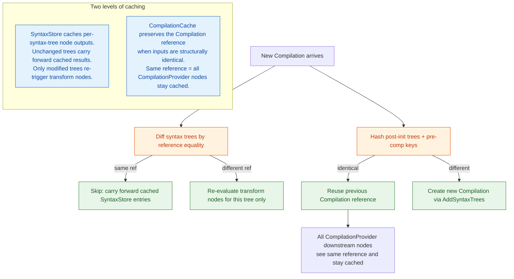

**TL;DR:** Why does Roslyn's incremental source generator pipeline cache individual syntax tree state rather than eagerly caching the entire Compilation result? Because a Compilation is a monolithic snapshot where any single file change invalidates everything — syntax trees, by contrast, are immutable, individually diffable, and cheap to compare by reference, so caching at that granularity lets the pipeline skip re-running transform nodes when only one file changed out of thousands, while a single `CompilationCache` layer at the top preserves the reference-equality contract that keeps every downstream generator's `CompilationProvider`-derived cache valid across runs.

> **In plain English (30 sec):** Memoization you already do: check Map first, only call DB on miss.

**Real repo:** [`dotnet/roslyn`](https://github.com/dotnet/roslyn)

---

## 1. The Engineering Problem: re-running every generator on every keystroke defeats the purpose of generation

A source generator receives a `Compilation` — the entire program's syntax trees, semantic models, options, references — and produces new source files. The naive `ISourceGenerator` API does exactly this: hand the generator the full compilation, let it produce output, merge the output back in. The problem is that the Compilation object changes on every keystroke that touches any source file, and there is no built-in mechanism for the generator to know *which part* of the compilation actually changed. If a project has 500 files and a developer edits one, the entire generator re-executes against the entire Compilation — all 500 files' syntax trees get walked, all semantic models get materialized, all transform steps re-run. For a project with multiple generators (DI source generation, JSON serialization, logging), this compounds: every file edit triggers N full-generation passes against the full program, even if only one generator cares about the one file that changed.

---

## 2. The Technical Solution: a pipeline of nodes that cache intermediate state per syntax tree, with a single Compilation-level cache at the top

The `IIncrementalGenerator` API replaces the monolithic "receive Compilation, produce output" model with a directed acyclic graph of transform nodes. Each node wraps a function that takes an input value and produces an output value, and the infrastructure caches the output of every node independently. The key insight driving the entire design is the distinction between two levels of caching:

- **Syntax tree caching (fine-grained):** Each `SyntaxTree` is immutable and reference-stable between compilations. The `SyntaxStore` maintains per-node state tables. When a new `Compilation` arrives, Roslyn diffs its syntax trees against the previous compilation's trees by reference equality. Unchanged trees are carried forward — their cached node outputs survive without re-execution. Only trees that are new, changed, or removed cause their associated transform nodes to re-run.

- **Compilation caching (coarse-grained, preserving downstream validity):** The `CompilationCache` at the driver level does not re-create the Compilation reference when all inputs (post-init trees, pre-compilation contributions) are structurally identical to the previous run. By preserving the same `Compilation` reference, every generator's `CompilationProvider`-derived caching stays valid — any node downstream of `CompilationProvider` that saw the same reference last time can short-circuit without even checking its own inputs.



The reason the pipeline does **not** cache the Compilation directly as its primary mechanism is that the Compilation is a single atomic snapshot — you cannot diff "half a Compilation." If you cached the whole Compilation and compared it as a unit, any single file change would invalidate the cache entirely, which is exactly the N-full-re-execution problem the incremental pipeline was built to solve. Syntax trees are the right caching boundary because they are individually immutable, individually diffable, and individually cheap to compare.

---

## 3. The Clean Example: caching per-node output in a pipeline of transforms

```csharp
// A generator pipeline: for each syntax tree, find classes with [MyAttribute],
// then collect their names into a single list.

// Node 1: per-syntax-tree input — walks ONE tree, returns attribute-bearing class names
IncrementalValuesProvider<string> classNames = context.SyntaxProvider
    .ForAttributeWithMetadataName(
        "MyApp.MyAttribute",
        predicate: (node, _) => node is ClassDeclarationSyntax,
        transform: (ctx, _) => ctx.TargetSymbol.Name);

// Node 2: aggregate — receives the COLLECTION from Node 1, produces final output
IncrementalValueProvider<ImmutableArray<string>> sorted = classNames
    .Collect()
    .Select((arr, _) => arr.Sort(Comparer<string>.Default));

// Registration (happens once at Initialize time, NOT per-build):
// context.RegisterSourceOutput(sorted, (spc, names) => { /* emit source */ });
//
// On a build where file B.cs changes but A.cs is untouched:
//   - Node 1 re-runs ONLY for B.cs trees (A.cs results cached from SyntaxStore)
//   - Node 2 re-runs because its input changed (the collected set)
//   - But Node 1 did NOT re-run for all 500 files — only the changed one
```

---

## 4. Production Reality (from `dotnet/roslyn`)

### 4.1 SyntaxStore — the per-tree caching engine

```csharp
// src/Compilers/Core/Portable/SourceGeneration/SyntaxStore.cs
internal sealed class SyntaxStore
{
    private readonly StateTableStore _tables;
    private readonly Compilation? _compilation;

    // ... (constructor omitted)

    public sealed class Builder
    {
        public IStateTable GetSyntaxInputTable(
            SyntaxInputNode syntaxInputNode,
            NodeStateTable<SyntaxTree> syntaxTreeTable)
        {
            // when we don't have a value for this node, we update all the syntax inputs at once
            if (!_tableBuilder.Contains(syntaxInputNode))
            {
                // CONSIDER: when the compilation is the same as previous,
                // the syntax trees must also be also be the same.
                // if we have a previous state table for a node,
                // we can just short circuit knowing that it is up to date
                var compilationIsCached = _compilation == _previous._compilation;

                // get a builder for each input node
                var syntaxInputBuilders = ArrayBuilder<(SyntaxInputNode node,
                    ISyntaxInputBuilder builder)>.GetInstance(_syntaxInputNodes.Length);

                foreach (var node in _syntaxInputNodes)
                {
                    // We don't cache the tracked incremental steps in a manner
                    // that we can easily rehydrate between runs, so we disable
                    // the cached compilation perf optimization when incremental
                    // step tracking is enabled.
                    if (compilationIsCached && !_enableTracking
                        && _previous._tables.TryGetValue(node, out var previousStateTable))
                    {
                        // COMPILATION UNCHANGED: reuse previous node table entirely
                        _tableBuilder.SetTable(node, previousStateTable);
                    }
                    else
                    {
                        // COMPILATION CHANGED: must re-evaluate this node
                        syntaxInputBuilders.Add((node,
                            node.GetBuilder(_previous._tables, _enableTracking)));
                    }
                }
                // ... (visit each changed tree, share SemanticModel across builders)
            }
        }
    }
# ... (1 lines omitted)
```

What this reveals: the **first check** is reference equality on the Compilation itself (`_compilation == _previous._compilation`). If the Compilation reference is the same object — which `CompilationCache` guarantees when inputs are unchanged — the entire syntax input table is reused without touching a single syntax tree. This is why `CompilationCache` preserving the reference is so important: it is the fast path that short-circuits everything below it.

### 4.2 CompilationCache — preserving the reference that keeps everything valid

```csharp
// src/Compilers/Core/Portable/SourceGeneration/CompilationCache.cs
internal sealed class CompilationCache
{
    public static readonly CompilationCache Empty = new();

    private readonly Compilation? _compilation;
    private readonly Compilation? _inputCompilation;
    private readonly ImmutableArray<SyntaxTree> _postInitTrees;
    private readonly ImmutableArray<PreCompCacheKey> _preCompKeys;

    internal sealed class Builder
    {
        public CompilationCache ToImmutableAndFree()
        {
            var preCompKeys = _preCompKeys.ToImmutableAndFree();
            var postInitTrees = _postInitTrees.ToImmutableAndFree();

            if (_previous._compilation is not null
                && ReferenceEquals(_previous._inputCompilation, _inputCompilation)
                && ReferenceSequenceEqual(_previous._postInitTrees, postInitTrees)
                && _previous._preCompKeys.AsSpan().SequenceEqual(preCompKeys.AsSpan()))
            {
                // Cache hit -- reuse the previous run's compilation reference.
                // This makes SharedInputNodes.Compilation report Cached for
                // every generator, which is the whole point of this cache.
                return _previous;
            }

            var newCompilation = preCompTreesToAdd.IsEmpty
                ? _compilationWithPostInit
                : _compilationWithPostInit.AddSyntaxTrees(preCompTreesToAdd);
            return new CompilationCache(newCompilation, _inputCompilation,
                postInitTrees, preCompKeys);
        }
    }
}
```

The comment is the design intent stated plainly: *"reuse the previous run's compilation reference... which makes SharedInputNodes.Compilation report Cached for every generator, which is the whole point of this cache."* The cache key is intentionally cheap — reference equality on the input Compilation, reference-sequence equality on post-init trees, and value equality on pre-comp cache keys (generator index + hint name + text reference + parse options reference). When all of those match, the same `Compilation` object reference is returned, and every downstream node that depends on `CompilationProvider` sees a cached reference and skips re-execution.

### 4.3 GeneratorState — what the infrastructure tracks per generator

```csharp
// src/Compilers/Core/Portable/SourceGeneration/GeneratorState.cs
internal readonly struct GeneratorState
{
    // The pipeline nodes registered by this generator at Initialize time
    internal ImmutableArray<SyntaxInputNode> InputNodes { get; }
    internal ImmutableArray<IIncrementalGeneratorOutputNode> OutputNodes { get; }

    // Generated output from the previous run — carried forward when pipeline
    // nodes report their outputs as cached
    internal ImmutableArray<GeneratedSyntaxTree> GeneratedTrees { get; }
    internal ImmutableArray<GeneratedSyntaxTree> PreCompilationTrees { get; }

    // Per-step execution traces — enables GetRunResult() diagnostics
    internal ImmutableDictionary<string, ImmutableArray<IncrementalGeneratorRunStep>>
        ExecutedSteps { get; }
    internal ImmutableDictionary<string, ImmutableArray<IncrementalGeneratorRunStep>>
        OutputSteps { get; }
}
```

`GeneratorState` carries forward the previous run's output (`GeneratedTrees`, `PreCompilationTrees`) and the registered pipeline shape (`InputNodes`, `OutputNodes`). When the driver re-runs, it walks the pipeline: if a node's inputs haven't changed, the cached output from the previous `GeneratorState` is used. The `ExecutedSteps` / `OutputSteps` dictionaries are populated during each run for diagnostic introspection — they record which steps actually executed and what their run reason was (`Cached`, `CandidateCached`, `New`, `Removed`, `Modified`), enabling generators to be debugged for caching performance.

---

## 5. Review Checklist

- [ ] The old `ISourceGenerator` API gave generators the full Compilation every time; `IIncrementalGenerator` builds a pipeline of nodes that cache intermediate results independently.
- [ ] Syntax trees are the right caching boundary: individually immutable, individually diffable by reference, and individually cheap to compare — a Compilation is a single atomic snapshot that cannot be partially cached.
- [ ] `SyntaxStore` checks `_compilation == _previous._compilation` (reference equality) as its first fast path: when the Compilation reference is the same, all syntax input tables carry forward without touching any tree.
- [ ] `CompilationCache` preserves the `Compilation` reference when post-init trees and pre-compilation contributions are structurally identical — this is what makes `SyntaxStore`'s fast path work.
- [ ] `CompilationCache` uses reference equality for the input Compilation and post-init trees, not deep structural comparison — the cost of deep comparison would negate the cache's benefit.
- [ ] Each `IncrementalGeneratorRunStep` records its run reason (`Cached`, `Modified`, `New`, `Removed`) — this is how `GetRunResult()` exposes which pipeline steps actually executed versus which were skipped.
- [ ] The pipeline is a DAG of nodes, not a flat function — a change in one syntax tree only re-triggers the transform nodes downstream of that specific tree, not all nodes in the pipeline.

---

## 6. FAQ

**Q: Why not just cache the Compilation directly and compare it structurally?**
A: A Compilation is a snapshot of the entire program — all syntax trees, all options, all references. Any single file edit creates a new Compilation. Structural comparison of two Compilations would require comparing every tree, every option, every reference, which is roughly as expensive as re-running the generator. Syntax trees are immutable and reference-stable: comparing two syntax trees by reference (`object.ReferenceEquals`) is O(1) and tells you instantly whether that tree changed.

**Q: What happens if a generator modifies the Compilation (by adding generated syntax trees)?**
A: Generated trees from the pre-compilation phase are tracked as part of the `CompilationCache` key via `PreCompCacheKey` (generator index + hint name + text reference + parse options reference). If the same generators produce the same trees with the same text, the cache key matches and the same `Compilation` reference is reused. If any pre-compilation tree changes, a new Compilation is created and the cache misses.

**Q: Does the caching work across editor sessions or only within a single build?**
A: Within a single build invocation. The `SyntaxStore` and `CompilationCache` live on `GeneratorDriverState`, which is held in memory for the duration of the build. Between builds (or when the editor restarts), the state is lost. Incremental benefits accrue within an IDE session where the driver is reused across edits.

**Q: Why does `SyntaxStore` disable the Compilation fast path when incremental step tracking is enabled?**
A: Step tracking (`_enableTracking`) records per-step execution traces for diagnostics. These traces are not persisted between runs in a way that can be rehydrated, so the infrastructure cannot safely short-circuit the step execution when tracking is active — it needs the steps to actually run (or be explicitly cached by the node logic) to produce accurate tracking data.

**Q: Can a generator opt out of incremental behavior?**
A: A generator that implements `IIncrementalGenerator` but registers a `CompilationProvider` (which provides the whole Compilation as input to a transform) will cause its downstream node to re-run whenever the Compilation reference changes — which is every build where any file changed. The generator is still incremental at the pipeline level, but if its pipeline's root input is the full Compilation, there is nothing to increment over. The recommendation is to use `SyntaxProvider` with targeted predicates to narrow the input as much as possible.

---

## Source

- **Concept:** Incremental source generator caching (syntax trees vs. compilation results)
- **Domain:** dotnet
- **Repo:** [dotnet/roslyn](https://github.com/dotnet/roslyn) → [`src/Compilers/Core/Portable/SourceGeneration/SyntaxStore.cs`](https://github.com/dotnet/roslyn/blob/main/src/Compilers/Core/Portable/SourceGeneration/SyntaxStore.cs) — the per-syntax-tree caching engine that diff trees by reference and carry forward cached node state.
- **Repo:** [dotnet/roslyn](https://github.com/dotnet/roslyn) → [`src/Compilers/Core/Portable/SourceGeneration/CompilationCache.cs`](https://github.com/dotnet/roslyn/blob/main/src/Compilers/Core/Portable/SourceGeneration/CompilationCache.cs) — the Compilation reference preservation layer whose cache hit keeps every downstream generator's CompilationProvider-derived node cached.
- **Repo:** [dotnet/roslyn](https://github.com/dotnet/roslyn) → [`src/Compilers/Core/Portable/SourceGeneration/GeneratorState.cs`](https://github.com/dotnet/roslyn/blob/main/src/Compilers/Core/Portable/SourceGeneration/GeneratorState.cs) — per-generator state carrying forward pipeline shape, previous outputs, and step execution traces.


