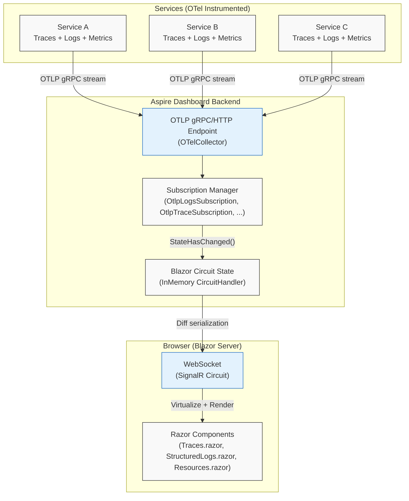
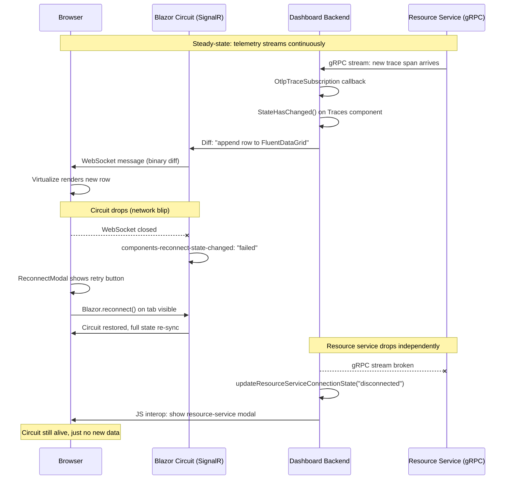

**TL;DR:** Why does the Aspire Dashboard show live-updating traces, structured logs, and resource state without ever hitting F5 — and what happens when the WebSocket behind the Blazor circuit drops?

> **In plain English (30 sec):** Code you already write — Map, function, API call, just bigger.

## 1. The Engineering Problem

The Aspire Dashboard must display four high-frequency telemetry streams simultaneously: resource state changes, structured logs, distributed traces, and metrics. Each stream is **server-initiated** — the back-end receives data from OTel exporters in each service and pushes it to the browser. HTTP long-polling would work, but it creates one request per stream per browser tab, doubles latency on every update (the browser must re-request after each response), and forces the server to hold open HTTP connections while waiting for new data.

For a developer console that may run for hours with dozens of resources emitting telemetry, long-polling quickly exhausts connection limits and produces a choppy experience — log entries arrive in bursts, traces appear with a visible delay, and resource state changes lag behind the actual Kubernetes pod lifecycle.

The fundamental problem is that HTTP request-response is pull-based, but telemetry is push-based. The dashboard needs a transport where the server can **write to the client at any time** without the client first asking.

## 2. The Technical Solution

The Aspire Dashboard solves this by running as a **Blazor Server** application. Blazor Server uses SignalR as its internal transport, giving every connected browser a persistent, bidirectional WebSocket connection (with automatic fallback to Server-Sent Events or long-polling when WebSockets are unavailable). The architecture has two distinct layers: the Blazor SignalR circuit that renders UI, and the gRPC streaming subscriptions that feed telemetry into the circuit.



The key insight is that Blazor Server's SignalR circuit is **not just a rendering transport** — it is the entire application runtime. The Razor components (`Traces.razor`, `StructuredLogs.razor`, `Resources.razor`) run on the server, not in the browser. When telemetry arrives via OTLP, the subscription manager invokes `StateHasChanged()` on the relevant component, which triggers Blazor's diff engine to compute the minimal DOM update and serialize it over the SignalR WebSocket.

The dashboard also manages **two independent connection health signals**: the Blazor circuit (SignalR WebSocket to the browser) and the resource service connection (gRPC channel from the dashboard to the Aspire resource service). The `app-reconnect.js` script handles both, with the circuit failure always taking precedence.



The two failure modes are critical to understand: when the **circuit drops**, the entire UI freezes and Blazor attempts automatic reconnection. When the **resource service drops**, the UI remains interactive (you can still filter, sort, and view existing data) but no new telemetry arrives until the gRPC stream is re-established. The `ReconnectModal` component distinguishes these cases — circuit failures show "Blazor circuit reconnecting" while resource service failures show "Resource service disconnected" with a retry button.

## 3. The Clean Example

A minimal Blazor component that subscribes to real-time trace updates and renders them with virtualization:

```csharp
@page "/traces"
@inject IStringLocalizer<Traces> Loc

<div class="datagrid-overflow-area continuous-scroll-overflow">
    <FluentDataGrid @ref="_dataGrid"
                    Virtualize="true"
                    GenerateHeader="GenerateHeaderOption.Sticky"
                    ItemsProvider="@GetData"
                    TGridItem="OtlpTrace"
                    OverscanCount="100"
                    ItemSize="46">
        <ChildContent>
            <AspireTemplateColumn Title="Timestamp">
                @FormatHelpers.FormatTimeWithOptionalDate(
                    TimeProvider,
                    context.FirstSpan.StartTime,
                    MillisecondsDisplay.Truncated)
            </AspireTemplateColumn>
            <AspireTemplateColumn Title="Name">
                <FluentHighlighter
                    HighlightedText="@TracesViewModel.FilterText"
                    Text="@context.FullName" />
            </AspireTemplateColumn>
            <AspireTemplateColumn Title="Duration">
                @DurationFormatter.FormatDuration(
                    context.Duration, CultureInfo.CurrentCulture)
            </AspireTemplateColumn>
        </ChildContent>
    </FluentDataGrid>
</div>

@code {
    private async ValueTask<ItemsProviderResult<OtlpTrace>> GetData(
        ItemsProviderRequest request)
    {
        // Data arrives via SignalR circuit, not HTTP polling.
        // The subscription callback triggers StateHasChanged(),
        // which causes FluentDataGrid to re-invoke GetData.
        var data = await TracesViewModel.GetTracesBatchAsync(
            request.StartIndex, request.Count);
        return new ItemsProviderResult<OtlpTrace>(
            data.Items, data.TotalCount);
    }
}
```

The `Virtualize` component is essential — a busy service can emit hundreds of spans per second, and rendering all of them into the DOM would freeze the browser. `Virtualize` only renders the visible rows plus the `OverscanCount` buffer, keeping DOM node count constant regardless of total trace count.

## 4. Production Reality (from dotnet/aspire)

The dashboard renders with `InteractiveServerRenderMode` and **prerendering disabled** — this means the SignalR WebSocket is established before any Razor component executes:

```csharp
// File: src/Aspire.Dashboard/Components/App.razor
// The head and body both use InteractiveServer with prerender: false.
// This ensures the SignalR circuit is fully connected before any
// component tries to subscribe to telemetry streams.

<HeadOutlet @rendermode="@(new InteractiveServerRenderMode(prerender: false))" />
<!-- ... -->
<Routes @rendermode="@(new InteractiveServerRenderMode(prerender: false))" />
```

`prerender: false` is a deliberate choice. With prerendering enabled, Blazor would render the initial HTML on the server without a circuit, then "hydrate" it client-side — during which telemetry subscriptions would fire but have nowhere to push updates. By disabling prerendering, the browser shows a loading state until the circuit is live, and every subscription is active from the first render.

The reconnect logic handles **two independent failure modes** — Blazor circuit (SignalR) and resource service (gRPC) — with circuit failures always taking precedence:

```javascript
// File: src/Aspire.Dashboard/wwwroot/js/app-reconnect.js
// Circuit mode always takes precedence over resource-service mode.
// When the circuit reconnects, the C# code will re-evaluate and
// re-trigger resource-service mode if still needed.
let currentMode = "none";

function handleReconnectStateChanged(event) {
    if (event.detail.state === "show") {
        currentMode = "circuit";
        setModalClass("components-reconnect-show");
        if (!reconnectModal.open) {
            reconnectModal.showModal();
        }
    } else if (event.detail.state === "hide") {
        currentMode = "none";
        setModalClass("");
        reconnectModal.close();
    } else if (event.detail.state === "failed") {
        currentMode = "circuit";
        setModalClass("components-reconnect-failed");
        document.addEventListener("visibilitychange",
            retryCircuitWhenDocumentBecomesVisible);
    } else if (event.detail.state === "rejected") {
        location.reload();
    }
}
```

The `app-reconnect.js` script also handles the resource service connection state via JS interop called from C#. The two connection health signals are tracked independently because the dashboard can remain interactive (filtering, sorting, navigating to trace details) even when the resource service is down — it just stops receiving new telemetry. Circuit failures are more severe: the entire UI stops responding because component event handlers execute on the server.

## 5. Review Checklist

- [ ] **Is prerendering disabled?** If you enable prerendering on a telemetry dashboard, components will execute their `OnInitialized` methods before the SignalR circuit is established. Any `IAsyncEnumerable` or subscription callback that fires during prerender will throw because there is no circuit to push updates to.
- [ ] **Is the circuit reconnect handler registered?** The `app-reconnect.js` script must load before Blazor's `blazor.web.js` to catch the initial connection state. If it loads after, the first disconnect event may be missed and the UI will freeze without a reconnect modal.
- [ ] **Are the two failure modes visible to operators?** Circuit disconnection (UI freezes, Blazor reconnects automatically) and resource service disconnection (UI stays responsive, no new data) require different remediation. If your dashboard only shows one generic "disconnected" message, operators cannot tell which layer is broken.
- [ ] **Is Virtualize configured with an appropriate OverscanCount?** The Aspire Dashboard uses `OverscanCount="100"` for its data grids. Too low causes visible blank rows during fast scrolling; too high defeats the purpose of virtualization for high-volume telemetry.

## 6. FAQ

**Q: Why doesn't the Aspire Dashboard use HTTP long-polling as a SignalR fallback instead of disabling it?**

A: It does — SignalR automatically negotiates the best available transport: WebSocket (preferred), Server-Sent Events, then long-polling. But for a telemetry dashboard, long-polling is a degraded experience, not a primary design target. The dashboard is designed for local development use (`dotnet run` opens the dashboard in a browser on the same machine), where WebSockets are always available. Long-polling fallback exists for environments where proxies strip WebSocket upgrade headers, but the latency and connection overhead make it unsuitable for high-frequency telemetry streams.

**Q: Can two browser tabs share the same Blazor circuit?**

A: No. Each browser tab opens its own SignalR connection and its own Blazor circuit. The dashboard backend maintains separate subscription state per circuit — each tab independently subscribes to telemetry streams. This means opening three tabs triples the gRPC subscription load on the dashboard backend. For local development with a handful of services this is fine; in a shared environment, it can be a scaling concern.

**Q: What happens to in-memory component state when the circuit reconnects?**

A: Blazor Server preserves component state across reconnections within the same circuit. However, if the server rejects the reconnection (circuit was garbage-collected during a long disconnect), `app-reconnect.js` calls `location.reload()`, which reinitializes everything from scratch. The dashboard components re-subscribe to telemetry streams on `OnInitializedAsync`, so the user sees a brief empty state before data repopulates.

**Q: Why are traces, logs, and metrics separate subscription channels instead of one multiplexed stream?**

A: Each telemetry type has different filtering, pagination, and lifecycle semantics. Structured logs support pause/resume and clear operations independently of traces. Metrics use a different subscription model with duration-based windows. Multiplexing would require complex demultiplexing logic on both the server and client, and the gRPC subscription channels are already efficient enough that the overhead of separate streams is negligible compared to the WebSocket transport.

**Q: Does the dashboard work without WebSockets entirely (e.g. behind a strict corporate proxy)?**

A: Yes. SignalR falls back to Server-Sent Events (one-way server-to-client) with HTTP POST for client-to-server messages, and then to long-polling if SSE is unavailable. The reconnection logic in `app-reconnect.js` is transport-agnostic — it only cares about the circuit state events, not the underlying transport. The user experience degrades (higher latency, more visible refreshes) but the dashboard remains functional.

## Source

- **Concept:** SignalR as Blazor Server transport for real-time telemetry streaming
- **Domain:** dotnet
- **Repo:** [dotnet/aspire](https://github.com/dotnet/aspire) → [`src/Aspire.Dashboard/Components/App.razor`](https://github.com/dotnet/aspire/blob/main/src/Aspire.Dashboard/Components/App.razor) — the root Blazor component that configures `InteractiveServerRenderMode(prerender: false)`, and [`src/Aspire.Dashboard/wwwroot/js/app-reconnect.js`](https://github.com/dotnet/aspire/blob/main/src/Aspire.Dashboard/wwwroot/js/app-reconnect.js) — the dual-mode reconnect handler for Blazor circuits and resource service connections


