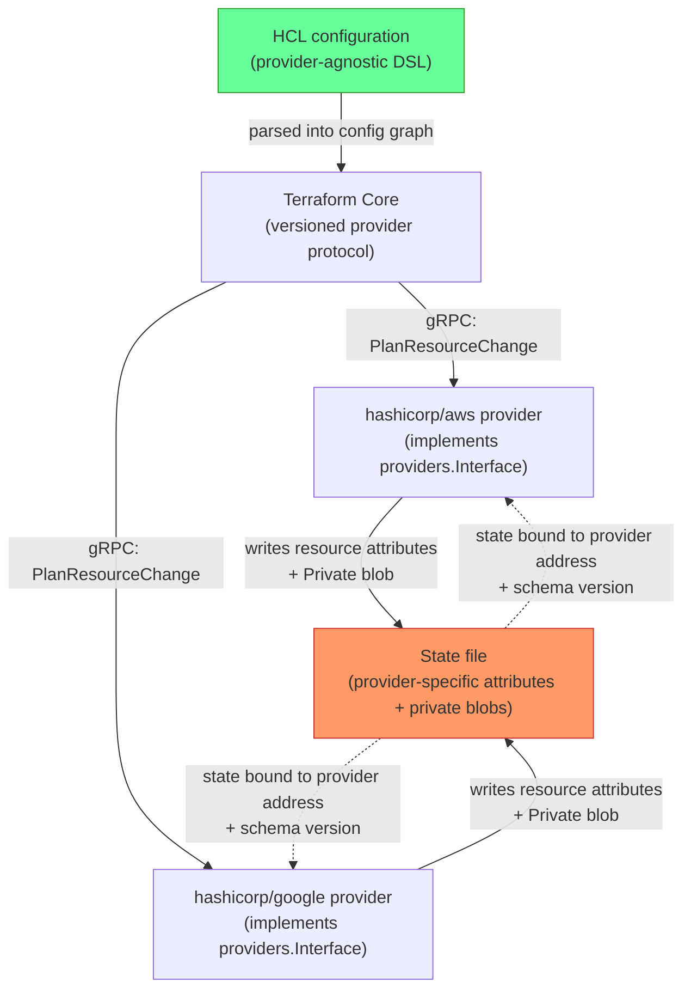
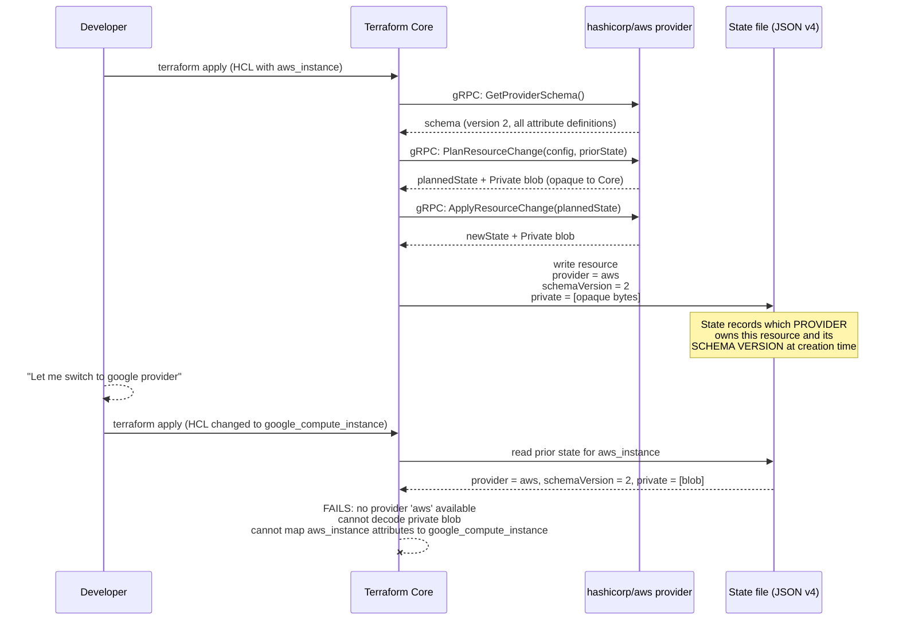

**TL;DR:** Is Terraform HCL actually portable across clouds, or does switching providers require rewriting everything anyway? The provider protocol is genuinely portable — it's a versioned gRPC interface any provider can implement — but the real lock-in lives in the state file: provider addresses, schema-versioned resource attributes, and opaque private blobs that only the original provider can decode.

**Real repo:** [`hashicorp/terraform`](https://github.com/hashicorp/terraform)

## 1. The Engineering Problem: HCL looks portable, but your state file ties you to one provider's internal representation

Terraform's marketing pitch is "infrastructure as code, cloud-agnostic." Write HCL, swap the provider block, and move from AWS to GCP. In practice, teams that attempt a real cross-cloud migration discover the portability story is more nuanced. The HCL configuration syntax is genuinely provider-agnostic — it's a DSL for expressing resource declarations, not a binding to any specific cloud API. But the *state file* that Terraform produces after every `terraform apply` is deeply provider-specific: it records which provider owns each resource, what schema version that resource was created under, and opaque private data blobs that only the original provider plugin can decode. Swap the provider, and Terraform can no longer read its own state for those resources — not because HCL changed, but because the state file's internal structure assumes the original provider's schema, version, and private encoding.

This is the real lock-in mechanism: not what you *write* (HCL), but what Terraform *remembers* (state).

---

## 2. The Technical Solution: a versioned provider protocol decouples configuration from state, but state remains provider-tied

Terraform Core defines a versioned provider protocol — a Go interface with explicit methods like `GetProviderSchema`, `PlanResourceChange`, `ApplyResourceChange`, and `UpgradeResourceState` — that any provider plugin must implement. This protocol is genuinely abstract: the same Terraform Core can orchestrate AWS, GCP, Azure, or any custom provider, as long as the provider implements the interface. The protocol version (currently v5 and v6) negotiates capability differences between Core and each provider.

But the state file stores resource state keyed by provider address and schema version, and includes opaque `Private` byte blobs that only the originating provider can interpret. This means state is provider-bound, even though configuration is not.



Three core truths:

1. **HCL is genuinely provider-agnostic.** The configuration DSL doesn't reference any provider's internal types — it's purely declarative resource names and attribute values. You *can* write syntactically valid HCL for any provider.

2. **The state file is provider-bound.** Each resource instance in state records its `ProviderConfig` address (e.g. `provider["registry.terraform.io/hashicorp/aws"]`), its `SchemaVersion`, and an opaque `Private` byte array that only the originating provider can decode. Swapping providers makes these fields meaningless.

3. **`UpgradeResourceState` is the escape hatch, not `provider =` swapping.** When you change providers, you can't just re-point state. You need `terraform state mv` or `moved` blocks, and even then, attribute names, types, and private blobs may not map 1:1 across providers.



---

## 3. The clean example (concept in isolation)

```hcl
# --- This HCL is provider-agnostic in SYNTAX ---
# You can write this for ANY provider by swapping the resource type

terraform {
  required_providers {
    cloud = {
      source  = "acme/cloud"
      version = "~> 2.0"
    }
  }
}

resource "cloud_virtual_machine" "web" {
  name     = "web-01"
  size     = "standard-2"
  region   = "us-east-1"
  image_id = "ami-placeholder"

  tags = {
    env = "production"
  }
}
```

```go
// --- But the STATE this produces is provider-specific ---
// The state file records these provider-bound fields per resource:

type ResourceInstanceObjectSrc struct {
    // Which provider OWNS this resource
    // (e.g. "provider[\"registry.terraform.io/hashicorp/aws\"]")
    ProviderConfig addrs.AbsProviderConfig

    // The schema VERSION at creation time
    // (the provider decides how to migrate old state forward)
    SchemaVersion uint64

    // Opaque blob — only the ORIGINATING provider can decode this
    // (used for things like computed default values, internal tracking)
    Private []byte

    // The actual resource attributes — typed per provider's schema
    AttrsJSON []byte

    // Resource status (ready, tainted, planned)
    Status ObjectStatus

    // Dependency graph edges (which other resources this depends on)
    Dependencies []addrs.ConfigResource
}
```

---

## 4. Production reality (from `hashicorp/terraform`)

```
internal/
  providers/provider.go          # The provider protocol interface
  states/
    state.go                     # State file structure
    instance_object.go           # Resource instance object encoding
```

```go
// internal/providers/provider.go
// The interface EVERY provider must implement — this is the protocol

type Interface interface {
    // Schema negotiation: Core asks the provider what resources it supports
    // and what attributes each resource has, including schema VERSION
    GetProviderSchema() GetProviderSchemaResponse

    // Lifecycle: Core asks the provider to validate, plan, and apply changes
    ValidateResourceConfig(ValidateResourceConfigRequest) ValidateResourceConfigResponse
    PlanResourceChange(PlanResourceChangeRequest) PlanResourceChangeResponse
    ApplyResourceChange(ApplyResourceChangeRequest) ApplyResourceChangeResponse

    // State migration: when provider version changes, Core asks the provider
    // to UPGRADE its own old state to the new schema version
    UpgradeResourceState(UpgradeResourceStateRequest) UpgradeResourceStateResponse

    // Import: bring existing real-world resources under Terraform management
    ImportResourceState(ImportResourceStateRequest) ImportResourceStateResponse

    // ... (20+ more methods for data sources, functions, state stores, etc.)
}
```

```go
// internal/states/instance_object.go
// The object that gets SERIALIZED into the state file per resource instance

type ResourceInstanceObject struct {
    // The actual resource attribute values — typed per provider's schema
    Value cty.Value

    // Opaque provider-private data — ONLY the originating provider
    // can decode this; Terraform Core treats it as raw bytes
    Private []byte

    // Object lifecycle status
    Status ObjectStatus  // ObjectReady ('R'), ObjectTainted ('T'), ObjectPlanned ('P')

    // Which other resources this instance depends on (ordering edges)
    Dependencies []addrs.ConfigResource

    // Whether create_before_destroy was set (affects destroy ordering)
    CreateBeforeDestroy bool
}
```

```go
// internal/states/state.go
// The top-level state structure — tracks ALL modules and their resources

type State struct {
    // Every module's resource state, keyed by module address string
    Modules map[string]*Module

    // Root module output values only — submodule outputs are transient
    RootOutputValues map[string]*OutputValue

    // Check results from the last run (for terraform validate checks)
    CheckResults *CheckResults
}

// ProviderAddrs extracts every distinct provider referenced across
// ALL resources in state — this is how Terraform knows which
// provider binaries it needs to download and run
func (s *State) ProviderAddrs() []addrs.AbsProviderConfig {
    m := map[string]addrs.AbsProviderConfig{}
    for _, ms := range s.Modules {
        for _, rc := range ms.Resources {
            m[rc.ProviderConfig.String()] = rc.ProviderConfig
        }
    }
    // ... returns deduplicated provider addresses
}
```

What this teaches that a hello-world can't:

- **`Private []byte` is the deepest lock-in mechanism in the state file.** Providers store opaque blobs — computed defaults, internal tracking IDs, SDK-specific metadata — that only they can decode. Terraform Core treats these as raw bytes with no understanding of their contents. Swap the provider, and these blobs become unreadable dead weight in state. There is no standard encoding; each provider's SDK (the older `terraform-plugin-sdk` vs. the newer `terraform-plugin-framework`) serializes private data differently.

- **`UpgradeResourceState` is per-provider, not per-protocol.** When a provider bumps its schema version (say, from v1 to v2 of `aws_instance`), the provider itself implements `UpgradeResourceState` to migrate its *own* old state forward. This is internal migration within one provider — it doesn't help you move state from `aws_instance` to `google_compute_instance`. The provider protocol defines the *shape* of the upgrade RPC, but the migration logic is entirely provider-owned.

- **`ProviderAddrs()` in the state file determines which provider binaries Terraform downloads.** The state isn't just a record of what exists — it's an *active dependency manifest*. Open a state file from a different team's project, and Terraform will attempt to download and run every provider referenced in that state, even if your HCL configuration doesn't reference those providers. This is why `terraform state pull` on a state with stale provider references can trigger unexpected provider downloads.

- **The state file's `SchemaVersion` field is the contract between state and provider.** When Terraform reads state for a resource, it checks the recorded `SchemaVersion` against the provider's current schema. If they differ, it calls `UpgradeResourceState` to let the provider migrate. This means state and provider versions are tightly coupled — downgrading a provider version after a schema bump can leave state unreadable.

Known-stale fact: "Terraform state is just JSON you can hand-edit." This was closer to true in state format v2/v3, but v4 (current) stores attribute values as `cty`-encoded JSON with type annotations that make hand-editing significantly more fragile. The `Private` blob is not JSON at all. Manual state editing is possible but high-risk — `terraform state mv` and `terraform state rm` exist specifically because hand-editing the v4 state file's type-annotated attributes is error-prone.

---

## Review checklist

- [ ] **Verify `ProviderConfig` address before migration.** Each resource in state is owned by a specific provider address (e.g. `hashicorp/aws`). Before attempting any cross-cloud migration, confirm which provider owns every resource in your state with `terraform state list` and inspect the provider bindings — migrating state from one provider to another is not a syntax change, it's a state reconstruction.

- [ ] **Check `SchemaVersion` before provider version upgrades.** If your state records `schemaVersion: 2` for a resource and the provider's current schema is version 4, the provider must successfully implement `UpgradeResourceState` for versions 2 → 3 → 4. Verify the provider's changelog documents schema migration paths for the versions you're jumping across.

- [ ] **Audit `Private` blob dependencies.** If your workflow involves `terraform import` or custom state manipulation, be aware that `Private` data is provider-internal. There is no tooling to decode or migrate private blobs across providers — any state you import must be re-created from scratch under the new provider, not migrated.

- [ ] **Treat state files as provider-locked artifacts.** A state file produced by `hashicorp/aws` is not readable by `hashicorp/google`, even if the HCL is syntactically identical. Plan cross-cloud migrations as destroy-and-recreate under the new provider, not as state file transformations.

---

## FAQ

**Q: Can I just change the provider address in the state file to switch clouds?**

A: No. The state file records provider-specific attribute schemas, schema versions, and opaque `Private` blobs. Changing the provider address string without also transforming every attribute value, resetting schema versions, and clearing private data will produce a state file that Terraform cannot read — `UpgradeResourceState` will fail because the new provider's schema doesn't match the attribute names or types from the old provider.

**Q: Does Terraform's `moved` block help with cross-cloud migration?**

A: `moved` blocks rename or restructure resources *within the same provider's schema*. They operate on state addresses and attribute mappings that the provider understands. Moving from `aws_instance` to `google_compute_instance` requires different attribute names, types, and provider-specific configurations that `moved` blocks cannot express — it's a cross-provider change, not an intra-provider refactor.

**Q: Why does `terraform state pull` sometimes download providers I don't use?**

A: `State.ProviderAddrs()` scans every resource in the state file and extracts the provider address each one references. When you `terraform state pull` a state file from a different project, Terraform reads these addresses and attempts to download the matching provider binaries — even if your local HCL doesn't reference them. The state file is an active dependency manifest, not just a passive record.

**Q: Is OpenTofu any different here?**

A: OpenTofu (the CNCF fork) adopted the same provider protocol and state format (v4) for backward compatibility. The state-level lock-in mechanism — provider-bound attributes, schema versions, and private blobs — is identical. The fork's value is governance and licensing, not a different state architecture.

**Q: What's the practical escape hatch for cross-cloud migration?**

A: Treat it as a controlled destroy-and-recreate, not a state transformation. Write new HCL for the target provider, `terraform destroy` the source resources, and `terraform apply` the new configuration. Use data lookups or scripting to map source-resource attributes to target-resource attributes, rather than trying to transform the state file. This is slower but structurally sound — it acknowledges that state is provider-bound rather than fighting that constraint.

---

## Source

- **Concept:** Provider protocol and state file lock-in
- **Domain:** multicloud
- **Repo:** [hashicorp/terraform](https://github.com/hashicorp/terraform) → [`internal/providers/provider.go`](https://github.com/hashicorp/terraform/blob/main/internal/providers/provider.go) (the versioned provider interface every plugin must implement), [`internal/states/state.go`](https://github.com/hashicorp/terraform/blob/main/internal/states/state.go) (state file structure tracking provider addresses and module resources), [`internal/states/instance_object.go`](https://github.com/hashicorp/terraform/blob/main/internal/states/instance_object.go) (per-resource state encoding with provider-private opaque blobs)


