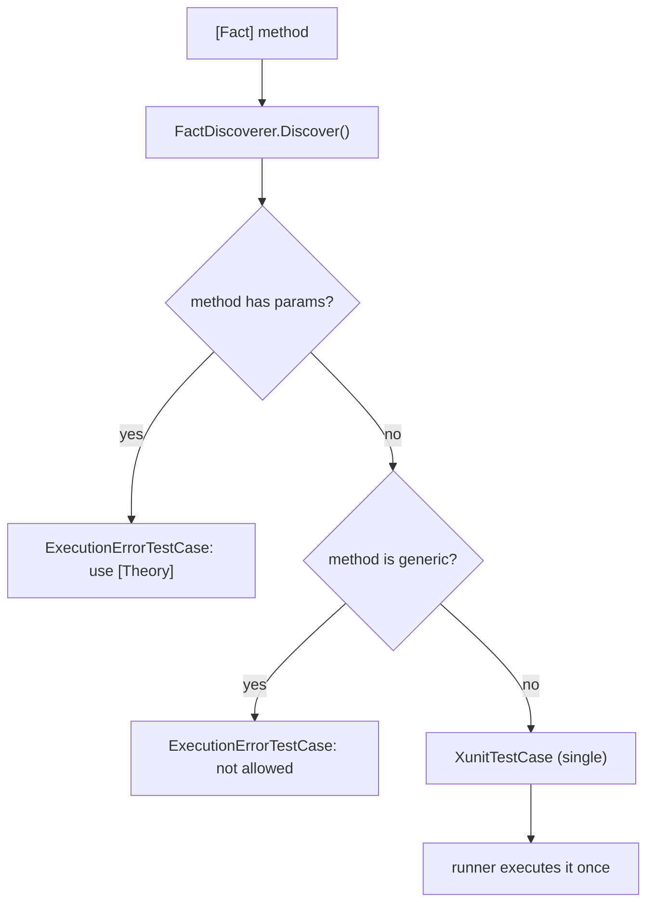
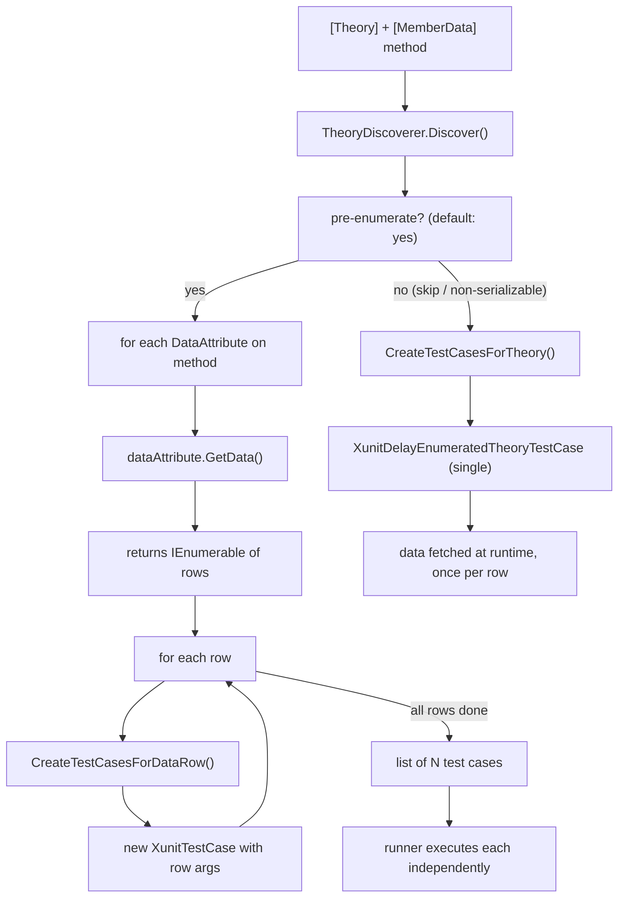

**TL;DR:** When you slap `[Fact]` on a method, xUnit's `FactDiscoverer` emits exactly one test case and the runner executes it once. When you slap `[Theory]` with `[MemberData]` on the same method, `TheoryDiscoverer` calls `dataAttribute.GetData()` at discovery time, gets back an `IEnumerable<object[]>`, loops over every row, and emits one `XunitTestCase` per row — so the runner sees N independent test cases and runs the method N times. The attribute itself doesn't loop anything; the discoverer does.

**Real repo:** [`xunit/xunit`](https://github.com/xunit/xunit)

---

## 1. The Engineering Problem: one method, two very different execution counts

A developer writes a validation test:

```csharp
[Theory]
[MemberData(nameof(TestData))]
public void IsAlwaysPositive(int value) => Assert.True(value > 0);
```

They expect it to run once per data row. If the data source returns five rows, the test runner should report five results — five green checks, or five reds, not one result that magically "passed" if the first row succeeded and the second silently failed. The runner needs a way to turn one method into many independent test cases, each with its own data bound in, each reported separately in the test output.

Meanwhile, a plain `[Fact]` must never accidentally expand into multiple runs. It has no data parameters, no rows to enumerate — it's a single, deterministic invocation. These two attributes require fundamentally different discovery strategies, and xUnit implements them with two separate discoverer classes.

---

## 2. The Technical Solution: two discoverers, two different loops

**FactDiscoverer** is trivial. It checks that the method has no parameters and isn't generic, then creates a single `XunitTestCase`. One method in, one case out. The runner calls it once and moves on.



**TheoryDiscoverer** is the interesting one. When pre-enumeration is enabled (the default), it iterates every `DataAttribute` on the method, calls `GetData()` on each, and loops over the returned rows. For each row it calls `CreateTestCasesForDataRow`, which wraps the row's arguments into a brand-new `XunitTestCase`. The result is a list with one case per row — the runner doesn't know or care that they all map to the same method.



Key insight: when data rows contain non-serializable types, the discoverer can't create per-row test cases (because the runner needs to serialize test case identity). It falls back to a single `XunitDelayEnumeratedTheoryTestCase` that defers data fetching to runtime — but the runner still iterates and executes per-row inside the test case itself. The count is the same; only the timing of enumeration changes.

Core truths: **`[Theory]` doesn't multiply runs — the discoverer does, by enumerating data at discovery time and emitting one test case per row;** and **`[Fact]` always emits exactly one test case because `FactDiscoverer.Discover()` returns a single-element collection with no data iteration logic at all.**

---

## 3. The clean example (concept in isolation)

```csharp
// [Fact] — one method, one test case, one execution
[Fact]
public void TruthIsTrue()
{
    Assert.True(true);
}

// [Theory] + [MemberData] — one method, N test cases, N executions
public static IEnumerable<object[]> TestData => new[]
{
    new object[] { 1 },
    new object[] { 2 },
    new object[] { 3 },
};

[Theory]
[MemberData(nameof(TestData))]
public void IsAlwaysPositive(int value)
{
    Assert.True(value > 0);
}
// xUnit sees three test cases: IsAlwaysPositive(1), IsAlwaysPositive(2), IsAlwaysPositive(3)
// Each is an independent test case with its own pass/fail result.
```

---

## 4. Production reality (from `xunit/xunit`'s `TheoryDiscoverer` and `FactDiscoverer`)

```csharp
// src/xunit.v3.core/Framework/FactDiscoverer.cs
// FactDiscoverer.Discover: returns exactly one test case. No data iteration.
public virtual ValueTask<IReadOnlyCollection<IXunitTestCase>> Discover(
    ITestFrameworkDiscoveryOptions discoveryOptions,
    IXunitTestMethod testMethod,
    IFactAttribute factAttribute)
{
    // ...
    var testCase =
        testMethod.Parameters.Count != 0
            ? ErrorTestCase(discoveryOptions, testMethod, factAttribute,
                "[Fact] methods are not allowed to have parameters. Did you mean to use [Theory]?")
            : testMethod.IsGenericMethodDefinition
                ? ErrorTestCase(discoveryOptions, testMethod, factAttribute,
                    "[Fact] methods are not allowed to be generic.")
                : CreateTestCase(discoveryOptions, testMethod, factAttribute);

    return new([testCase]);  // always a single-element collection
}
```

```csharp
// src/xunit.v3.core/Framework/TheoryDiscoverer.cs
// TheoryDiscoverer.Discover: iterates data attributes and emits one case per row.
if (preEnumerate)
{
    var results = new List<IXunitTestCase>();

    foreach (var dataAttribute in testMethod.DataAttributes)
    {
        if (!dataAttribute.SupportsDiscoveryEnumeration())
            return await CreateTestCasesForTheory(discoveryOptions, testMethod, theoryAttribute);

        var data = await dataAttribute.GetData(testMethod.Method, disposalTracker);
        // ... null check, disposal check ...

        foreach (var dataRow in data)
        {
            var resolvedData = testMethod.ResolveMethodArguments(dataRow.GetData());
            // ... serialization check (falls back to single delay-enumerated case if non-serializable) ...
            results.AddRange(
                await CreateTestCasesForDataRow(discoveryOptions, testMethod, theoryAttribute, dataRow, resolvedData)
            );
        }
    }

    if (results.Count == 0)
    {
        // No data found — either ExecutionErrorTestCase or skip, depending on SkipTestWithoutData
    }

    return results;  // one XunitTestCase per data row
}
```

```csharp
// src/xunit.v3.core/MemberDataAttribute.cs
// MemberDataAttribute: binds to a static property, field, or method on the test class.
public sealed class MemberDataAttribute(
    string memberName,
    params object?[] arguments) :
        MemberDataAttributeBase(memberName, arguments)
{ }
// The GetData() method (inherited from MemberDataAttributeBase) uses reflection to
// invoke the named member and returns its result as IEnumerable<object[]>.
// Each element becomes one theory data row.
```

What this teaches that a hello-world can't:

- **`SupportsDiscoveryEnumeration()` is the escape hatch** — if a data attribute returns `false` from this method, `TheoryDiscoverer` immediately bails out to `CreateTestCasesForTheory()`, creating a single delay-enumerated test case instead of N pre-enumerated ones. Custom data attributes that depend on runtime state (database queries, environment variables) use this to defer enumeration.
- **The serialization check is real and causes silent fallbacks** — if any argument in a data row contains a non-serializable type, the discoverer logs a diagnostic message and falls back to a single `XunitDelayEnumeratedTheoryTestCase`. This means the test runner sees one test case, not many — but at runtime, the test case itself enumerates and runs per-row. The test output looks identical, but the infrastructure under it is different.
- **`FactDiscoverer` actively rejects parameters** — it's not just "no data, no iteration." A `[Fact]` method with parameters returns an `ExecutionErrorTestCase` with an error message suggesting `[Theory]`. This is a hard failure at discovery time, not a silent misconfiguration. `[Fact]` methods that are generic get the same treatment.

Known-stale fact: many xUnit tutorials describe `[Theory]` as "running a test multiple times" as if the attribute itself contains a loop. In reality, the attribute is inert — it's a marker. The `TheoryDiscoverer` is the class that reads data attributes, enumerates rows, and emits multiple test cases. The attribute stores configuration (like `SkipTestWithoutData` and `DisableDiscoveryEnumeration`), but the looping logic lives entirely in the discoverer's `Discover` method.

---

## Review checklist

- [ ] `[Fact]` → `FactDiscoverer.Discover()` → one `XunitTestCase` → one execution. Always.
- [ ] `[Theory]` + `[MemberData]` → `TheoryDiscoverer.Discover()` → iterates data rows → one `XunitTestCase` per row → N executions.
- [ ] Non-serializable data falls back to a single `XunitDelayEnumeratedTheoryTestCase` — data is enumerated at runtime, not discovery time.
- [ ] `MemberDataAttribute` binds to a public static property, field, or method — reflection-based, not compile-time.
- [ ] Custom data attributes returning `false` from `SupportsDiscoveryEnumeration()` always force the single delay-enumerated fallback.
- [ ] `[Fact]` methods with parameters or generic type parameters produce `ExecutionErrorTestCase` failures at discovery time.

---

## FAQ

**Q: Does `[MemberData]` call my data method once per test run, or once per data row?**
A: Once at discovery time (before any tests run). `GetData()` returns all rows as a single `IEnumerable`, and the discoverer iterates it. Your static property or method is invoked once, not once per row.

**Q: What happens if my `[MemberData]` source returns zero rows?**
A: If `SkipTestWithoutData` is `false` (the default), `TheoryDiscoverer` emits an `ExecutionErrorTestCase` with a "No data found" message. If `true`, it emits a skipped test case instead.

**Q: Can `[Fact]` and `[Theory]` coexist on the same method?**
A: No. The runner uses whichever attribute it finds first (determined by `[XunitTestCaseDiscoverer]` on the attribute). In practice, having both is a configuration error.

**Q: Why not just use `[InlineData]` instead of `[MemberData]`?**
A: `[InlineData]` only supports compile-time constant values. `[MemberData]` can call arbitrary static methods, return complex objects, or pull from a database — anything that produces `IEnumerable<object[]>`.

**Q: What is `DisableDiscoveryEnumeration` for?**
A: Setting `DisableDiscoveryEnumeration = true` on `[Theory]` forces the single delay-enumerated path even when data is serializable. This is useful when you want the runner to handle enumeration at execution time rather than during test discovery.

---

## Source

- **Concept:** Theory data-driven testing (MemberData, InlineData, TheoryDiscoverer)
- **Domain:** dotnet
- **Repo:** [xunit/xunit](https://github.com/xunit/xunit) → [`src/xunit.v3.core/Framework/TheoryDiscoverer.cs`](https://github.com/xunit/xunit/blob/main/src/xunit.v3.core/Framework/TheoryDiscoverer.cs), [`src/xunit.v3.core/Framework/FactDiscoverer.cs`](https://github.com/xunit/xunit/blob/main/src/xunit.v3.core/Framework/FactDiscoverer.cs), [`src/xunit.v3.core/TheoryAttribute.cs`](https://github.com/xunit/xunit/blob/main/src/xunit.v3.core/TheoryAttribute.cs), [`src/xunit.v3.core/MemberDataAttribute.cs`](https://github.com/xunit/xunit/blob/main/src/xunit.v3.core/MemberDataAttribute.cs) — the xUnit testing framework itself.


