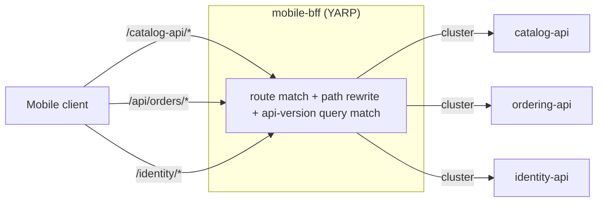

## 1. The Engineering Problem

Once a system is genuinely decomposed — catalog, ordering, identity, each
its own service with its own address — a client calling it directly has to
know all of that internal topology. Every client (mobile app, web frontend,
third-party integrator) ends up either hardcoding N different service
addresses, or every service independently reimplements the same
cross-cutting concerns: auth-token validation, CORS, API versioning,
rate limiting. Neither scales cleanly:

- **Leaking topology breaks encapsulation.** If a mobile client calls
  `catalog-api` directly, then renaming, resharding, or scaling that
  service becomes a mobile-app release, not an internal deploy.
- **Duplicated cross-cutting logic drifts.** Auth-token checking
  implemented five times in five languages inevitably gets out of sync —
  one service enforces a claim the other four forgot to check.
- **Different clients want different shapes.** A mobile client hitting a
  metered connection wants fewer round trips and stricter API versioning
  than a browser SPA that can afford to call several endpoints and combine
  results client-side. One-size-fits-all routing serves neither well.

## 2. The Technical Solution: a routing layer clients can trust as "the API"

An **API gateway** (or, scoped to one client type, a **backend-for-frontend**)
is a single edge process that owns routing, path rewriting, and
cross-cutting policy, so the client sees one stable surface instead of N
internal services.



Core truths to hold:

- **A gateway's job is traffic shaping, not business logic.** Routes match
  on path/host/query; clusters name a set of backend destinations; transforms
  rewrite the request on the way through. None of that is domain code.
- **One gateway per client shape is a legitimate pattern (BFF), not
  over-engineering.** A mobile client's routing and auth needs can differ
  enough from a browser's that they warrant separate edge processes, each
  simpler than one gateway trying to serve both.
- **Correcting a stale assumption:** "API gateway" doesn't have to mean a
  heavyweight standalone service like the old Netflix Zuul. Modern
  reverse-proxy libraries (YARP, Spring Cloud Gateway) are embeddable —
  a gateway can be a few lines inside an existing process just as easily as
  its own deployment.

## 3. The clean example (concept in isolation)

A minimal YARP reverse proxy: one route, one cluster, one path rewrite.

```json
// appsettings.json
{
  "ReverseProxy": {
    "Routes": {
      "catalog-route": {
        "ClusterId": "catalog-cluster",
        "Match": { "Path": "/catalog-api/{**catch-all}" },
        "Transforms": [ { "PathRemovePrefix": "/catalog-api" } ]
      }
    },
    "Clusters": {
      "catalog-cluster": {
        "Destinations": {
          "d1": { "Address": "http://catalog-api/" }
        }
      }
    }
  }
}
```

```csharp
// Program.cs
var builder = WebApplication.CreateBuilder(args);
builder.Services.AddReverseProxy()
    .LoadFromConfig(builder.Configuration.GetSection("ReverseProxy"));

var app = builder.Build();
app.MapReverseProxy();   // one call wires the whole routing table above
app.Run();
```

A public request to `/catalog-api/items/1` gets forwarded to
`http://catalog-api/items/1` — the `/catalog-api` prefix exists only in the
public contract, stripped before the backend ever sees it.

## 4. Production reality (from the real repo)

[dotnet/eShop](https://github.com/dotnet/eShop) runs a dedicated reverse
proxy — `mobile-bff` — configured entirely in code via YARP's Aspire
integration, separate from the web app's own edge handling. It's wired up
in the AppHost, the same orchestration file this series' first lesson used
for service decomposition:

```csharp
// src/eShop.AppHost/Program.cs (trimmed to the gateway-relevant lines)

// Reverse proxies
builder.AddYarp("mobile-bff")
    .WithExternalHttpEndpoints()
    .ConfigureMobileBffRoutes(catalogApi, orderingApi, identityApi);
```

The routing table itself lives in a dedicated extension method:

```csharp
// src/eShop.AppHost/Extensions.cs (trimmed to a representative slice —
// the real method defines a route per catalog endpoint plus ordering and identity)

public static IResourceBuilder<YarpResource> ConfigureMobileBffRoutes(this IResourceBuilder<YarpResource> builder,
    IResourceBuilder<ProjectResource> catalogApi,
    IResourceBuilder<ProjectResource> orderingApi,
    IResourceBuilder<ProjectResource> identityApi)
{
    return builder.WithConfiguration(yarp =>
    {
        var catalogCluster = yarp.AddCluster(catalogApi);   // cluster resolved via service discovery, not a hardcoded host

        yarp.AddRoute("/catalog-api/api/catalog/items", catalogCluster)
            .WithMatchRouteQueryParameter([new() { Name = "api-version", Values = ["1.0", "1", "2.0"], Mode = QueryParameterMatchMode.Exact }])
            .WithTransformPathRemovePrefix("/catalog-api");

        yarp.AddRoute("/catalog-api/api/catalog/items/{id}", catalogCluster)
            .WithMatchRouteQueryParameter([new() { Name = "api-version", Values = ["1.0", "1", "2.0"], Mode = QueryParameterMatchMode.Exact }])
            .WithTransformPathRemovePrefix("/catalog-api");

        // Generic catalog catch-all route
        yarp.AddRoute("/api/catalog/{*any}", catalogCluster)
            .WithMatchRouteQueryParameter([new() { Name = "api-version", Values = ["1.0", "1", "2.0"], Mode = QueryParameterMatchMode.Exact }]);

        // Ordering routes
        yarp.AddRoute("/api/orders/{*any}", orderingApi.GetEndpoint("http"))
            .WithMatchRouteQueryParameter([new() { Name = "api-version", Values = ["1.0", "1"], Mode = QueryParameterMatchMode.Exact }]);

        // Identity routes
        yarp.AddRoute("/identity/{*any}", identityApi.GetEndpoint("http"))
            .WithTransformPathRemovePrefix("/identity");
    });
}
```

The web app doesn't go through `mobile-bff` at all — it does its own,
much smaller version of the same pattern for exactly one route:

```csharp
// src/WebApp/Program.cs (trimmed)
app.MapForwarder("/product-images/{id}", "https+http://catalog-api", "/api/catalog/items/{id}/pic");
```

```csharp
// src/WebApp/Extensions/Extensions.cs (trimmed)
builder.Services.AddHttpForwarderWithServiceDiscovery();
```

What this teaches that a hello-world can't:

- **`yarp.AddCluster(catalogApi)` takes an Aspire project reference, not a
  hostname string.** The gateway resolves its routing targets through the
  same service-discovery mechanism the rest of the app uses — a gateway
  isn't a special case that gets to hardcode addresses just because it's
  the edge.
- **`WithMatchRouteQueryParameter([... "api-version" ...])` routes on more
  than the path.** Real gateways commonly branch on an API-version query
  parameter, letting `v1` and `v2` clients hit the same path prefix and
  still reach version-appropriate behavior without the backend exposing
  separate URLs per version.
- **`WithTransformPathRemovePrefix("/catalog-api")` decouples the public
  contract from the backend's actual routes.** The public path is
  `/catalog-api/api/catalog/items/{id}`; the backend only ever sees
  `/api/catalog/items/{id}`. The backend can restructure its own routes as
  long as the gateway's transform is updated to match — clients never see
  the difference.
- **Two gateway patterns coexist in one system, at different complexity
  levels.** `mobile-bff` is a full declarative router with clusters and
  transforms for a whole API surface; `WebApp`'s `MapForwarder` is a
  single-line direct-forward for the one route it needs. Production
  systems don't force every route through the heaviest mechanism available
  — they match the tool to the route.
- **Identity gets its own route group with its own prefix strip**
  (`/identity/{*any}` → strips `/identity`), publicly exposing exactly the
  auth-adjacent surface (login, token endpoints) a client needs, while
  everything else about the identity service stays behind the gateway's
  routing table.

A common misconception worth correcting: many teams still picture "API
gateway" as one company-wide chokepoint every request passes through.
eShop's own architecture shows two coexisting, narrower edges instead — a
dedicated BFF for mobile traffic and a lighter forwarding layer inside the
web app for its one cross-service need — because a single shared gateway
serving very different client shapes tends to become exactly the kind of
change-coordination bottleneck decomposition was meant to avoid.

---

## Source

- **Concept:** API Gateway
- **Domain:** microservices
- **Repo:** [dotnet/eShop](https://github.com/dotnet/eShop) → [`src/eShop.AppHost/Extensions.cs`](https://github.com/dotnet/eShop/blob/main/src/eShop.AppHost/Extensions.cs), [`src/eShop.AppHost/Program.cs`](https://github.com/dotnet/eShop/blob/main/src/eShop.AppHost/Program.cs), [`src/WebApp/Program.cs`](https://github.com/dotnet/eShop/blob/main/src/WebApp/Program.cs) — .NET Aspire-orchestrated e-commerce reference architecture, YARP-based mobile BFF
