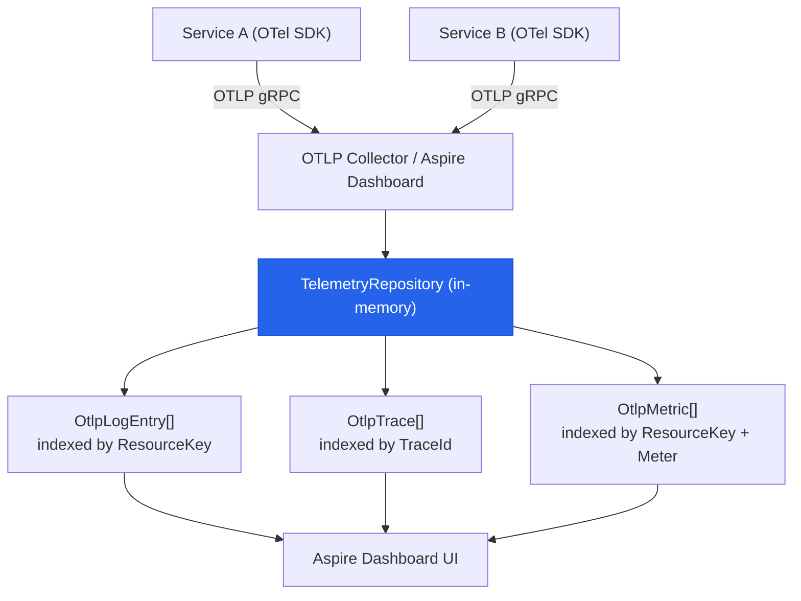
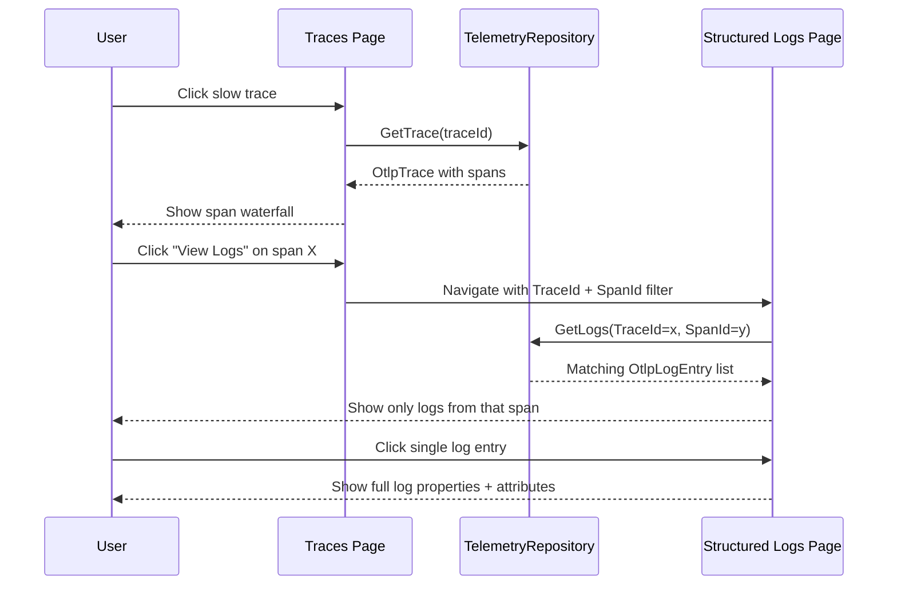

**TL;DR:** Can a single dashboard truly correlate your traces, metrics, and logs without forcing engineers to copy trace IDs between three different UIs and re-derive context each time? Yes — if all three signals are ingested through one OTLP endpoint, stored in a single `TelemetryRepository`, and linked by shared `TraceId`/`SpanId` keys that the viewer can navigate across tabs.

> **In plain English (30 sec):** Code you already write — Map, function, API call, just bigger.

## 1. The Engineering Problem

When a microservice starts returning 503s, the on-call engineer's instinct is to check metrics first — latency p99 is spiking, error rate is climbing. But *which* endpoint? The metric dashboard shows a graph; you click the spike and get... a number. To find out *why*, you leave the metrics tool, open your log aggregator, filter by the service name and a rough time window, and scroll through thousands of structured log entries hoping the error message is there. Then you find a suspicious entry, extract its `TraceId`, switch to your tracing tool (Jaeger, Zipkin, etc.), paste the `TraceId`, and finally see the waterfall — a downstream database call taking 4 seconds.

Three tools. Two context switches. One trace ID manually copy-pasted. And you still can't easily jump from that slow database span back to the *specific* log entry that captured the connection timeout exception, because the log aggregator doesn't natively understand trace/span IDs as navigational links.

This is the "three pillars of observability" paradox: logs, metrics, and traces each provide a different *view* of the same system, but if the viewer doesn't correlate them, the engineer ends up doing the correlation manually. The signals exist. The relationship exists. The UI doesn't surface it.

The deeper problem is structural. Each tool has its own ingestion pipeline — Prometheus scrapes metrics, Loki ingests logs, Jaeger receives spans — each with its own SDK configuration, retention policy, and query language. Switching from Datadog to Grafana (or vice versa) means rewriting every instrumentation call across every service. The signals are coupled by the system's behavior but decoupled by the toolchain.

## 2. The Technical Solution

The OpenTelemetry specification solves the instrumentation decoupling: one SDK, one `OTEL_EXPORTER_OTLP_ENDPOINT`, three signal types all sent over the same gRPC or HTTP/Protobuf connection. But *viewing* them in a unified way requires a component that sits on the receiving end of that single OTLP stream, stores all three signals in a correlated index, and presents a UI where you can click from a metric spike → to a trace → to a log entry with a single navigation action.

.NET Aspire's Dashboard is exactly this component. It runs as a local development server (and can be deployed standalone as a container), receives OTLP on port 18889 (gRPC) or 18890 (HTTP), and serves a Blazor-based UI with four primary views: Resources, Structured Logs, Traces, and Metrics. The key architectural fact is that all three signal types are stored in a single in-memory `TelemetryRepository` that indexes by `ResourceKey`, `TraceId`, and `SpanId` — the shared identity fields that make cross-signal navigation possible.



The navigation flow is a sequence, not a lookup. When you click a slow trace, the dashboard calls `TelemetryRepository.GetTrace(traceId)` and renders the span waterfall. Each span has a `SpanId`; clicking "View Logs" on that span constructs a filter query `TraceId == {id} AND SpanId == {spanId}` and switches to the Structured Logs view with those filters pre-applied. The log entries that match are the ones *produced during that span's execution* — not logs from the same time window, but logs from the same causal unit of work.



Three core truths to hold:

- `TraceId` and `SpanId` are the shared join keys across all three signals — traces contain spans with these IDs, logs carry them as attributes, and metrics can be correlated via resource identity and time window.
- The `TelemetryRepository` uses `ReaderWriterLockSlim` per signal type (`_logsLock`, `_tracesLock`) and a `CircularBuffer` bounded by configurable `MaxLogCount`/`MaxTraceCount` — it's a fixed-memory ring buffer, not an append-only store, so it doesn't OOM under sustained load.
- The dashboard's OTLP ingestion point is `AddLogs()`/`AddTraces()`/`AddMetrics()` on `TelemetryRepository`, each of which calls `RaiseSubscriptionChanged()` to notify all active UI subscriptions — this is a push-based reactive model, not a polling loop.

## 3. The clean example (concept in isolation)

A minimal unified telemetry store that accepts logs, traces, and metrics through a single class, indexes them by the shared `TraceId`/`SpanId` keys, and supports cross-signal lookup — same shape as Aspire's `TelemetryRepository`, stripped down to the correlation mechanism:

```csharp
using System.Collections.Concurrent;

// Shared identity fields that link logs, traces, and metrics
record TelemetryEntry(
    string TraceId,
    string SpanId,
    string ServiceName,
    string SignalType,   // "log", "trace", "metric"
    DateTimeOffset Timestamp,
    string Message,
    Dictionary<string, string> Attributes
);

class UnifiedTelemetryStore
{
    // Bounded ring buffer — mirrors Aspire's CircularBuffer<OtlpLogEntry>
    private readonly CircularBuffer<TelemetryEntry> _entries = new(maxCapacity: 10_000);

    // Index by TraceId for cross-signal lookup
    private readonly ConcurrentDictionary<string, List<TelemetryEntry>> _traceIndex = new();

    // Lock for write operations — mirrors Aspire's ReaderWriterLockSlim pattern
    private readonly object _writeLock = new();

    public void AddEntry(TelemetryEntry entry)
    {
        lock (_writeLock)
        {
            _entries.Add(entry);
            _traceIndex.GetOrAdd(entry.TraceId, _ => new()).Add(entry);
        }
    }

    // Navigate: "show me everything related to this trace"
    public List<TelemetryEntry> GetByTrace(string traceId)
    {
        return _traceIndex.TryGetValue(traceId, out var entries)
            ? entries
            : new List<TelemetryEntry>();
    }

    // Navigate: "show me logs for this specific span"
    public List<TelemetryEntry> GetLogsForSpan(string traceId, string spanId)
    {
        return GetByTrace(traceId)
            .Where(e => e.SignalType == "log" && e.SpanId == spanId)
            .ToList();
    }
}
```

## 4. Production reality

The Aspire Dashboard's actual implementation spans several files. Here's the structure:

```
src/Aspire.Dashboard/
  Components/
    Pages/
      Traces.razor.cs           — Trace list + filter UI
      StructuredLogs.razor.cs   — Structured log list + filter UI
      Metrics.razor.cs          — Metric chart selector + time range
  Otlp/
    Storage/
      TelemetryRepository.cs    — Central in-memory store for all three signals
  Model/
    Otlp/
      OtlpLogEntry.cs           — Log entry model with TraceId, SpanId, Attributes
      OtlpTrace.cs              — Trace model containing spans
      OtlpSpan.cs               — Span model with TraceId, SpanId, Status
```

From `src/Aspire.Dashboard/Otlp/Storage/TelemetryRepository.cs` — the central repository that receives all three OTLP signal types and stores them in correlated, bounded buffers:

```csharp
// TelemetryRepository.cs — the single ingestion point for all three signals
// CircularBuffer bounded by MaxLogCount and MaxTraceCount from DashboardOptions
private readonly CircularBuffer<OtlpLogEntry> _logs;
private readonly CircularBuffer<OtlpTrace> _traces;

// ReaderWriterLockSlim per signal type for concurrent read access
private readonly ReaderWriterLockSlim _logsLock = new();
private readonly ReaderWriterLockSlim _tracesLock = new();

// Subscriptions: UI components register callbacks for push-based updates
private readonly List<Subscription> _logSubscriptions = new();
private readonly List<Subscription> _tracesSubscriptions = new();
private readonly List<Subscription> _metricsSubscriptions = new();

public void AddLogs(AddContext context, RepeatedField<ResourceLogs> resourceLogs)
{
    // Pause support: if user paused the log stream, ignore incoming data
    if (_pauseManager.AreStructuredLogsPaused(out _)) { return; }

    foreach (var rl in resourceLogs)
    {
        // Resolve or create the resource identity from OTLP Resource attributes
        OtlpResourceView resourceView = GetOrAddResourceView(rl.Resource);

        // Insert log entries in timestamp-sorted order into the bounded buffer
        AddLogsCore(context, resourceView, rl.ScopeLogs);
        SetResourceHasLogs(resourceView.Resource, true);
    }

    // Push: notify all active UI subscriptions that new logs are available
    RaiseSubscriptionChanged(_logSubscriptions);
}
```

From `src/Aspire.Dashboard/Components/Pages/Traces.razor.cs` — the trace page that navigates to logs via the shared `TraceId`:

```csharp
// Traces.razor.cs — subscribes to real-time trace updates from TelemetryRepository
private Subscription? _tracesSubscription;

private void UpdateSubscription()
{
    var selectedResourceKey = PageViewModel.SelectedResource.Id?.GetResourceKey();

    // Dispose previous subscription, create new one scoped to selected resource
    _tracesSubscription?.Dispose();
    _tracesSubscription = TelemetryRepository.OnNewTraces(
        selectedResourceKey,
        SubscriptionType.Read,
        async () =>
        {
            TracesViewModel.ClearData();
            // Trigger Blazor data grid refresh when new traces arrive
            await InvokeAsync(_dataGrid.SafeRefreshDataAsync);
        });
}
```

From `src/Aspire.Dashboard/Components/Pages/StructuredLogs.razor.cs` — the logs page that accepts a `TraceId` query parameter for cross-signal navigation:

```csharp
// StructuredLogs.razor.cs — accepts TraceId from the Traces page
[Parameter]
[SupplyParameterFromQuery]
public string? TraceId { get; set; }

[Parameter]
[SupplyParameterFromQuery]
public string? SpanId { get; set; }

protected override void OnInitialized()
{
    // Pre-apply trace/span filters when navigated from Traces page
    if (!string.IsNullOrEmpty(TraceId))
    {
        ViewModel.AddFilter(new FieldTelemetryFilter
        {
            Field = KnownStructuredLogFields.TraceIdField,
            Condition = FilterCondition.Equals,
            Value = TraceId
        });
    }
    if (!string.IsNullOrEmpty(SpanId))
    {
        ViewModel.AddFilter(new FieldTelemetryFilter
        {
            Field = KnownStructuredLogFields.SpanIdField,
            Condition = FilterCondition.Equals,
            Value = SpanId
        });
    }
}
```

## 5. Review checklist

- **Single OTLP endpoint**: Verify all services export to one `OTEL_EXPORTER_OTLP_ENDPOINT` — Aspire sets this automatically via environment variables in local development (`http://localhost:4318`), and the dashboard listens on that port. If you're pointing different services at different collectors, the unified view breaks.

- **`TraceId`/`SpanId` propagation**: Confirm your HTTP clients propagate W3C `traceparent` headers (Aspire's `AddStandardResilienceHandler()` and `AddServiceDiscovery()` include OTel instrumented `HttpClient` by default). Without propagation, spans from downstream services won't share the same `TraceId`, and the "view logs for this trace" navigation returns partial results.

- **Bounded buffers and retention**: The `TelemetryRepository` uses `CircularBuffer` with configurable `MaxLogCount` and `MaxTraceCount` (default in `DashboardOptions.TelemetryLimits`). If you're in a high-throughput scenario, old entries are silently evicted — the UI shows a "limit reached" message, but you won't see data from before the buffer rolled. Tune these values if you need longer retention during debugging sessions.

- **Subscription lifecycle**: UI components subscribe via `OnNewTraces()`/`OnNewLogs()` and must dispose subscriptions (see the `Dispose()` methods in each page component). A leaked subscription keeps the callback delegate alive and continues to fire `InvokeAsync` against a disposed Blazor component — this manifests as silent errors in the browser console, not as server-side crashes.

## 6. FAQ

**Q: Why can't I just use Grafana for all three signals?**
A: You can, and many teams do. But Grafana requires separate data sources (Prometheus for metrics, Loki for logs, Tempo for traces), each with its own configuration, retention, and query syntax. The Aspire Dashboard's advantage is zero-configuration for local development — it receives all three signals through one OTLP endpoint with no data source setup, and the correlation navigation (trace → logs) is built into the UI without needing Grafana's trace-to-logs panel configuration.

**Q: What happens when the dashboard is overwhelmed with data?**
A: The `TelemetryRepository` uses bounded `CircularBuffer` instances (controlled by `DashboardOptions.TelemetryLimits.MaxLogCount` and `MaxTraceCount`). When the buffer is full, the oldest entries are evicted silently, and the UI displays a "limit reached" message. The `MaxLogLimitMessage` and `MaxTraceLimitMessage` fields on `TelemetryRepository` track whether this notification has been shown, preventing repeated popups.

**Q: Can I use the Aspire Dashboard in production, not just local dev?**
A: Yes. The dashboard ships as a container image (`mcr.microsoft.com/dotnet/aspire-dashboard`) and can be deployed alongside your services. It's designed as a "just-in-time" diagnostic tool — no persistent storage, no built-in alerting. For production, it complements (not replaces) a full APM stack like Azure Monitor or Datadog. The key limitation is that it stores telemetry in memory only.

**Q: How does the dashboard know which logs belong to which trace?**
A: The OpenTelemetry .NET SDK automatically injects `TraceId` and `SpanId` into log entries when there's an active `Activity` (span). The Aspire Dashboard's `StructuredLogs` page uses `FieldTelemetryFilter` on `KnownStructuredLogFields.TraceIdField` and `KnownStructuredLogFields.SpanIdField` to filter logs by these fields. The `TelemetryRepository.GetLogsForSpan()` method performs this exact lookup.

**Q: Why does the metrics view show different instruments per resource?**
A: Each service (resource) registers its own `Meter` and `Instrument<T>` instances. The `Metrics` page queries `TelemetryRepository.GetInstrumentsSummaries(resourceKey)` and displays only the instruments belonging to the selected resource. When you switch resources, the metric tree updates to show that resource's instruments — this is by design, not a bug, because different services expose different metric names.

---

**Source:** [dotnet/aspire](https://github.com/dotnet/aspire) — specifically `src/Aspire.Dashboard/Otlp/Storage/TelemetryRepository.cs`, `src/Aspire.Dashboard/Components/Pages/Traces.razor.cs`, `src/Aspire.Dashboard/Components/Pages/StructuredLogs.razor.cs`, and `src/Aspire.Dashboard/Components/Pages/Metrics.razor.cs`.


