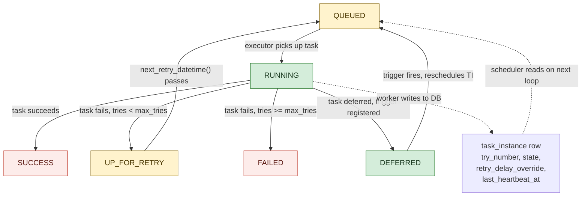
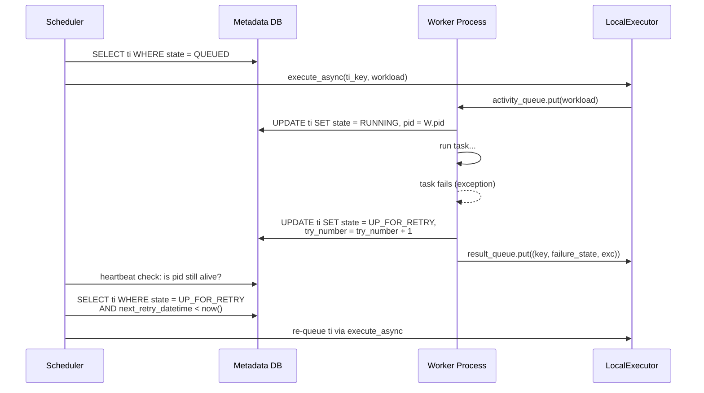

**TL;DR:** In a multi-process DAG executor, why can't retry state live in the worker that failed? Because when a worker process crashes or is killed, every in-memory variable it held -- including which attempt just failed, when the next retry should fire, and what exponential-backoff calculation was in progress -- vanishes instantly; the scheduler, which runs in a completely separate process (or even on a different machine), must independently know that a task failed, which attempt it was, and when to re-queue it, and the only place that survives a process crash is a row in the metadata database that the scheduler polls on its next heartbeat loop.

> **In plain English (30 sec):** Code you already write — Map, function, API call, just bigger.

**Real repo:** [`apache/airflow`](https://github.com/apache/airflow)

## 1. The Engineering Problem: a crashed worker takes its retry bookkeeping with it

Airflow's executor model is fundamentally multi-process: the scheduler loop decides what to run, hands work to executor workers (each a separate OS process via `multiprocessing`), and those workers run the actual task. When a task fails, the question "should this be retried, and if so, when?" must be answered *after* the worker that ran it is already dead or gone. If retry state lived only in the worker's memory -- `try_number`, the next backoff delay, the reason for the failure -- it would vanish with the process, leaving the scheduler with no way to know whether to re-queue the task or mark it permanently failed. The scheduler would see a task that was RUNNING and is now... nothing, with no record of how many attempts remain or when a retry window opens.

---

## 2. The Technical Solution: persist every retry-relevant field in the `task_instance` table so the scheduler can drive retries independently

Airflow solves this by making the `task_instance` database row the *authoritative* source of truth for all retry state -- not a convenience cache, but the actual thing the scheduler reads on every loop to decide what to do next. The `state` column holds the current lifecycle status (`QUEUED`, `RUNNING`, `UP_FOR_RETRY`, `FAILED`, `SUCCESS`, `DEFERRED`); `try_number` tracks which attempt just completed; `max_tries` is a cumulative ceiling that survives clears and DAG version changes; and `retry_delay_override` / `retry_reason` are written by the task worker *back to the DB row* so the scheduler can compute the next retry window without re-loading the task definition.



The critical property: the scheduler never trusts the worker's in-memory state. After a worker crashes, the scheduler detects the missing heartbeat (or the failed result callback), reads the `task_instance` row directly from the DB, checks `try_number` against `max_tries`, and either transitions the row to `UP_FOR_RETRY` with a computed next-fire time, or transitions it to `FAILED`. Every decision is DB-driven, process-independent.



Note the asymmetry: the worker writes the *failure* and the *new try_number* to the DB as its final act, but the scheduler is the one that reads that state back and decides whether to actually re-dispatch. The worker never self-reschedules -- it always exits, leaving the decision to the scheduler process.

---

## 3. The clean example (concept in isolation)

```
# The scheduler's retry-decision loop (simplified)
def scheduler_heartbeat():
    for ti in db.query("SELECT * FROM task_instance WHERE state = 'RUNNING'"):
        if not is_worker_alive(ti.pid):
            # Worker crashed -- the in-memory state is gone.
            # Only the DB row survives.
            if ti.try_number < ti.max_tries:
                ti.state = 'UP_FOR_RETRY'
                ti.end_date = now()
                ti.duration = (ti.end_date - ti.start_date).total_seconds()
                # next_retry_datetime reads ti.try_number, ti.retry_delay,
                # ti.retry_exponential_backoff -- all persisted in the DB row
                ti.next_fire = ti.next_retry_datetime()
            else:
                ti.state = 'FAILED'
            db.commit(ti)

    for ti in db.query("SELECT * FROM task_instance WHERE state = 'UP_FOR_RETRY'"):
        if ti.next_fire <= now():
            ti.state = 'QUEUED'
            executor.execute_async(ti.key, build_workload(ti))
            db.commit(ti)
```

---

## 4. Production reality (from `apache/airflow`)

### The `TaskInstance` model -- retry fields that must outlive the worker process

```python
# airflow-core/src/airflow/models/taskinstance.py

class TaskInstance(Base, LoggingMixin, BaseWorkload):
    """
    Task instances store the state of a task instance.

    This table is the authority and single source of truth around what tasks
    have run and the state they are in.

    The SqlAlchemy model doesn't have a SqlAlchemy foreign key to the task or
    dag model deliberately to have more control over transactions.

    Database transactions on this table should insure double triggers and
    any confusion around what task instances are or aren't ready to run
    even while multiple schedulers may be firing task instances.
    """

    __tablename__ = "task_instance"
    id: Mapped[UUID] = mapped_column(Uuid(), primary_key=True, default=uuid7, nullable=False)
    task_id: Mapped[str] = mapped_column(StringID(), nullable=False)
    dag_id: Mapped[str] = mapped_column(StringID(), nullable=False)
    run_id: Mapped[str] = mapped_column(StringID(), nullable=False)
    map_index: Mapped[int] = mapped_column(Integer, nullable=False, server_default="-1")

    state: Mapped[str | None] = mapped_column(String(20), nullable=True)
    try_number: Mapped[int] = mapped_column(Integer, default=0)
    max_tries: Mapped[int] = mapped_column(Integer, server_default="-1")
    hostname: Mapped[str | None] = mapped_column(String(1000), nullable=True)
    pid: Mapped[int | None] = mapped_column(Integer, nullable=True)

    last_heartbeat_at: Mapped[datetime | None] = mapped_column(UtcDateTime, nullable=True)

    # Retry policy overrides: set by the task worker when a RetryPolicy is configured.
    # Cleared on task start (ti_run).  Read by next_retry_datetime().
    retry_delay_override: Mapped[float | None] = mapped_column(Float, nullable=True)
    retry_reason: Mapped[str | None] = mapped_column(String(500), nullable=True)
```

What this teaches that a hello-world can't:

- **`retry_delay_override` is written by the worker, not the scheduler** -- this is how a `RetryPolicy` (a runtime, per-attempt decision, e.g. "the API rate-limited us, double the backoff") can override the static `retry_delay` defined in the DAG. The worker writes it to the DB row as its final action before exiting, and the scheduler reads it back via `next_retry_datetime()`. Without this DB-mediated handoff, a runtime policy decision would be trapped in a dead process.
- **`max_tries` is cumulative, not per-attempt** -- it is set once at `__init__` from `task.retries` and *incremented* when a task is cleared (re-run from the UI or API), never reset. This means the DB row is the only place that knows the true retry budget after multiple clears, something the worker process never tracks.
- **`last_heartbeat_at` is how the scheduler detects a dead worker** -- the worker updates it periodically; the scheduler checks if it's stale relative to `now()`. If the worker crashes mid-task, this timestamp freezes, and the scheduler eventually declares the TI orphaned and re-queues it. This detection is entirely DB-driven: no in-memory signal is needed.

### The `next_retry_datetime()` method -- exponential backoff computed from persisted state

```python
# airflow-core/src/airflow/models/taskinstance.py

    def next_retry_datetime(self):
        """
        Get datetime of the next retry if the task instance fails.

        When a RetryPolicy has overridden the delay, retry_delay_override
        is stored on the task instance row and takes precedence over the
        static retry_delay / exponential-backoff calculation.
        """
        # Check for a policy-driven delay override.
        if self.retry_delay_override is not None:
            base = self.end_date if self.end_date is not None else timezone.utcnow()
            return base + timedelta(seconds=self.retry_delay_override)

        from airflow.sdk.definitions._internal.abstractoperator import MAX_RETRY_DELAY

        delay = self.task.retry_delay
        multiplier = self.task.retry_exponential_backoff if self.task.retry_exponential_backoff != 0 else 1.0
        if multiplier != 1.0 and multiplier > 0:
            try:
                min_backoff = math.ceil(delay.total_seconds() * (multiplier ** (self.try_number - 1)))
            except OverflowError:
                min_backoff = MAX_RETRY_DELAY

            if min_backoff < 1:
                min_backoff = 1

            # deterministic per task instance -- same try always gets the same jitter
            ti_hash = int(
                hashlib.sha1(
                    f"{self.dag_id}#{self.task_id}#{self.logical_date}#{self.try_number}".encode(),
                    usedforsecurity=False,
                ).hexdigest(),
                16,
            )
            modded_hash = min_backoff + ti_hash % min_backoff
            delay_backoff_in_seconds = min(modded_hash, MAX_RETRY_DELAY)
            delay = timedelta(seconds=delay_backoff_in_seconds)
            if self.task.max_retry_delay:
                delay = min(self.task.max_retry_delay, delay)
        return self.end_date + delay
```

What this teaches that a hello-world can't:

- **The jitter is deterministic per `(dag_id, task_id, logical_date, try_number)`** -- it uses a SHA1 hash of those four fields to compute `modded_hash`, which means the same failed attempt on the same task always computes the same backoff delay, regardless of which scheduler process or worker called this method. This eliminates thundering-herd retries where multiple failed tasks all retry at the same instant: each task's hash produces a different jitter offset within the `[min_backoff, 2*min_backoff)` window.
- **`retry_delay_override` takes precedence and is read from the DB row, not from the task definition** -- a `RetryPolicy` can decide at runtime (e.g. reading a `Retry-After` header from an API response) to override the static backoff. That decision is written to `retry_delay_override` on the TI row by the worker, and `next_retry_datetime()` checks it first. The task definition's `retry_exponential_backoff` and `retry_delay` are never consulted when an override exists.
- **`self.end_date` is used as the base, not `now()`** -- `end_date` is the timestamp when the task *finished failing*, persisted in the DB. Using `now()` instead would introduce drift: if the scheduler is delayed processing a heartbeat (e.g. under load), the retry window would be shifted. Anchoring to `end_date` means the retry fires at a predictable time relative to the failure, regardless of scheduler latency.

### The `prepare_db_for_next_try()` method -- recording history before re-queuing

```python
# airflow-core/src/airflow/models/taskinstance.py

    def prepare_db_for_next_try(self, session: Session):
        """Update the metadata with all the records needed to put this TI in queued for the next try."""
        from airflow.models.taskinstancehistory import TaskInstanceHistory

        TaskInstanceHistory.record_ti(self, session=session)
        session.execute(delete(TaskReschedule).filter_by(ti_id=self.id))
        self.id = uuid7()
```

What this teaches that a hello-world can't:

- **A new UUID is assigned on every retry** -- `self.id = uuid7()` gives the next attempt a brand-new primary key. This means the old attempt's row in `task_instance_history` is immutable history, and the new attempt is a fresh row in the scheduler's identity map. The composite unique key (`dag_id`, `task_id`, `run_id`, `map_index`) stays the same, but `id` changes, so each attempt is independently trackable without overwriting the previous one's timing data.
- **`TaskReschedule` records are deleted** -- if the task was rescheduled (e.g. from a `Reschedule` sensor), the old reschedule records would conflict with the new attempt's scheduling. Deleting them ensures the next attempt starts with a clean dependency slate.
- **The history record is written *before* re-queuing** -- this ordering is deliberate: if the scheduler crashes between recording history and re-queuing, the history is safe (already committed) and the scheduler can pick up the re-queue on restart by seeing `state = UP_FOR_RETRY` or `state = QUEUED` without orphaned history.

### The `LocalExecutor` worker -- result callback drives DB transitions

```python
# airflow-core/src/airflow/executors/local_executor.py

def _run_worker(
    logger_name: str,
    input: SimpleQueue[ExecutorWorkload | None],
    output: Queue[WorkloadResultType],
    unread_messages: multiprocessing.sharedctypes.Synchronized[int],
    team_conf,
):
    import signal

    signal.signal(signal.SIGINT, signal.SIG_IGN)

    log = structlog.get_logger(logger_name)
    log.info("Worker starting up pid=%d", os.getpid())

    while True:
        setproctitle(f"{_get_executor_process_title_prefix(team_conf.team_name)} <idle>", log)
        try:
            workload = input.get()
        except EOFError:
            break

        if workload is None:
            return

        with unread_messages:
            unread_messages.value -= 1

        if workload.running_state is not None:
            output.put((workload.key, workload.running_state, None))

        try:
            BaseExecutor.run_workload(
                workload,
                server=get_execution_api_server_url(team_conf),
                proctitle=f"{_get_executor_process_title_prefix(team_conf.team_name)} {workload.display_name}",
                subprocess_logs_to_stdout=True,
            )
            output.put((workload.key, workload.success_state, None))
        except Exception as e:
            log.exception("Workload execution failed.", workload_type=type(workload).__name__)
            output.put((workload.key, workload.failure_state, e))
```

What this teaches that a hello-world can't:

- **The worker puts the result on a `Queue`, not directly into the DB** -- `output.put((workload.key, workload.failure_state, e))` sends the failure signal back to the executor's main process, which then calls `change_state()` to update the DB. This two-step design means the worker process itself never opens a DB session for state transitions, avoiding connection-pool contention when hundreds of workers run simultaneously; the executor's `sync()` loop serializes all DB writes through a single process.
- **`SIGINT` is explicitly ignored in the worker process** -- `signal.signal(signal.SIGINT, signal.SIG_IGN)` means the worker ignores Ctrl-C (which the scheduler sends to shut down gracefully). Only `SIGTERM` (from `proc.terminate()`) or `SIGKILL` (escalation) will kill a worker. This prevents a keyboard interrupt during a task from silently aborting the task's cleanup code without the executor knowing.
- **The worker's `unread_messages` counter is decremented *before* execution, not after** -- this is a deliberate design choice: if the executor's `_check_workers()` runs between the decrement and the `output.put()`, it sees one fewer outstanding message, but the result hasn't been produced yet. This is safe because `_check_workers()` only spawns *new* workers based on whether outstanding messages exceed the worker count, and a missing count just means one fewer worker spawned -- it self-corrects on the next `sync()` cycle.

---

## Review checklist

- [ ] **The `task_instance` table is the single source of truth** -- every retry decision (`try_number < max_tries`?), every backoff calculation (`next_retry_datetime()`), and every state transition (`RUNNING -> UP_FOR_RETRY`) reads from and writes to this table, not from in-memory worker state.
- [ ] **Workers write failure state, schedulers read and decide** -- the worker's final act is to put the result on a queue (or update the DB row via the Execution API), but the scheduler is the process that reads that result and transitions the TI to `UP_FOR_RETRY` or `FAILED`.
- [ ] **`max_tries` is cumulative, not per-clear** -- clearing a task from the UI increments the retry budget rather than resetting it, preventing infinite retry loops from repeated manual re-runs.
- [ ] **Heartbeat-based liveness detection** -- `last_heartbeat_at` is checked by the scheduler to detect dead workers; if the heartbeat is stale, the scheduler reclaims the TI regardless of whether the worker sent a failure signal.
- [ ] **Deterministic jitter prevents thundering herd** -- `next_retry_datetime()` hashes `(dag_id, task_id, logical_date, try_number)` to compute per-task jitter, so N tasks that fail simultaneously retry at N different times within their backoff windows.
- [ ] **New UUID on every retry** -- `prepare_db_for_next_try()` assigns a fresh `id`, keeping each attempt's history immutable and independently trackable.

---

## FAQ

**Q: Why not just use the executor's in-memory `queued_tasks` dict for retry state?**
A: Because the executor process can restart (or be replaced by a new scheduler election), and `queued_tasks` is lost on restart. The DB row survives any process restart, which is why Airflow's scheduler is designed to be safely restartable at any point in its loop.

**Q: What happens if the worker crashes between `activity_queue.get()` and writing `state = RUNNING` to the DB?**
A: The TI stays in `QUEUED` state. The scheduler's next heartbeat loop will either re-dispatch it (if the executor reports the task was never started) or detect the orphaned `pid` via `last_heartbeat_at` staleness. The key invariant: a TI is only considered "running" when the DB row says so, not when the executor's in-memory dict says so.

**Q: Why does `prepare_db_for_next_try()` assign a new UUID instead of reusing the same row?**
A: Because `TaskInstanceHistory.record_ti()` needs to snapshot the current attempt's timing data (start_date, end_date, duration) before overwriting the row for the next attempt. If the same `id` were reused, the history record and the new attempt would share a primary key, making it impossible to retain the previous attempt's metrics.

**Q: Can `retry_delay_override` be set by the DAG author, or only by the worker at runtime?**
A: Both. A DAG author can set `retry_delay` on the operator (the static default), but `retry_delay_override` is specifically for runtime overrides: a `RetryPolicy` attached to the operator can inspect the failure (e.g. read a `Retry-After` header) and write a different delay to `retry_delay_override`, which then takes precedence in `next_retry_datetime()`.

**Q: Does the scheduler itself ever run inside a worker process?**
A: No. The scheduler loop runs in its own process (the `scheduler_job` process). Workers are spawned by the executor to run individual tasks. This separation is exactly why DB-mediated state is necessary: the scheduler and workers never share memory.

---

## Source

- **Concept:** Task lifecycle and retry orchestration in distributed DAG executors
- **Domain:** mlops
- **Repo:** [apache/airflow](https://github.com/apache/airflow) → [`airflow-core/src/airflow/models/taskinstance.py`](https://github.com/apache/airflow/blob/main/airflow-core/src/airflow/models/taskinstance.py) — the `TaskInstance` ORM model that serves as the single source of truth for task state, retry bookkeeping, and scheduler-executor coordination; [`airflow-core/src/airflow/executors/local_executor.py`](https://github.com/apache/airflow/blob/main/airflow-core/src/airflow/executors/local_executor.py) — the `LocalExecutor` and `_run_worker` function that demonstrates the worker-to-executor result-queue handoff pattern.


