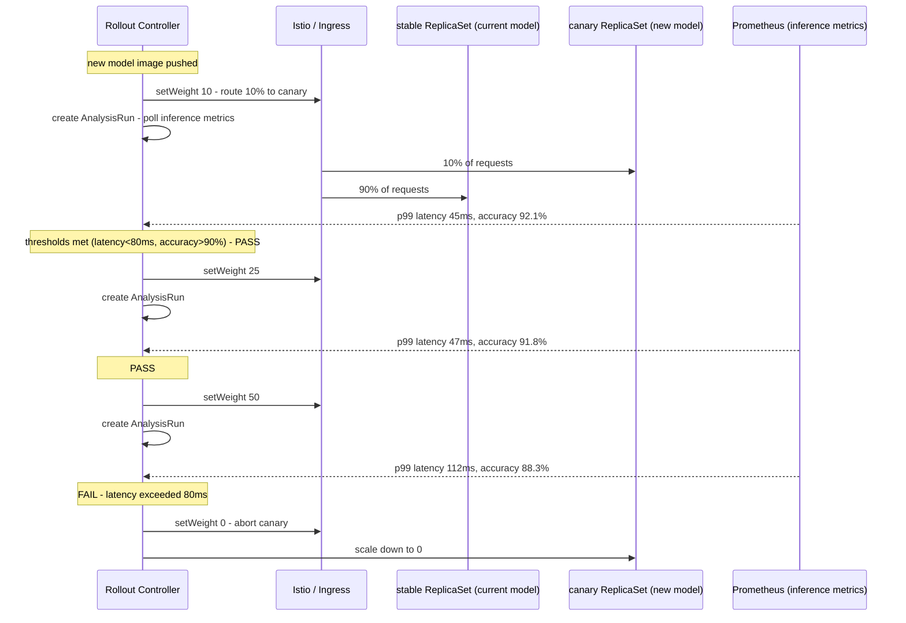
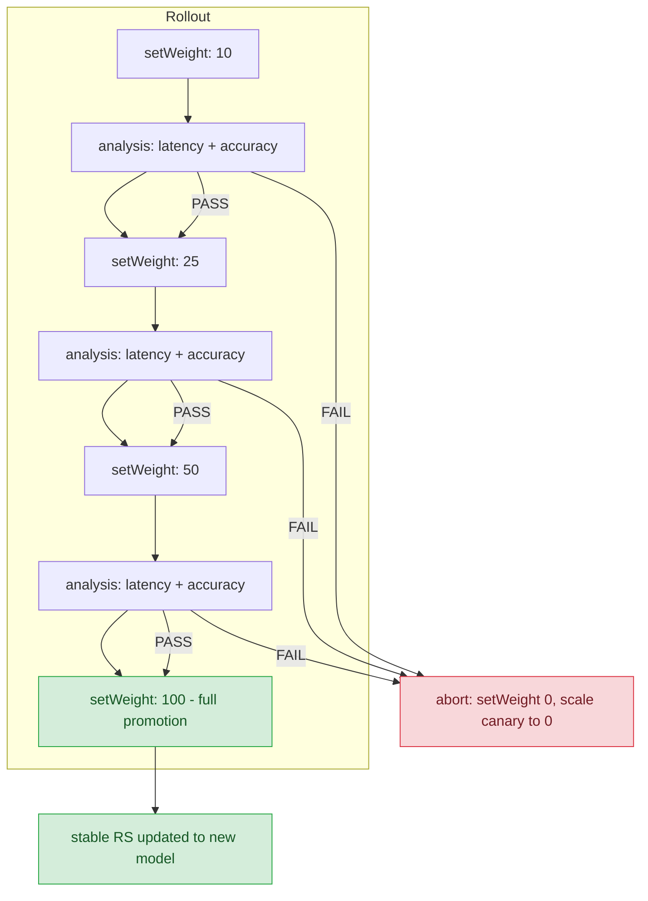

**TL;DR:** Deploying a new ML model version behind a Kubernetes Service looks identical to deploying any other container — but the failure mode is different: latency creep, accuracy drift, and silent regression all hide behind a green health check. Argo Rollouts gives you canary traffic shifting (percentage-based, enforced by a real mesh or ingress) combined with `AnalysisRun` gates so a model only gets promoted when inference metrics like p99 latency and accuracy pass configurable thresholds.
> **In plain English (30 sec):** Think of this like concepts you already use, but in a production system at scale.


**Real repo:** [`argoproj/argo-rollouts`](https://github.com/argoproj/argo-rollouts)

---

## 1. The Engineering Problem: rolling out a model without traffic control is a black-box bet

When you update a model's container image in a plain Kubernetes `Deployment`, the rolling update replaces Pods by count — 25% of new Pods, then 50%, and so on — but there is no built-in mechanism to say "route only 10% of live inference traffic to the new model, watch its latency and accuracy, and abort automatically if they degrade." A plain Deployment has no pause gate, no percentage-based traffic split, and no integration with a metrics pipeline that could feed a Promethean `error_rate` back into the rollout decision. In ML serving, where a 50ms p99 latency increase or a 2-point accuracy drop is the real "crash," a Pod readiness probe tells you almost nothing.

For a model serving 1,000 requests/second, deploying the new version to even 25% of Pods (the default `maxUnavailable`) means 250 requests/second are hitting an unvalidated model within seconds of the first Pod scheduling. There is no clean rollback path that restores the old model's routing — you would have to wait for the rolling update to finish, then roll it back, all while the degraded model keeps receiving traffic proportional to however many new Pods exist.

---

## 2. The Technical Solution: canary steps with analysis gates, enforced by a real traffic router

Argo Rollouts replaces `Deployment` with a `Rollout` custom resource whose `spec.strategy.canary.steps` array lets you declare explicit traffic-weight milestones. Each `setWeight` step instructs the controller to ask a configured traffic backend (Istio, Nginx, ALB, Traefik, or SMI) to route that exact percentage of live traffic to the canary ReplicaSet — the new model version — while the rest stays on the stable ReplicaSet. The critical difference from a plain rolling update: the weight is enforced by the mesh/ingress on the data plane, not by Pod count.

Between weight steps, `analysis` steps create an `AnalysisRun` that polls a metrics endpoint (Prometheus, Datadog, a custom endpoint) against a threshold. The rollout pauses until the analysis passes or fails. This is the A/B gate: the new model receives a known fraction of traffic, real inference metrics are collected from that fraction, and promotion only proceeds when those metrics meet the criteria you defined.



The abort path is the key safety mechanism: the moment any analysis step fails, the controller sends `setWeight 0` to the traffic backend, all traffic returns to the stable model, and the canary ReplicaSet is scaled down. No human intervention needed, no race window where the degraded model continues receiving requests.

Analysis runs can also run in background mode across all steps simultaneously, giving you a continuous safety net rather than a per-step gate.



---

## 3. The clean example (concept in isolation)

```yaml
apiVersion: argoproj.io/v1alpha1
kind: Rollout
metadata:
  name: ml-model-serving
spec:
  replicas: 4
  selector:
    matchLabels:
      app: ml-model
  template:
    metadata:
      labels:
        app: ml-model
    spec:
      containers:
        - name: inference
          image: myregistry/ml-model:v2
          ports:
            - containerPort: 8080
  strategy:
    canary:
      canaryService: ml-model-canary
      stableService: ml-model-stable
      trafficRouting:
        istio:
          virtualService:
            name: ml-model-vsvc
            routes:
              - primary
      steps:
        - setWeight: 10
        - pause: {duration: 5m}
        - analysis:
            templates:
              - templateName: ml-accuracy-check
        - setWeight: 25
        - pause: {duration: 10m}
        - analysis:
            templates:
              - templateName: ml-latency-check
        - setWeight: 100
```

---

## 4. Production reality (from `argoproj/argo-rollouts`)

From `rollout/trafficrouting.go` — the controller's reconcile loop that calculates and enforces traffic weights. This is the code that makes percentage-based splitting real on the data plane:

```go
// rollout/trafficrouting.go
// This currently only be used in the canary strategy
func (c *rolloutContext) reconcileTrafficRouting() error {
	reconcilers, err := c.newTrafficRoutingReconciler(c)
	if err != nil {
		return err
	}
	if len(reconcilers) == 0 {
		c.log.Info("No TrafficRouting Reconcilers found")
		c.newStatus.Canary.Weights = nil
		return nil
	}

	c.log.Infof("Found %d TrafficRouting Reconcilers", len(reconcilers))
	for _, reconciler := range reconcilers {
		c.log.Infof("Reconciling TrafficRouting with type '%s'", reconciler.Type())
		currentStep, index := replicasetutil.GetCurrentCanaryStep(c.rollout)
		desiredWeight := int32(0)
		weightDestinations := make([]v1alpha1.WeightDestination, 0)

		var canaryHash, stableHash string
		if c.stableRS != nil {
			stableHash = c.stableRS.Labels[v1alpha1.DefaultRolloutUniqueLabelKey]
		}
		if c.newRS != nil {
			canaryHash = c.newRS.Labels[v1alpha1.DefaultRolloutUniqueLabelKey]
		}

		if c.newRS == nil || c.newRS.Status.AvailableReplicas == 0 {
			weightDestinations = append(weightDestinations, c.calculateWeightDestinationsFromExperiment()...)
			err := reconciler.RemoveManagedRoutes()
			if err != nil {
				return err
			}
		} else if index != nil {
			atDesiredReplicaCount := replicasetutil.AtDesiredReplicaCountsForCanary(
				c.rollout, c.newRS, c.stableRS, c.otherRSs, nil)
			if !atDesiredReplicaCount && !c.rollout.Status.PromoteFull {
				for i := *index - 1; i >= 0; i-- {
					step := c.rollout.Spec.Strategy.Canary.Steps[i]
					if step.SetWeight != nil {
						desiredWeight = *step.SetWeight
						break
					}
				}
			} else if *index != int32(len(c.rollout.Spec.Strategy.Canary.Steps)) {
				desiredWeight = replicasetutil.GetCurrentSetWeight(c.rollout)
				weightDestinations = append(weightDestinations, c.calculateWeightDestinationsFromExperiment()...)
			} else {
				desiredWeight = weightutil.MaxTrafficWeight(c.rollout)
# ... (1 lines omitted)
```

What this teaches that the YAML-only examples cannot:

- **`checkReplicasAvailable` guards against routing traffic to a canary that is not ready to receive it.** Before any `SetWeight` call reaches the mesh, the controller verifies the stable ReplicaSet has enough available replicas to absorb the portion of traffic being shifted away from it. For ML models with slow cold-start (loading large weights into GPU memory), this is the difference between a graceful canary and a surge of 503s while the new model Pod is still initializing.
- **When the new ReplicaSet has zero available replicas, the weight is forced to zero and managed routes are removed — even if the previous weight was nonzero.** This handles the scenario where a new model version fails its readiness probe or OOMs during load: the controller detects `AvailableReplicas == 0`, resets traffic to 100% stable, and tears down any Istio VirtualService routes it previously managed. The canary never receives traffic it cannot serve.
- **`VerifyWeight` is a non-blocking check that re-enqueues the rollout if the mesh has not yet applied the desired weight.** For Istio, this means polling the VirtualService status until the proxy configuration has propagated to all sidecars. For ML inference workloads where a single misrouted request to a not-yet-loaded model can trigger a cascading failure in downstream feature pipelines, waiting for weight verification before proceeding is essential, not optional.

---

## 5. Review checklist

- [ ] `canaryService` and `stableService` are separate Services with selectors pointing at the canary and stable ReplicaSets respectively — the model serving layer (Triton, TF Serving, vLLM) exposes a `/health` or `/v2/health/ready` endpoint that Kubernetes reads for Pod readiness, so a model that has not finished loading its weights is never marked ready.
- [ ] Each `analysis` step references an `AnalysisTemplate` that queries the same Prometheus (or Datadog/Grafana) metrics your inference service is already emitting — the template's `successCondition` and `failureCondition` must use the same metric names and labels your `/metrics` endpoint actually exports, not a hypothetical name.
- [ ] `trafficRouting.istio.virtualService.routes` matches a real route name in your existing VirtualService — Argo Rollouts will modify this VirtualService in place during the rollout, so the route must exist before the Rollout is created and must not be manually edited while a rollout is in progress.
- [ ] `pause.duration` on each analysis step is long enough for the analysis to collect a statistically meaningful sample — for a model serving 100 req/s, a 5-minute pause gives ~30,000 inference samples; for a model serving 5 req/s, you may need 60+ minutes to reach the same confidence.

---

## FAQ

**Q: Can I use Argo Rollouts for A/B testing (header-based routing) instead of percentage-based canary?**
A: Yes. The `SetHeaderRoute` step type sends 100% of traffic matching a specific HTTP header (e.g., `x-model-version: v2`) to the canary while leaving percentage-based routing at zero for the stable. This is useful when you want a specific user segment to test the new model before any percentage split begins. The analysis gate still applies: the rollout will not promote until the header-routed analysis passes.

**Q: What happens if the canary model OOMs mid-rollout?**
A: The Pod crashes, `AvailableReplicas` drops to zero, and the controller hits the `c.newRS == nil || c.newRS.Status.AvailableReplicas == 0` branch in `reconcileTrafficRouting()`, which immediately sets traffic weight to zero and removes managed routes. All traffic returns to the stable model. The rollout enters an error state and can be retried after fixing the memory limit.

**Q: Do I need Istio to use canary traffic shifting?**
A: No. Argo Rollouts supports Istio, Nginx Ingress, AWS ALB, Traefik, SMI, Ambassador, App Mesh, and Apisix out of the box, plus a plugin system for custom routers. Without any traffic router configured, the controller falls back to replica-ratio weighting — a less precise approximation where the canary weight is derived from the ratio of canary to total replicas.

**Q: How does `dynamicStableScale` affect my model rollout?**
A: When `dynamicStableScale: true`, the stable ReplicaSet is scaled down proportionally as canary weight increases — reducing total Pod count during the rollout. For ML models that consume significant GPU memory, this saves cost: at 10% canary weight, only ~10% of stable replicas are running rather than a full copy. The trade-off is that instantaneous rollback becomes slower because the stable ReplicaSet must scale back up before it can absorb full traffic.

**Q: Can I run background analysis across all steps instead of per-step analysis?**
A: Yes. The `canary.analysis` field (a `RolloutAnalysisBackground`) starts an AnalysisRun at step 0 that runs continuously alongside every step. This complements per-step analysis by giving you a persistent safety net — if background metrics degrade at any point, the rollout aborts even between explicit analysis steps.

---

## Source

- **Topic:** A/B testing and canary deployment for ML models
- **Domain:** mlops
- **Repo:** [argoproj/argo-rollouts](https://github.com/argoproj/argo-rollouts) — [`rollout/trafficrouting.go`](https://github.com/argoproj/argo-rollouts/blob/master/rollout/trafficrouting.go) (traffic weight reconciliation logic), [`pkg/apis/rollouts/v1alpha1/types.go`](https://github.com/argoproj/argo-rollouts/blob/master/pkg/apis/rollouts/v1alpha1/types.go) (Rollout, CanaryStrategy, and AnalysisRun CRD type definitions) — the CNCF progressive-delivery controller for Kubernetes.


