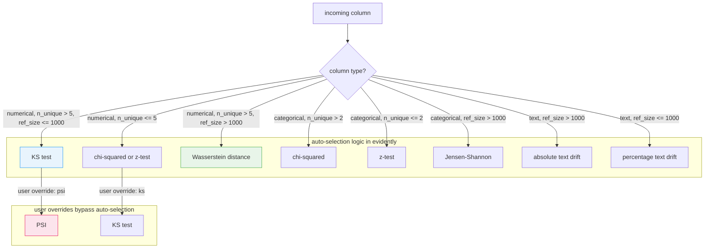
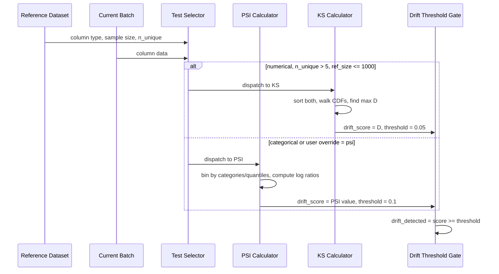

**TL;DR:** Data drift detection is not a single algorithm problem — PSI (Population Stability Index) bins both distributions and measures the cumulative divergence in proportions across bins, making it excellent for detecting overall distribution shifts and categorical changes. The Kolmogorov-Smirnov test, by contrast, finds the single point where the two cumulative distribution functions are farthest apart, making it more sensitive to local shape changes in continuous distributions. Evidently auto-selects the right test based on column type and sample size, but understanding when each test is appropriate prevents false negatives in production monitoring.

> **In plain English (30 sec):** Code you already write — Map, function, API call, just bigger.

**Real repo:** [`evidentlyai/evidently`](https://github.com/evidentlyai/evidently)

---

## 1. The Engineering Problem: choosing the wrong drift test silently masks distribution changes

When a production ML model starts receiving data that differs from its training distribution, accuracy degrades gradually — not in a crash, not in an error log, but in a slow erosion of prediction quality that can go unnoticed for weeks. The root cause is always the same: the feature distributions the model learned from no longer match the distributions it receives at inference time.

The challenge is that "distribution shift" is not one thing. A feature's mean can shift by 5% (a global location change), or a bimodal distribution can become unimodal (a structural shape change), or a new category can appear in a categorical column (a support change). Each of these shift types is best caught by a different statistical test. PSI is effective at detecting the overall divergence between two distributions by comparing the proportion of observations in shared bins — it catches both location and shape changes as a single score. KS, however, is a non-parametric test that compares the maximum distance between two empirical CDFs, making it more sensitive to local deviations at specific quantiles, even when the overall proportion shift is small.

Using only PSI misses scenarios where a distribution develops a new peak in a narrow quantile range without significantly changing the overall bin proportions. Using only KS misses categorical drift entirely (KS only works on numerical data) and can be overly sensitive to sample-size artifacts in large datasets. Production monitoring pipelines need both, applied to the right column types.

---

## 2. The Technical Solution: test selection by data type, with complementary statistical foundations

Evidently's drift detection pipeline works in two layers: an outer layer that selects which statistical test to apply per column (based on column type, sample size, and user overrides), and an inner layer that runs the chosen test and compares its output against a configurable threshold. The outer selection logic is deterministic — it checks the number of unique values, the reference dataset size, and whether the column is numerical, categorical, or text, then dispatches to the appropriate test.

The key insight is that PSI and KS operate on fundamentally different mathematical representations of the same data. PSI works on binned proportions (a histogram-based approach), while KS works on the raw order statistics via the empirical CDF. This is why they catch different shifts.



PSI computes its score by first binning both the reference and current data into shared bins (using reference quantiles for numerical data, or category values for categorical data), then calculating the proportional difference in each bin weighted by the log ratio. The formula is `PSI = sum((ref_pct - cur_pct) * ln(ref_pct / cur_pct))`. This makes PSI sensitive to any bin where the proportions diverge — a category that was 20% of the reference but is 5% of current, or a quantile bin where the density dropped.

KS computes its score by sorting both samples and walking along their empirical CDFs, tracking the maximum absolute difference at any point. The test statistic is `D = max|F_ref(x) - F_cur(x)|`. This means KS will flag a shift even if it only affects a narrow quantile range, as long as the CDFs separate significantly at that point. But it cannot handle categorical data, and its p-value becomes unreliable with very large sample sizes (it will always reject).



The threshold defaults differ because the test statistics have different scales. PSI produces a value from 0 (identical) to infinity (completely disjoint distributions), with 0.1 as the conventional "moderate drift" threshold. KS produces a p-value from 0 to 1, with 0.05 as the default significance level — a p-value below 0.05 means the two samples are unlikely to come from the same distribution.

---

## 3. The clean example (concept in isolation)

```python
import pandas as pd
import numpy as np
from sklearn import datasets
from evidently import Report
from evidently.presets import DataDriftPreset

# Load Iris dataset and simulate drift by shifting petal length
iris = datasets.load_iris(as_frame=True)
reference = iris.frame.iloc[:60].copy()

# Artificially shift petal length to create detectable drift
current = iris.frame.iloc[60:].copy()
current["petal length (cm)"] += np.random.normal(0.8, 0.2, len(current))

# Run drift detection with PSI (default for this dataset size)
report = Report([DataDriftPreset(method="psi")])
result = report.run(reference, current)

# Get the drift verdict per column as a dictionary
print(result.dict())

# To switch to KS test explicitly:
report_ks = Report([DataDriftPreset(method="ks")])
result_ks = report_ks.run(reference, current)
print(result_ks.dict())
```

---

## 4. Production Reality: verbatim from evidentlyai/evidently

The following code is from `src/evidently/legacy/calculations/stattests/psi.py`:

```python
"""PSI of two samples.

Name: "psi"

Import:

    >>> from evidently.legacy.calculations.stattests import psi_stat_test

Properties:
- only for categorical and numerical features
- returns PSI value
"""

from typing import Tuple

import numpy as np
import pandas as pd

from evidently.legacy.calculations.stattests.registry import StatTest
from evidently.legacy.calculations.stattests.registry import register_stattest
from evidently.legacy.calculations.stattests.utils import get_binned_data
from evidently.legacy.core import ColumnType


def _psi(
    reference_data: pd.Series, current_data: pd.Series,
    feature_type: ColumnType, threshold: float, n_bins: int = 30
) -> Tuple[float, bool]:
    """Calculate the PSI
    Args:
        reference_data: reference data
        current_data: current data
        feature_type: feature type
        threshold: all values above this threshold means data drift
        n_bins: number of bins
    Returns:
        psi_value: calculated PSI
        test_result: whether the drift is detected
    """
    reference_percents, current_percents = get_binned_data(
        reference_data, current_data, feature_type, n_bins
    )

    psi_values = (
        (reference_percents - current_percents)
        * np.log(reference_percents / current_percents)
    )
    psi_value = np.sum(psi_values)

    return psi_value, psi_value >= threshold


psi_stat_test = StatTest(
    name="psi",
    display_name="PSI",
    allowed_feature_types=[ColumnType.Categorical, ColumnType.Numerical],
    default_threshold=0.1,
)

register_stattest(psi_stat_test, _psi)
```

And from `src/evidently/legacy/calculations/stattests/ks_stattest.py`:

```python
"""Kolmogorov-Smirnov test of two samples.

Name: "ks"

Import:

    >>> from evidently.legacy.calculations.stattests import ks_stat_test

Properties:
- only for numerical features
- returns p-value
"""

from typing import Tuple

import pandas as pd
from scipy.stats import ks_2samp

from evidently.legacy.calculations.stattests.registry import StatTest
from evidently.legacy.calculations.stattests.registry import register_stattest
from evidently.legacy.core import ColumnType


def _ks_stat_test(
    reference_data: pd.Series, current_data: pd.Series,
    feature_type: ColumnType, threshold: float
) -> Tuple[float, bool]:
    """Run the two-sample Kolmogorov-Smirnov test of two samples.
    Alternative: two-sided
    Args:
        reference_data: reference data
        current_data: current data
        feature_type: feature type
        threshold: level of significance
    Returns:
        p_value: two-tailed p-value
        test_result: whether the drift is detected
    """
    p_value = ks_2samp(reference_data, current_data)[1]
    return p_value, p_value <= threshold


ks_stat_test = StatTest(
    name="ks",
    display_name="K-S p_value",
    allowed_feature_types=[ColumnType.Numerical],
    default_threshold=0.05,
)

register_stattest(ks_stat_test, _ks_stat_test)
```

What this reveals that tutorials cannot:

- **PSI fills zero-proportion bins with a floor value to avoid `log(0)` errors.** The `get_binned_data` utility replaces any bin with 0% proportion with `min(non_zero_proportions) / 10^6` (or `0.0001` if the minimum is already very small). This is a numerical stability guard, not an approximation — without it, the log-ratio calculation would produce `-inf` for any bin where one dataset has observations and the other does not, corrupting the final sum.
- **KS defaults to a two-sided test with a 0.05 threshold, while PSI defaults to 0.1.** These are different scales — KS returns a p-value (probability of observing this separation under the null hypothesis), while PSI returns a dimensionless divergence score. A PSI of 0.1 means roughly 10% of the distribution mass has shifted; a KS p-value of 0.05 means there is a 5% chance the two samples come from the same distribution. You cannot compare these numbers directly.
- **PSI is registered for both `ColumnType.Numerical` and `ColumnType.Categorical`, while KS is registered only for `ColumnType.Numerical`.** Attempting to use KS on a categorical column raises `StatTestInvalidFeatureTypeError`. The auto-selection logic in `_get_default_stattest` accounts for this by routing categorical columns to chi-squared, z-test, or Jensen-Shannon based on unique value count and sample size.
- **The `StatTest.__call__` method delegates to an engine-specific implementation via `_get_impl(engine)`.** The default is `PythonEngine`, but the registry supports alternative engines for distributed computation. This is the extension point for running drift tests on Spark or Dask backends without modifying the test logic itself.

---

## 5. Review checklist

- [ ] The drift test is appropriate for the column type — PSI works on both numerical and categorical columns, KS only on numerical; auto-selection handles this, but manual overrides must respect the constraint.
- [ ] The reference dataset is large enough for the chosen test — KS with fewer than 20-30 samples per group has low statistical power; PSI with fewer than 500 rows produces unstable bin proportions.
- [ ] The threshold matches the business tolerance — PSI threshold of 0.1 is a moderate default, but for high-stakes applications (medical, financial) a threshold of 0.05 or lower may be required.
- [ ] Drift detection runs on a rolling window, not the full production history — comparing today's batch against the original training set (months or years old) will always show drift; compare against a recent reference window of similar age.
- [ ] Categorical columns with high cardinality (hundreds of unique values) are handled separately — chi-squared and z-tests lose power with many low-count categories; consider grouping rare categories before testing.

---

## FAQ

**Q: Why not just use KL divergence instead of PSI?**
A: PSI is a symmetric form of KL divergence — `sum((p - q) * ln(p/q))` instead of `sum(p * ln(p/q))` — which means PSI does not depend on which distribution you call "reference" and which you call "current." Standard KL divergence is asymmetric and requires a smoothing strategy when the current distribution has support in areas where the reference has zero mass. PSI's bin-filling floor handles this automatically.

**Q: Can KS detect a mean shift of 1% in a large dataset?**
A: Yes, and that is precisely the problem. With 100,000+ samples, KS becomes oversensitive — it will detect statistically significant differences that are practically meaningless (a 1% mean shift that has no effect on model accuracy). This is why Evidently's auto-selection switches from KS to Wasserstein distance or Jensen-Shannon divergence when the reference dataset exceeds 1,000 rows — those tests produce magnitude-scale scores that are more interpretable at large sample sizes.

**Q: What happens when a new category appears in a categorical column?**
A: PSI handles this naturally because `get_binned_data` unions the unique values from both reference and current datasets. A new category gets its own bin with 0% reference proportion (filled to the floor value) and some nonzero current proportion, which increases the PSI score. Chi-squared and z-tests also detect new categories, as they create additional cells in the contingency table with zero expected counts.

**Q: How does Evidently handle datetime columns for drift detection?**
A: Datetime columns are excluded from drift detection by default — they are classified as `ColumnType.Datetime`, which is not in the `allowed_feature_types` list for PSI, KS, or any other registered test. If you need to detect temporal distribution shifts, extract features from the datetime (hour of day, day of week) and monitor those as numerical columns.

---

## Source

- **Topic:** Data drift and model drift detection
- **Domain:** mlops
- **Repo:** [evidentlyai/evidently](https://github.com/evidentlyai/evidently) — [`src/evidently/legacy/calculations/stattests/psi.py`](https://github.com/evidentlyai/evidently/blob/main/src/evidently/legacy/calculations/stattests/psi.py) (PSI implementation and registration), [`src/evidently/legacy/calculations/stattests/ks_stattest.py`](https://github.com/evidentlyai/evidently/blob/main/src/evidently/legacy/calculations/stattests/ks_stattest.py) (KS test implementation and registration), [`src/evidently/legacy/calculations/stattests/registry.py`](https://github.com/evidentlyai/evidently/blob/main/src/evidently/legacy/calculations/stattests/registry.py) (test registry, auto-selection logic, and `StatTest` dispatch) — the open-source ML and LLM observability framework with 100+ built-in metrics for data drift detection.


