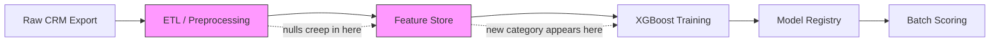
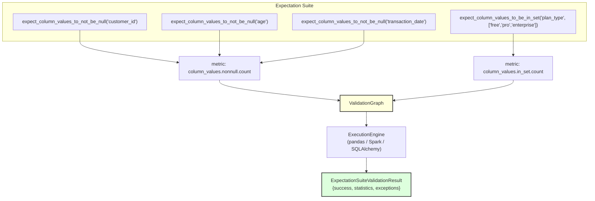
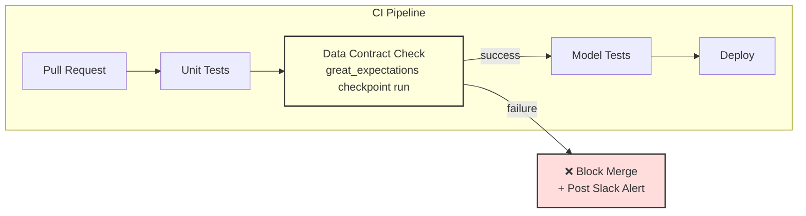

## TL;DR

ML pipelines fail silently when upstream data drifts, nulls multiply, or categorical values mutate between training and serving. Accuracy metrics on a held-out test set tell you nothing about data shape corruption. Great Expectations lets you codify **data contracts**—machine-readable assertions over schema, nullity, value ranges, and categorical membership—so your CI pipeline catches broken data *before* a single model weight is loaded.

---

## The Engineering Problem

Most ML teams test their models exhaustively: cross-validation scores, confusion matrices, calibration plots. Almost none of them test the *data feeding those models*.

Consider a churn prediction pipeline:



The two pink nodes are where data contracts matter. Without explicit assertions:

- A nullable `age` column silently fills with `NaN` after a CRM schema change, and the imputer defaults to median—masking a population shift.
- A `plan_type` column introduces `"enterprise_v2"` as a new category, which the label encoder maps to an unknown index, silently producing garbage features.
- A `transaction_date` column switches from ISO 8601 to epoch milliseconds, and every time-based feature becomes a number 10 orders of magnitude too large.

None of these break the training script. All of them corrupt the model. You discover the damage weeks later when production AUC drops 12 points and nobody can explain why.

**The core issue:** ML test suites validate *model output quality*. They do not validate *data contract compliance*. Great Expectations fills that gap by letting you declare expectations as code, run them in CI, and gate deployments on pass/fail.

---

## Technical Solution

Great Expectations models data validation as a **validation graph**—a directed acyclic graph of metric dependencies. Each expectation (e.g., "column X must not be null") declares metrics it needs, and the framework resolves the dependency tree, computes metrics in the fewest passes over the data, and returns a structured result.



The `ValidationGraph` deduplicates metrics across expectations—multiple expectations sharing the same metric compute it exactly once. The `ExecutionEngine` abstracts over pandas, Spark, and SQLAlchemy backends, so the same expectation suite runs against a local DataFrame in CI and a 50 TB Spark table in production.

### The `mostly` Parameter: Tolerating Known Noise

Real-world data is never 100% clean. Great Expectations handles this through the `mostly` parameter, which sets the minimum fraction of rows that must satisfy the expectation for the overall check to pass.

From the source (`expect_column_values_to_not_be_null.py`):

```python
# From great_expectations/expectations/core/expect_column_values_to_not_be_null.py
# The _validate method compares the observed null ratio against the `mostly` threshold.

def _validate(
    self,
    configuration: ExpectationConfiguration,
    metrics: Dict,
    runtime_configuration: dict = None,
    execution_engine: ExecutionEngine = None,
):
    result_format = self.get_result_format(
        configuration=configuration, runtime_configuration=runtime_configuration
    )
    mostly = self.get_success_kwargs().get(
        "mostly", self.default_kwarg_values.get("mostly")
    )
    total_count = metrics.get("table.row_count")
    unexpected_count = metrics.get(f"{self.map_metric}.unexpected_count")

    if total_count is None or total_count == 0:
        # Vacuously true
        success = True
    else:
        success_ratio = (total_count - unexpected_count) / total_count
        success = success_ratio >= mostly

    nonnull_count = None

    return _format_map_output(
        result_format=parse_result_format(result_format),
        success=success,
        element_count=metrics.get("table.row_count"),
        nonnull_count=nonnull_count,
        unexpected_count=metrics.get(f"{self.map_metric}.unexpected_count"),
        unexpected_list=metrics.get(f"{self.map_metric}.unexpected_values"),
        unexpected_index_list=metrics.get(
            f"{self.map_metric}.unexpected_index_list"
        ),
    )
```

The key line is `success = success_ratio >= mostly`. Set `mostly=0.99` to allow 1% nulls in a column known to have sporadic missing values, while still catching a jump to 15%.

### The Validation Graph: Deduplicating Metric Computation

When you have 50 expectations across 20 columns, naive implementations compute the same metric multiple times. The `ValidationGraph` avoids this:

```python
# From great_expectations/validator/validation_graph.py
# ValidationGraph stores MetricEdge objects and deduplicates by edge ID.

class ValidationGraph:
    def __init__(self, edges: Optional[List[MetricEdge]] = None) -> None:
        if edges:
            self._edges = edges
        else:
            self._edges = []

        self._edge_ids = {edge.id for edge in self._edges}

    def add(self, edge: MetricEdge) -> None:
        if edge.id not in self._edge_ids:
            self._edges.append(edge)
            self._edge_ids.add(edge.id)

    @property
    def edges(self):
        return copy.deepcopy(self._edges)

    @property
    def edge_ids(self):
        return {edge.id for edge in self.edges}


class ExpectationValidationGraph:
    def __init__(self, configuration: ExpectationConfiguration) -> None:
        self._configuration = configuration
        self._graph = ValidationGraph()

    def update(self, graph: ValidationGraph) -> None:
        edge: MetricEdge
        for edge in graph.edges:
            self.graph.add(edge=edge)

    def get_exception_info(
        self,
        metric_info: Dict[
            Tuple[str, str, str],
            Dict[str, Union[MetricConfiguration, Set[ExceptionInfo], int]],
        ],
    ) -> Set[ExceptionInfo]:
        metric_info = self._filter_metric_info_in_graph(metric_info=metric_info)
        metric_exception_info: Set[ExceptionInfo] = set()
        metric_id: Tuple[str, str, str]
        metric_info_item: Union[MetricConfiguration, Set[ExceptionInfo], int]
        for metric_id, metric_info_item in metric_info.items():
            metric_exception_info.update(
                cast(Set[ExceptionInfo], metric_info_item["exception_info"])
            )

        return metric_exception_info
```

Each `MetricEdge` links a left metric to an optional right metric (for compound computations). The `_edge_ids` set makes `add()` an O(1) duplicate check. The `ExpectationValidationGraph` wraps this per-expectation, filtering the global metric info down to only the metrics this expectation's graph requires.

---

## Clean Example

Here's a complete data contract for an ML training dataset, written as a Great Expectations suite:

```python
# data_contract.py
# Defines an ExpectationSuite that validates a churn prediction training dataset.
# Run with: great_expectations checkpoint run training_data_checkpoint

from great_expectations.core import ExpectationSuite
from great_expectations.core.batch import RuntimeBatchRequest
from great_expectations.validator.validator import Validator

suite = ExpectationSuite(expectation_suite_name="churn_training_contract")

# ── Nullity contracts ─────────────────────────────────────────────────
# customer_id must never be null (primary key integrity)
suite.add_expectation(
    {
        "expectation_type": "expect_column_values_to_not_be_null",
        "kwargs": {"column": "customer_id"},
    }
)

# age can have up to 3% nulls (known CRM export issue), but no more
suite.add_expectation(
    {
        "expectation_type": "expect_column_values_to_not_be_null",
        "kwargs": {"column": "age", "mostly": 0.97},
    }
)

# ── Categorical contracts ─────────────────────────────────────────────
# plan_type must be exactly one of these three values — no silent new categories
suite.add_expectation(
    {
        "expectation_type": "expect_column_values_to_be_in_set",
        "kwargs": {
            "column": "plan_type",
            "value_set": ["free", "pro", "enterprise"],
        },
    }
)

# churn_label must be binary — anything else corrupts the target variable
suite.add_expectation(
    {
        "expectation_type": "expect_column_values_to_be_in_set",
        "kwargs": {
            "column": "churn_label",
            "value_set": [0, 1],
        },
    }
)

# ── Structural contracts ──────────────────────────────────────────────
# Dataset must have at least 10,000 rows (minimum for statistical power)
suite.add_expectation(
    {
        "expectation_type": "expect_table_row_count_to_be_between",
        "kwargs": {"min_value": 10_000},
    }
)

# Column count must be exactly what the feature pipeline expects
suite.add_expectation(
    {
        "expectation_type": "expect_table_columns_to_match_ordered_list",
        "kwargs": {
            "column_list": [
                "customer_id",
                "age",
                "plan_type",
                "monthly_spend",
                "tenure_months",
                "support_tickets",
                "churn_label",
            ]
        },
    }
)

# ── Value range contracts ─────────────────────────────────────────────
# monthly_spend must be non-negative and below $10,000 (sanity bound)
suite.add_expectation(
    {
        "expectation_type": "expect_column_values_to_be_between",
        "kwargs": {
            "column": "monthly_spend",
            "min_value": 0,
            "max_value": 10_000,
        },
    }
)
```

---

## Production Reality

### How Great Expectations Actually Validates

The expectation source code reveals the exact validation logic. When `expect_column_values_to_not_be_null` runs, it does **not** just check for Python `None`—it checks for database-native null representations:

```python
# From great_expectations/expectations/core/expect_column_values_to_not_be_null.py
# Docstring clarifies what counts as "null" across engines.

class ExpectColumnValuesToNotBeNull(ColumnMapExpectation):
    """Expect column values to not be null.

    To be counted as an exception, values must be explicitly null or missing,
    such as a NULL in PostgreSQL or an np.NaN in pandas. Empty strings don't
    count as null unless they have been coerced to a null type.

    Args:
        column (str):
            The column name.

    Keyword Args:
        mostly (None or a float between 0 and 1):
            Return `"success": True` if at least mostly fraction of values
            match the expectation.
    """

    map_metric = "column_values.nonnull"
    args_keys = ("column",)

    def validate_configuration(
        self, configuration: Optional[ExpectationConfiguration]
    ) -> None:
        super().validate_configuration(configuration)
        self.validate_metric_value_between_configuration(
            configuration=configuration
        )
```

This distinction matters. A CRM export might contain empty strings `""` in a `plan_type` column that are *not* NULL in the database but *are* invalid for your model. Great Expectations correctly does **not** treat `""` as null—so you need a separate `expect_column_values_to_not_be_in_set` expectation with `[""]` in the forbidden set, or use `expect_column_values_to_match_regex` to enforce non-blank values.

### How Categorical Validation Works

The `expect_column_values_to_be_in_set` expectation uses a profiler-based approach for parameterized suites. The source reveals the `value_set` estimator:

```python
# From great_expectations/expectations/core/expect_column_values_to_be_in_set.py
# The default profiler auto-discovers value sets across batches.

class ExpectColumnValuesToBeInSet(ColumnMapExpectation):
    map_metric = "column_values.in_set"

    args_keys = (
        "column",
        "value_set",
    )

    value_set_estimator_parameter_builder_config: ParameterBuilderConfig = (
        ParameterBuilderConfig(
            module_name=(
                "great_expectations.rule_based_profiler.parameter_builder"
            ),
            class_name="ValueSetMultiBatchParameterBuilder",
            name="value_set_estimator",
            metric_domain_kwargs=(
                DOMAIN_KWARGS_PARAMETER_FULLY_QUALIFIED_NAME
            ),
            metric_value_kwargs=None,
            evaluation_parameter_builder_configs=None,
            json_serialize=True,
        )
    )
```

In production, you typically **fix** the `value_set` rather than letting the profiler discover it—because the whole point of a data contract is to reject values that weren't in the training schema. The profiler is useful during initial contract authoring to see what values currently exist, but the contract should hardcode the allowed set.

### CI Integration Pattern



The data contract runs as a CI gate *before* model training. If expectations fail, the pipeline blocks and alerts the data engineering team. This catches schema drift within hours, not weeks.

---

## Review Checklist

Before adopting Great Expectations data contracts for your ML pipeline, verify:

- [ ] **Primary key nullity.** Every ID column that joins to other tables has `expect_column_values_to_not_be_null` with `mostly` unset (100% required).
- [ ] **Categorical whitelists.** Every categorical feature and the target variable has `expect_column_values_to_be_in_set` with an explicit, hardcoded `value_set`. Do not use the profiler in production contracts.
- [ ] **Numeric sanity bounds.** Every continuous feature has `expect_column_values_to_be_between` with `min_value`/`max_value` reflecting physical reality, not statistical distributions.
- [ ] **Row count floor.** `expect_table_row_count_to_be_between` with a `min_value` that guarantees statistical power for your smallest subgroup.
- [ ] **Column list exactness.** `expect_table_columns_to_match_ordered_list` ensures the feature pipeline receives exactly the columns it expects, in the expected order.
- [ ] **Null tolerance declared.** Columns with known sporadic missingness use `mostly` at a realistic threshold (e.g., 0.95–0.99), not the default 1.0.
- [ ] **Empty-string vs null.** Expectations distinguish between empty strings and NULL based on your database engine. Add explicit `expect_column_values_to_not_be_in_set` with `[""]` if empty strings are invalid.
- [ ] **Contract versioning.** The expectation suite is committed to version control alongside the feature pipeline code, so schema changes are reviewed in PRs.

---

## FAQ

**Q: Why not just use `pandas.DataFrame.info()` or `df.describe()` in a notebook?**
A: Notebooks are not CI. Manual checks don't run on every PR, don't produce machine-readable pass/fail, and don't block deployments. Great Expectations suites execute programmatically in your pipeline and return structured `ExpectationSuiteValidationResult` objects with exact failure details.

**Q: Can I use Great Expectations with Spark DataFrames for large-scale training data?**
A: Yes. The `ExecutionEngine` abstraction supports pandas, Spark, and SQLAlchemy. The same expectation suite runs against a 10k-row sample in CI and a 10 TB Spark table in production without modification.

**Q: What happens when I legitimately add a new category to a feature?**
A: You update the data contract in the same PR that adds the new category to the feature pipeline. The contract is version-controlled—so the change is reviewed, tested, and merged together. This is the entire point: schema changes are explicit, not accidental.

**Q: How does `mostly` interact with data quality monitoring in production?**
A: In production, you run expectations on each batch of scoring data. The `unexpected_percent` field in the result tells you exactly how far off you are from the contract. Track this metric over time with a monitoring dashboard to detect gradual drift even when individual batches still pass.

---

## Source

- [great_expectations/great_expectations](https://github.com/great-expectations/great_expectations) — Apache 2.0 licensed
- [`expect_column_values_to_not_be_null.py`](https://github.com/great-expectations/great_expectations/blob/main/great_expectations/expectations/core/expect_column_values_to_not_be_null.py) — Nullity expectation with `mostly` threshold logic
- [`expect_column_values_to_be_in_set.py`](https://github.com/great_expectations/great_expectations/blob/main/great_expectations/expectations/core/expect_column_values_to_be_in_set.py) — Categorical membership validation with profiler support
- [`validation_graph.py`](https://github.com/great-expectations/great_expectations/blob/main/great_expectations/validator/validation_graph.py) — Metric dependency graph and deduplication engine
