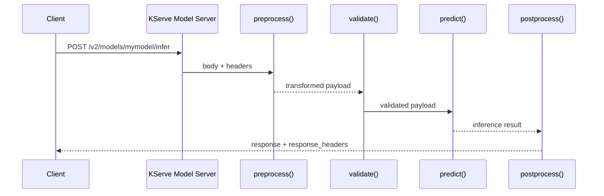
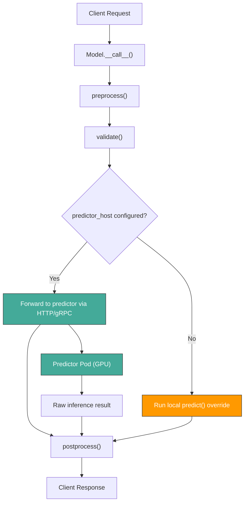

> **In plain English (30 sec):** Code you already write — Map, function, API call, just bigger.


## TL;DR

**Q:** Why can't you just run the same batch scoring pipeline to serve a prediction API with sub-100ms latency?

**A:** Because batch pipelines optimize for throughput (millions of rows per hour, scheduled, fault-tolerant) while online inference servers optimize for latency (single request in, single response out, milliseconds budget, always-on) — and KServe's `Model` class is built entirely around the online serving lifecycle.

---

## 1. The Engineering Problem

Your fraud detection model scored 95% AUC in training. You have a batch job that runs every hour, scores 2 million transactions, and writes results to a dashboard. Life is good.

Then product wants a real-time endpoint: "Can we flag fraudulent transactions *before* the payment completes?"

Your batch job takes 45 minutes to score 2 million rows. A payment authorization has a 200ms timeout. The batch architecture — load data, preprocess in bulk, predict in bulk, write results — simply cannot work here. The problems compound:

- **Latency budget**: A batch job assumes minutes-to-hours are acceptable. Online serving has a strict per-request latency budget (often < 100ms end-to-end).
- **Concurrency model**: Batch jobs process one partition at a time. Online servers handle hundreds of concurrent requests, each isolated and independently timed.
- **Health and readiness**: A batch job that crashes mid-run can be re-run. An online server that crashes loses live traffic — Kubernetes needs a `readinessProbe` to stop routing requests to an unhealthy pod.
- **Protocol differences**: Batch pipelines read from files or databases. Online servers expose REST/gRPC endpoints conforming to standards like the Open Inference Protocol (V2).

Batch and online inference aren't the same "deployment" problem wearing different clothes. They have different failure modes, different resource profiles, and different operational contracts.

---

## 2. The Technical Solution

KServe solves this by defining a strict online serving lifecycle inside the `Model` class. Every request flows through a four-stage pipeline: **preprocess → validate → predict → postprocess**. This is a request-response architecture, not a batch loop.



The critical design decision: `predict()` is not a one-off call. KServe's `Model` can either run inference locally (your custom `predict` override) or forward to a separate predictor container via HTTP/gRPC. This indirection is what enables transformer/predictor splitting — the preprocessing runs on CPU pods, the GPU-heavy predictor runs on GPU pods, and KServe wires them together transparently.



Three core truths:

1. **The model class is the serving contract.** `load()`, `preprocess()`, `predict()`, and `postprocess()` are the lifecycle hooks. Kubernetes health probes call `healthy()` — if `self.ready` is `False`, traffic stops.
2. **Protocol-aware routing.** KServe supports REST V1, REST V2, and gRPC V2 protocols. The `predict()` method checks `predictor_config.protocol` and dispatches to `_http_predict()` or `_grpc_predict()` accordingly. Batch pipelines don't need protocol negotiation.
3. **Header forwarding and observability.** Online servers must propagate `x-request-id`, `x-b3-traceid`, and `authorization` headers for distributed tracing. Batch jobs have no caller to propagate headers from.

---

## 3. The Clean Example

A minimal KServe model subclass that overrides the four lifecycle hooks:

```python
import kserve
from typing import Dict, Union
from kserve.protocol.infer_type import InferRequest, InferResponse


class FraudDetectorModel(kserve.Model):
    def __init__(self, name: str):
        super().__init__(name)
        self.model = None

    # 1. Load the model into memory once at startup
    def load(self) -> bool:
        import joblib
        self.model = joblib.load("/mnt/models/fraud_xgb.pkl")
        self.ready = True
        return self.ready

    # 2. Transform incoming request into model-ready features
    async def preprocess(
        self, payload: Union[Dict, InferRequest], headers: Dict = None
    ) -> Dict:
        instances = payload.get("instances", [])
        features = [self._extract_features(row) for row in instances]
        return {"instances": features}

    # 3. Run inference (or forward to a predictor pod)
    async def predict(
        self, payload: Union[Dict, InferRequest], headers: Dict = None
    ) -> Dict:
        instances = payload["instances"]
        predictions = self.model.predict_proba(instances).tolist()
        return {"predictions": predictions}

    # 4. Shape the response for the caller
    async def postprocess(
        self, result: Union[Dict, InferResponse], headers: Dict = None
    ) -> Dict:
        scores = result["predictions"]
        labels = ["legitimate" if s < 0.5 else "fraudulent" for s in scores]
        return {"results": labels}

    def _extract_features(self, row: Dict) -> list:
        return [row["amount"], row["merchant_category"], row["hour"]]
```

This is the online serving shape: always-on, request/response, per-request latency budget. A batch pipeline would look entirely different — read from a file, loop, predict in bulk, write results.

---

## 4. Production Reality

Here's how KServe's `Model.__call__` actually implements the online serving lifecycle. From `python/kserve/kserve/model.py`:

```
python/kserve/kserve/model.py
├── BaseKServeModel          # Abstract base with load/stop/healthy lifecycle
├── InferenceModel(BaseKServeModel)  # Adds __call__ and input/output type metadata
└── Model(InferenceModel)    # Concrete implementation with HTTP/gRPC predict dispatch
```

```python
# Source: python/kserve/kserve/model.py — Model.__call__()
async def __call__(
    self,
    body: Union[Dict, CloudEvent, InferRequest],
    headers: Optional[Dict[str, str]] = None,
    verb: InferenceVerb = InferenceVerb.PREDICT,
) -> InferReturnType:
    # --- Header propagation for distributed tracing ---
    request_id = headers.get("x-request-id", "N.A.") if headers else "N.A."

    # --- Per-stage latency tracking (Prometheus histograms) ---
    preprocess_ms = 0
    predict_ms = 0
    postprocess_ms = 0
    prom_labels = get_labels(self.name)

    # --- Stage 1: Preprocess (sync or async, detected at runtime) ---
    with PRE_HIST_TIME.labels(**prom_labels).time():
        start = time.time()
        payload = (
            await self.preprocess(body, headers)
            if inspect.iscoroutinefunction(self.preprocess)
            else self.preprocess(body, headers)
        )
        preprocess_ms = get_latency_ms(start, time.time())
    payload = self.validate(payload)

    # --- Stage 2: Predict or Explain (verb dispatch) ---
    if verb == InferenceVerb.PREDICT:
        with PREDICT_HIST_TIME.labels(**prom_labels).time():
            start = time.time()
            if self.required_response_headers:
                response = (
                    await self.predict(payload, headers, response_headers)
                    if inspect.iscoroutinefunction(self.predict)
                    else self.predict(payload, headers, response_headers)
                )
            else:
                response = (
                    await self.predict(payload, headers)
                    if inspect.iscoroutinefunction(self.predict)
                    else self.predict(payload, headers)
                )
            predict_ms = get_latency_ms(start, time.time())

    # --- Stage 3: Postprocess ---
    with POST_HIST_TIME.labels(**prom_labels).time():
        start = time.time()
        response = (
            await self.postprocess(response, headers)
            if inspect.iscoroutinefunction(self.postprocess)
            else self.postprocess(response, headers)
        )
        postprocess_ms = get_latency_ms(start, time.time())

    # --- Latency logging (optional, gated by flag) ---
    if self.enable_latency_logging is True:
        trace_logger.info(
            f"requestId: {request_id}, preprocess_ms: {preprocess_ms}, "
            f"predict_ms: {predict_ms}, postprocess_ms: {postprocess_ms}"
        )
    return response, response_headers
```

Production details this reveals that a hello-world tutorial never shows:

1. **Sync/async detection at runtime.** `inspect.iscoroutinefunction(self.preprocess)` lets subclasses define preprocess as either sync or async without breaking the framework. A batch pipeline never needs this — it controls the entire execution flow.
2. **Per-stage Prometheus histograms.** Every request gets `PRE_HIST_TIME`, `PREDICT_HIST_TIME`, and `POST_HIST_TIME` tracked with model-specific labels. Online servers need this for SLO enforcement; batch jobs only need aggregate job duration.
3. **Header forwarding.** `_FORWARDABLE_HEADERS = frozenset({"x-request-id", "x-b3-traceid", "authorization"})` — only three headers survive the hop from client to predictor. Batch pipelines have no caller to propagate headers from.
4. **`required_response_headers` flag.** When enabled, `predict()` and `postprocess()` receive an extra mutable `response_headers` dict — this lets the model inject headers into the HTTP response without touching the response body. Batch results have no HTTP response headers.

---

## 5. Review Checklist

- [ ] **`self.ready = True` must be set in `load()`** — Kubernetes readiness probes call `healthy()`, which returns `self.ready`. If you override `load()` but forget this line, the pod starts but never receives traffic.
- [ ] **Protocol matches predictor config.** `predict()` dispatches to `_http_predict()` or `_grpc_predict()` based on `predictor_config.protocol`. Mismatched protocol settings cause silent failures — the request succeeds but the predictor receives garbled data.
- [ ] **Preprocess must handle both `Dict` and `InferRequest`.** KServe V1 endpoints send `Dict` with `instances`; V2 endpoints send `InferRequest` with `inputs`. A preprocess that only handles one will break for the other protocol.
- [ ] **Latency logging is opt-in.** `enable_latency_logging` defaults to `False`. For production online serving, enable it — the per-stage Prometheus histograms are always collected, but the per-request trace log line requires this flag.

---

## 6. FAQ

**Q: Can I use KServe's `Model` class for batch scoring?**

A: Technically yes, but it's the wrong tool. `Model.__call__` is designed for single-request response cycles with header propagation and latency tracking. Batch scoring needs bulk predict, parallelism, and checkpointing — use a pipeline orchestrator (Kubeflow Pipelines, Airflow) or a batch-capable serving runtime instead.

**Q: What's the difference between `predict()` forwarding to a predictor pod vs running locally?**

A: When `predictor_config.predictor_host` is set, `predict()` makes an HTTP/gRPC call to a separate predictor container — this is the transformer/predictor split that lets you run preprocessing on CPU pods and inference on GPU pods. When no predictor host is configured, `predict()` expects your subclass to override it with local inference logic.

**Q: How does KServe decide between REST V1, REST V2, and gRPC V2?**

A: The `PredictorProtocol` enum (`v1`, `v2`, `grpc-v2`) is set in the `InferenceService` CRD or in `PredictorConfig`. V1 uses `instances` in the request body; V2 uses `inputs` (the Open Inference Protocol). gRPC V2 uses protobuf `ModelInferRequest`. The `predict()` method checks the protocol and dispatches to the appropriate client — `_http_predict()` for REST, `_grpc_predict()` for gRPC.

**Q: Why only three forwardable headers?**

A: `_FORWARDABLE_HEADERS` is a deliberate allowlist: `x-request-id` (distributed tracing), `x-b3-traceid` (Zipkin/B3 propagation), and `authorization` (upstream auth tokens). Forwarding arbitrary headers would leak security context and create subtle coupling between clients and predictor pods.

**Q: What happens if `preprocess()` is slow?**

A: It's tracked by `PRE_HIST_TIME` (a Prometheus histogram) and adds directly to the total request latency. There's no circuit breaker or timeout at the framework level — if your preprocess takes 500ms, the client waits 500ms + predict time + postprocess time. Optimize it or move it to a separate transformer pod that scales independently.

---

## Source

- **Concept:** Online model serving lifecycle and request-response architecture
- **Domain:** MLOps
- **Repo:** [kserve/kserve](https://github.com/kserve/kserve) → [`python/kserve/kserve/model.py`](https://github.com/kserve/kserve/blob/master/python/kserve/kserve/model.py) — the `Model` class implementing the preprocess-predict-postprocess serving pipeline
- **Repo:** [kserve/kserve](https://github.com/kserve/kserve) → [`python/kserve/kserve/predictor_config.py`](https://github.com/kserve/kserve/blob/master/python/kserve/kserve/predictor_config.py) — protocol, timeout, and retry configuration for predictor communication
- **Repo:** [kserve/kserve](https://github.com/kserve/kserve) → [`python/kserve/kserve/constants/constants.py`](https://github.com/kserve/kserve/blob/master/python/kserve/kserve/constants/constants.py) — `PredictorProtocol` enum and `EXPLAINER_BASE_URL_FORMAT`


