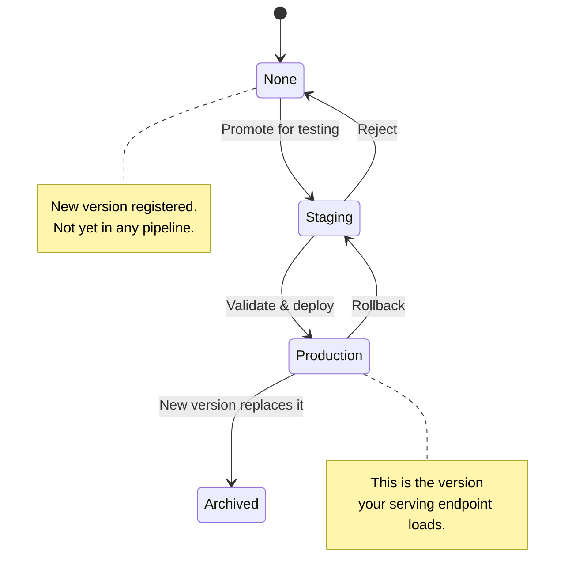
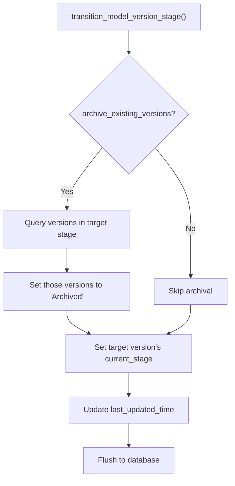

## TL;DR

**Q:** How do you know which model version is serving traffic right now without grepping log files or querying a separate CMDB?

**A:** Every model version transitions through explicit stages (None → Staging → Production → Archived), and only the version currently in Production is loaded by the serving layer—version numbers are just metadata.

---

## 1. The Engineering Problem

Picture this: three ML engineers have each pushed a new model version in the last hour. Your serving endpoint is running *something*, but nobody can tell you exactly what. Was it the v7 with the AUC regression? The v8 that never got staging-tested? The v9 someone hot-fixed directly into production?

Version numbers alone create an illusion of order. They tell you *sequence* (v1 came before v2) but not *status* (is v2 live, testing, or retired?). In production ML systems, the critical question is never "what's the latest version?"—it's **"which version is serving customers right now, and which version was serving them five minutes ago?"**

Without explicit lifecycle stages, teams resort to:
- Spreadsheets tracking "the model in prod" (out of date by lunch)
- Convention docs that nobody reads
- Slack messages asking "did you promote v6 yet?"
- Rollback procedures that involve manually editing config files

MLflow's model registry solves this with a finite-state machine: every model version must occupy exactly one stage, and transitions between stages are explicit, auditable, and atomic.

---

## 2. The Technical Solution

MLflow defines four stages that every model version passes through:



The key insight: **only one version can occupy Production at a time** (unless you explicitly allow canary deployments). When you promote v9 to Production, MLflow can automatically archive v8—no manual cleanup required.

Here's the full lifecycle for a single model name:

```mermaid
flowchart LR
    A[Register Model] --> B[Create Version 1]
    B --> C[v1: None]
    C --> D[v1: Staging]
    D --> E[v1: Production]
    E --> F[v1: Archived]
    
    B2[Create Version 2] --> C2[v2: None]
    C2 --> D2[v2: Staging]
    D2 --> E2[v2: Production]
    
    E -.-> F : archive_existing_versions=True
    
    style E2 fill:#2d6,stroke:#333,color:#fff
    style E fill:#2d6,stroke:#333,color:#fff
```

Notice the arrow from v1 Production to v1 Archived: when v2 is promoted to Production with `archive_existing_versions=True`, v1 is automatically moved to Archived. This is the mechanism that makes the "which model is live?" question answerable.

### How It Works Under the Hood

MLflow's `SqlAlchemyStore` implements this as a database column update. The `current_stage` field on each `SqlModelVersion` row is the source of truth:



---

## 3. The Clean Example

Here's the model registry lifecycle in isolation, stripped of infrastructure concerns:

```python
import mlflow
from mlflow import MlflowClient

client = MlflowClient()

# 1. Register the model (creates the container)
client.create_registered_model("fraud-detector")

# 2. Create version 1 from a training run
#    Version starts in stage "None" automatically
mv1 = client.create_model_version(
    name="fraud-detector",
    source="s3://mlflow/artifacts/run-abc/model",
    run_id="abc123",
    description="Baseline XGBoost with 94.2% AUC",
)
print(f"v1 stage: {mv1.current_stage}")  # None

# 3. Promote to Staging for integration tests
mv1 = client.transition_model_version_stage(
    name="fraud-detector",
    version=mv1.version,
    stage="staging",
)
print(f"v1 stage: {mv1.current_stage}")  # Staging

# 4. Promote to Production — this version now serves traffic
mv1 = client.transition_model_version_stage(
    name="fraud-detector",
    version=mv1.version,
    stage="production",
)
print(f"v1 stage: {mv1.current_stage}")  # Production

# 5. Train a better model, register version 2
mv2 = client.create_model_version(
    name="fraud-detector",
    source="s3://mlflow/artifacts/run-def/model",
    run_id="def456",
    description="Tuned XGBoost with 95.1% AUC",
)

# 6. Promote v2 to Production, auto-archive v1
mv2 = client.transition_model_version_stage(
    name="fraud-detector",
    version=mv2.version,
    stage="production",
    archive_existing_versions=True,  # v1 → Archived automatically
)
print(f"v2 stage: {mv2.current_stage}")  # Production

# 7. Verify: only v2 is in Production now
versions = client.get_latest_versions("fraud-detector", stages=["production"])
assert len(versions) == 1
assert versions[0].version == "2"
```

---

## 4. Production Reality

Here's how MLflow actually implements the stage transition inside `SqlAlchemyStore`. This is from `mlflow/store/model_registry/sqlalchemy_store.py`:

```python
# Source: mlflow/store/model_registry/sqlalchemy_store.py:1192
def transition_model_version_stage(self, name, version, stage, archive_existing_versions):
    """
    Update model version stage.

    Args:
        name: Registered model name.
        version: Registered model version.
        stage: New desired stage for this model version.
        archive_existing_versions: If this flag is set to ``True``, all existing model
            versions in the stage will be automatically moved to the "archived" stage. Only
            valid when ``stage`` is ``"staging"`` or ``"production"`` otherwise an error will
            be raised.

    Returns:
        A single ModelVersion object.
    """
    # Only Staging and Production are "active" stages —
    # you can't archive versions when moving to None or Archived
    is_active_stage = get_canonical_stage(stage) in DEFAULT_STAGES_FOR_GET_LATEST_VERSIONS
    if archive_existing_versions and not is_active_stage:
        msg_tpl = (
            "Model version transition cannot archive existing model versions "
            "because '{}' is not an Active stage. Valid stages are {}"
        )
        raise MlflowException(msg_tpl.format(stage, DEFAULT_STAGES_FOR_GET_LATEST_VERSIONS))

    with self.ManagedSessionMaker(read_only=False) as session:
        last_updated_time = get_current_time_millis()

        model_versions = []
        if archive_existing_versions:
            # Find all OTHER versions currently in the target stage
            conditions = [
                SqlModelVersion.name == name,
                SqlModelVersion.version != version,
                SqlModelVersion.current_stage == get_canonical_stage(stage),
            ]
            model_versions = self._get_query(session, SqlModelVersion).filter(*conditions).all()
            # Move them all to Archived in one transaction
            for mv in model_versions:
                mv.current_stage = STAGE_ARCHIVED
                mv.last_updated_time = last_updated_time

        # Now promote the target version
        sql_model_version = self._get_sql_model_version(
            session=session, name=name, version=version
        )
        sql_model_version.current_stage = get_canonical_stage(stage)
        sql_model_version.last_updated_time = last_updated_time

        # Update the parent registered model's timestamp too
        sql_registered_model = sql_model_version.registered_model
        sql_registered_model.last_updated_time = last_updated_time

        # Single atomic commit: archive old + promote new
        session.add_all([*model_versions, sql_model_version, sql_registered_model])
        return self._populate_model_version_aliases(
            session, name, sql_model_version.to_mlflow_entity()
        )
```

Key production details to notice:

1. **Atomic operation**: The archival of old versions and promotion of the new version happen in a single `session.add_all()` → flush. If anything fails, neither the archive nor the promotion persists.

2. **Active stage guard**: You can only archive existing versions when promoting to Staging or Production—not when moving to None or Archived. This prevents nonsensical states.

3. **`get_canonical_stage()`** normalizes case: `"production"`, `"Production"`, and `"PRODUCTION"` all map to the same canonical value, preventing silent mismatches.

4. **Timestamp propagation**: Both the model version and its parent registered model get their `last_updated_time` set, so the UI always reflects the latest change.

---

## 5. Review Checklist

- [ ] **Stages are finite and ordered**: None → Staging → Production → Archived. There are no arbitrary custom stages—you work within this lifecycle or you're building your own registry.
- [ ] **Transitions are atomic**: The archival of the old version and promotion of the new version happen in a single database transaction. No partial states.
- [ ] **`archive_existing_versions=True` is your friend**: Without it, you'll accumulate multiple versions in Production and lose the ability to answer "which model is live?"
- [ ] **Stages are deprecated in favor of aliases (MLflow 2.9+)**: The `@deprecated` decorator on `transition_model_version_stage` signals that model version aliases are the long-term replacement. Plan your migration.

---

## 6. FAQ

**Q: Can I have multiple versions in Production simultaneously?**

A: Yes, but only if you don't use `archive_existing_versions=True`. The registry allows it, but your serving layer may not support canary routing. If you need A/B testing, use model version aliases instead of stages.

**Q: What happens if I promote a version to Staging that's currently in Production?**

A: It moves back to Staging. The previous Production version is NOT automatically archived—you'd need to explicitly archive it or promote a different version to Production with `archive_existing_versions=True`.

**Q: How do stages relate to model version aliases?**

A: Stages (None, Staging, Production, Archived) are the legacy lifecycle mechanism. Aliases (like `@champion`, `@challenger`) are the modern replacement introduced in MLflow 2.9. Aliases are more flexible—you can define your own names and don't have to map to a fixed set of stages.

**Q: Can I query which versions are in a specific stage?**

A: Yes. `client.get_latest_versions("model-name", stages=["production"])` returns all versions currently in the Production stage. For broader searches, use `client.search_model_versions("current_stage = 'production'")`.

**Q: What database backs this?**

A: MLflow's `SqlAlchemyStore` supports SQLite, PostgreSQL, MySQL, and MSSQL. The stage transitions are plain SQL UPDATE operations wrapped in transactions—no special database features required.

---

## Source

All code in this post is from the [mlflow/mlflow](https://github.com/mlflow/mlflow) repository:

- `mlflow/entities/model_registry/model_version_stages.py` — Stage constants and canonical mapping
- `mlflow/store/model_registry/sqlalchemy_store.py:1192` — `transition_model_version_stage()` implementation
- `mlflow/tracking/client.py:4896` — `MlflowClient.transition_model_version_stage()` public API
