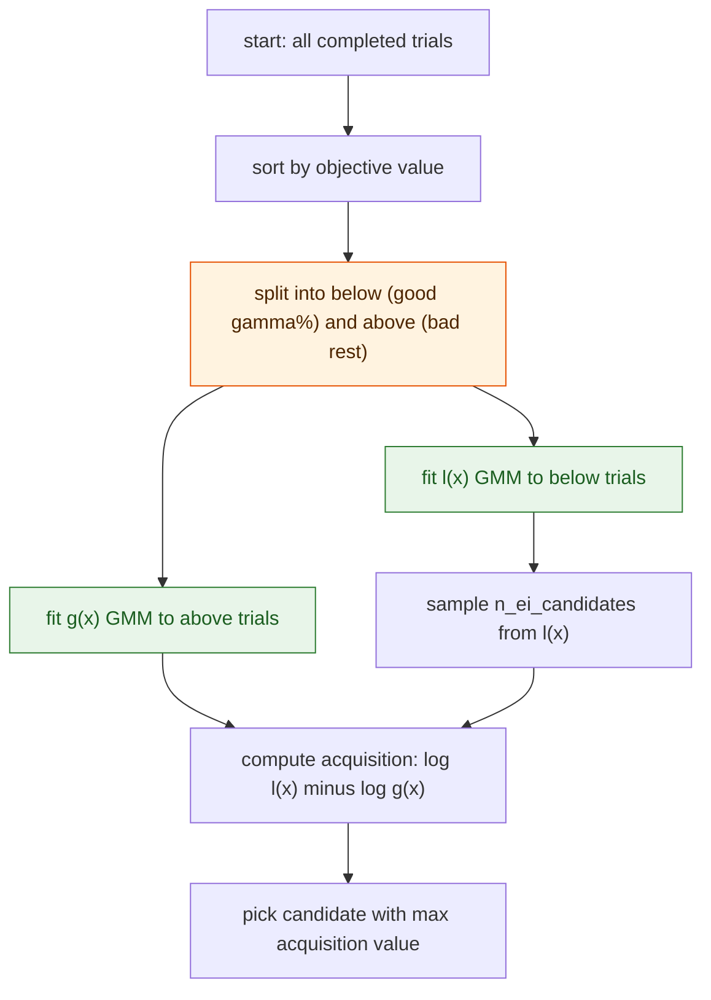
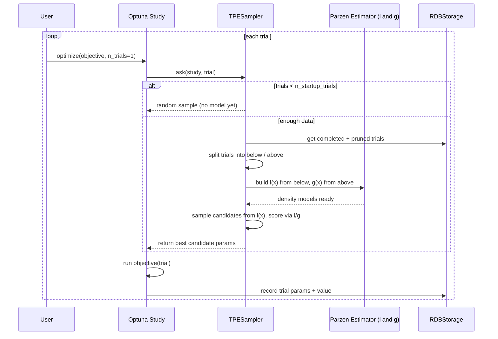

**TL;DR:** Why does TPE (Tree-structured Parzen Estimator) find good hyperparameters in 50 trials where grid search needs thousands? TPE splits completed trials into "good" and "bad" sets, fits a separate Gaussian Mixture Model to each, then samples the point that maximizes the ratio `l(x)/g(x)` — the likelihood of being good relative to being bad. This is Bayesian optimization without a surrogate model, and Optuna's `TPESampler` implements it with multivariate correlations, constant-liar handling for parallel workers, and constrained search space support.

> **In plain English (30 sec):** Code you already write — Map, function, API call, just bigger.

**Real repo:** [`optuna/optuna`](https://github.com/optuna/optuna)

## 1. The Engineering Problem: grid search wastes budget by treating every region of the space equally

A neural network has learning rate, batch size, dropout rate, number of layers, and hidden dimension — each with a continuous or integer range. Grid search discretizes every axis and tries every combination: 5 values per axis across 5 axes means 3,125 trials, each requiring a full training run. Random search does better by spreading samples, but it learns nothing from past results — trial 3,000 is chosen with the same indifference as trial 1. In practice, most hyperparameter configurations are terrible, and a few regions of the space dominate. The problem is that neither grid nor random search can use the *outcome* of previous trials to focus on the regions that are actually working. You need a method that asks "given what I've seen so far, where should I try next?"

---

## 2. The Technical Solution: fit two density models — one for good results, one for bad — and sample where good dominates

**TPE (Tree-structured Parzen Estimator):** After each batch of trials, TPE sorts completed trials by objective value and splits them into two groups using a cutoff `gamma(n)` — the bottom `gamma(n)`% become "below" (good), the rest become "above" (bad). It fits a Parzen estimator (kernel density estimator using Gaussian mixture components) to each group: `l(x)` models the density of good configurations, `g(x)` models bad ones. Then it samples `n_ei_candidates` points from `l(x)` and picks the one that maximizes `l(x)/g(x)` — the expected improvement ratio. Crucially, TPE is a *tree-structured* estimator: it handles conditional parameters (e.g., "if optimizer is Adam, sample learning_rate; if SGD, sample momentum") by structuring the density estimation according to the search space's dependency tree, not as a flat vector.





The key insight: TPE doesn't model the objective function directly — it models the *distribution of good parameters* versus the *distribution of bad parameters*. This avoids the expensive fitting step that Gaussian Process-based Bayesian optimization requires, scales to high-dimensional spaces, and handles conditional (tree-structured) search spaces natively.

---

## 3. The clean example (concept in isolation)

```python
import optuna
from optuna.samplers import TPESampler


def objective(trial):
    # TPE handles conditional spaces: if optimizer is "adam",
    # the lr parameter is active; if "sgd", momentum is active.
    optimizer = trial.suggest_categorical("optimizer", ["adam", "sgd"])
    lr = trial.suggest_float("lr", 1e-5, 1e-1, log=True)
    if optimizer == "sgd":
        momentum = trial.suggest_float("momentum", 0.0, 1.0)
    dropout = trial.suggest_float("dropout", 0.1, 0.5)
    return train_model(optimizer, lr, dropout)


# TPESampler: Bayesian optimization via dual density models
sampler = TPESampler(
    n_startup_trials=20,      # random trials before the model kicks in
    n_ei_candidates=24,        # candidates sampled from l(x) each round
    multivariate=True,         # model correlations between parameters
)

study = optuna.create_study(
    direction="minimize",
    sampler=sampler,
)
study.optimize(objective, n_trials=200)

print(f"Best trial: {study.best_trial.params}")
# After 200 trials, TPE has focused budget on the low-loss region
# instead of wasting it on uniformly exploring the entire space.
```

---

## 4. Production reality (from `optuna/optuna`)

### The TPE core loop: split, fit, sample, pick

```python
# optuna/samplers/_tpe/sampler.py
def _sample(
    self, study: Study, trial: FrozenTrial, search_space: dict[str, BaseDistribution]
) -> dict[str, Any]:
    if self._constant_liar:
        states = [TrialState.COMPLETE, TrialState.PRUNED, TrialState.RUNNING]
    else:
        states = [TrialState.COMPLETE, TrialState.PRUNED]
    use_cache = not self._constant_liar
    trials = study._get_trials(deepcopy=False, states=states, use_cache=use_cache)

    if self._constant_liar:
        # For constant_liar, filter out the current trial.
        trials = [t for t in trials if trial.number != t.number]

    # We divide data into below and above.
    n = sum(trial.state != TrialState.RUNNING for trial in trials)  # Ignore running trials.
    below_trials, above_trials = _split_trials(
        study, trials, self._gamma(n), self._constraints_func is not None,
    )

    mpe_below = self._build_parzen_estimator(
        study, search_space, below_trials, handle_below=True
    )
    mpe_above = self._build_parzen_estimator(
        study, search_space, above_trials, handle_below=False
    )

    samples_below = mpe_below.sample(self._rng.rng, self._n_ei_candidates)
    acq_func_vals = self._compute_acquisition_func(samples_below, mpe_below, mpe_above)
    ret = TPESampler._compare(samples_below, acq_func_vals)

    for param_name, dist in search_space.items():
        ret[param_name] = dist.to_external_repr(ret[param_name])

    return ret
```

What this reveals that a hello-world can't:

- **`_split_trials` is the cutoff mechanism** — it classifies every completed, pruned, and running trial into "below" (the `gamma(n)` best) or "above" (the rest), then passes each group to its own Parzen estimator. The `gamma` function is tunable — Optuna's default is `min(ceil(0.1 * n), 25)`, meaning the top 10% of trials form the "good" density model, capped at 25 trials.
- **The acquisition function is a log-space ratio** — `log l(x) - log g(x)` is equivalent to maximizing `l(x)/g(x)`, but numerically stable. The `TPESampler._compare` classmethod picks the candidate with the highest ratio.
- **`constant_liar` penalizes running trials** — in parallel optimization, multiple workers might suggest parameters near each other because they haven't seen each other's in-progress trials. By including `RUNNING` trials in the "above" (bad) group, TPE discourages sampling nearby configurations while trials are still in flight.

### The Parzen estimator parameters that control density estimation

```python
# optuna/samplers/_tpe/parzen_estimator.py
class _ParzenEstimatorParameters(NamedTuple):
    prior_weight: float
    consider_magic_clip: bool
    consider_endpoints: bool
    weights: Callable[[int], np.ndarray]
    multivariate: bool
    categorical_distance_func: dict[
        str, Callable[[CategoricalChoiceType, CategoricalChoiceType], float]
    ]
```

What this reveals that a hello-world can't:

- **`multivariate=True` models parameter correlations** — the default in Optuna v2.2+. Without it, TPE treats each parameter independently, missing interactions like "high learning rate pairs well with large batch size." With it, the Parzen estimator fits a joint density across all parameters simultaneously.
- **`categorical_distance_func` lets you encode domain knowledge** — if your categorical parameter is "resnet18, resnet34, resnet50, resnet101," you can tell Optuna that resnet50 is closer to resnet34 than to resnet18, so the density model samples near-good categorical values more often.
- **`weights` controls how old trials decay** — the default weights function ramps linearly for the first 25 trials, then stays flat. This gives recent trials no special treatment once there's enough data, but prevents the density model from being dominated by early random exploration.

### The gamma function: how many trials count as "good"

```python
# optuna/samplers/_tpe/sampler.py
def default_gamma(x: int) -> int:
    return min(math.ceil(0.1 * x), 25)


def hyperopt_default_gamma(x: int) -> int:
    return min(math.ceil(0.25 * x**0.5), 25)
```

What this reveals that a hello-world can't:

- **The gamma function is the single most important tuning knob** — it controls what fraction of trials are considered "good." Optuna's default takes the top 10% (capped at 25). Hyperopt's default takes `0.25 * sqrt(n)`, which is more aggressive early on (25% of 100 trials = 25) but shrinks as n grows. This directly affects how focused vs. how exploratory TPE behaves.
- **The cap at 25 prevents the "good" model from being too broad** — if 200 trials are good, the density model `l(x)` becomes too diffuse to distinguish signal from noise. The cap keeps the "good" model tight even as the total trial count grows large.

---

## Review checklist

- [ ] Grid search and random search do not use past trial outcomes to inform the next sample — TPE does, via `l(x)/g(x)`
- [ ] `n_startup_trials` controls the random exploration phase before the Bayesian model kicks in
- [ ] `gamma(n)` determines the split point between "below" (good) and "above" (bad) trials
- [ ] `multivariate=True` models correlations between parameters — always prefer it over independent TPE
- [ ] `constant_liar=True` penalizes configurations near in-flight parallel trials to avoid wasted workers
- [ ] TPE handles conditional (tree-structured) search spaces natively — no manual pruning of impossible combos
- [ ] The acquisition function `l(x)/g(x)` is the expected improvement ratio, computed in log space for stability
- [ ] RDBStorage persists study state across processes — `heartbeat_interval` detects dead workers in cluster environments

---

## FAQ

**Q: Why TPE instead of Gaussian Process (GP) based Bayesian optimization?**
A: GP-based BO fits a surrogate model to the objective function itself, which scales poorly beyond ~20-30 dimensions and can't handle conditional search spaces. TPE models the *distribution of good vs. bad configurations* instead, scales to hundreds of dimensions, and handles tree-structured (conditional) spaces natively. The tradeoff is that TPE's density estimation is less statistically optimal than GP's posterior, but in practice the scalability and flexibility win.

**Q: What does `n_ei_candidates` actually control?**
A: Each round, TPE samples `n_ei_candidates` points from the "good" density model `l(x)`, scores each by the `l(x)/g(x)` ratio, and picks the winner. More candidates mean better exploration of `l(x)` but slower per-trial computation. The default of 24 is a practical sweet spot — Optuna's benchmarks showed diminishing returns beyond ~25.

**Q: Can TPE handle multi-objective optimization?**
A: Yes — `TPESampler` supports multi-objective TPE (MOTPE) when the study has multiple directions. The "below" group is selected using non-domination rank and hypervolume contribution, not a simple scalar sort. This is enabled automatically when the study is multi-objective and `sampler=TPESampler()` is explicitly passed (NSGA-II is the default for multi-objective).

**Q: What storage should I use in production?**
A: PostgreSQL or MySQL via `RDBStorage` — never SQLite for parallel optimization. SQLite has row-level locking that causes contention with multiple workers. Optuna's `RDBStorage` adds `pool_pre_ping=True` for MySQL by default to handle connection timeouts, and supports heartbeat-based dead worker detection via `heartbeat_interval` and `grace_period`.

---

## Source

- **Concept:** Tree-structured Parzen Estimator (TPE) — Bayesian hyperparameter optimization via dual density models
- **Domain:** mlops
- **Repo:** [optuna/optuna](https://github.com/optuna/optuna) → [`optuna/samplers/_tpe/sampler.py`](https://github.com/optuna/optuna/blob/master/optuna/samplers/_tpe/sampler.py) (`TPESampler`, `_sample`, `_split_trials`), [`optuna/samplers/_tpe/parzen_estimator.py`](https://github.com/optuna/optuna/blob/master/optuna/samplers/_tpe/parzen_estimator.py) (`_ParzenEstimatorParameters`), [`optuna/importance/__init__.py`](https://github.com/optuna/optuna/blob/master/optuna/importance/__init__.py) (`get_param_importances`) — the production hyperparameter optimization framework used by 14K+ GitHub stars.


