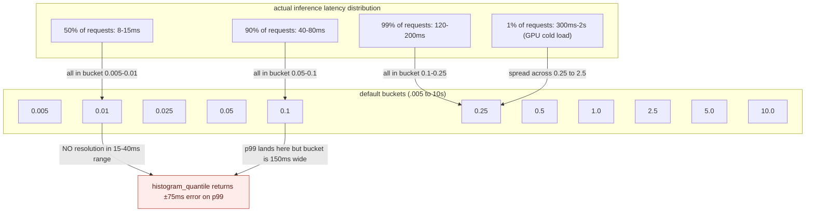
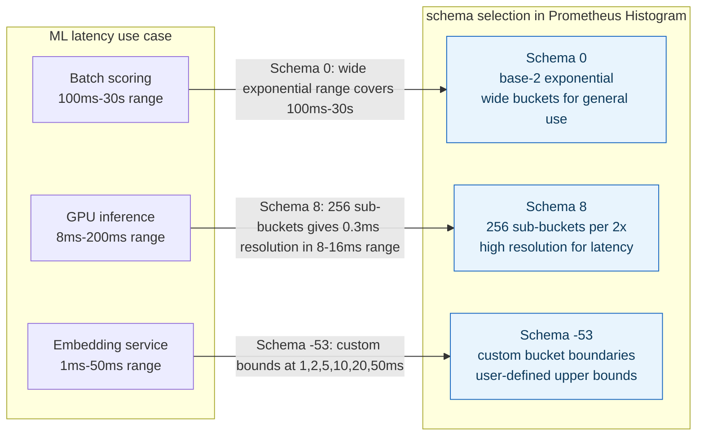

**TL;DR:** Prometheus default histogram buckets (.005, .01, .025, .05, .1, .25, .5, 1, 2.5, 5, 10) are tuned for HTTP request durations, not ML inference latency. A transformer model serving requests at 15ms p50 and 200ms p99 will see 99% of observations land in the last bucket (10s), making percentile queries like `histogram_quantile(0.99, ...)` wildly inaccurate. Custom buckets solve this -- and Prometheus native histograms (introduced in v2.53) go further by encoding the bucket layout directly in the metric, not in the metric name.

**Real repo:** [`prometheus/prometheus`](https://github.com/prometheus/prometheus)

---

## 1. The Engineering Problem: default buckets destroy percentile accuracy for ML latency distributions

When you instrument an ML inference service with `prometheus.Histogram` using defaults, the bucket boundaries are `(.005, .01, .025, .05, .1, .25, .5, 1, 2.5, 5, 10)` seconds. These are reasonable for HTTP request latencies in typical web apps, but ML inference latency distributions are fundamentally different:

- A batch inference job that processes 100 samples in 40ms produces a single observation of 0.04s, not 100 observations of 0.0004s.
- A real-time embedding model serving p50 latency of 12ms and p99 latency of 180ms needs resolution in the 5ms--300ms range, not the 5ms--10s range.
- A model behind GPU batch scheduling can exhibit bimodal latency (fast for cached inputs, slow for cache misses), requiring bucket density around both modes.

With default buckets, the p99 of a 180ms-tail distribution collapses into a single bucket (`0.1` to `0.25` or `0.25` to `0.5`), making `histogram_quantile(0.99, rate(model_latency_seconds_bucket[5m]))` return an approximation spanning a 150ms range -- useless for detecting a 20ms latency regression that is the difference between an SLA pass and fail.



---

## 2. The Technical Solution: custom exponential buckets and native histograms

Prometheus offers two mechanisms to fix this: **custom classic buckets** and **native histograms** (also called sparse histograms).

### Custom classic buckets

The simplest fix: define bucket boundaries that match your actual latency distribution:

```go
histogram := prometheus.NewHistogram(prometheus.HistogramOpts{
    Name:    "model_inference_latency_seconds",
    Help:    "Latency of ML model inference requests",
    Buckets: []float64{0.005, 0.01, 0.015, 0.02, 0.03, 0.05, 0.08, 0.1, 0.15, 0.2, 0.3, 0.5, 1.0, 2.0},
})
```

This gives you a bucket every 5ms in the critical 5--50ms range, and wider buckets for the tail. The tradeoff: one time series per bucket per label combination, so 14 buckets times 3 label combinations (model, version, endpoint) = 42 time series just for this one histogram.

### Native histograms (Prometheus v2.53+)

Native histograms encode bucket boundaries in the metric itself using a schema-based approach, not in the metric name. This is where the `prometheus/prometheus` source gets interesting.

The core data structure is a `Histogram` with a `Schema` field that selects the bucket layout:

```go
// model/histogram/histogram.go
type Histogram struct {
    CounterResetHint CounterResetHint
    Schema           int32
    ZeroThreshold    float64
    ZeroCount        uint64
    Count            uint64
    Sum              float64
    PositiveSpans, NegativeSpans []Span
    PositiveBuckets, NegativeBuckets []int64
    CustomValues     []float64
}
```

The `Schema` field is the key: `Schema 0` means base-2 exponential buckets where each bucket is twice as wide as the previous. `Schema 8` means 2^8 = 256 sub-buckets per power of two, giving extremely fine resolution. For custom-defined boundaries (like your ML latency buckets), `Schema -53` activates the `CustomValues` field.



The `PositiveSpans` and `PositiveBuckets` fields implement a sparse encoding: instead of storing one count per possible bucket (most of which are zero), spans define contiguous sequences of non-empty buckets, and the bucket values are delta-encoded relative to the previous bucket. This means a histogram with 5 non-zero buckets out of a theoretical 256 uses only ~10 integers of storage, not 256.

---

## 3. The clean example: instrument an ML inference service with custom buckets

```go
package main

import (
    "math/rand"
    "net/http"
    "time"

    "github.com/prometheus/client_golang/prometheus"
    "github.com/prometheus/client_golang/prometheus/promhttp"
)

func main() {
    // Custom buckets tuned for ML inference latency:
    // dense in the 5-50ms range where p50-p95 live,
    // wider buckets for the GPU cold-load tail.
    inferenceLatency := prometheus.NewHistogram(prometheus.HistogramOpts{
        Name:    "model_inference_latency_seconds",
        Help:    "Latency of ML model inference in seconds",
        Buckets: []float64{
            0.005, 0.01, 0.015, 0.02, 0.03, 0.05,
            0.08, 0.1, 0.15, 0.2, 0.3, 0.5, 1.0, 2.0,
        },
    })
    prometheus.MustRegister(inferenceLatency)

    http.HandleFunc("/predict", func(w http.ResponseWriter, r *http.Request) {
        start := time.Now()

        // simulate inference: bimodal latency distribution
        if rand.Float64() < 0.01 {
            time.Sleep(time.Duration(200+rand.Intn(300)) * time.Millisecond) // cold load
        } else {
            time.Sleep(time.Duration(8+rand.Intn(20)) * time.Millisecond)  // normal inference
        }

        inferenceLatency.Observe(time.Since(start).Seconds())
        w.Write([]byte(`{"prediction": 0.87}`))
    })

    http.Handle("/metrics", promhttp.Handler())
    http.ListenAndServe(":8080", nil)
}
```

This gives you PromQL queries like:

```promql
# p99 inference latency
histogram_quantile(0.99, rate(model_inference_latency_seconds_bucket[5m]))

# p95 latency by model version
histogram_quantile(0.95,
  sum by (le, version) (rate(model_inference_latency_seconds_bucket[5m]))
)

# request rate in the 50-100ms bucket (useful for bimodal detection)
rate(model_inference_latency_seconds_bucket{le="0.1"}[5m])
  - rate(model_inference_latency_seconds_bucket{le="0.05"}[5m])
```

---

## 4. Production reality (from `prometheus/prometheus`)

The real Prometheus histogram implementation reveals several things a hello-world example does not:

```go
// model/histogram/histogram.go
//
// Schema numbers: -4 <= n <= 8 for exponential buckets (base-2).
// Schema -53 for custom bucket boundaries defined by CustomValues.
//
// For exponential schemas, each bucket boundary is the previous
// boundary times 2^(2^-n). Schema 8 means 2^8 = 256 logarithmic
// sub-buckets per power of two.
type Histogram struct {
    Schema       int32
    ZeroThreshold float64
    ZeroCount    uint64
    Count        uint64
    Sum          float64
    PositiveSpans, NegativeSpans []Span
    PositiveBuckets, NegativeBuckets []int64
    CustomValues []float64  // nil unless Schema == -53
}

func (h *Histogram) UsesCustomBuckets() bool {
    return IsCustomBucketsSchema(h.Schema)
}
```

What this teaches that a hello-world can't:

- **The `Schema` field is not just a flag -- it changes the mathematical meaning of every bucket boundary.** Schema 0 divides each power-of-two interval into 1 bucket (doubling width); Schema 8 divides it into 256 buckets (0.3% width per bucket). The same `PositiveBuckets` slice has completely different physical meaning depending on `Schema`. This is why `histogram_quantile` must read the schema first, not assume a fixed bucket layout.
- **`CustomValues` is interned and copied by reference, not by value** -- the comment says "This slice is interned, to be treated as immutable and copied by reference." This is a deliberate memory optimization: when a native histogram with custom buckets is scraped from 100 targets, the 100 copies share one `CustomValues` slice in memory rather than allocating 100 independent slices. For ML monitoring with many pods, this prevents histogram storage from becoming the memory bottleneck.
- **Custom bucket histograms have no zero bucket, no negative spans, and no negative buckets** -- the `Validate()` method enforces this explicitly: `if h.ZeroCount != 0 { return ErrHistogramCustomBucketsZeroCount }`. The zero bucket concept (observations near zero that don't fit normal bucketing) is incompatible with user-defined boundaries. This means if your inference service ever produces a 0.0s observation (which can happen with no-op predictions or measurement precision issues), it lands in your first defined bucket, not a special zero bucket. Design your first bucket boundary accordingly.
- **`CounterResetHint` is a four-state enum, not a boolean** -- `UnknownCounterReset`, `CounterReset`, `NotCounterReset`, `GaugeType`. Gauge histograms (for values that can go up and down, like queue depth) use `GaugeType` where counter resets don't apply. ML inference latency is always a counter-style histogram (monotonically increasing observation count), so `CounterResetHint` should always be `NotCounterReset` in scraping -- if you see `UnknownCounterReset` in your data, your scraper may have missed a scrape interval and the delta encoding is ambiguous.

Known-stale fact: default histogram buckets are sometimes treated as universally reasonable -- "just use the defaults" -- with no acknowledgment that percentile accuracy is entirely determined by bucket boundary placement. The Prometheus source itself shows the bucket layout is not fixed infrastructure: it's a mathematical parameter (`Schema`) that you choose based on your distribution, and the encoding adapts to whatever you choose. The "right" buckets for ML inference monitoring are the ones that put boundaries where your latency distribution actually changes shape, not the ones that happen to be the default for unrelated workloads.

---

## 5. Review checklist

- [ ] **Identified the actual latency distribution** before choosing buckets: profiled p50, p95, p99, and the shape of the tail under load, not just a single average.
- [ ] **Bucket boundaries are densest in the range where percentile accuracy matters most** -- for ML inference, that is typically 5ms--200ms, not 1ms--10s.
- [ ] **First bucket boundary is below the minimum expected latency** -- a 0.0s observation from a no-op prediction must land in a real bucket, not fall below all boundaries.
- [ ] **Last bucket boundary is above the maximum expected latency under failure** -- GPU cold loads, OOM retries, and model reloading can produce multi-second observations that should still be bucketed, not all lumped into the `+Inf` bucket.
- [ ] **If using native histograms, verified Schema choice matches use case** -- Schema 8 for high-resolution general latency, Schema -53 for custom-defined boundaries.
- [ ] **Checked `CustomValues` are strictly increasing** -- the `Validate()` method enforces this, and a non-monotonic boundary list causes a silent schema error at scrape time.
- [ ] **Verified Prometheus version supports native histograms** -- native histograms are stable as of Prometheus v2.53; earlier versions silently ignore the native encoding.

---

## FAQ

**Q: Why not just use summary metrics instead of histograms?**

A: Summaries compute quantiles client-side and expose a single `quantile` label -- you cannot aggregate quantiles across instances. If you have 20 inference pods and want p99 across all of them, summaries give you 20 separate p99 values and no way to combine them. Histograms let you aggregate at query time with `sum by (le)`, giving you the true cluster-wide percentile.

**Q: How many buckets do I actually need for ML latency?**

A: Typically 12--16. Enough to give ~5ms resolution in your p50--p95 range and ~50ms resolution in the tail. The cardinality cost is one time series per bucket per label combination: 14 buckets * 3 labels = 42 time series. This is negligible compared to the thousands of time series a single unbounded label creates.

**Q: What happens if I pick wrong bucket boundaries and only notice after data is already collected?**

A: You cannot change bucket boundaries on an existing metric and keep it as the same time series -- Prometheus identifies metrics by name + label set, and classic bucket boundaries are encoded in the metric name (`_bucket{le="0.1"}`). Switching boundaries creates a new metric. This is one of the advantages of native histograms: boundaries are part of the metric value, not the metric name, so a boundary change produces a new histogram schema on the same metric name.

**Q: Does the sparse encoding in native histograms lose precision compared to classic histograms?**

A: No. The delta-encoded span/bucket structure stores exact integer counts per bucket -- there is no sampling or approximation. The "sparseness" refers to the fact that empty buckets are not stored, not that non-empty buckets are rounded. For a histogram where only 10 of 256 possible buckets have observations, the native format stores those 10 exactly, plus a few span integers to describe their positions.

---

## Source

- **Concept:** Histogram bucket design, native histogram encoding, and the Schema/CustomValues system for user-defined boundaries
- **Domain:** mlops
- **Repo:** [prometheus/prometheus](https://github.com/prometheus/prometheus) → [`model/histogram/histogram.go`](https://github.com/prometheus/prometheus/blob/main/model/histogram/histogram.go) — the core histogram data structure that implements sparse exponential and custom-bucket encoding for Prometheus native histograms.


