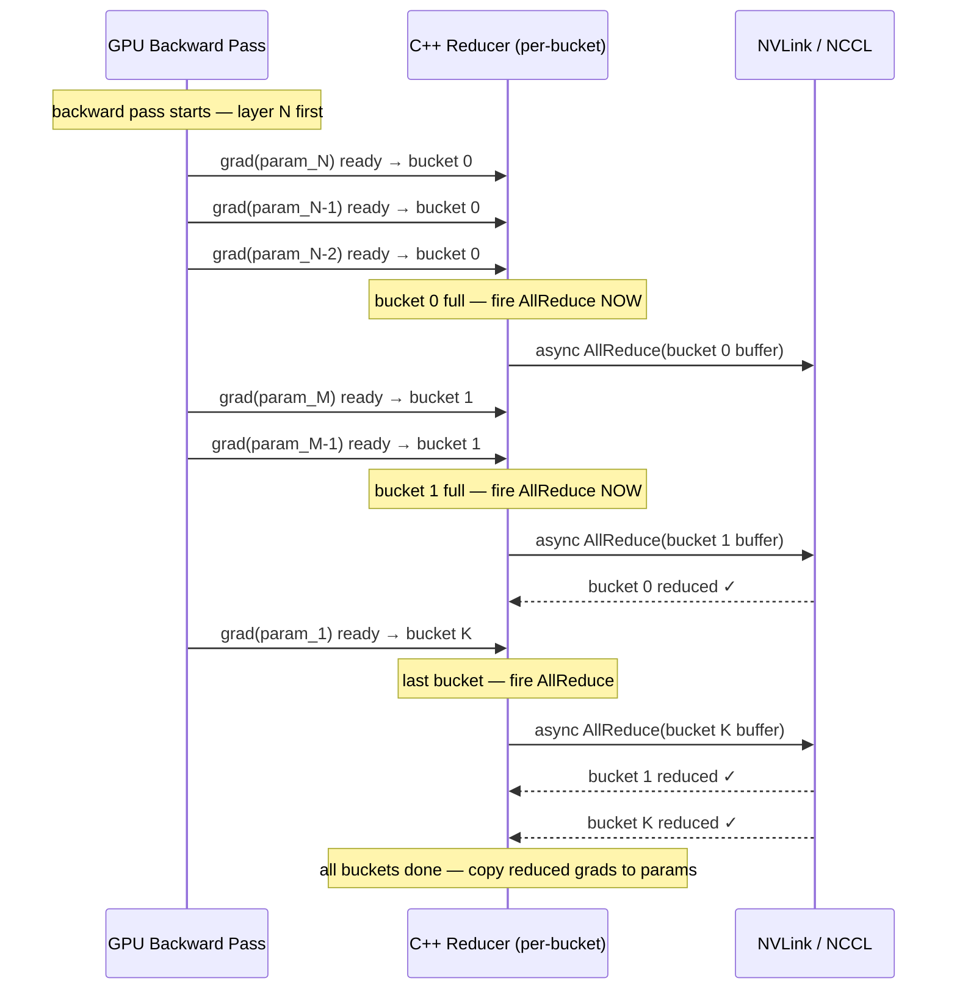
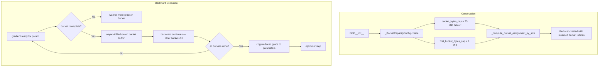

**TL;DR:** Without bucketing, every parameter's gradient must finish computing before any cross-GPU communication starts — the backward pass is fully serialised against AllReduce. DDP partitions parameters into buckets (default 25 MiB each), and the moment the last parameter gradient in a bucket finishes computing, the AllReduce for that bucket fires immediately while the backward pass continues computing gradients for parameters in earlier buckets. This overlap hides AllReduce latency behind gradient computation, and the key code that makes it happen lives in PyTorch's C++ Reducer and `_BucketCapacityConfig`.

**Real repo:** [`pytorch/pytorch`](https://github.com/pytorch/pytorch)

---

## 1. The Engineering Problem: serialised gradients waste interconnect bandwidth

In a naive distributed data-parallel setup, every GPU computes the full backward pass, accumulates all parameter gradients locally, and only then begins the AllReduce — a single collective operation over the concatenated gradient tensor. For a model with 100 MiB of gradients on an NVLink interconnect delivering 200 GB/s, the AllReduce alone takes roughly 1 ms. For larger models (LLMs with 70B+ parameters, where gradient volume reaches multiple GB), this serial wait becomes the dominant wall-clock cost, and every training step pays the full penalty.

The problem is structural: backward computation and communication are independent activities on independent hardware (GPU compute units vs. NICs), but a naive implementation forces them to execute sequentially. There is no overlap, no pipelining, and the GPUs sit idle during communication — and the interconnect sits idle during computation.

---

## 2. The Technical Solution: bucket-based pipelining of AllReduce and backward

DDP's solution is gradient bucketing with eager trigger. At construction time, DDP assigns each parameter to a numbered bucket based on its reverse-order position in the parameter list, subject to a per-bucket size cap. As backward progresses and parameter gradients are computed, each bucket's "ready count" increments. The moment the last gradient in a bucket lands, the C++ Reducer fires an async AllReduce on that bucket's buffer while backward continues computing gradients for parameters in other buckets.



The key insight is that bucket 0 (containing the parameters whose gradients compute last, near the input layer) gets a smaller size cap by default — 1 MiB instead of 25 MiB — precisely because it finishes last. A smaller first bucket means AllReduce for the bulk of parameters can start earlier, reducing the overall communication tail.



The reversed bucket ordering is critical: DDP reverses the parameter list before assigning buckets, so the first parameters processed by backward (the ones closest to the loss) end up in the highest-numbered buckets, and the parameters computed last (closest to the input) end up in bucket 0 — the bucket with the smallest size cap that triggers AllReduce earliest.

---

## 3. The clean example (concept in isolation)

```python
import os
import torch
import torch.nn as nn
import torch.distributed as dist
import torch.multiprocessing as mp


# 1. Initialise the process group — one process per GPU
dist.init_process_group(backend="nccl")
rank = dist.get_rank()
world_size = dist.get_world_size()
torch.cuda.set_device(rank)

# 2. Define a model — parameters are assigned to buckets in reverse order
model = nn.Sequential(
    nn.Linear(1024, 512),   # params land in bucket 1 (computed first by backward)
    nn.ReLU(),
    nn.Linear(512, 256),    # params land in bucket 0 (computed last — smallest cap)
    nn.ReLU(),
    nn.Linear(256, 10),
).cuda()

# 3. Wrap with DDP — bucket_cap_mb controls the 25 MiB default
#    gradient_as_bucket_view=True eliminates gradient copy overhead
ddp_model = nn.parallel.DistributedDataParallel(
    model,
    device_ids=[rank],
    bucket_cap_mb=25,             # 25 MiB per bucket (default)
    gradient_as_bucket_view=True, # gradients become views into bucket buffers
)

optimizer = torch.optim.SGD(ddp_model.parameters(), lr=0.01)
loss_fn = nn.CrossEntropyLoss()

# 4. Training loop — AllReduce overlaps with backward automatically
for step in range(100):
    inputs = torch.randn(32, 1024).cuda()
    labels = torch.randint(0, 10, (32,)).cuda()

    optimizer.zero_grad()
    outputs = ddp_model(inputs)
    loss = loss_fn(outputs, labels)
    loss.backward()   # backward fires bucketed AllReduces as it goes
    optimizer.step()   # optimizer runs after all buckets are reduced

dist.destroy_process_group()
```

---

## 4. Production reality (from `pytorch/pytorch`)

From `torch/nn/parallel/distributed.py` — the `DistributedDataParallel` constructor that computes bucket assignments and creates the C++ Reducer. This is the code that translates your `bucket_cap_mb` into actual per-bucket size limits:

```python
# torch/nn/parallel/distributed.py — _ddp_init_helper
# DDP init helper function to manage parameters, grad hooks, logging, and SyncBatchNorm.
#
# Initialization helper function that does the following:
# (1) bucketing the parameters for reductions
# (2) resetting the bucketing states
# (3) registering the grad hooks
# (4) Logging construction-time DDP logging data
# (5) passing a handle of DDP to SyncBatchNorm Layer
#
# Notice, the parameters order is not in the order in which they are used,
# especially in models with control flow.
#
# Alongside parameters are not presented in the real execution order,
# if a certain model happens to also
#   1) have other collectives comm ops in its backward graph.
#   2) have unused parameter in subset ranks of the whole world.
# bucketing could insert ALL-REDUCE comm op too early on the rank with unused parameter,
# matching up with other collectives comm ops on other ranks unexpectedly.

(
    bucket_size_limits,
    bucket_size_limits_for_rebuilding,
) = self._bucket_config.compute_bucket_size_limits(
    static_graph=static_graph,
    find_unused_parameters=self.find_unused_parameters,
)

(
    bucket_indices,
    per_bucket_size_limits,
) = dist._compute_bucket_assignment_by_size(
    parameters,
    bucket_size_limits,
    expect_sparse_gradient,
)

# Note: reverse list of buckets because we want to approximate the
# order in which their gradients are produced, and assume they
# are used in the forward pass in the order they are defined.
self.reducer = dist.Reducer(
    parameters,
    list(reversed(bucket_indices)),
    list(reversed(per_bucket_size_limits)),
    self.process_group,
    expect_sparse_gradient,
    self.bucket_bytes_cap,
    self.find_unused_parameters,
    self.gradient_as_bucket_view,
    param_to_name_mapping,
    self._bucket_config.first_bucket_bytes_cap,
    self.skip_all_reduce_unused_params,
    self._use_python_reducer,
    bucket_size_limits_for_rebuilding,
    self.batched_grad_copy,
)
```

And from `torch/nn/parallel/distributed.py` — the `_BucketCapacityConfig` dataclass that computes the first-bucket latency optimisation and per-bucket size limits:

```python
# torch/nn/parallel/distributed.py — _BucketCapacityConfig
# Configuration for DDP gradient reduction bucket capacities.
#
# This immutable dataclass encapsulates bucket size settings for
# DistributedDataParallel. Use the create() factory method to construct.
#
# The bucket capacity determines how parameters are grouped for AllReduce:
# - Smaller buckets: more frequent, smaller AllReduce operations
# - Larger buckets: less frequent, larger AllReduce operations
_BUCKET_CAP_MB = 25
_MB_TO_BYTES = 1024 * 1024

@dataclass(frozen=True)
class _BucketCapacityConfig:
    bucket_bytes_cap: int
    per_bucket_bytes_caps: tuple[int, ...]
    first_bucket_bytes_cap: int

    @classmethod
    def create(cls, bucket_cap_mb, bucket_cap_mb_list, use_python_reducer):
        is_using_default = bucket_cap_mb is None
        effective_bucket_cap_mb = (
            bucket_cap_mb if bucket_cap_mb is not None else _DEFAULT_BUCKET_CAP_MB
        )

        per_bucket_bytes_caps: tuple[int, ...] = ()
        if bucket_cap_mb_list:
            if use_python_reducer:
                raise AssertionError(
                    "when using bucket_cap_mb_list, python reducer is not supported"
                )
            per_bucket_bytes_caps = tuple(
                int(cap_mb * _MB_TO_BYTES) for cap_mb in bucket_cap_mb_list
            )
            effective_bucket_cap_mb = max(bucket_cap_mb_list)
            is_using_default = False

        bucket_bytes_cap = int(effective_bucket_cap_mb * _MB_TO_BYTES)

        # First bucket optimization: use smaller size when using defaults
        # to reduce latency for early-computed gradients
        first_bucket_bytes_cap = (
            dist._DEFAULT_FIRST_BUCKET_BYTES if is_using_default else bucket_bytes_cap
        )

        return cls(
            bucket_bytes_cap=bucket_bytes_cap,
            per_bucket_bytes_caps=per_bucket_bytes_caps,
            first_bucket_bytes_cap=first_bucket_bytes_cap,
        )
```

From `torch/distributed/algorithms/ddp_comm_hooks/default_hooks.py` — the AllReduce hook that is called per-bucket when it becomes ready. This is the actual communication entry point that the Reducer invokes:

```python
# torch/distributed/algorithms/ddp_comm_hooks/default_hooks.py

def _allreduce_fut(
    process_group: dist.ProcessGroup, tensor: torch.Tensor
) -> torch.futures.Future[torch.Tensor]:
    """Average the input gradient tensor by allreduce and returns a future."""
    group_to_use = process_group if process_group is not None else dist.group.WORLD

    # Apply the division first to avoid overflow, especially for FP16.
    tensor.div_(group_to_use.size())

    return (
        dist.all_reduce(tensor, group=group_to_use, async_op=True)
        .get_future()
        .then(lambda fut: fut.value()[0])
    )


def allreduce_hook(
    process_group: dist.ProcessGroup, bucket: dist.GradBucket
) -> torch.futures.Future[torch.Tensor]:
    """
    Call allreduce using GradBucket tensors.

    Once gradient tensors are aggregated across all workers, its then
    callback takes the mean and returns the result.

    If user registers this DDP communication hook,
    DDP results is expected to be same as the case where no hook was registered.
    Hence, this won't change behavior of DDP and user can use this as a reference
    or modify this hook to log useful information or any other purposes while
    unaffecting DDP behavior.
    """
    return _allreduce_fut(process_group, bucket.buffer())
```

And from `torch/distributed/algorithms/ddp_comm_hooks/optimizer_overlap_hooks.py` — the fused-optimiser-in-backward hook that runs `optimizer.step()` immediately after each bucket's AllReduce completes, not after the full backward pass:

```python
# torch/distributed/algorithms/ddp_comm_hooks/optimizer_overlap_hooks.py
# Run optimizer in a functional fashion after DDP communication hook.

def _hook_then_optimizer(
    hook: Callable[[Any, dist.GradBucket], torch.futures.Future[torch.Tensor]],
    optimizer_state: _OptimizerHookState,
) -> Callable[[Any, dist.GradBucket], torch.futures.Future[torch.Tensor]]:
    """Run optimizer in a functional fashion after DDP communication hook."""
    has_set_params = (
        hasattr(optimizer_state, "params_to_optimize")
        and optimizer_state.params_to_optimize is not None
    )

    def hook_then_optimizer_wrapper(
        hook_state, bucket: dist.GradBucket
    ) -> torch.futures.Future[torch.Tensor]:
        # Run original hook
        fut = hook(hook_state, bucket)

        def optimizer_step(fut):
            gradient_tensors = bucket.gradients()
            model_params = bucket.parameters()
            for grad_tensor, model_param in zip(gradient_tensors, model_params):
                if (
                    not has_set_params
                    or model_param in optimizer_state.params_to_optimize
                ):
                    optimizer_state.functional_optimizer.step_param(
                        model_param,
                        grad_tensor,
                    )
            return bucket.buffer()

        return fut.then(optimizer_step)

    return hook_then_optimizer_wrapper
```

What this teaches that the tutorial-level examples cannot:

- **The first bucket is smaller by default (1 MiB, not 25 MiB) because of gradient execution order.** Backward processes parameters in reverse order of the forward pass. The parameters whose gradients compute last (near the input layer) are placed in bucket 0 — and giving bucket 0 a smaller size cap means its AllReduce triggers sooner after those late gradients land, reducing the communication tail that would otherwise idle the entire pipeline.
- **`gradient_as_bucket_view=True` eliminates the copy between gradient memory and bucket buffer.** The gradient tensor becomes a direct view into the communication bucket, saving up to the full gradient memory footprint in peak usage. The trade-off is that `detach_()` cannot be called on gradient tensors in this mode — `zero_grad(set_to_none=True)` is the recommended alternative.
- **The bucket index list is reversed at Reducer creation.** `list(reversed(bucket_indices))` ensures the C++ Reducer processes buckets in the order gradients actually arrive during backward, not in the parameter-definition order — which is the only way to guarantee a bucket's AllReduce fires the instant its last gradient lands, not after an arbitrary delay waiting for out-of-order gradients.
- **`register_comm_hook` lets you replace AllReduce entirely on a per-bucket basis.** The hook receives a `GradBucket` and returns a `Future[Tensor]` — you can compress gradients to FP16 before communication, use PowerSGD low-rank approximation, or implement custom gossip-style averaging, all while preserving the bucketed overlap architecture.

---

## 5. Review checklist

- [ ] `bucket_cap_mb` is tuned for your model size and interconnect: 25 MiB (default) works for most models, but models with many small parameters (e.g., transformers with large embedding tables) may benefit from smaller buckets (5-10 MiB) to trigger AllReduce more frequently and improve overlap.
- [ ] `gradient_as_bucket_view=True` is set unless you need to call `detach_()` on gradients — this eliminates the gradient-to-bucket copy and saves peak memory equal to total gradient size.
- [ ] `find_unused_parameters=True` is only set when the model actually has unused parameters in some forward passes — enabling it unconditionally adds overhead for graph traversal on every backward pass.
- [ ] `static_graph=True` is considered when the model's computation graph is identical across iterations — this allows DDP to skip unused-parameter detection after the first iteration and supports activation checkpointing with unused parameters.
- [ ] NCCL backend is used for GPU training (not GLOO) — NCCL's async AllReduce is what makes the overlap possible; GLOO AllReduce is synchronous and blocks the calling thread.
- [ ] `torch.cuda.set_device(rank)` or `torch.accelerator.set_device_index(rank)` is called before model creation to ensure each process maps to its own GPU — mismatched device assignments silently break the bucket-to-GPU mapping.

---

## FAQ

**Q: What happens if one parameter's gradient takes much longer to compute than the rest?**
A: That parameter ends up as the straggler in its bucket. The bucket's AllReduce cannot fire until every gradient in the bucket is ready, so a single slow gradient delays communication for all parameters in the same bucket. This is why the first bucket (containing late-computed gradients) gets a smaller size cap — fewer parameters per bucket means fewer chances for a straggler to delay AllReduce. For models with highly uneven gradient computation times, you can use `bucket_cap_mb_list` to assign explicit per-bucket sizes.

**Q: Does bucketing change the numerical results of training?**
A: No. Bucketing only changes the timing of when AllReduce executes — the reduced gradients are still the same arithmetic mean across all ranks. The only exception is when `gradient_as_bucket_view=True` interacts with certain gradient accumulation patterns, where gradients must be handled carefully during `zero_grad()`.

**Q: Can I use DDP bucketing with FSDP (Fully Sharded Data Parallel)?**
A: FSDP uses a different communication strategy entirely — it shards parameters across ranks and uses AllGather for forward/backward activation, not bucketed AllReduce for gradients. DDP and FSDP are mutually exclusive wrappers; you use one or the other, not both on the same model.

**Q: How does `batched_grad_copy` interact with bucketing?**
A: When `batched_grad_copy=True`, individual gradient-to-bucket copies are deferred and flushed as a single `_foreach_copy_` plus one flat `div_` when a bucket becomes ready — reducing per-parameter kernel launches from N to 2 per bucket. This is most effective with `zero_grad(set_to_none=True)`, where `gradient_as_bucket_view` alone cannot avoid copies because the bucket view alias is destroyed every iteration.

**Q: Why are buckets reversed instead of assigned in forward-pass order?**
A: Because backward computes gradients in reverse order of the forward pass. If buckets were assigned in forward order, the first parameters processed by backward (near the loss) would fill buckets that were numbered last — meaning the Reducer would have no bucket ready to AllReduce until deep into backward. Reversing the assignment aligns bucket fill order with backward execution order, so the first gradient computed fills the first bucket the Reducer processes.

---

## Source

- **Topic:** Distributed training with gradient bucketing and AllReduce overlap
- **Domain:** mlops
- **Repo:** [pytorch/pytorch](https://github.com/pytorch/pytorch) — [`torch/nn/parallel/distributed.py`](https://github.com/pytorch/pytorch/blob/main/torch/nn/parallel/distributed.py) (`DistributedDataParallel`, `_BucketCapacityConfig`, `_ddp_init_helper` — bucket assignment, Reducer creation, and first-bucket latency optimisation), [`torch/distributed/algorithms/ddp_comm_hooks/default_hooks.py`](https://github.com/pytorch/pytorch/blob/main/torch/distributed/algorithms/ddp_comm_hooks/default_hooks.py) (`allreduce_hook` — the per-bucket AllReduce entry point called by the C++ Reducer), [`torch/distributed/algorithms/ddp_comm_hooks/optimizer_overlap_hooks.py`](https://github.com/pytorch/pytorch/blob/main/torch/distributed/algorithms/ddp_comm_hooks/optimizer_overlap_hooks.py) (`_hook_then_optimizer` — fused optimiser-in-backward that runs `step_param` immediately after each bucket's AllReduce completes) — the PyTorch distributed training framework.


