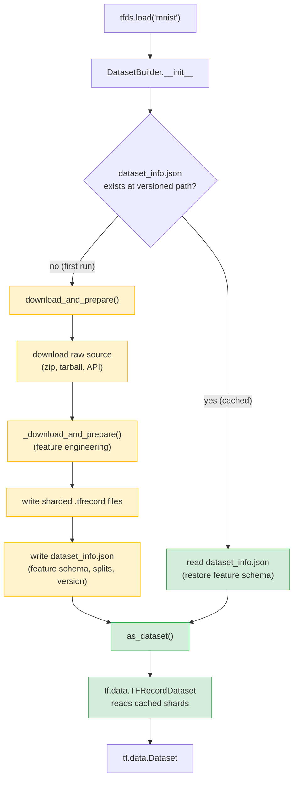
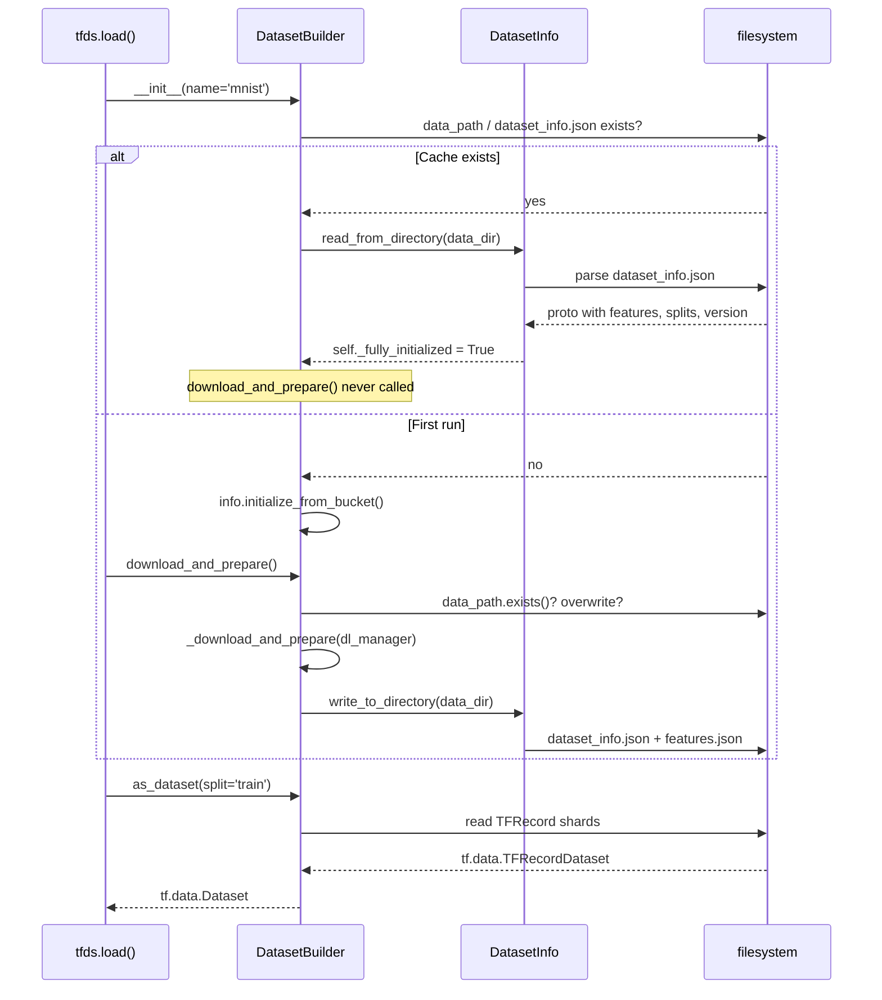

**TL;DR:** Does `tfds.load('mnist')` re-download and re-transform the data every time you run it? No — the first call runs `download_and_prepare()`, which downloads raw data, applies the dataset builder's `_download_and_prepare` transform exactly once, and writes the result as sharded TFRecord files to a versioned directory on disk. Every subsequent call finds that directory already exists, short-circuits the entire download-and-transform pipeline, and returns a `tf.data.Dataset` reading directly from the cached TFRecords. A `DatasetInfo` JSON sidecar records the feature schema, split boundaries, and checksum so the system knows whether the cache is still valid.

**Real repo:** [`tensorflow/datasets`](https://github.com/tensorflow/datasets)

---

## 1. The Engineering Problem

Every ML training run needs data. But "getting data" is not a single operation — it is a chain: download the raw source (a zip, a tarball, an API response), parse it into a canonical structure, apply feature engineering (normalization, tokenization, encoding), split it into train/test/validation, and serialize the result into a format the training loop can read efficiently. This chain is expensive. A large image dataset might take minutes to download and hours to transform. Running it at the start of every training script, every notebook restart, every CI pipeline is waste.

The naive fix — save the transformed data to a file and load it next time — introduces a new problem: how does the system know whether the saved file is still valid? If someone changes the dataset builder code (new version, new split logic, new feature normalization), the old cached file is stale. Loading it silently gives you wrong data. The system needs a way to know: "this cache was produced by *this* version of *this* builder with *this* feature schema," and to invalidate itself when any of those change.

## 2. The Technical Solution

TFDS solves this with a two-phase architecture: `download_and_prepare()` writes the data, `as_dataset()` reads it. The cache validity is tracked by a `DatasetInfo` proto serialized as JSON alongside the TFRecord files.

The first time you call `tfds.load('mnist')`, the library instantiates a `DatasetBuilder`, calls `download_and_prepare()`, which downloads the raw source, runs the builder's `_download_and_prepare` method (the actual feature engineering and serialization logic), and writes sharded `.tfrecord` files to `~/tensorflow_datasets/mnist/3.0.0/`. It also writes a `dataset_info.json` file containing the feature schema, split definitions, number of examples per split, and the dataset version.

The second time you call `tfds.load('mnist')`, the builder's `__init__` detects that `dataset_info.json` already exists at the versioned path. It reads the proto, restores the feature schema and split info from disk, and skips `download_and_prepare()` entirely. The `_as_dataset` method then constructs a `tf.data.TFRecordDataset` pointing at the cached shard files.



The second diagram shows what happens inside `download_and_prepare()` when the data directory already exists — the early-return path that makes subsequent loads instant:



The `DatasetInfo` proto is the linchpin. It records not just the feature schema but also the version string, the file format, split boundaries (number of examples per shard), and download checksums. When `read_from_directory` is called, it compares the proto's version against the builder's code version — a mismatch means the cache is stale and must be regenerated.

## 3. Clean Example

```python
import tensorflow_datasets as tfds

# First call: runs download_and_prepare, writes TFRecords to disk.
# Subsequent calls in any script, notebook, or CI job will skip this entirely.
ds, info = tfds.load(
    'cifar10',
    split='train',
    with_info=True,       # return the DatasetInfo object
    as_supervised=True,   # yield (image, label) tuples
)

print(info.features)     # FeaturesDict restored from dataset_info.json
print(info.splits['train'].num_examples)  # 50000 — recorded at prepare time

# The tf.data.Dataset reads directly from cached TFRecord shards.
# No download, no transform — just TFRecordDataset → parse → yield.
for image, label in ds.take(1):
    print(image.shape, label.numpy())
    # (32, 32, 3) 6
```

## 4. Production Reality (from the real repo)

The version-detection and early-return logic lives in `DatasetBuilder.__init__` and `download_and_prepare()`. Here is the actual code:

```
tensorflow/datasets/core/
├── dataset_builder.py   — DatasetBuilder.__init__: cache detection via dataset_info.json
├── dataset_info.py      — DatasetInfo.read_from_directory: proto restoration from disk
├── file_adapters.py     — FileAdapter: pluggable format abstraction (TFRecord, Riegeli, Parquet)
└── reader.py            — Reader: interleaved tf.data.Dataset construction from shards
```

`DatasetBuilder.__init__` checks for the versioned data directory and restores metadata from disk if found — this is what makes `download_and_prepare()` a no-op on subsequent calls:

```python
# dataset_builder.py — DatasetBuilder.__init__
self._data_dir_root, self._data_dir = self._build_data_dir(data_dir)
# If the dataset info is available, use it.
dataset_info_path = dataset_info.dataset_info_path(self.data_path)
if retry.retry(dataset_info_path.exists):
    self.info.read_from_directory(self._data_dir)
else:  # Use the code version (do not restore data)
    self.info.initialize_from_bucket()
```

`download_and_prepare()` short-circuits when the data directory already contains a valid versioned dataset — the log message confirms the reuse:

```python
# dataset_builder.py — DatasetBuilder.download_and_prepare
data_path = self.data_path
data_exists = retry.retry(data_path.exists)
# ...
if data_exists:
    if download_config.download_mode.overwrite_dataset:
        logging.info(
            "Deleting pre-existing dataset %s (%s)", self.name, self.data_dir
        )
        data_path.rmtree()
        data_exists = retry.retry(data_path.exists)
    else:
        logging.info("Reusing dataset %s (%s)", self.name, self.data_dir)
        return
```

`DatasetInfo.read_from_directory` deserializes the proto from JSON and validates the version matches — a mismatch means the builder code and cached data are out of sync:

```python
# dataset_info.py — DatasetInfo.read_from_directory
parsed_proto = read_from_json(dataset_info_path(dataset_info_dir))

if str(self.version) != parsed_proto.version:
    raise AssertionError(
        "The constructed DatasetInfo instance and the restored proto version "
        "do not match. Builder version: {}. Proto version: {}".format(
            self.version, parsed_proto.version
        )
    )
```

The `FileAdapter` abstraction makes the cached format pluggable — TFRecord is the default, but ArrayRecord and Parquet are also supported, each with its own shard-writing and reading logic:

```python
# file_adapters.py — FileFormat enum and default
class FileFormat(enum.Enum):
    TFRECORD = 'tfrecord'
    RIEGELI = 'riegeli'
    ARRAY_RECORD = 'array_record'
    PARQUET = 'parquet'

DEFAULT_FILE_FORMAT = FileFormat.TFRECORD
```

## 5. Review Checklist

- **Is `dataset_info.json` present and version-matched in the data directory?** If it is missing or its `version` field does not match the builder's code version, `download_and_prepare()` will attempt to regenerate — which may overwrite your cached data if `overwrite_dataset` mode is set.
- **Is the `features.json` sidecar file consistent with the feature schema your training code expects?** `DatasetInfo.read_from_directory` restores feature metadata from this file; if someone modified the builder's `_info()` without bumping the version, the cached features may not match the code's expectations.
- **Are you using the default `FileFormat.TFRECORD`, or did you specify `file_format=` when calling `download_and_prepare()`?** The cached format is recorded in the proto — loading with a different format than what was written will fail unless the dataset was prepared with alternative formats.
- **Does your CI pipeline explicitly call `download_and_prepare()` before `as_dataset()`, or does it rely on the auto-short-circuit?** Relying on the short-circuit is correct in most cases, but if the data directory is ephemeral (fresh container each run), you need an explicit prepare step or a pre-populated volume.

## 6. FAQ

**Q: What happens if I call `tfds.load()` from two different scripts simultaneously — will they race on `download_and_prepare()`?**
A: TFDS uses `utils.incomplete_dir` to write to a temporary directory and atomically rename it on success. A second concurrent caller that starts before the rename will see the directory does not yet exist and begin its own prepare — but the second caller's write will fail or overwrite depending on the `download_mode`. For production pipelines, prepare the dataset once in a dedicated step and share the data directory via a volume or mounted storage.

**Q: If I change the feature normalization in my builder's `_info()`, does the old cache get invalidated automatically?**
A: Only if you also bump the `VERSION`. `read_from_directory` compares the proto's version string against the builder's code version — if they match, the old `features.json` is restored regardless of whether the code's `_info()` now defines different features. Bump the version to force a regeneration.

**Q: Why does TFDS default to TFRecord instead of a format like Parquet or Arrow?**
A: TFRecord is TensorFlow's native serialized-example format, and `tf.data.TFRecordDataset` is a first-class TF component with optimized I/O, parallel interleaving, and sharding support. Parquet support was added later (v4.9.5) for frameworks outside the TF ecosystem, but TFRecord remains the default because it integrates most deeply with `tf.data` pipelines.

**Q: Can I inspect what's in the cache without running the full builder?**
A: Yes — `ReadOnlyBuilder` (`read_only_builder.py`) reconstructs a `DatasetBuilder` from an existing data directory by reading `dataset_info.json` alone, without importing the original builder class. This is what `builder_from_files` and `builder_from_directory` use.

---

## Source

- **Concept:** Transform-once-and-cache pattern with TFRecord serialization and metadata sidecar validation
- **Domain:** mlops
- **Repo:** [tensorflow/datasets](https://github.com/tensorflow/datasets) → [`tensorflow_datasets/core/dataset_builder.py`](https://github.com/tensorflow/datasets/blob/master/tensorflow_datasets/core/dataset_builder.py) (cache detection and `download_and_prepare` short-circuit); [`tensorflow_datasets/core/dataset_info.py`](https://github.com/tensorflow/datasets/blob/master/tensorflow_datasets/core/dataset_info.py) (proto serialization and version validation); [`tensorflow_datasets/core/file_adapters.py`](https://github.com/tensorflow/datasets/blob/master/tensorflow_datasets/core/file_adapters.py) (pluggable format abstraction); [`tensorflow_datasets/core/reader.py`](https://github.com/tensorflow/datasets/blob/master/tensorflow_datasets/core/reader.py) (interleaved `tf.data.Dataset` from sharded TFRecords)
