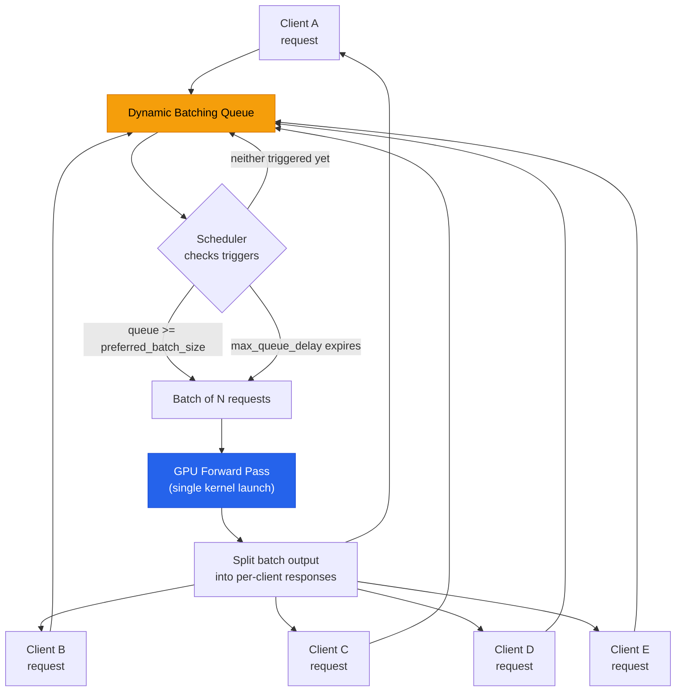
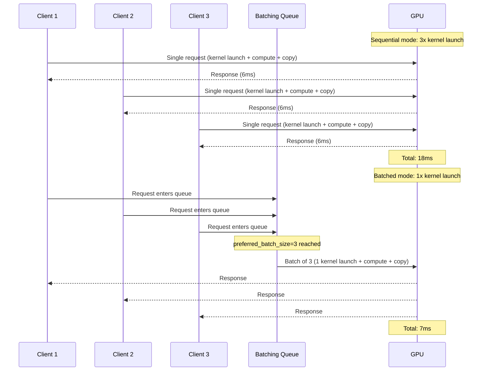

**TL;DR:** Can a model server truly serve ten concurrent clients faster than serving them one at a time? Yes — if it waits a few milliseconds in a queue to accumulate a batch, then runs all ten through the GPU in a single kernel launch, amortizing the fixed overhead of GPU thread block scheduling, memory transfer setup, and model weight loading across every request in the group.
> **In plain English (30 sec):** Think of this like concepts you already use, but in a production system at scale.


## 1. The Engineering Problem

When you deploy a trained model behind an HTTP endpoint, the naive approach is straightforward: a client sends one request, the server loads the input tensor onto the GPU, executes the model forward pass, copies the output tensor back, and returns the response. For a single client this works fine. But at production scale, dozens or hundreds of clients are sending requests concurrently, and each one pays the full fixed cost of a GPU inference cycle.

The critical insight is that GPU compute does not scale linearly with batch size. Loading a ResNet-50 model's weights into the CUDA cores takes roughly the same time whether you are processing one image or thirty-two. The kernel launch overhead, the memory address translation, and the PCIe transfer setup are all fixed costs. A single-image inference might spend 5ms of a 6ms total on fixed overhead and only 1ms on actual math. Ten sequential single-image inferences therefore burn 60ms total, of which 50ms is pure waste.

This is the batching problem: if you could group those ten images into a single batch and execute them together, the fixed costs are paid once, not ten times. The total execution time drops to roughly 7ms instead of 60ms — a 9x throughput improvement with no change to the model, the hardware, or the client code. But manually grouping requests from different clients is hard: you need a queue, a timer, and a way to split the batched output back into per-client responses.

## 2. The Technical Solution

Triton Inference Server's dynamic batching feature solves this exact problem at the server level. You enable it by adding a `dynamic_batching` section to your model's `config.pbtxt`, and the server handles the rest: incoming requests are held in a queue, grouped into batches according to your preferred batch sizes, executed on the GPU in a single forward pass, and split back into individual client responses.

The scheduling works on two triggers. First, a **preferred batch size** — if the queue fills up to this threshold, the batch is dispatched immediately without waiting. Second, a **maximum queue delay** — if the queue has not reached the preferred size within this timeout (even a few milliseconds), whatever is in the queue is dispatched as a partial batch. This prevents starvation when traffic is light while still capturing batching gains during load spikes.



The second diagram shows the timing comparison between sequential and batched execution, making the fixed-cost amortization visible:



Three core truths to hold:

- **The batch size is the multiplier.** Triton's `preferred_batch_size` tells the scheduler the batch sizes at which the model is most efficient. For TensorRT models, this is typically 8, 16, or 32 — values chosen by profiling with NVIDIA's Model Analyzer to find the sweet spot where GPU SMs are fully saturated without exceeding memory.
- **The queue delay is the latency tax.** Every request in the queue waits up to `max_queue_delay_microseconds` before execution. Setting this to 0 disables batching entirely; setting it to 5000 (5ms) is a common starting point for real-time workloads. The tradeoff is linear: more delay = larger batches = higher throughput, but higher tail latency per request.
- **Response ordering is preserved.** When `preserve_ordering` is true, the batched responses are returned in the same order the requests arrived, even though the GPU may have computed them out of order. This is critical for sequential models (like autoregressive LLMs) where request ordering carries semantic meaning.

## 3. The Clean Example

A minimal Triton model configuration that enables dynamic batching, showing the two critical fields — `preferred_batch_size` and `max_queue_delay_microseconds` — and the client code that benefits from batching without knowing it exists:

```protobuf
# config.pbtxt — minimal model configuration with dynamic batching enabled
name: "resnet50_onnx"
platform: "onnxruntime_onnx"
max_batch_size: 32

input [
  {
    name: "input"
    data_type: TYPE_FP32
    dims: [ 3, 224, 224 ]
  }
]

output [
  {
    name: "output"
    data_type: TYPE_FP32
    dims: [ 1000 ]
  }
]

dynamic_batching {
  preferred_batch_size: [ 8, 16, 32 ]
  max_queue_delay_microseconds: 5000
  preserve_ordering: true
}
```

```python
# client.py — sends independent requests; batching is invisible to the client
import tritonclient.grpc as grpcclient
import numpy as np

URL = "localhost:8001"
MODEL = "resnet50_onnx"

def infer_single(image: np.ndarray) -> np.ndarray:
    """Send one image. The server may batch it with others — client never knows."""
    with grpcclient.InferenceServerClient(URL) as client:
        inputs = [grpcclient.InferInput("input", image.shape, "FP32")]
        inputs[0].set_data_from_numpy(image)
        outputs = [grpcclient.InferRequestedOutput("output")]
        result = client.infer(MODEL, inputs, outputs=outputs)
        return result.as_numpy("output")

# Fire 32 requests concurrently — Triton batches them automatically
images = [np.random.rand(3, 224, 224).astype(np.float32) for _ in range(32)]
results = [infer_single(img) for img in images]
print(f"Processed {len(results)} images, each shape {results[0].shape}")
```

## 4. Production Reality

The dynamic batching scheduler lives in the Triton core library (`triton-inference-server/core`). Here is the model configuration protobuf that defines the batching parameters, verbatim from the repository:

From `common/protobuf/model_config.proto` — the `ModelDynamicBatching` message that controls all batching behavior:

```protobuf
// ModelDynamicBatching - the protobuf message that defines dynamic batching behavior
message ModelDynamicBatching {
  // Preferred batch sizes for dynamic batching. If a batch of one of
  // these sizes can be formed it will be executed immediately.
  repeated int32 preferred_batch_size = 1;

  // The maximum time, in microseconds, a request will be delayed in
  // the scheduling queue to wait for additional requests for batching.
  // Default is 0.
  uint64 max_queue_delay_microseconds = 2;

  // Should the dynamic batcher preserve the ordering of responses to
  // match the order of requests received by the scheduler. Default is false.
  bool preserve_ordering = 3;

  // The number of priority levels to be enabled for the model,
  // the priority level starts from 1 and 1 is the highest priority.
  uint64 priority_levels = 4;

  // The default queue policy used for requests that don't require priority handling
  ModelQueuePolicy default_queue_policy = 6;

  // Queue policy for each priority level
  map<uint64, ModelQueuePolicy> priority_queue_policy = 7;
}
```

From `common/protobuf/model_config.proto` — the `ModelQueuePolicy` that controls per-priority-level timeout and rejection behavior:

```protobuf
// ModelQueuePolicy - timeout and rejection rules for the request queue
message ModelQueuePolicy {
  enum TimeoutAction {
    REJECT = 0;
    DELAY = 1;
  }

  // The action applied to timed-out request.
  TimeoutAction timeout_action = 1;

  // The default timeout for every request, in microseconds.
  uint64 default_timeout_microseconds = 2;

  // Whether individual request can override the default timeout value.
  bool allow_timeout_override = 3;

  // Maximum queue size. A request will be rejected immediately if
  // it cannot be enqueued because the queue is full.
  uint32 max_queue_size = 4;
}
```

From `triton-inference-server/server/src/main.cc` — the server startup sequence that wires the batching scheduler into the inference pipeline:

```cpp
// main.cc - creating the server with batching configuration from model repo
TRITONSERVER_Server* server_ptr = nullptr;
FAIL_IF_ERR(
    TRITONSERVER_ServerNew(&server_ptr, triton_options.get()),
    "creating server");

std::shared_ptr<TRITONSERVER_Server> server(
    server_ptr, TRITONSERVER_ServerDelete);

// Configure and start tracing if specified on the command line.
if (!StartTracing(&trace_manager)) {
    exit(1);
}

// Start the HTTP, GRPC, and metrics endpoints.
if (!StartEndpoints(server, trace_manager, shm_manager)) {
    exit(1);
}

// Wait until a signal terminates the server...
while (!triton::server::signal_exiting_) {
    // If enabled, poll the model repository to see if there have been
    // any changes.
    if (g_triton_params.repository_poll_secs_ > 0) {
        LOG_TRITONSERVER_ERROR(
            TRITONSERVER_ServerPollModelRepository(server_ptr),
            "failed to poll model repository");
    }

    std::unique_lock<std::mutex> lock(triton::server::signal_exit_mu_);
    std::chrono::seconds wait_timeout(
        (g_triton_params.repository_poll_secs_ == 0)
            ? 3600
            : g_triton_params.repository_poll_secs_);
    triton::server::signal_exit_cv_.wait_for(lock, wait_timeout);
}
```

## 5. Review Checklist

- **Batch size profiling is not optional.** Never guess `preferred_batch_size` — use NVIDIA Model Analyzer to profile your specific model on your specific GPU. The optimal batch size varies by orders of magnitude between a lightweight classifier (batch 64+) and a large language model (batch 2-8). Setting it too high causes GPU memory exhaustion; setting it too low wastes the batching opportunity entirely.

- **Queue delay vs. latency SLA.** The `max_queue_delay_microseconds` field is the direct lever for your latency budget. For a real-time recommendation system with a 50ms end-to-end SLA, a queue delay of 5000 (5ms) is reasonable. For a batch analytics pipeline, you might set it to 50000 (50ms) to capture larger batches. Always measure p99 latency under load, not just throughput.

- **Response ordering has a cost.** Enabling `preserve_ordering: true` adds internal synchronization overhead because Triton must buffer out-of-order responses until it can deliver them in the original request sequence. For stateless classifiers this is unnecessary overhead; for autoregressive LLMs or sequence models it is mandatory. Profile both configurations to quantify the difference on your workload.

- **Priority levels for multi-tenant serving.** The `priority_levels` and `priority_queue_policy` fields let you route premium-traffic requests ahead of batch jobs in the same queue. Configure this when a single Triton instance serves multiple SLA tiers — without it, a burst of low-priority batch requests can delay high-priority real-time requests by filling the queue before the scheduler can drain it.

## 6. FAQ

**Q: Does dynamic batching change my model or require retraining?**
A: No. Dynamic batching is entirely a server-side scheduling optimization. The model receives a batched input tensor and produces a batched output tensor, but this is the same shape the model already supports (governed by `max_batch_size` in your config). The model weights, training data, and inference logic are untouched.

**Q: What happens if only one request arrives — does batching still work?**
A: Yes. If `max_queue_delay_microseconds` expires and only one request is in the queue, Triton dispatches a batch of size 1. There is no minimum batch size — the scheduler simply groups what is available when the timer fires.

**Q: Can I enable dynamic batching for a model that already supports batching?**
A: If your model config already has `max_batch_size > 0`, the model already accepts batched inputs. Adding `dynamic_batching` to that config simply tells Triton how to accumulate individual client requests into those batches. If `max_batch_size` is 0, dynamic batching cannot be used because the model cannot handle batched inputs.

**Q: How does dynamic batching interact with GPU instance groups?**
A: Each GPU instance group runs its own copy of the model. Triton's scheduler dispatches batches to available instances — if you have 4 GPU instances and a batch size of 8, each instance processes its own batch of 8 independently. The `count` field in `instance_group` controls how many model copies run in parallel, and dynamic batching controls how requests are grouped before reaching each copy.

**Q: Is dynamic batching the same as TensorRT's built-in batching?**
A: No. TensorRT batching refers to the engine's ability to accept batched input tensors during a single execution call. Triton's dynamic batching is the server-side layer that accumulates individual client requests into those batched tensors before calling TensorRT. They work together — TensorRT handles the batched execution, Triton handles the request accumulation and response splitting.

---

**Source:** [triton-inference-server/server](https://github.com/triton-inference-server/server) and [triton-inference-server/core](https://github.com/triton-inference-server/core) — specifically `common/protobuf/model_config.proto` (`ModelDynamicBatching`, `ModelQueuePolicy` messages), `triton-inference-server/server/src/main.cc` (server startup and endpoint wiring), and the [Triton dynamic batching documentation](https://docs.nvidia.com/deeplearning/triton-inference-server/user-guide/docs/user_guide/model_configuration.html#dynamic-batching).


