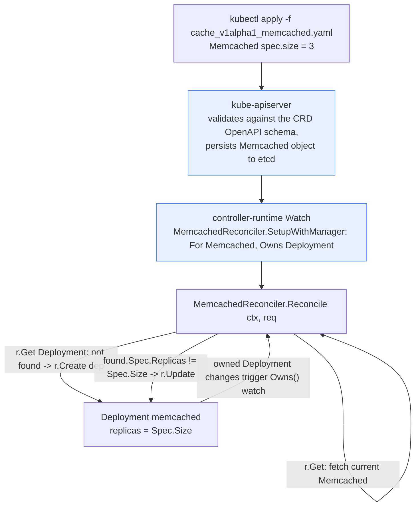

**TL;DR:** Kubernetes' control loops only know how to reconcile the object kinds baked into the API server — `Deployment`, `Service`, `Pod` — so how do you get the same self-healing behavior for your own domain object, like "a Memcached cluster" or "a Postgres replica set"? A `CustomResourceDefinition` (CRD) registers the new kind with the API server, and a `controller-runtime`-based Operator runs its own `Reconcile` loop against it — the exact same pattern `kube-controller-manager` uses internally for `Deployment`/`ReplicaSet`, just running as your own binary. From `operator-framework/operator-sdk`'s real Kubebuilder-scaffolded controller source.

## 1. The Engineering Problem

A team running memcached (or Postgres, or Kafka, or any stateful app with operational rules) on Kubernetes eventually hits the same wall: a `Deployment` alone doesn't know the domain-specific rules for that app. "If the memcached cluster's replica count drops below what's declared, recreate the missing Deployment" is trivial to express in YAML, but "before failing over, verify the replica set has caught up on replication, and only then promote a new primary" is not a `Deployment` concept — it's application-specific operational knowledge that Kubernetes has no built-in object for.

The naive fix is a runbook: an on-call engineer or a cron-triggered shell script watches `kubectl get` output and manually intervenes. This doesn't scale and doesn't self-heal — it depends on a human or a fragile polling script noticing drift, and it gives the cluster no single object representing "the desired state of my Memcached cluster" that `kubectl get`, RBAC, and GitOps tooling can all reason about uniformly. What's needed is a way to teach the Kubernetes API server about an entirely new kind of object — `Memcached`, not just `Pod`/`Deployment` — and have a control loop reconcile it exactly the way `kube-controller-manager` reconciles the built-in kinds.

## 2. The Technical Solution

A **CustomResourceDefinition (CRD)** registers a new API kind (e.g. `Memcached` in the `cache.example.com` group) with the API server — after that, `kubectl get memcacheds`, RBAC, and `kubectl apply` all treat it like any built-in object, backed by the same etcd storage. A CRD alone is inert, though — it's just a schema. The actual behavior comes from an **Operator**: a controller process, typically built on `sigs.k8s.io/controller-runtime`, that watches the new kind and runs a `Reconcile` function every time an object of that kind (or something it owns) changes.



Two core truths this diagram is showing:

- **The CRD is a schema registration, the Operator is the behavior.** `cache.example.com_memcacheds.yaml` alone gives you storage and validation for a `Memcached` object; nothing reconciles it until `MemcachedReconciler` is running and watching.
- **`Owns()` is what makes this self-healing, not just create-once.** Because the controller registers `Owns(&appsv1.Deployment{})`, an owned `Deployment` being scaled or deleted out-of-band re-triggers `Reconcile` — the same "watch what you created, not just what you were told" pattern `ReplicaSet`'s own controller uses for `Pod`s.

## 3. The clean example (concept in isolation)

A minimal CRD plus the reconcile loop's core idempotent shape, stripped of finalizers and status bookkeeping:

```yaml
# crd.yaml — registers the new kind with the API server
apiVersion: apiextensions.k8s.io/v1
kind: CustomResourceDefinition
metadata:
  name: memcacheds.cache.example.com
spec:
  group: cache.example.com
  names:
    kind: Memcached
    plural: memcacheds
  scope: Namespaced
  versions:
    - name: v1alpha1
      served: true
      storage: true
      schema:
        openAPIV3Schema:
          type: object
          properties:
            spec:
              type: object
              properties:
                # desired replica count — the ONLY field this
                # minimal operator reconciles against
                size:
                  type: integer
                  minimum: 1
```

```go
// controller.go — the reconcile loop's essential shape
func (r *MemcachedReconciler) Reconcile(ctx context.Context, req ctrl.Request) (ctrl.Result, error) {
    memcached := &cachev1alpha1.Memcached{}
    // 1. Read current desired state from etcd (via the API server)
    if err := r.Get(ctx, req.NamespacedName, memcached); err != nil {
        return ctrl.Result{}, client.IgnoreNotFound(err)
    }

    // 2. Read current actual state (does the Deployment exist?)
    dep := &appsv1.Deployment{}
    err := r.Get(ctx, req.NamespacedName, dep)
    if apierrors.IsNotFound(err) {
        // 3. Actual state is missing entirely — create it
        return ctrl.Result{}, r.Create(ctx, buildDeployment(memcached))
    }

    // 4. Actual state exists but has drifted — converge it
    if *dep.Spec.Replicas != memcached.Spec.Size {
        dep.Spec.Replicas = &memcached.Spec.Size
        return ctrl.Result{}, r.Update(ctx, dep)
    }
    // 5. Already converged — nothing to do this pass
    return ctrl.Result{}, nil
}
```

Every real reconcile loop is this same read-compare-converge shape; the production version below adds finalizers, status conditions, and error-driven requeues around it.

## 4. Production reality (from the real repo)

`operator-framework/operator-sdk`'s `testdata/go/v4/memcached-operator/` is the SDK's own Kubebuilder-scaffolded reference operator, generated by `operator-sdk init` + `operator-sdk create api` — it's the canonical shape every real operator built on this tooling starts from.

```
testdata/go/v4/memcached-operator/
├── api/v1alpha1/
│   └── memcached_types.go        # the CRD's Go type + kubebuilder markers
├── config/
│   ├── crd/bases/
│   │   └── cache.example.com_memcacheds.yaml   # generated CRD manifest
│   └── samples/
│       └── cache_v1alpha1_memcached.yaml       # example custom resource
└── internal/controller/
    └── memcached_controller.go    # the Reconciler
```

The CRD's Go type — `+kubebuilder` markers on this struct are what `controller-gen` reads to generate `cache.example.com_memcacheds.yaml`:

```go
// api/v1alpha1/memcached_types.go
type MemcachedSpec struct {
	// +kubebuilder:validation:Minimum=1
	// +kubebuilder:validation:Maximum=3
	// Size defines the number of Memcached instances
	Size int32 `json:"size,omitempty"`

	// Port defines the port that will be used to init the container with the image
	ContainerPort int32 `json:"containerPort,omitempty"`
}

// MemcachedStatus defines the observed state of Memcached
type MemcachedStatus struct {
	// Conditions store the status conditions of the Memcached instances
	Conditions []metav1.Condition `json:"conditions,omitempty" patchStrategy:"merge" patchMergeKey:"type"`
}
```

The reconcile loop's real shape — note this is materially more than the clean example: it manages a **finalizer** for cleanup-before-delete, and a **status condition** the API server exposes back to `kubectl describe`:

```go
// internal/controller/memcached_controller.go
const memcachedFinalizer = "cache.example.com/finalizer"

func (r *MemcachedReconciler) Reconcile(ctx context.Context, req ctrl.Request) (ctrl.Result, error) {
	memcached := &cachev1alpha1.Memcached{}
	err := r.Get(ctx, req.NamespacedName, memcached)
	if err != nil {
		if apierrors.IsNotFound(err) {
			// Object was deleted between the event firing and this Get —
			// nothing to reconcile, this is not an error condition.
			return ctrl.Result{}, nil
		}
		return ctrl.Result{}, err
	}

	// Set an initial "Unknown" status condition on first sight, then
	// re-fetch — avoids a stale-object conflict on the next Update.
	if len(memcached.Status.Conditions) == 0 {
		meta.SetStatusCondition(&memcached.Status.Conditions, metav1.Condition{
			Type: typeAvailableMemcached, Status: metav1.ConditionUnknown,
			Reason: "Reconciling", Message: "Starting reconciliation",
		})
		if err = r.Status().Update(ctx, memcached); err != nil {
			return ctrl.Result{}, err
		}
	}

	if !controllerutil.ContainsFinalizer(memcached, memcachedFinalizer) {
		controllerutil.AddFinalizer(memcached, memcachedFinalizer)
		if err = r.Update(ctx, memcached); err != nil {
			return ctrl.Result{}, err
		}
	}
	// ... deletion-timestamp branch runs doFinalizerOperationsForMemcached()
	// and removes the finalizer before letting the API server GC the object ...

	found := &appsv1.Deployment{}
	err = r.Get(ctx, types.NamespacedName{Name: memcached.Name, Namespace: memcached.Namespace}, found)
	if err != nil && apierrors.IsNotFound(err) {
		dep, err := r.deploymentForMemcached(memcached)
		if err != nil {
			return ctrl.Result{}, err
		}
		if err = r.Create(ctx, dep); err != nil {
			return ctrl.Result{}, err
		}
		// Requeue rather than assume the Create succeeded synchronously —
		// the next pass re-reads real state instead of trusting this branch.
		return ctrl.Result{RequeueAfter: time.Minute}, nil
	}

	size := memcached.Spec.Size
	if *found.Spec.Replicas != size {
		found.Spec.Replicas = &size
		if err = r.Update(ctx, found); err != nil {
			return ctrl.Result{}, err
		}
		return ctrl.Result{Requeue: true}, nil
	}
	return ctrl.Result{}, nil
}
```

The watch registration, which is what turns "create once" into "keep converged":

```go
func (r *MemcachedReconciler) SetupWithManager(mgr ctrl.Manager) error {
	return ctrl.NewControllerManagedBy(mgr).
		For(&cachev1alpha1.Memcached{}).
		Named("memcached").
		// If the owned Deployment is scaled/deleted out-of-band,
		// this re-triggers Reconcile — not just on Memcached changes.
		Owns(&appsv1.Deployment{}).
		Complete(r)
}
```

**What this teaches that a hello-world can't:**

- **Finalizers turn deletion into a reconcile event, not an instant DELETE.** `metadata.deletionTimestamp` gets set first; the object survives in etcd (with the finalizer still attached) until the controller runs cleanup and calls `RemoveFinalizer` — the API server won't actually GC the object with a finalizer still present. Skipping this leaves orphaned dependent resources when a `Memcached` is deleted.
- **Status conditions are the operator's only way to report health back through `kubectl`.** `Conditions []metav1.Condition` isn't optional bookkeeping — it's the mechanism by which `kubectl describe memcached` and any dashboard reading the API server learns the CR converged (or didn't), the same convention `Deployment.status.conditions` uses.
- **`RequeueAfter`/`Requeue: true` after a mutation is deliberate, not laziness.** Rather than assuming a `Create`/`Update` immediately reflects in the next line, the loop returns and lets the next pass re-read real state — reconcile loops are built to tolerate being interrupted and restarted at any point.
- **`SecurityContext.RunAsNonRoot` + `SeccompProfileTypeRuntimeDefault` on the generated Deployment** (in `deploymentForMemcached`) show the scaffolding template itself defaulting to a Restricted-adjacent posture — worth noticing since it's the same posture Topic 17 covers as a cluster-wide policy rather than a per-manifest default.

## 5. Review checklist

- Does every mutating branch (`Create`/`Update`/`Status().Update`) end the `Reconcile` call with a `return`, rather than falling through into subsequent branches that assume it already converged? Multiple resource mutations in one pass, without a `Requeue`, invite races against the informer cache.
- Is a finalizer added *before* any external side effect the cleanup path depends on, and removed only after that cleanup genuinely succeeds — not unconditionally in a `defer`?
- Does `SetupWithManager`'s `Owns(...)` list cover every resource kind the controller creates? An owned kind left off this list means drift in that resource won't re-trigger reconciliation until the next unrelated event.
- Does the CRD schema (`+kubebuilder:validation:Minimum`/`Maximum` etc.) reject invalid `spec` values at the API server, rather than relying on the controller to validate and silently ignore bad input?

## 6. FAQ

**Q: Why does `Reconcile` re-fetch the object after every `Status().Update()` call instead of mutating the in-memory struct?**
A: The comment in `memcached_controller.go` says it directly — re-fetching avoids "the object has been modified, please apply your changes to the latest version and try again," a resourceVersion conflict from `optimistic concurrency control`. Any `Update` bumps `resourceVersion`; continuing to mutate the stale in-memory copy and calling `Update` again would fail.

**Q: What actually happens if I `kubectl delete` a `Memcached` with a finalizer, and the operator is down?**
A: The object stays in etcd indefinitely with `deletionTimestamp` set but not GC'd — `kubectl get` still shows it (often as `Terminating`). Nothing removes the finalizer until the operator comes back and its reconcile loop runs the deletion branch. This is a real production failure mode (a stuck-terminating custom resource); the fix is bringing the controller back, not force-deleting, unless you're certain no cleanup is actually needed.

**Q: Does the `Owns(&appsv1.Deployment{})` watch fire on every field change to every Deployment in the cluster?**
A: No — `controller-runtime` only forwards events for objects that have an `OwnerReference` back to a watched `Memcached`, set via `ctrl.SetControllerReference(memcached, dep, r.Scheme)` in `deploymentForMemcached`. That ownerRef is also what makes `kubectl delete memcached` cascade-delete its Deployment via the API server's built-in garbage collector, independent of the operator's own finalizer logic.

**Q: Is a CRD's OpenAPI schema validation a replacement for an admission webhook?**
A: No — it only validates structure and value ranges (`type`, `minimum`/`maximum`, `enum`) at the API server, before the object is ever persisted. It can't express cross-field or cross-object rules ("size must be odd" or "can't exceed the namespace's quota"); that needs a `ValidatingWebhookConfiguration`, which is exactly the mechanism Topic 17 covers for Pod Security Standards.

**Q: Why does the controller `Get` the Deployment by `types.NamespacedName{Name: memcached.Name, ...}` instead of a label selector?**
A: Because this operator deliberately gives the managed Deployment the same name as its owning `Memcached` — a 1:1 naming convention that makes the existence check a single `Get` instead of a `List` + filter. It's a valid simplification for a single-owned-resource operator, but doesn't generalize to operators that manage multiple resources of the same kind per CR (those need label selectors, as `ReplicaSet`'s own controller does for its Pods).

---

## Source

- **Concept:** Custom Resource Definitions (CRDs) and Operators
- **Domain:** kubernetes
- **Repo:** [operator-framework/operator-sdk](https://github.com/operator-framework/operator-sdk) → [`testdata/go/v4/memcached-operator/internal/controller/memcached_controller.go`](https://github.com/operator-framework/operator-sdk/blob/master/testdata/go/v4/memcached-operator/internal/controller/memcached_controller.go), [`api/v1alpha1/memcached_types.go`](https://github.com/operator-framework/operator-sdk/blob/master/testdata/go/v4/memcached-operator/api/v1alpha1/memcached_types.go) — the SDK's own Kubebuilder-scaffolded reference operator.

---

**Next in the Kubernetes series:** [Pod Security Standards: How Namespace Labels Replaced PodSecurityPolicy]({{ '/kubernetes/pod-security-standards-admission-controllers/' | relative_url }})
