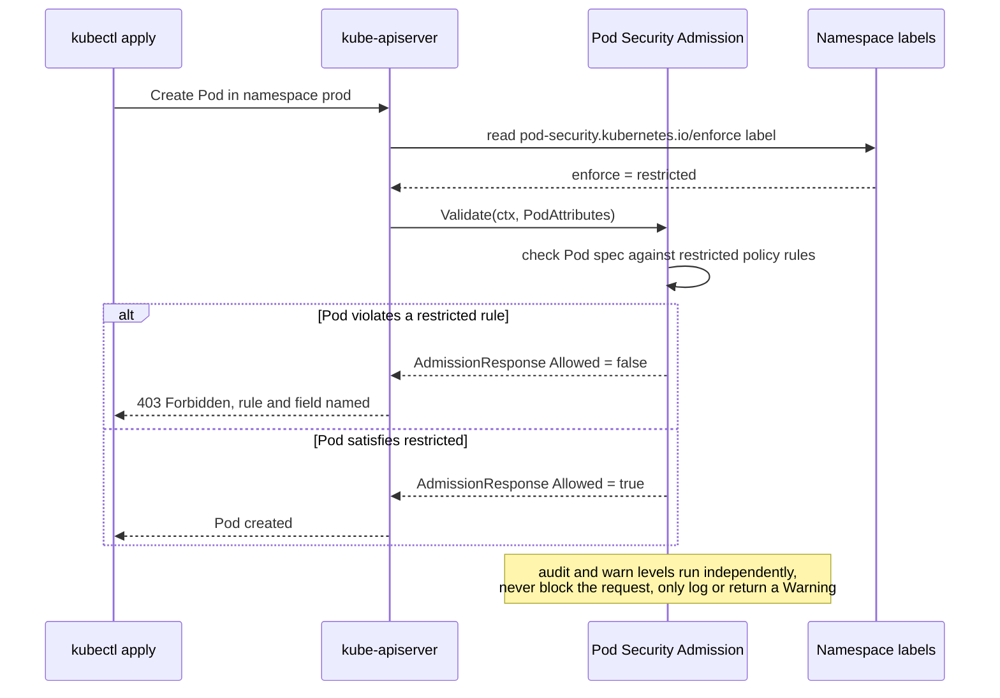

**TL;DR:** RBAC controls who can create a Pod; it says nothing about what that Pod is allowed to run as once created — a user with `create pods` permission can still request `privileged: true` or a hostPath mount, and RBAC won't stop them. Pod Security Admission, a built-in admission controller since Kubernetes 1.23 (and PodSecurityPolicy's replacement after PSP's removal in 1.25), closes that gap by evaluating every Pod against one of three fixed **Pod Security Standards** levels — driven entirely by `pod-security.kubernetes.io/*` labels on the Pod's namespace, no separate policy object to create or bind. From Kubernetes' own `pod-security-admission` source and `kubernetes-sigs/security-profiles-operator`'s real `MutatingWebhookConfiguration`.

> **In plain English (30 sec):** Think of a Pod like a small VM holding containers sharing same IP — like containers on localhost.

## 1. The Engineering Problem

RBAC answers "can this identity create a Pod in this namespace" — it has no concept of what fields that Pod's spec is allowed to contain. A `Role` granting `create` on `pods` says nothing about `securityContext.privileged`, `hostNetwork`, or mounting `/var/run/docker.sock` as a `hostPath` volume. In practice this means any user or CI pipeline with ordinary "deploy an app" permissions can, intentionally or by copy-pasting an example manifest, request a container that shares the host's PID/network namespace or runs as root with all Linux capabilities — a full container-breakout surface, with RBAC never even evaluating the question.

Kubernetes' first answer to this was **PodSecurityPolicy (PSP)**: a cluster-scoped object that admins bound to users/ServiceAccounts via RBAC, constraining what Pod fields those identities could set. PSP shipped as beta for years, was confusing to bind correctly (a Pod with no matching PSP bound to its creator was silently rejected, a common production surprise), and was formally **removed in Kubernetes 1.25** — a genuinely stale fact many older tutorials still don't reflect. Its replacement isn't a CRD or a policy object at all — it's a namespace-label-driven built-in admission controller.

## 2. The Technical Solution

**Pod Security Admission (PSA)** is a compiled-in admission plugin in `kube-apiserver` (`staging/src/k8s.io/pod-security-admission`) that evaluates every Pod create/update against the **Pod Security Standards**: three fixed, non-customizable levels — `privileged` (no restrictions), `baseline` (blocks the most obviously dangerous fields), and `restricted` (a hardened, "run as unprivileged" posture). Which level applies to a namespace is set entirely through labels on the `Namespace` object itself — `pod-security.kubernetes.io/enforce: restricted` — with no separate policy object, no RBAC binding step, and three independent modes (`enforce`, `audit`, `warn`) that can each be set to a different level.



Two core truths this diagram is showing:

- **The policy source of truth is a namespace label, not a bound object.** There's no PSP-style "which policy applies to this identity" resolution step — `ValidateNamespace`/`ValidatePod` read `namespace.Labels` directly, so `kubectl label namespace prod pod-security.kubernetes.io/enforce=restricted` is the entire "attach a policy" operation.
- **`enforce`, `audit`, and `warn` are three independent evaluations against the same Pod**, at potentially different levels — a namespace can `enforce: baseline` while `warn: restricted`, so violations of the stricter level surface as warnings without blocking anything, letting teams see restricted-level noise before flipping enforcement.

## 3. The clean example (concept in isolation)

The entire "policy" for a namespace is three label key/value pairs — no separate object:

```yaml
apiVersion: v1
kind: Namespace
metadata:
  name: prod
  labels:
    # blocks Pod creation outright if this level is violated
    pod-security.kubernetes.io/enforce: restricted
    # pins WHICH version of the restricted rules to evaluate against —
    # rules can tighten between Kubernetes releases
    pod-security.kubernetes.io/enforce-version: latest
    # never blocks; annotates kubectl output/audit log only —
    # useful for previewing a stricter level before enforcing it
    pod-security.kubernetes.io/warn: restricted
```

A Pod that this `restricted` label would reject — no ServiceAccount, no RBAC role, no PSP-style binding involved in the decision:

```yaml
apiVersion: v1
kind: Pod
metadata:
  name: broken-under-restricted
  namespace: prod
spec:
  containers:
    - name: app
      image: myapp:v1
      securityContext:
        # restricted requires allowPrivilegeEscalation: false —
        # this Pod is rejected purely on this field, before it's ever scheduled
        allowPrivilegeEscalation: true
```

## 4. Production reality (from the real repo)

Two files show the two halves of this mechanism: the actual admission decision logic in `kubernetes/kubernetes`, and a real production `MutatingWebhookConfiguration` — a different, complementary admission mechanism — from `kubernetes-sigs/security-profiles-operator`, a SIG project that manages seccomp/SELinux profiles as CRDs.

```
kubernetes/kubernetes
└── staging/src/k8s.io/pod-security-admission/
    ├── api/constants.go            # the actual label key names
    └── admission/admission.go      # ValidateNamespace / ValidatePod

kubernetes-sigs/security-profiles-operator
└── deploy/overlays/webhook/
    └── webhook_config.yaml         # a real MutatingWebhookConfiguration
```

The label constants PSA actually reads — this is the entire "API" of the mechanism:

```go
// staging/src/k8s.io/pod-security-admission/api/constants.go
const (
	labelPrefix = "pod-security.kubernetes.io/"

	EnforceLevelLabel   = labelPrefix + "enforce"
	EnforceVersionLabel = labelPrefix + "enforce-version"
	AuditLevelLabel     = labelPrefix + "audit"
	AuditVersionLabel   = labelPrefix + "audit-version"
	WarnLevelLabel      = labelPrefix + "warn"
	WarnVersionLabel    = labelPrefix + "warn-version"
)
```

`ValidateNamespace` — notably, changing a namespace's enforce label doesn't just apply going forward, it dry-runs the new policy against every existing Pod already in that namespace:

```go
// staging/src/k8s.io/pod-security-admission/admission/admission.go
func (a *Admission) ValidateNamespace(ctx context.Context, attrs api.Attributes) *admissionv1.AdmissionResponse {
	// ... decode the Namespace object, compute newPolicy from its labels ...

	switch attrs.GetOperation() {
	case admissionv1.Create:
		// require valid labels on create
		if len(newErrs) > 0 {
			return invalidResponse(attrs, newErrs)
		}
		return sharedAllowedResponse

	case admissionv1.Update:
		// Skip dry-running pods if the enforce level didn't actually tighten
		if newPolicy.Enforce == oldPolicy.Enforce {
			return sharedAllowedResponse
		}
		if newPolicy.Enforce.Level == api.LevelPrivileged {
			return sharedAllowedResponse
		}
		// A relaxation (restricted -> baseline) never needs a dry-run either
		if newPolicy.Enforce.Version == oldPolicy.Enforce.Version &&
			api.CompareLevels(newPolicy.Enforce.Level, oldPolicy.Enforce.Level) < 1 {
			return sharedAllowedResponse
		}

		// Only a genuine TIGHTENING reaches here: check existing Pods
		// against the new policy and surface violations as WARNINGS,
		// not a blocked namespace update.
		response := allowedResponse()
		response.Warnings = a.EvaluatePodsInNamespace(ctx, namespace.Name, newPolicy.Enforce)
		return response
	}
	// ...
}
```

A real `MutatingWebhookConfiguration` — a genuinely different admission mechanism (a custom webhook, not the built-in PSA plugin) that `security-profiles-operator` uses to inject its recording sidecar, showing the general webhook shape PSA-adjacent tooling builds on:

```yaml
# deploy/overlays/webhook/webhook_config.yaml
apiVersion: admissionregistration.k8s.io/v1
kind: MutatingWebhookConfiguration
metadata:
  name: spo-mutating-webhook-configuration
  annotations:
    cert-manager.io/inject-ca-from: "security-profiles-operator/webhook-cert"
webhooks:
  - name: binding.spo.io
    failurePolicy: Fail
    sideEffects: None
    rules:
      - operations: ["CREATE", "DELETE"]
        apiGroups: ["*"]
        apiVersions: ["v1"]
        resources: ["pods"]
    namespaceSelector:
      matchExpressions:
        # opt-in: only namespaces explicitly labeled get this webhook's
        # mutation, the same "namespace label drives behavior" pattern PSA uses
        - key: spo.x-k8s.io/enable-binding
          operator: Exists
    clientConfig:
      service:
        name: "webhook-service"
        path: "/mutate-v1-pod-binding"
      caBundle: "Cg=="
    admissionReviewVersions: ["v1beta1", "v1"]
```

**What this teaches that a hello-world can't:**

- **`failurePolicy: Fail` on a custom webhook is a real availability decision.** If the `security-profiles-operator` webhook service is down, `Fail` means every matching Pod create/delete is rejected cluster-wide until it recovers — the safe-but-brittle choice, versus `Ignore`, which fails open and silently skips the mutation. PSA itself is compiled into `kube-apiserver`, so it has no equivalent availability failure mode — one more reason it replaced PSP's separate-admission-plugin architecture.
- **`namespaceSelector` gating on a custom label (`spo.x-k8s.io/enable-binding`) is the same opt-in pattern PSA's own labels use** — neither mechanism runs unconditionally cluster-wide; both are scoped per-namespace by a label the namespace owner controls.
- **`EvaluatePodsInNamespace` on a namespace `Update` is a real production safety detail**: tightening a namespace from `baseline` to `restricted` doesn't retroactively block or evict already-running Pods — it can't, PSA only gates admission-time requests — but it does dry-run the new policy against them and returns warnings, so `kubectl apply` shows you what would break before you find out at the next Pod restart.

## 5. Review checklist

- Does every namespace that runs untrusted or externally-authored workloads have `pod-security.kubernetes.io/enforce` set explicitly, rather than relying on the cluster default (which may be `privileged`)?
- When tightening an `enforce` label on a namespace with existing Pods, has someone actually read the `Warnings` from the dry-run (`EvaluatePodsInNamespace`) before assuming existing workloads are unaffected?
- For any custom `ValidatingWebhookConfiguration`/`MutatingWebhookConfiguration` alongside PSA, is `failurePolicy` a deliberate choice (`Fail` for a security-critical webhook, `Ignore` only when the webhook is genuinely optional). and is it scoped with `namespaceSelector`/`objectSelector` rather than cluster-wide?
- Is `enforce-version` pinned (or intentionally left as `latest`)? Pinning avoids a Kubernetes upgrade silently tightening `restricted`'s rule set under an already-passing namespace.

## 6. FAQ

**Q: Is Pod Security Admission a drop-in replacement for PodSecurityPolicy?**
A: No, and this is the most common stale assumption. PSP let you bind different policies to different ServiceAccounts within the same namespace via RBAC; PSA's policy is purely per-namespace via labels, with no per-identity distinction. Workloads that genuinely needed different privilege levels within one namespace need a different namespace, or a custom admission webhook layered on top — PSA alone can't express that.

**Q: What happens to a namespace with no `pod-security.kubernetes.io/enforce` label at all?**
A: It defaults to the cluster-wide default level configured for `kube-apiserver` (commonly `privileged` unless the cluster operator changed it), meaning PSA effectively does nothing there. This is why the review checklist above calls out explicit labeling — an unlabeled namespace is not automatically restricted.

**Q: Why does `ValidateNamespace` special-case `newPolicy.Enforce.Level == api.LevelPrivileged` to skip the dry-run?**
A: Because dropping to `privileged` can never introduce a new violation — `privileged` has no rules to violate. The dry-run cost (evaluating every Pod in the namespace) is only worth paying when the change could actually reject something, which the code narrows to genuine tightenings via `api.CompareLevels`.

**Q: Does a `MutatingWebhookConfiguration` like `security-profiles-operator`'s run before or after Pod Security Admission?**
A: Kubernetes runs all mutating webhooks (and built-in mutating plugins) before validating webhooks and validating plugins like PSA, specifically so a mutation can still be checked against policy afterward. If `security-profiles-operator`'s webhook injected a privileged field, PSA would still see and could still reject the mutated result.

**Q: Can `restricted` level PSA fields be satisfied without ever hand-writing `securityContext`?**
A: In practice no — `restricted` requires `runAsNonRoot: true`, `allowPrivilegeEscalation: false`, dropping `ALL` capabilities, and a `RuntimeDefault`-or-stricter `seccompProfile`, none of which are Pod defaults. This is exactly the gap tools like `security-profiles-operator`'s `SeccompProfile` CRD (Topic 16's CRD pattern, applied to security) exist to manage at scale instead of hand-editing every Pod spec.

---

## Source

- **Concept:** Pod Security Standards and Admission Controllers
- **Domain:** kubernetes
- **Repo:** [kubernetes/kubernetes](https://github.com/kubernetes/kubernetes) → [`staging/src/k8s.io/pod-security-admission/admission/admission.go`](https://github.com/kubernetes/kubernetes/blob/master/staging/src/k8s.io/pod-security-admission/admission/admission.go), [`staging/src/k8s.io/pod-security-admission/api/constants.go`](https://github.com/kubernetes/kubernetes/blob/master/staging/src/k8s.io/pod-security-admission/api/constants.go) — the built-in Pod Security Admission plugin; [kubernetes-sigs/security-profiles-operator](https://github.com/kubernetes-sigs/security-profiles-operator) → [`deploy/overlays/webhook/webhook_config.yaml`](https://github.com/kubernetes-sigs/security-profiles-operator/blob/main/deploy/overlays/webhook/webhook_config.yaml) — a real production `MutatingWebhookConfiguration`.

---

**Next in the Kubernetes series:** [Advanced Scheduling: Why Topology Spread and Anti-Affinity Aren't the Same Guarantee]({{ '/kubernetes/advanced-scheduling-topology-spread-affinity-anti-affinity/' | relative_url }})


