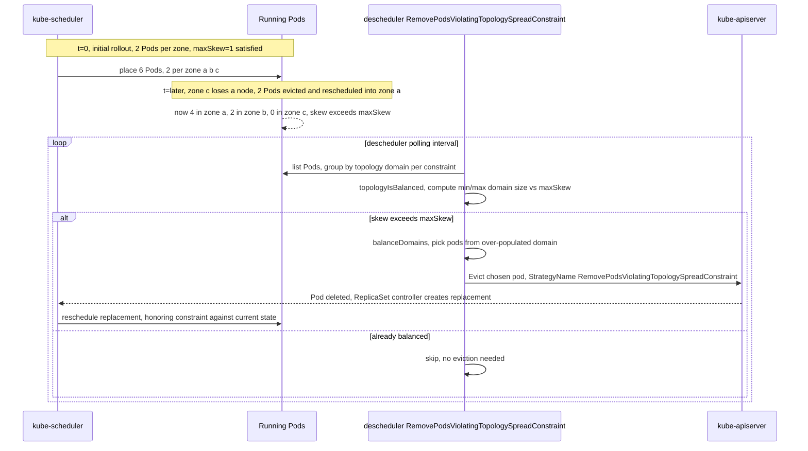

**TL;DR:** `topologySpreadConstraints` and pod affinity/anti-affinity both influence where a Pod is *initially placed*, but neither is a standing guarantee — the default scheduler evaluates them once, at admission time, and nothing in the base cluster re-checks compliance afterward. A node failure, a scale-up, or a rolling update can leave a Deployment's Pods skewed across zones or co-located with a Pod they were supposed to avoid, and it will stay that way indefinitely unless something actively rebalances it. `kubernetes-sigs/descheduler`'s real `RemovePodsViolatingTopologySpreadConstraint` and `RemovePodsViolatingInterPodAntiAffinity` plugins exist specifically to close that gap.

## 1. The Engineering Problem

A `Deployment` with `replicas: 6` spread across 3 availability zones looks safe on day one — the scheduler's `topologySpreadConstraints` logic placed 2 Pods per zone. But Kubernetes scheduling decisions are not re-evaluated after the fact: if zone `us-east-1a` loses a node and 2 Pods are evicted and rescheduled into the remaining zones, the Deployment is now skewed 3/3/0 — every replica behind a single zone failure — and nothing in the default control plane notices or fixes it. The same gap applies to `podAntiAffinity`: a rule saying "don't co-locate two replicas of this Deployment on the same node" is enforced only when a Pod is *scheduled*; if a node is cordoned and Pods are manually rescheduled, or a `preferredDuringSchedulingIgnoredDuringExecution` (soft) rule was violated because no compliant node existed at the time, the violation simply persists.

The naive fix — a human periodically running `kubectl get pods -o wide` and manually deleting/redistributing Pods — doesn't scale and reacts only after someone notices, often after an incident has already demonstrated the skew was real. What's needed is a control loop that continuously re-evaluates already-running Pods against the same scheduling constraints the scheduler used at admission time, and evicts (not reschedules directly — eviction lets the scheduler redo its job) the ones that now violate them.

## 2. The Technical Solution

**`kube-scheduler`** decides placement once, at Pod creation, using its `podtopologyspread` and `interpodaffinity` filter/score plugins. **`descheduler`**, a separate SIG-maintained controller that runs as a `CronJob` or `Deployment` on its own polling interval, re-implements the *evaluation* of those same constraints against the Pods already running in the cluster — not to place Pods itself, but to **evict** ones that now violate them, handing them back to `kube-scheduler` to re-place under current conditions.



Two core truths this diagram is showing:

- **`descheduler` never places Pods — it only evicts.** Placement authority stays entirely with `kube-scheduler`; `descheduler`'s job ends at `Evict()`, trusting the normal ReplicaSet-recreate-and-reschedule path to do the actual re-placement under current cluster state.
- **The check runs on a polling interval, not continuously.** Unlike the scheduler's admission-time evaluation, `descheduler`'s `Balance()` pass only runs when its own loop fires — a real gap window exists between drift occurring and it being corrected.

## 3. The clean example (concept in isolation)

The constraint itself, on a Deployment, and the descheduler policy that re-enforces it after the fact:

```yaml
# Deployment: the scheduler enforces this ONCE, at Pod creation
apiVersion: apps/v1
kind: Deployment
metadata:
  name: checkout
spec:
  replicas: 6
  template:
    spec:
      topologySpreadConstraints:
        - maxSkew: 1
          topologyKey: topology.kubernetes.io/zone
          # DoNotSchedule = scheduler refuses to place a Pod
          # that would exceed maxSkew; ScheduleAnyway = allowed,
          # just penalized in scoring — descheduler's Constraints
          # list below decides which of these it re-enforces
          whenUnsatisfiable: DoNotSchedule
          labelSelector:
            matchLabels:
              app: checkout
```

```yaml
# descheduler policy: re-checks the SAME constraint on a recurring interval
apiVersion: descheduler/v1alpha2
kind: DeschedulerPolicy
profiles:
  - name: rebalance-topology
    pluginConfig:
      - name: RemovePodsViolatingTopologySpreadConstraint
        args:
          # only re-enforce constraints the scheduler itself would
          # have hard-blocked on — matches DoNotSchedule above
          constraints: ["DoNotSchedule"]
    plugins:
      balance:
        enabled: ["RemovePodsViolatingTopologySpreadConstraint"]
```

## 4. Production reality (from the real repo)

`kubernetes-sigs/descheduler`'s two relevant plugins live side by side under `pkg/framework/plugins/`:

```
kubernetes-sigs/descheduler
└── pkg/framework/plugins/
    ├── removepodsviolatingtopologyspreadconstraint/
    │   └── topologyspreadconstraint.go
    └── removepodsviolatinginterpodantiaffinity/
        └── pod_antiaffinity.go
```

The topology-spread plugin's balance check — this is the actual re-implementation of the scheduler's skew math, run against currently-running Pods instead of at admission time:

```go
// pkg/framework/plugins/removepodsviolatingtopologyspreadconstraint/topologyspreadconstraint.go
func (d *RemovePodsViolatingTopologySpreadConstraint) Balance(ctx context.Context, nodes []*v1.Node) *frameworktypes.Status {
	// ... build namespaceTopologySpreadConstraints from EVERY currently running
	// pod's spec.topologySpreadConstraints, deduplicated ...

	for _, tsc := range namespaceTopologySpreadConstraints {
		constraintTopologies := make(map[topologyPair][]*v1.Pod)
		// count pods per topology domain (e.g. per zone) matching this constraint
		for _, pod := range namespacedPods[namespace] {
			if !tsc.Selector.Matches(labels.Set(pod.Labels)) {
				continue
			}
			node, ok := nodeMap[pod.Spec.NodeName]
			nodeValue := node.Labels[tsc.TopologyKey]
			topoPair := topologyPair{key: tsc.TopologyKey, value: nodeValue}
			constraintTopologies[topoPair] = append(constraintTopologies[topoPair], pod)
		}
		if topologyIsBalanced(constraintTopologies, tsc) {
			// skew already within maxSkew — nothing to evict for this constraint
			continue
		}
		d.balanceDomains(ctx, podsForEviction, tsc, constraintTopologies, sumPods, nodes)
	}
	// ... evict each pod in podsForEviction via d.handle.Evictor().Evict(...) ...
}

// topologyIsBalanced mirrors the SAME skew formula the scheduler's own
// podtopologyspread plugin uses at admission time
func topologyIsBalanced(topology map[topologyPair][]*v1.Pod, tsc topologySpreadConstraint) bool {
	minDomainSize, maxDomainSize := math.MaxInt32, math.MinInt32
	for _, pods := range topology {
		if len(pods) < minDomainSize { minDomainSize = len(pods) }
		if len(pods) > maxDomainSize { maxDomainSize = len(pods) }
		if int32(maxDomainSize-minDomainSize) > tsc.MaxSkew {
			return false
		}
	}
	return true
}
```

The anti-affinity plugin, by contrast, doesn't compute skew at all — it just checks, per-node, whether any two co-located Pods now violate a `podAntiAffinity` rule between them, and evicts one:

```go
// pkg/framework/plugins/removepodsviolatinginterpodantiaffinity/pod_antiaffinity.go
func (d *RemovePodsViolatingInterPodAntiAffinity) Deschedule(ctx context.Context, nodes []*v1.Node) *frameworktypes.Status {
	podsOnANode := podutil.GroupByNodeName(pods)

loop:
	for _, node := range nodes {
		pods := podsOnANode[node.Name]
		// lowest-priority pods considered for eviction FIRST —
		// a violation is resolved by removing the least-important
		// co-located pod, not an arbitrary one
		podutil.SortPodsBasedOnPriorityLowToHigh(pods)
		for i := 0; i < len(pods); i++ {
			if utils.CheckPodsWithAntiAffinityExist(pods[i], podsInANamespace, nodeMap) {
				if d.handle.Evictor().Filter(pods[i]) {
					err := d.handle.Evictor().Evict(ctx, pods[i], evictions.EvictOptions{
						StrategyName: PluginName,
					})
					// once ONE pod from the violating pair is evicted,
					// the remaining pod on this node no longer violates —
					// stop checking pairs involving the evicted pod
					if err == nil {
						pods = append(pods[:i], pods[i+1:]...)
						i--
						continue
					}
				}
			}
		}
	}
	return nil
}
```

**What this teaches that a hello-world can't:**

- **`Balance` vs `Deschedule` are different `descheduler` extension points** (`BalancePlugin` vs `DeschedulePlugin`) — topology spread is a cluster-wide balance problem (compare domain sizes across the whole constraint), while anti-affinity is evaluated per-node independently. The plugin interface itself reflects that these are structurally different checks, not the same logic reused.
- **Eviction is priority-aware, not arbitrary.** `SortPodsBasedOnPriorityLowToHigh` in the anti-affinity plugin, and the `sortDomains` priority ordering in the topology-spread plugin, both bias eviction toward lower-`priorityClass` Pods first — a real production safeguard against `descheduler` evicting a business-critical Pod just because it happened to iterate first.
- **`PodFitsAnyOtherNode` gates every topology-spread eviction** — `descheduler` explicitly checks a candidate Pod could actually be rescheduled elsewhere before evicting it; evicting a Pod that would just be rescheduled right back to the same node accomplishes nothing but churn.
- **`constraints: ["DoNotSchedule"]` in the policy is a deliberate scope limit** — a `ScheduleAnyway` (soft) constraint was never a hard guarantee even at admission time, so most `descheduler` policies (as in the clean example above) only re-enforce the `DoNotSchedule` (hard) constraints, matching the strictness level the scheduler itself applied.

## 5. Review checklist

- Does a `topologySpreadConstraint` set `whenUnsatisfiable: DoNotSchedule` if the spread is actually load-bearing (e.g. zone-level HA), rather than `ScheduleAnyway`, which the scheduler treats as a soft preference it can and will violate under pressure?
- If `descheduler` is deployed, does its `DeschedulerPolicy` scope `constraints` to match what's actually meant to be enforced (`DoNotSchedule` only, typically) rather than blanket-including `ScheduleAnyway` constraints that were never meant to be hard guarantees?
- Does every Pod carry a `priorityClassName` appropriate to its importance? `descheduler`'s eviction ordering depends on it — an unset priority (defaulting to 0) makes a critical Pod indistinguishable from a batch job when `descheduler` picks an eviction candidate.
- For `podAntiAffinity` rules, is the `topologyKey` set to what actually matters (`kubernetes.io/hostname` for per-node, `topology.kubernetes.io/zone` for per-zone)? A mismatched topology key silently changes what "co-located" means to both the scheduler and `descheduler`.

## 6. FAQ

**Q: If `topologySpreadConstraints` is set to `DoNotSchedule`, why is a rebalancing controller like `descheduler` still needed?**
A: Because `DoNotSchedule` only constrains *new* placements — it has no power over Pods that already exist. A node/zone failure that forces existing Pods to be rescheduled elsewhere can still produce a skewed result if the remaining zones are the only ones with capacity at that moment; the constraint was honored at the time, but the cluster's topology changed underneath it afterward.

**Q: Does `descheduler` guarantee the replacement Pod lands somewhere better after eviction?**
A: No — `descheduler` only evicts; `kube-scheduler` decides the replacement's placement independently, using whatever cluster state exists at that later moment. `PodFitsAnyOtherNode` checks feasibility before evicting, but doesn't reserve or guarantee a specific target node.

**Q: Why does the anti-affinity plugin evict the lowest-priority Pod in a violating pair rather than checking which one arrived more recently?**
A: `SortPodsBasedOnPriorityLowToHigh` deliberately optimizes for business impact, not arrival order — evicting the lower-priority Pod first minimizes the blast radius of the eviction, since `descheduler` has no way to know which of two co-located Pods is "wrong" in a business sense, only which is less important by declared `priorityClassName`.

**Q: Can `maxSkew` ever be satisfied for a constraint with zero pods in a topology domain?**
A: The `Balance` function pre-populates `constraintTopologies` from every node's topology label before counting Pods (`for _, node := range nodeMap { if val, ok := node.Labels[tsc.TopologyKey]; ok { constraintTopologies[...] = make([]*v1.Pod, 0) } }`), specifically so an empty-but-eligible zone counts as a valid (zero-Pod) domain in the skew calculation — a zone with 0 Pods next to zones with 3 is very much a skew violation, not an ignored gap.

**Q: Is `descheduler` a replacement for cluster-autoscaler or the scheduler itself?**
A: No — it has no scaling logic and makes no placement decisions of its own. It's strictly a periodic corrective layer that identifies constraint violations among already-running Pods and hands the problem back to the existing scheduler via ordinary eviction, the same mechanism a `kubectl drain` uses.

---

## Source

- **Concept:** Advanced Scheduling — topology spread constraints and pod (anti-)affinity, and their post-placement enforcement gap
- **Domain:** kubernetes
- **Repo:** [kubernetes-sigs/descheduler](https://github.com/kubernetes-sigs/descheduler) → [`pkg/framework/plugins/removepodsviolatingtopologyspreadconstraint/topologyspreadconstraint.go`](https://github.com/kubernetes-sigs/descheduler/blob/master/pkg/framework/plugins/removepodsviolatingtopologyspreadconstraint/topologyspreadconstraint.go), [`pkg/framework/plugins/removepodsviolatinginterpodantiaffinity/pod_antiaffinity.go`](https://github.com/kubernetes-sigs/descheduler/blob/master/pkg/framework/plugins/removepodsviolatinginterpodantiaffinity/pod_antiaffinity.go) — the real SIG project that undoes scheduling decisions violating topology spread or affinity rules.

---

**Next in the Kubernetes series:** [Kubernetes Network Model: What kube-proxy's iptables and IPVS Modes Actually Do Differently]({{ '/kubernetes/kubernetes-network-model-cni-kube-proxy-modes/' | relative_url }})


