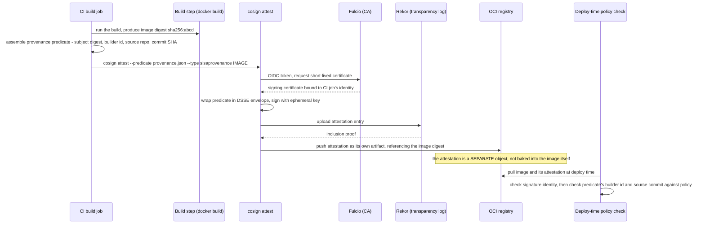

**TL;DR:** If an attacker compromises a build step (a poisoned dependency, a tampered Makefile target) rather than the signing key itself, a correctly signed image sails through verification — the signature only proves *which identity produced these bytes*, never *what process produced them*. SLSA provenance attestations close that gap by attaching a separate, equally-signed record of the source commit, builder identity, and build invocation to the image, so a deploy-time policy can check the build's inputs, not just its output.

> **In plain English (30 sec):** Code you already write — Map, function, API call, just bigger.

**Real repo:** [`sigstore/cosign`](https://github.com/sigstore/cosign)

## 1. The Engineering Problem: "it built successfully, and it's signed" is not the same as "it built from what you think"

Once a team adopts image signing, it's tempting to treat a passing `cosign verify` as the finish line: the image is signed by a trusted CI identity, so it's trustworthy. But signing only answers one question — *did this specific identity produce this specific set of bytes* — and says nothing about **how those bytes came to exist**. A compromised build dependency, a `Dockerfile` silently pulling from a different base image than the one reviewed, or a malicious PR that alters a build script without altering the final binary's outward behavior can all produce an image that is completely legitimate from the signer's point of view and completely compromised from everyone else's.

This is a distinct failure mode from a stolen signing key. The CI job is genuinely the CI job; the OIDC identity is genuinely valid; the signature is genuinely correct. The problem lives one layer earlier — in what the build process was actually allowed to *do* before cosign ever got involved. "It built successfully" was good enough advice when the build machine was trusted by default. It stops being good enough once builds pull third-party actions, transitive dependencies, and base images from outside your control — the same expanded blast radius that made supply-chain attacks (SolarWinds, the `xz` backdoor, countless typosquatted packages) a distinct threat category from key theft.

---

## 2. The Technical Solution: attest the build, don't just sign the artifact

**SLSA** (Supply-chain Levels for Software Artifacts) defines what a build's provenance record should contain: which source repository and commit were built, which builder (CI system/workflow) ran the build, and what invocation parameters were used. Cosign implements this as a second, independent artifact — a **provenance attestation** — attached to the image alongside (never instead of) the signature. `cosign attest --predicate provenance.json --type slsaprovenance` wraps that JSON predicate in a signed [in-toto](https://in-toto.io/) statement (a DSSE envelope), pushes it through the exact same Fulcio-certificate-plus-Rekor-log path a signature uses, and stores it as a separate artifact in the registry, linked to the image by digest.



Three core truths to hold:

- **A provenance attestation is not a stronger signature — it's a different claim, riding the same trust rail.** Both a plain signature and a provenance attestation go through Fulcio (identity) and Rekor (timestamped log); the difference is entirely in *what payload* gets wrapped and signed — one is the image digest, the other is a structured predicate about the build.
- **The predicate schema is standardized, not cosign-specific.** Cosign attests using in-toto's own `slsa-provenance` predicate types (v0.2 and v1), the same schema other SLSA-compliant tooling produces and consumes — a provenance attestation isn't locked to one vendor's format.
- **An unchecked attestation is worthless.** Attaching a provenance predicate changes nothing on its own — the security value only exists once a deploy-time policy actually inspects `builder.id` and `configSource` against an allow-list, the same way a signature only matters once something enforces `cosign verify` before deploy.

---

## 3. The clean example (concept in isolation)


```bash
# Build the image, get its digest - provenance is attested against the DIGEST, not a mutable tag
docker build -t myapp:1.0 .
DIGEST=$(docker inspect --format='{{index .RepoDigests 0}}' myapp:1.0)

# A minimal SLSA provenance predicate - what a real CI system assembles automatically
cat > provenance.json <<'JSON'
{
  "buildType": "https://github.com/actions/runs",
  "builder": { "id": "https://github.com/myorg/myapp/.github/workflows/release.yml" },
  "invocation": {
    "configSource": {
      "uri": "git+https://github.com/myorg/myapp@refs/heads/main",
      "digest": { "sha1": "a1b2c3d4e5f6" }
    }
  }
}
JSON

# Attach the predicate as its own signed attestation, separate from the image signature
cosign attest --yes --predicate provenance.json --type slsaprovenance "$DIGEST"

# A deploy-time gate checks BOTH claims, not just one:
cosign verify "$DIGEST"                                     # who signed the bytes
cosign verify-attestation --type slsaprovenance "$DIGEST"   # what built the bytes
```


---

## 4. Production reality (from `sigstore/cosign`)

Cosign dogfoods this on its own release pipeline — the tool that implements keyless signing signs and attests its own binaries and container images using the mechanism it ships:

```
cosign/
├── .goreleaser.yml                        # release-time: signs cosign's own build artifacts
├── .github/workflows/build.yaml           # CI: builds and signs cosign's own container images
├── cmd/cosign/cli/sign/sign.go            # signDigest(): the keyless-sign mechanics
└── pkg/cosign/attestation/attestation.go  # the SLSA provenance predicate types cosign understands
```

**`.goreleaser.yml`** signs every release binary twice — once with a long-lived KMS key, once keylessly — during the same release:


```yaml
# .goreleaser.yml
signs:
  - id: cosign
    cmd: ./dist/cosign-linux-amd64
    args: ["sign-blob", "--bundle", "${signature}", "--key",
      "gcpkms://projects/{{ .Env.PROJECT_ID }}/locations/{{ .Env.KEY_LOCATION }}/keyRings/{{ .Env.KEY_RING }}/cryptoKeys/{{ .Env.KEY_NAME }}/versions/{{ .Env.KEY_VERSION }}",
      "${artifact}"]
    signature: "${artifact}-kms.sigstore.json"
    artifacts: binary
  # Keyless
  - id: cosign-keyless
    cmd: ./dist/cosign-linux-amd64
    args: ["sign-blob", "--bundle", "${signature}", "${artifact}"]
    signature: "${artifact}.sigstore.json"
    artifacts: binary
  - id: checksum-keyless
    cmd: ./dist/cosign-linux-amd64
    args: ["sign-blob", "--bundle", "${signature}", "${artifact}"]
    signature: "${artifact}.sigstore.json"
    artifacts: checksum
```


**`.github/workflows/build.yaml`** grants exactly the permission the keyless flow needs, and nothing more, then signs the container images it just built:


```yaml
# .github/workflows/build.yaml
jobs:
  build:
    permissions:
      id-token: write     # required to mint the OIDC token cosign exchanges with Fulcio
      contents: read
      packages: write
    steps:
      - uses: sigstore/cosign-installer@6f9f17788090df1f26f669e9d70d6ae9567deba6 # v4.1.2
      # ... build steps produce and push the container images ...
      - name: containers-cosign
        run: make sign-ci-containers
        env:
          KO_PREFIX: ghcr.io/sigstore/cosign/cosign/ci
          COSIGN_PASSWORD: "${{secrets.COSIGN_PASSWORD}}"
```


**`pkg/cosign/attestation/attestation.go`** shows the predicate types the `attest` command understands aren't invented by cosign — they're imported straight from in-toto's own SLSA schema packages:

```go
// pkg/cosign/attestation/attestation.go
import (
	slsa02_attest "github.com/in-toto/attestation/go/predicates/provenance/v02"
	slsa1_attest "github.com/in-toto/attestation/go/predicates/provenance/v1"
	slsa02 "github.com/in-toto/in-toto-golang/in_toto/slsa_provenance/v0.2"
	slsa1 "github.com/in-toto/in-toto-golang/in_toto/slsa_provenance/v1"
)

const (
	// CosignCustomProvenanceV01 specifies the type of the Predicate.
	CosignCustomProvenanceV01 = "https://cosign.sigstore.dev/attestation/v1"
	// ...
)
```

**`cmd/cosign/cli/sign/sign.go`**'s `signDigest` shows that attestation and signature both flow through the same identity-to-certificate exchange — a provenance attestation isn't a second trust system bolted on the side:

```go
// cmd/cosign/cli/sign/sign.go — signDigest()
keypair, certBytes, idToken, err := signcommon.GetKeypairAndToken(ctx, ko, signOpts.Cert, signOpts.CertChain)
// ...
var certProvider sign.CertificateProvider
if idToken != "" {
	certProvider, err = cbundle.NewCachingFulcioProvider(ko.SigningConfig)
	// ...
}
// content is signed and bundled the same way whether it's an image digest
// payload or (in the attest path) a DSSE-wrapped provenance predicate
bundleBytes, err := cbundle.SignData(ctx, content, keypair, idToken, certBytes, ko.SigningConfig, ko.TrustedMaterial, cbundleOpts)
```

What this teaches that a hello-world can't:

- **`.goreleaser.yml`'s dual `signs` entries aren't redundancy for its own sake** — the KMS-backed `cosign` id is the long-established, auditable trust anchor consumers can pin to today, while `cosign-keyless` establishes the same artifact's provenance through the newer, key-free path. Shipping both during a transition period lets consumers migrate their verification policy without a hard cutover.
- **`id-token: write` in `build.yaml` is the entire foundation the keyless flow depends on** — without this specific GitHub Actions permission, the job has no OIDC token to exchange with Fulcio at all, and `cosign sign`/`cosign attest` without `--key` would simply fail. It's scoped to the `build` job specifically, not workflow-wide.
- **`GetKeypairAndToken` and `NewCachingFulcioProvider` run identically whether the caller is `cosign sign` or `cosign attest`** — the code path that turns an OIDC token into a Fulcio certificate doesn't know or care whether the payload it's about to sign is an image digest or a provenance predicate. Provenance attestations aren't a parallel security feature; they're the same signing mechanism pointed at a different, richer payload.

Known-stale fact: `cosign attest`'s predicate types aren't limited to SLSA provenance — the same `attest`/`verify-attestation` mechanism carries SBOMs, vulnerability scan results (`CosignVulnProvenanceV01`), and custom predicates. Treating "cosign" as strictly an image-signing tool undersells it — provenance, SBOM, and signature all travel through the identical Fulcio/Rekor trust path, just with different predicate payloads.

---

## 5. Review checklist

- **Does the pipeline generate and attach a build-provenance attestation (`cosign attest --type slsaprovenance`), or only a plain signature?** A signature alone proves who produced the bytes, never which source commit, dependencies, or build steps produced them — the exact gap this lesson opened with.
- **Is `permissions: id-token: write` scoped to only the job that actually performs the OIDC exchange**, per `build.yaml`'s pattern — not left workflow-wide, where any job (including one running less-trusted third-party actions) could mint a signing-capable token.
- **If the pipeline dual-signs (KMS-backed and keyless, per `.goreleaser.yml`), does the deploy-time verification check the specific signature path it expects**, rather than accepting either one indiscriminately — accepting both without distinction means a compromise of either signing path is sufficient to pass.
- **Does deploy-time policy actually inspect the provenance predicate's `builder.id` and `configSource` fields against an allow-list**, or does it only check "an attestation exists" — an unchecked attestation carries no more security than no attestation at all.

---

## 6. FAQ

**Q: If an image is already signed, why does it also need a provenance attestation?**

A: A signature proves *who* produced the bytes (a specific CI identity, verified through Fulcio). It says nothing about *how* — which source commit, which dependencies, which build steps. A provenance attestation is a separate, equally-signed claim about the build itself, so a deploy-time policy can reject an image built from the wrong repository or by an unrecognized builder even though its signature is perfectly valid.

**Q: Why does cosign's own `.goreleaser.yml` sign its release binaries with both a KMS key and keylessly?**

A: The KMS-backed (`gcpkms://...`) signature is the long-lived, directly-pinnable trust anchor; the keyless signature exercises and validates the same OIDC-to-Fulcio path cosign ships to its users. Running both on cosign's own artifacts during a transition period lets consumers verify against either path without a hard cutover.

**Q: What's actually inside the SLSA provenance predicate cosign attests?**

A: At minimum, a `builder.id` (which CI system/workflow ran the build) and an `invocation.configSource` (the source repository URI and commit digest that were built) — the schema comes from in-toto's own `slsa_provenance` packages (`v0.2` and `v1`), which `pkg/cosign/attestation/attestation.go` imports directly rather than reinventing.

**Q: Does verifying a provenance attestation use a different trust root than verifying a signature?**

A: No. `signDigest`'s call to `GetKeypairAndToken` and `cbundle.SignData` is the same code path for both — the OIDC-token-to-Fulcio-certificate exchange and the Rekor upload don't distinguish between "this is an image signature" and "this is a DSSE-wrapped provenance predicate." Only the payload being signed differs.

**Q: What does `permissions: id-token: write` actually grant in a GitHub Actions workflow?**

A: It authorizes that specific job to request a short-lived OIDC token from GitHub's own token issuer, scoped to that workflow run's identity (repo, workflow file, ref). Cosign exchanges that token with Fulcio for a signing certificate — without this permission line, there is no token to exchange, and the keyless flow (signing or attesting) cannot start.

---

## Source

- **Concept:** Container image signing & supply chain (SLSA provenance attestation)
- **Domain:** docker
- **Repo:** [sigstore/cosign](https://github.com/sigstore/cosign) → [`.goreleaser.yml`](https://github.com/sigstore/cosign/blob/main/.goreleaser.yml), [`.github/workflows/build.yaml`](https://github.com/sigstore/cosign/blob/main/.github/workflows/build.yaml), [`cmd/cosign/cli/sign/sign.go`](https://github.com/sigstore/cosign/blob/main/cmd/cosign/cli/sign/sign.go), [`pkg/cosign/attestation/attestation.go`](https://github.com/sigstore/cosign/blob/main/pkg/cosign/attestation/attestation.go) — the reference container signing tool, examined here through its own release/build pipeline.

---

**Next in the Docker series:** [Docker in Production Patterns: Why Dev Compose Defaults Silently Fail at Scale]({{ '/docker/docker-in-production-logging-secrets-compose-profiles/' | relative_url }})


