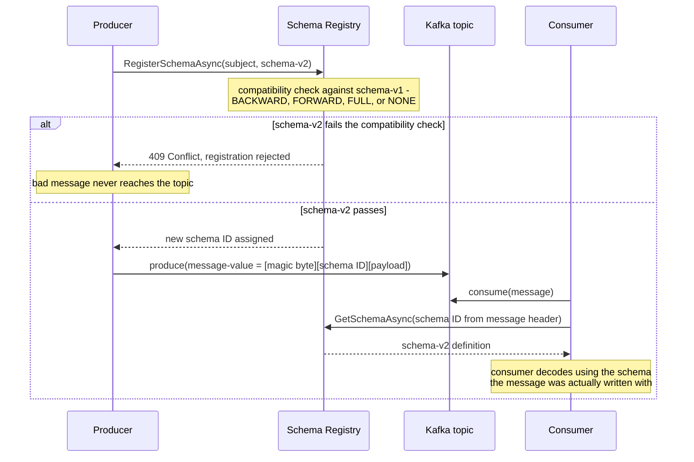

**TL;DR:** What stops a producer's innocent field rename from silently corrupting every consumer reading the same Kafka topic? A schema registry that sits between producer and broker, rejects incompatible schema changes at publish time, and — when a break really is necessary — lets a registered migration rule transform old records into the new shape on read, so producer and consumer teams never have to deploy in lockstep.

**Real repo:** [`confluentinc/confluent-kafka-dotnet`](https://github.com/confluentinc/confluent-kafka-dotnet)

## 1. The Engineering Problem: the broker doesn't know or care what's inside a message

Kafka (and most message brokers) treat a message value as an opaque byte array. That's a deliberate, useful simplification — the broker doesn't need to understand payloads to route and persist them — but it means schema compatibility is entirely the application's problem. In a monolith, a field rename is a single atomic commit: the writer and every reader change together. In an event-driven microservices system, a producer and its consumers are separately deployed services, often owned by different teams, that agree on nothing except "we both read/write this topic." If the producer renames `favorite_number` to `fave_num` and ships, every consumer still deserializing the old field name either throws, silently gets `null`, or (worse, with a loosely-typed deserializer) gets no error at all and just computes wrong answers downstream.

The naive fixes don't scale. "Just tell everyone before you deploy" breaks down past a handful of consumers and fails the moment one consumer team is slow to redeploy. Embedding a version number in the payload and writing `if (version == 1) ... else ...` branches in every consumer works for a while, then becomes an unmaintainable matrix of every schema version against every consumer. What's missing is a system that (a) makes a schema change fail *before* a bad message ever reaches the topic, and (b) can adapt an old or new message to whatever shape a given consumer actually expects, without that consumer hand-rolling the translation.

---

## 2. The Technical Solution: a schema registry as the mandatory checkpoint between contract and byte stream

A schema registry (Confluent Schema Registry, in this repo's case) is a separate service that owns the canonical schema for each topic's key/value ("subject"), assigns every registered schema a global ID, and enforces a configured **compatibility mode** on every new schema registration. The serializer and deserializer — not the broker — are what call out to the registry: a producer's `AvroSerializer`/`ProtobufSerializer` registers (or looks up) the schema before writing bytes, and a consumer's deserializer fetches the schema by the ID embedded in the message to decode it correctly.



Three core truths this diagram is enforcing:

- **The compatibility check happens at registration time, on the producer's write path** — a schema that would break a consumer never gets an ID, so it can never be produced. This is the "fail before the bad message ships" property the naive approaches above don't have.
- **Every message carries its schema ID, not its full schema.** The registry is a lookup service, not a per-message payload — this is what keeps the wire format compact while still letting every consumer resolve exactly which schema version produced any given record, even records written years apart.
- **Compatibility is a *relationship* between schema versions (old-can-read-new, new-can-read-old, both, or neither), configured per subject** — it's not a single global on/off switch, and different subjects in the same cluster can run different compatibility modes depending on how tightly coupled their producers and consumers are.

---

## 3. The clean example (concept in isolation)

A minimal Protobuf contract for a `User` topic — the schema itself is the artifact registered and version-checked, independent of any particular producer or consumer:

```protobuf
syntax = "proto3";

message User {
    string Name = 1;            // field number 1 - wire-compatible identity, not the field name
    int64 FavoriteNumber = 2;    // renaming this field is safe; changing its number/type is not
    string FavoriteColor = 3;
}
```

Producing and consuming it, with the registry doing the schema round-trip on both sides:

```csharp
var schemaRegistry = new CachedSchemaRegistryClient(
    new SchemaRegistryConfig { Url = schemaRegistryUrl });

// producer: serializer registers/looks up the schema before writing bytes
var producer = new ProducerBuilder<string, User>(producerConfig)
    .SetValueSerializer(new ProtobufSerializer<User>(schemaRegistry))
    .Build();

// consumer: deserializer fetches the schema by the ID embedded in the message
var consumer = new ConsumerBuilder<string, User>(consumerConfig)
    .SetValueDeserializer(new ProtobufDeserializer<User>().AsSyncOverAsync())
    .Build();
```

---

## 4. Production reality (from `confluentinc/confluent-kafka-dotnet`)

```
confluent-kafka-dotnet/
├── examples/Protobuf/
│   ├── proto/user.proto              # the wire contract, checked into source control
│   └── Program.cs                     # producer + consumer wired to the registry
└── examples/AvroGenericMigration/
    └── Program.cs                     # registers TWO schema versions and a field-rename migration rule
```

The Protobuf example (above, section 3) shows the steady-state case: producer and consumer both use one stable schema, and the registry just needs to enforce that new registrations stay compatible. `AvroGenericMigration/Program.cs` is the more interesting case — it deliberately registers a **breaking** field rename (`favorite_number` → `fave_num`) and shows the registry's migration-rule mechanism that makes that survivable:

```csharp
// AvroGenericMigration/Program.cs
// schema v1: original field name, tagged as metadata version "1"
var s = (RecordSchema)RecordSchema.Parse(@"{
    ""type"": ""record"", ""name"": ""User"",
    ""fields"": [
        {""name"": ""name"", ""type"": ""string"", ""confluent:tags"": [""PII""]},
        {""name"": ""favorite_number"", ""type"": ""long""},
        {""name"": ""favorite_color"", ""type"": ""string""}
    ]}");
Schema schema = new Schema(s.ToString(), null, SchemaType.Avro,
    new Metadata(null, new Dictionary<string,string>{["application.major.version"]="1"}, null), null);

// schema v2: the field was renamed - by itself, this is a BREAKING change
var s2 = (RecordSchema)RecordSchema.Parse(@"{
    ""type"": ""record"", ""name"": ""User"",
    ""fields"": [
        {""name"": ""name"", ""type"": ""string"", ""confluent:tags"": [""PII""]},
        {""name"": ""fave_num"", ""type"": ""long""},
        {""name"": ""favorite_color"", ""type"": ""string""}
    ]}");

// a JSONata migration rule that maps the old field name to the new one on read
String expr = "$merge([$sift($, function($v, $k) {$k != 'favorite_number'}), " +
              "{'fave_num': $.'favorite_number'}])";
RuleSet ruleSet = new RuleSet(
    new List<Rule> { new Rule("upgrade", RuleKind.Transform, RuleMode.Upgrade,
                               "JSONATA", null, null, expr, null, null, false) },
    new List<Rule>());
Schema schema2 = new Schema(s2.ToString(), null, SchemaType.Avro,
    new Metadata(null, new Dictionary<string,string>{["application.major.version"]="2"}, null),
    ruleSet);

// a consumer pinned to major version "2" via UseLatestWithMetadata gets fave_num
// even when it reads a record a producer wrote against schema v1
var avroDeserializerConfig = new AvroDeserializerConfig {
    UseLatestWithMetadata = new Dictionary<string, string> { ["application.major.version"] = "2" }
};
```

What this teaches that a hello-world can't:

- **The registration order matters, and it's explicit in the code:** `RegisterSchemaAsync(subjectName, schema, true)` then `RegisterSchemaAsync(subjectName, schema2, true)` — both versions exist in the registry simultaneously, with an `UpgradeRule` attached to `schema2` that knows how to transform a v1-shaped record into v2 shape. This is what makes the rename survivable: the registry isn't just validating compatibility, it's storing an executable translation.
- **A consumer declares which version it wants via metadata (`application.major.version`), not by parsing raw field names itself.** `UseLatestWithMetadata` on the deserializer config means the same physical bytes on the topic get transformed differently depending on which consumer reads them — old and new consumers coexist against one topic without either one being rewritten.
- **`UpdateCompatibilityAsync(Compatibility.None, ...)` is called before registering the two schemas** — this example deliberately disables the registry's own compatibility gate so it can register an otherwise-rejected breaking change and demonstrate the migration-rule escape hatch instead. In a real system you'd leave compatibility enforcement on for the common case and reserve migration rules for the rare, deliberate breaking change — not disable the gate wholesale.

Known-stale fact: "Avro is what Kafka schema registries support" was true when Confluent Schema Registry launched, but it's no longer the whole picture — the registry (and this same `Confluent.SchemaRegistry.Serdes` package) supports Avro, Protobuf, and JSON Schema as first-class citizens with their own serializer/deserializer classes (`AvroSerializer<T>`, `ProtobufSerializer<T>`, `JsonSerializer<T>`), each with its own compatibility-checking rules (Protobuf's field-number-based evolution differs from Avro's name-based resolution). Don't assume a schema-registry tutorial written before Protobuf/JSON support landed still describes the full feature set.

---

## 5. Review checklist

- **Does the compatibility mode match how tightly coupled producer and consumer deploys actually are?** `BACKWARD` (new schema can read old data — the default) protects consumers reading newer data with an older schema; `FORWARD` protects the reverse; `FULL` requires both. A PR changing a subject's compatibility mode to `NONE` is disabling the registry's core safety net, not a routine config tweak — treat it as high-risk.
- **Is a field being renamed, retyped, or renumbered (for Protobuf) actually a breaking change under the subject's current compatibility mode** — or does it need a migration rule like the JSONata `upgrade` rule above, registered alongside the new schema version, not bolted on after consumers start failing?
- **Does every consumer's `UseLatestWithMetadata` (or equivalent version pin) actually match the major version it was built against?** A consumer silently reading "latest" with no version pin will get whatever the newest registered schema is, including one it was never tested against.
- **Is `AutoRegisterSchemas` left on in production?** It's convenient in examples (and off by default in some client configs) but means any producer code change can register a new schema version without a human or CI gate reviewing the compatibility implications first.

## 6. FAQ

**Q: Does the schema registry replace the need for API versioning between services?**
A: No — it solves a narrower, specific problem: keeping *serialized message shape* compatible across producer/consumer deploys on one topic. `AvroGenericMigration`'s `application.major.version` metadata is effectively a version scheme layered on top of the registry, not something the registry provides by default; you still design what "a breaking change" means for your data.

**Q: What actually happens on the wire when a producer writes a message?**
A: The serializer prefixes the payload with a magic byte and the schema ID (see the sequence diagram in section 2), then writes the encoded value. `ProtobufDeserializer<User>` and `AvroDeserializer<GenericRecord>` in the example code both read that ID first and fetch the matching schema from the registry (`CachedSchemaRegistryClient` caches it locally after the first lookup) before decoding — the message itself never carries a full schema.

**Q: Why does `AvroGenericMigration` disable compatibility checking (`Compatibility.None`) before registering a breaking schema?**
A: Because the example's whole point is to demonstrate the migration-rule mechanism, which only matters when a genuinely incompatible change gets registered. In production you'd keep compatibility enforcement on and reserve `RuleMode.Upgrade`/`RuleMode.Downgrade` rules for changes a human has explicitly decided are worth the added translation complexity — not as a routine way around the compatibility gate.

**Q: Is Protobuf or Avro the better choice for a new topic?**
A: The example repo's own choice of file organization is a hint: Protobuf's compatibility rules are based on field numbers (`FavoriteNumber = 2` in `user.proto`), so renaming a field name is always safe and only changing/reusing a field number is risky. Avro's rules are name-based with a resolution algorithm that reads the writer's and reader's schemas together, so a field rename (as `AvroGenericMigration` demonstrates) needs an explicit alias or migration rule to stay compatible. Protobuf's model is generally easier to reason about for teams new to schema evolution; Avro's is more expressive when you actually need a rule engine, as this example shows.

**Q: What stops the schema registry itself from becoming a single point of failure for every producer?**
A: `SchemaRegistryConfig.Url` accepts a comma-separated list of registry URLs specifically for redundancy (see the comment in `Protobuf/Program.cs`'s `schemaRegistryConfig`), and `CachedSchemaRegistryClient` caches resolved schemas locally so a consumer that already has a schema ID cached doesn't need the registry to be reachable to keep decoding messages it's already seen the schema for — only *new* schema IDs require a live round-trip.

---

## Source

- **Concept:** Data contracts & schema evolution (protobuf, Avro, schema registry)
- **Domain:** microservices
- **Repo:** [confluentinc/confluent-kafka-dotnet](https://github.com/confluentinc/confluent-kafka-dotnet) → [`examples/Protobuf/Program.cs`](https://github.com/confluentinc/confluent-kafka-dotnet/blob/master/examples/Protobuf/Program.cs), [`examples/Protobuf/proto/user.proto`](https://github.com/confluentinc/confluent-kafka-dotnet/blob/master/examples/Protobuf/proto/user.proto), [`examples/AvroGenericMigration/Program.cs`](https://github.com/confluentinc/confluent-kafka-dotnet/blob/master/examples/AvroGenericMigration/Program.cs) — the official .NET client for Apache Kafka and Confluent Schema Registry.

---

**Next in the Microservices series:** [Advanced Resilience Patterns: Load Shedding, Adaptive Concurrency, and Why Naive Retry Causes Cascading Failure]({{ '/microservices/advanced-resilience-patterns-load-shedding-adaptive-concurrency/' | relative_url }})
